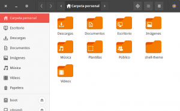
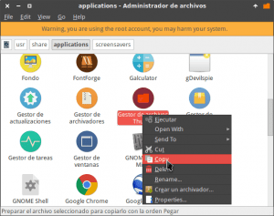
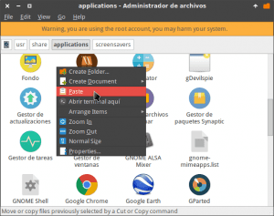
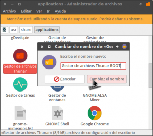
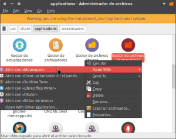
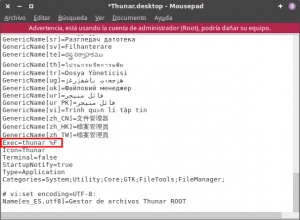
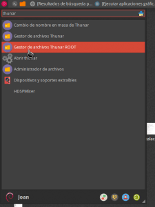
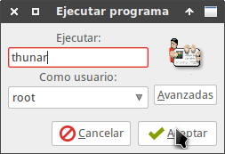

La semana pasada vimos como configurar el comando sudo en GNU/Linux. A raíz de esto veremos cual es la forma adecuada para abrir aplicaciones gráficas con privilegios de usuario root.<!--more-->

## ¿POR QUÉ NO ES ACONSEJABLE USAR SUDO PARA ABRIR APLICACIONES CON PRIVILEGIOS DE USUARIO ROOT?

La gran mayoría de lectores abren sus aplicaciones con permisos de usuario root ejecutando un comando del siguiente tipo en la terminal:

> ```
> sudo nombre_del_programa
> ```

El programa se abrirá sin problema alguno y lo podremos usar, pero no es la forma ideal de hacerlo.

Si usamos sudo para abrir aplicaciones gráficas con privilegios de usuario root nos podemos encontrar con los siguientes problemas:

### Sudo puede utilizar y modificar archivos de configuración del usuario estándar

Cuando ejecutamos una aplicación gráfica con sudo estamos abriendo la aplicación como usuario root, pero también damos la posibilidad que este programa este usando ciertos archivos de configuración almacenados en nuestra propia home.

Este hecho puede ocasionar que se cambien permisos de ciertos archivos del programa ubicados en nuestra home (**~/**) pudiendo llegar a causar los siguientes problemas:

1. Un programa deja de abrirse al trabajar con nuestro usuario.
2. Ciertas funcionalidades de un programa tienen un comportamiento anómalo como por ejemplo que no se carguen las extensiones de nuestro navegador.
3. No podemos abrir un determinado archivo con nuestra cuenta de usuario normal.
4. Etc.

Para evitar este y otros posibles inconvenientes les recomiendo seguir las siguientes indicaciones para abrir aplicaciones gráficas como usuario root.

###### Nota: Las posibilidades de tener problemas al abrir aplicaciones gráficas con sudo son pocas, no obstante siempre es sensato minimizar los riesgos.

## COMO ABRIR APLICACIONES CON PRIVILEGIOS DE USUARIO ROOT

Para abrir aplicaciones gráficas con permisos de usuario root debemos usar los comandos gksudo, kdesudo y beesu.

###### Nota: Deberemos aplicar un comando u otro en función de nuestro entorno de escritorio y/o la distribución que usamos.

Al usar los comandos mencionados evitaremos los problemas que acabamos de citar.

Por lo tanto si aplicamos un comando del tipo:

> ```
> gksudo nombre_del_programa
> ```

Conseguiremos abrir el programa como usuario root y además podemos estar seguros que estaremos usando la configuración del usuario root almacenada en la ubicación **/root**.

De este modo tenemos la total seguridad que no se modificaran los permisos de ninguno de los archivos de configuración de nuestra partición home (**~/**).

### Abrir programas como usuario root En Gnome, Xfce, Lxde, Mate, Cinnamon y Openbox

En los escritorios de Gnome, XFCE, LXDE, Mate, Cinnamon y Openbox tenemos que seguir los siguientes pasos para poder abrir programas con privilegios de administrador.

Para empezar instalamos el paquete gksu ejecutando el siguiente comando en la terminal:

> ```
> sudo apt-get install gksu
> ```

Una vez instalado el paquete gksu ya podemos abrir programas con privilegios de administrador. Para ello tan solo tenemos que abrir una terminal y ejecutar el comando gksu seguido del nombre del programa que queremos abrir.

Por lo tanto si queremos abrir el gestor de archivos nautilus con permisos de usuario root tenemos que ejecutar el siguiente comando en la terminal:

> ```
> gksudo nautilus
> ```

Una vez ejecutado se abrirá el gestor de archivos sin ningún tipo de problema.

[](images/Ejecutando-Nautilus-como-usuario-root.png)

### Abrir programas como usuario root en KDE

Si pretenden abrir aplicaciones gráficas con permisos de usuario root en KDE tienen que asegurarse de tener instalado el paquete kdesu.

Para ello ejecutamos el siguiente comando en la terminal:

> ```
> sudo apt-get install kdesu
> ```

###### Nota: Si vuestra distro no usa el gestor de paquetes apt-get deberán modificar el comando que acabamos de ejecutar.

Una vez instalado el paquete ya seremos capaces de lanzar cualquier programa con interfaz gráfica con privilegios de administrador.

De este modo si queremos abrir dolphin con privilegios de administrador tan solo tenemos que ejecutar el comando **kdesudo** seguido del **nombre del programa** que en este caso es dolphin:

> ```
> kdesudo dolphin
> ```

Justo después de ejecutar el comando se abrirá dolphin y dispondremos de privilegios de administrador.

### Abrir programas con entorno gráfico y permisos de administrador en Fedora y en distro derivadas de Fedora

En Fedora ninguno de los comandos anteriores nos funcionará. En Fedora tenemos que usar **beesu**.

Para instalar beesu abrimos una terminal y ejecutamos el siguiente comando:

> ```
> sudo dnf install beesu
> ```

Una vez instalado beesu ya podremos abrir cualquier aplicación con entorno gráfico disponiendo de privilegios de administrador.

Para ello tan solo tenemos que ejecutar el comando beesu seguido del programa que queremos abrir como usuario root que en mi caso es gedit:

> ```
> beesu gedit
> ```

Al ejecutar el comando se abrirá gedit con permisos de administrador.

## CREAR UN LANZADOR PARA ABRIR UN DETERMINADO PROGRAMA COMO USUARIO ROOT

En la totalidad de apartados anteriores hemos abierto aplicaciones gráficas como usuario root usando la terminal.

Si hay algún programa que usamos a menudo y queremos crear un lanzador para abrirlo directamente sin tener que usar la terminal lo podemos hacer de la siguiente forma:

Como primer paso ejecutamos el siguiente comando en la terminal:

> ```
> gksudo thunar /usr/share/applications
> ```

Al ejecutar el comando se abrirá el gestor de archivos en el que podremos ver prácticamente la totalidad de archivos .desktop de los programas instalados en nuestro ordenador.

###### Nota: Si en la ubicación /usr/share/applications no encuentran el archivo .desktop que están buscando pueden usar catfish para realizar una búsqueda con el término \*.desktop. Otra ubicación en la que también se acostumbran a almacenar archivos .desktop es la ~/.local/share/applications/

Buscamos el programa que queremos abrir como usuario root y lo copiamos.

[](images/Copiar-el-archivo-.dektop.png)

Una vez copiado lo pegamos en la misma ubicación.

[](images/Pegar-el-archivo-.desktop.png)

Seguidamente renombramos el archivo que acabamos de pegar con el nombre que nosotros queramos. En mi caso lo renombro como **Gestor de archivos Thunar ROOT**

[](images/Renombrar-el-archivo-.dektop.png)

A continuación abrimos el archivo .desktop que acabamos de renombrar con un editor de textos.

[](images/Editar-el-archivo-.desktop.png)

Una vez se abra el editor de textos buscamos la línea que empieza por la palabra **Exec**.

[](images/Localizar-el-código-a-modificar.png)

Una vez encontrada añadimos gksudo, kdesudo o beesu después del símbolo **=**

###### Nota: Deberemos añadir gksudo, kdesudo o beesu en función del entorno de escritorio y/o distro que estemos usando.

Como en mi caso estoy usando el entorno XFCE pasaré de tener la siguiente línea:

> ```
> Exec=thunar %F
> ```

a tener la siguiente:

> ```
> Exec=gksudo thunar %F
> ```

[](images/código-para-abrir-programas-como-root.png)

Una vez realizados todos los pasos tan solo tenemos que guardar los cambios y el proceso a finalizado.

En estos momentos si nos dirigimos al menú de nuestra distro podremos ver el lanzador que acabamos de crear.

[](images/Menú-con-el-nuevo-lanzador.png)

Si clicamos encima del lanzador se abrirá el gestor de archivos thunar con privilegios de usuario root.

## OPCIONES ADICIONALES DE LOS COMANDOS GKSUDO, KDESUO Y BEESU

Los comandos gksu, kdesu y beesu no únicamente sirven para abrir programas y aplicaciones con permisos de usuario root.

Estos comandos también sirven para ejecutar y usar programas en nombre de cualquier usuario que tengamos creado en nuestro equipo.

Así por lo tanto si queremos generar un archivo de texto en nombre de un usuario llamado **martin** podemos ejecutar los siguientes comandos:

En Gnome, Xfce, Lxde, Mate, Cinnamon y Openbox:

> ```
> gksudo -u martin mousepad
> ```

En Kde:

> ```
> kdesudo -u martin kate
> ```

En Fedora:

> ```
> beesu -l -P 'gedit' martin
> ```

Además estos comandos acostumbran a disponer de una interfaz gráfica para intentar facilitar su uso. Si abrimos una terminal y ejecutamos el comando gksu, kdesu o beesu se nos abrirá una interfaz gráfica parecida a la siguiente:

[](images/Interfaz-gráfica-de-gksu.png)

Con está interfaz podremos Abrir programas y usar parte de las funcionalidades de gksu, kdesy y beesu de forma más sencilla.

Para más información sobre estos comandos pueden consultar las páginas man de su distribución.

## CONCLUSIONES

Las conclusiones que tenemos que sacar de este artículo son las siguientes:

1. Para abrir aplicaciones gráficas con permisos de usuarios root tenemos que hacerlo con gksudo, kdesudo o beesu.
2. Para abrir programas que se ejecutan en la terminal con privilegios de administrador tenemos que usar el comando sudo.

Si aplicamos estas simples reglas evitaremos tener problemas con los permisos de nuestros archivos.

En el caso que decidan no seguir este simple consejo no tiene porque pasar nada. En el 99,9% de casos que abran aplicaciones gráficas con sudo no pasará absolutamente nada, pero siempre existen una pequeña posibilidad que se cambien los permisos de nuestros archivos.
