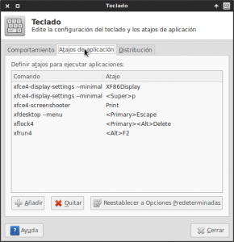
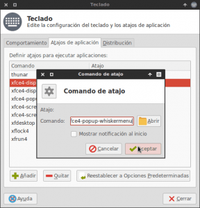
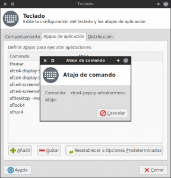
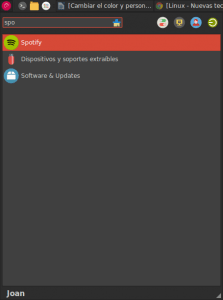

Continuando con la serie de post de whisker menu, hoy veremos como podemos abrir programas de forma ultra rápida con Whisker menu. Para empezar os diré que hasta hace poco tiempo, en mi equipo usaba el menú tradicional de Xfce y como complemento para abrir programas y aplicaciones usaba Kupfer.<!--more-->

###### Nota: Kupfer es un lanzador de aplicaciones similar al famoso Quicksilver de Mac. Aparte de [Kupfer](https://engla.github.io/kupfer/ "Web de desarrollo de Kupfer") o Quicksilver hay otras alternativas similares como por ejemplo [Synapse](https://launchpad.net/synapse-project "Web de desarrollo de Synapse") en Linux o [Launchy](http://www.launchy.net/ "Web del lanzador Launchy") en Windows.

En el momento de instalar y probar Whisker Menu me di cuenta al instante que Whisker menu se puede utilizar sin ningún problema como un lanzador de aplicaciones del tipo Kupfer o Synapse.

Por lo tanto usando Whisker menu se puede prescindir tranquilamente de aplicaciones como por ejemplo Kupfer, Synapse, Gnome do, etc. Las ventajas que obtendremos prescindiendo de Kupfer, o de otros programas similares, es tener menos paquetes instalados en nuestro ordenador y de paso también ahorraremos unas megas de memoria RAM.

Para poder usar Whisker menu de forma eficiente como lanzador de aplicaciones tenemos que seguir los siguientes pasos:

## ACTIVAR WHISKER MENU CON UNA COMBINACIÓN DE TECLAS

Al igual que hacemos con Kupfer, Synapse o Quicksilver, lo más rápido y lo más eficiente es activar o abrir whisker menu con una combinación de teclas.

Para conseguir activar Whisker menu con una combinación de teclas, **abrimos una terminal y ejecutamos el siguiente comando**:

> ```
> xfce4-keyboard-settings
> ```

Después de ejecutar este comando aparecerá la siguiente ventana:

[](images/acceso-atajos-xfce.png)

Tal y como se puede ver en la captura de pantalla **presionamos encima de la pestaña Atajos de Aplicación**. Seguidamente **Presionamos el botón Añadir**. Después de presionar añadir aparecerá la siguiente ventana:

[](images/Introducir-comando-a-ejecutar.png)

Tal y como puede verse en la captura de pantalla, tenemos que **introducir el comando que queremos que se ejecute cuando presionaremos la combinación de teclas** que seleccionaremos posteriormente. En este caso el comando a introducir es:

> ```
> xfce4-popup-whiskermenu
> ```

**Presionamos el botón Aceptar**. Después de presionar el botón Aceptar aparecerá la siguiente pantalla:

[](images/seleccionar-combinación-de-teclas.png)

Ahora tan solo tenemos que **presionar la combinación de teclas que queremos usar para abrir whisker menu**. **En mi caso** la combinación de teclas que he seleccionado es **Ctrl+Espacio**. Vosotros podéis seleccionar la tecla que vosotros creáis mas oportuna. (Muchos usuarios eligen la tecla de Windows “super”)

**Ahora cada vez que presionemos la combinación de teclas Ctrl+Espacio se abrirá Whisker Menu**. De este modo evitaremos tener que usar el ratón para tener que acceder al menú y la activación será mucho más rápido e inmediata.

## USAR WHISKER MENU PARA ABRIR PROGRAMAS Y APLICACIONES

Una vez hemos descrito como activar Whisker Menu con una combinación de teclas, ahora ya podemos pasar a ver como usamos Whisker para abrir programas o aplicaciones tal y como lo podemos hacer con otros lanzadores como por ejemplo Kupfer, Synapse o Quicksilver.

Para ver como usar whisker menu como lanzador de aplicaciones lo haremos con un ejemplo. En el ejemplo veremos como podemos abrir la aplicación Spotify. Si queremos abrir spotify con whisker tan solo tenemos que seguir los siguientes pasos:

**1-** **Presionamos** la combinación de teclas para abrir Whisker menu, que en mi caso es **Ctrl + Espacio**.

**2-** Una vez abierto whisker menu, tenemos que **empezar a teclear el nombre de la aplicación que queremos ejecutar** que en mi caso es Spotify.

**3-** Tal y como se puede ver en la captura de pantalla, con tan solo escribir “spo” vemos que whisker menu ya nos está sugiriendo ejecutar el programa Spotify.

[](images/Abrir-aplicaciones-como-Spotify.png)

**4-** **Una vez whisker menu nos proponga abrir spotify ya podemos presionar la tecla Enter** y spotify se ejecutará.

Como podéis ver el método para abrir programas con Whisker menu es increíblemente rápido. Incluso me atrevería decir que en uno o dos segundos podemos abrir el programa que queramos sin ningún tipo de problema.

Tan solo siguiente estos sencillos pasos seremos capaces de lanzar las aplicaciones que queramos de forma ultrarápida y sin tener que usar programas de terceros o docks que ciertamente consumen recursos.

En el caso que precisen información adicional acerca de Whisker menu pueden consultar los siguientes enlaces:

[\- Motivos para usar Whisker menu y como instalarlo]()

[\- Cambiar el color de Whisker menu y configurarlo a nuestro gusto]()

[\- Crear y usar acciones de búsqueda o Search Action en Whisker Menu]()
