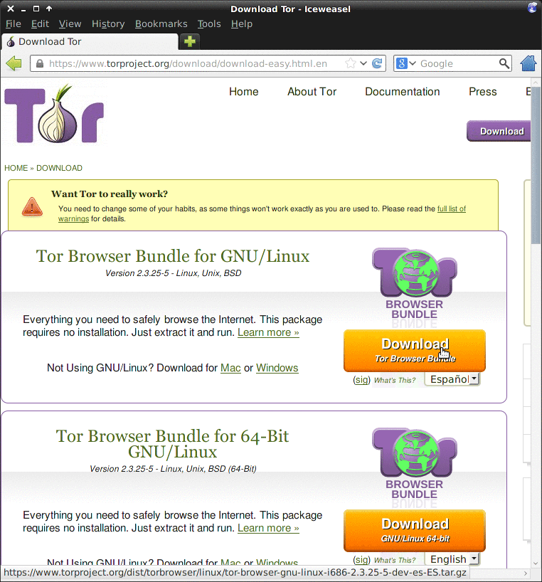
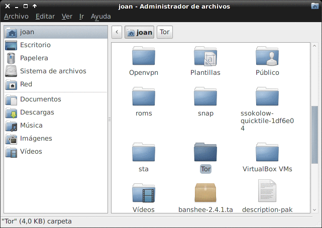
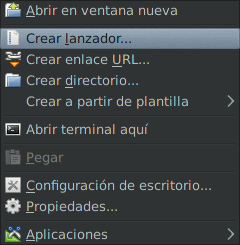
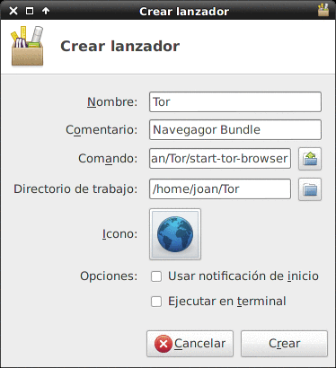
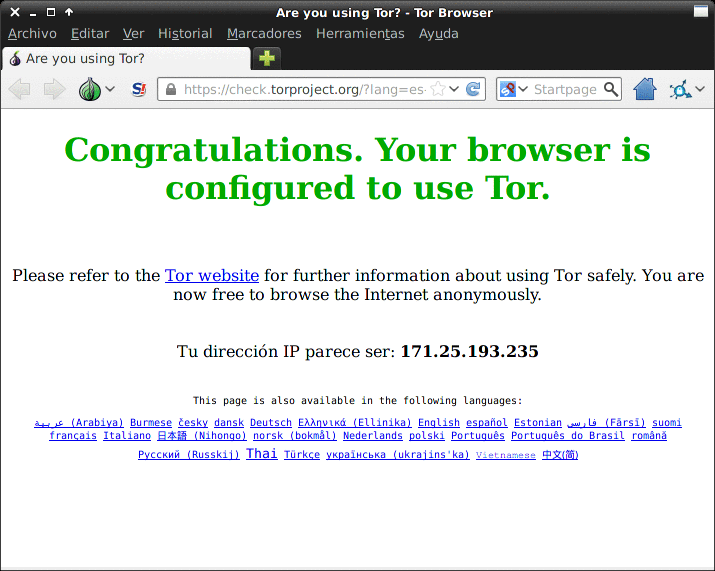

En el presente artículo veremos de forma detallada que es la deep web,  y como podemos acceder a ella para poder empezar a navegar de forma segura.

## ¿Qué es la deep web?

<!--more-->El concepto de deep web es sencillo. La deep web es aquella parte de la red que contiene material, información y páginas web que no están indexadas en ninguno de los buscadores existentes como pueden ser bing, google, yahoo, etc. Así en el hipotético caso que los buscadores pudieran indexar la totalidad de contenido en la web significaría que desaparecería la deep web.

No obstante esto es imposible ya que muchas de las páginas y documentos están hechos de tal forma que no puedan ser indexables, ya sea porque están protegidos con contraseña, porqué están realizados en formatos no indexables como por ejemplo páginas realizadas completamente en flash, sin contenido html, etc. Si hacemos una analogía con la película matrix podríamos decir que la totalidad de personas que toman la pastilla azul serian las personas que solo navegan y conocen lo que denominamos red superficial mientras que la totalidad de personas que tomarían la pastilla roja  son las personas que conocerían la existencia de la deep web.

## ¿Qué tamaño tiene la deep web?

Muchos de vosotros quedareis sorprendidos en saber que la deep web presenta mucho más contenido que la web superficial que nosotros podemos acceder. Según datos de la [Wikipedia](http://es.wikipedia.org/wiki/Internet_profunda "Wikipedia") en el año 2000 la internet superficial tenia un tamaño de 167 Terabytes mientras que la deep web tenia una tamaño de 7500 Terabytes lo que significa que el contenido de la deep web era 45 veces superior a la información que teníamos acceso en aquel momento. Actualmente a día de hoy la universidad de California en Berkeley estima que el tamaño real de la red profunda es de 91.000 Terabytes.

## ¿Qué podemos encontrar en la deep web?

Todo lo que hay en la deep web no podemos decir que sea intrínsecamente malo. Podemos encontrar contenido interesante y diverso como por ejemplo:

1. Contenido almacenado por los gobiernos de distintos países.
2. Organizaciones que almacenan información. Por ejemplo la NASA almacena información acerca de las investigaciones científicas que realiza. Otro de información almacenada puede ser datos meteorológicos,  datos financieros, directorios con información de personas, etc.
3. Multitud de bases de datos de distinta índole. Las bases de datos representan un % muy importante de la información almacenada en la deep web.
4. Foros de temáticas diversas.

No obstante también nos podemos encontrar contenido muy desagradable como por ejemplo los siguientes:

1. Venta de drogas.
2. Pornografía.
3. Mercado negro de sicarios.
4. Documentos clasificados como por ejemplo los de wikileaks. (Bueno diría que esto malo no es.)
5. Foros de crackers en busca de víctimas.
6. Phishers, spammers, botnet agents, en busca de víctimas.
7. Páginas para comprar o fabricar armas.
8. Piratería de libros, películas, música, software, etc.

###### Nota: Afortunadamente el contenido que se acaba de describir representa un % muy pequeño de lo que es la deep web. Este tipo de contenido se clasifica dentro de una sub categoría de la deep web denominada darknet. 

###### Nota: Cabe destacara que el 90% de contenido que existe en la deep web es accesible para la totalidad de usuarios.

## Como acceder a la Deep Web

Todo el material perteneciente a la deep web no es accesible de forma corriente. Para acceder a este contenido tenemos que acceder a través de un servidor proxy. En caso de querer investigar y experimentar una muy buena opción para empezar es hacerlo a través de la red Tor. La red Tor nos permitirá navegar tanto por la web superficial como dentro de la deep web de forma anónima y segura.

Si buscan por la red verán muchas formas de navegar en la deep web mediante Tor. La verdad es que hay varias opciones. Por ejemplo encontrarán muchos manuales en los que se detalla que es necesario instalar los paquetes **tor, privoxy y vidalia** y a posterior te explican como configurar el navegador adecuadamente para poder acceder a la deep web.

Si siguen los pasos adecuadamente podrán acceder tranquilamente a la deep web pero personalmente pienso que el método que se describe en muchos posts presenta los siguientes inconvenientes:

1. Si instalas los paquetes tor, privoxy y vidalia y sigues los pasos que se describen tenemos el problema que cada vez que arrancamos el ordenador se arrancan los demonios de tor y privoxy que consumirán recursos. En el caso que queramos tenerlos desactivados cada vez que accedamos a la deep web tendremos que estar activando y desactivando estos procesos.
2. Por muy buenos manuales que encuentran en la red para conectarse con navegadores convencionales  como por ejemplo Firefox o Chrome, es realmente muy difícil ser anónimo en la red ya que estos navegadores no han sido pensados precisamente para ser anónimos  Por ejemplo el simple hecho te tener activados Quicktime, flash o tener ciertas ciertas extensiones instaladas en nuestro navegador puede revelar nuestra ip, identidad o localización a terceros vulnerando así nuestra privacidad.
3. En el caso de navegar por webs normales y corrientes los navegadores convencionales, en caso de no estar configurados adecuadamente, no fuerzan  la navegación https.

### Opción más recomendable para acceder a la deep web

La solución propuesta a los problemas anteriores es usar el navegador Tor-browser-Bundle. Este navegador es un Firefox tuneado para asegurar que en todo momento la navegación es 100% segura y anónima. Las ventajas que nos ofrece Tor-browser-Bundle son:

1. Facilidad de instalación. No es necesario instalar paquetes, ni arrancar demonios ni lidiar con configuraciones.
2. El navegador viene preconfigurado para preservar nuestra privacidad y para ser totalmente anónimos en la red. Para dejar un chrome con la misma configuración que Tor-Blundle se precisa de conocimientos avanzados que no todo el mundo tiene. La configuración de Tor Blundle es la mejor existente en la actualidad para preservar nuestro anonimato.
3. Tendremos 2 navegadores. Una para navegar en nuestras páginas habituales y otro para navegar por la deep web. Personalmente no me gusta navegar por la web y la deep web con el mismo navegador.
4. Cada vez que realizas una acción que no es segura y que puede revelar información a terceros, el navegador Tor-Blundle te advertirá diciendo que la acción que vas a realizar es insegura.
5. Los procesos Tor, Vidalia y privoxi no estarán permanentemente activados. Solo se activarán cuando abrimos el navegador y una vez cerramos el navegador los procesos se vuelven a desactivar. Además si miramos nuestros repositorios veremos que estos paquetes no están ni físicamente instalados. Los lleva el navegador Tor-Bundle por defecto.
6. El navegador Tor-Bundle lleva la extensión HTTPS everywhere. De está forma te estará forzando a usar la encriptación HTTPS en todas las webs que sea posible.

###### Nota: El navegador Tor-browser-bundle no es más que un Firefox Tuneado y configurado adecuadamente para ocultar nuestra identidad. 

## Acceder a la red Tor y a la deep web con Tor-Bundle en nuestro ordenador

Para instalar Tor-Bundle y poder navegar por la deep web lo primeros que tenemos que hacer es acceder a la siguiente página web para descargar el navegador:

[https://www.torproject.org/download/download-easy.html.en](https://www.torproject.org/download/download-easy.html.en "Descargar El navegador Tor Bundle")

[](images/descargar-tor.png)

Como podemos ver en la imagen tenemos que elegir si queremos la versión 32 bits o 64 bits. Además en el cuadro de selección también podemos seleccionar el idioma. En mi caso elijo la versión 32 bits con idioma español.

Una vez descargado el fichero lo descomprimimos en nuestra home. La carpeta descomprimida la podemos renombrar con el nombre Tor. Abajo tenéis una imagen de la situación en este momento:

[](images/tor-en-home.png)

Una vez hemos llegado a este punto tan solo nos falta crear un lanzador para abrir la aplicación Tor. Para crear el lanzado el proceso es muy sencillo. Nos vamos por ejemplo a nuestro escritorio y clicamos el botón derecho del mouse. Nos aparecerá el menú de la imagen:

[](images/menu.png)

En el menú de la imagen tenemos que seleccionar crear lanzador. Al seleccionar esta opción nos aparecerá la siguiente pantalla para crear el lanzador o acceso directo:

[](images/ventana-creación-lanzador.png)

Como podéis ver en la imagen simplemente tenéis que poner el nombre de nuestro lanzador. Seguidamente un comentario y finalmente rellenar los campos Comando y Directorio de trabajo. Para rellenar estos dos campos:

Campo **Comando**: Tenemos que introducir el comando que abrirá el navegador. Como hemos guardado la carpeta Tor en nuestra home el comando para ejecutar el navegador tor es:

> ```
> /home/joan/Tor/start-tor-browser
> ```

###### Nota: Deberán adaptar el texto de color rojo en función de vuestro nombre de usuario

Campo **Directorio** de trabajo: Como podéis ver en la imagen solamente tenemos que poner la ubicación de donde guardamos la carpeta Tor. En mi caso:

> ```
> /home/joan/Tor
> ```

Si queremos también podemos asignar un icono a nuestro lanzador.

Finalmente apretamos el botón Crear y ya hemos finalizado el proceso de creación del lanzador.

###### Nota: Como podéis ver en este apartado estoy usando el entorno de escritorio XCFE. En otros entornos de escritorio el proceso puede variar. De todos modos lo importante es tener claro el comando para ejecutar el tor browser. Si ejecutamos el comando directamente en la terminal sin crear el lanzado el navegador se ejecutará sin ningún problema.

Hacemos doble click sobre el lanzador que acabamos de crear y que  tenemos en el escritorio. Ahora solo falta esperar. Tened paciencia. Es posible que tengáis que esperar  30 segundos o un minuto para que se abra el navegador. Durante la espera veremos que se conecta vidalia para conectarnos a la red Tor. Una vez conectados a la Red Tor se arranca el navegador. Cuando veáis una pantalla parecida a la que mostraré a continuación quiere decir que estáis conectados a la red Tor y por lo tanto podéis navegador por la deep web:

[](images/tor-browser-arrancado.png)

###### Nota: Es posible que algunos ISP capen el acceso a la red Tor. Si este es vuestro caso tenemos la posibilidad de conectarnos a la red Tor mediante bridges. Para mas información:

[https://www.torproject.org/docs/bridges](https://www.torproject.org/docs/bridges)

## Acceder a la red tor y a la deep web con nuestro teléfono Android

Si queréis conectaros a la red Tor y acceder y navegar por la deep web a través de vuestro teléfono Android, tan solo tiene que visitar el siguiente [enlace.]()

## Algunos links pertenecientes a la deep web

Para quien quiera investigar y empezar a navegar en la red Tor en el siguiente link podrán encontrar algunas direcciones:

[http://pastebin.com/ADTynHbX](http://pastebin.com/ADTynHbX "Links deep web")

Cuando entras en la deep web tienes que tener en cuenta que para acceder a los sitios necesitas saber la dirección exacta y difícilmente la encontrarás en ningún buscador tradicional. Primero hay que empezar con un punto de referencia que puede ser por ejemplo the hidden wiki. A partir de esta página se encuentran enlaces para acceder a distintos sitios y de los nuevos sitios también podrás encontrar nuevos enlaces. En foros también se pueden encontrar enlaces de contenido.

Otro lugar donde podremos obtener multitud de direcciones pertenecientes a la deep web es la siguiente página:

[http://pastebin.com/](http://pastebin.com/ "Hallar direcciones deep web")

Simplemente tienen que entrar en el sitio y hacer una búsqueda por ejemplo por .onion. De este modo podremos encontrar direcciones pertenecientes a la deep web que la gente ha subido a esta página.

Otra solución para encontrar links es usar buscadores existentes en la deep web. Por ejemplo se pueden usar los buscadores Torch y The Abyss que encontraran en la Hidden Wiki. Otra opción es usar google. Podemos acceder a google y buscar páginas .onion de la siguiente forma:

Antes de introducir el texto que queremos buscar tenemos que añadir site:onion.to. Así por ejemplo en el caso que deseamos buscar información acerca de fabricar aviones podemos escribir la siguiente búsqueda en google:

> ```
> site:onion.to fabricar aviones
> ```

## Precauciones que debemos tener cuando navegamos en la deep web

Algunas de las precauciones que tenemos que tener al navegar por la deep web son:

1. A poder ser hacerlo dentro de una máquina virtual. De este modo nuestro sistema operativo no corre peligro de ser dañado.
2. No descargar ningún archivo a menos que no estés seguro de saber lo que descargas. Es posible que los archivos traigan scripts ocultos. Por lo tanto el simple hecho de descargar un archivo puede dar información a un tercero de nuestra identidad. Si usas Tor-Bundle se te hará una notificación cada vez que vayas a realizar un acto "inseguro".
3. Tenemos que tener en cuenta que con el método descrito en este post solo tenemos garantizado ser anónimos usando nuestro navegador. No realices descargas ni chatees sin antes haber configurado las aplicaciones de chat y descargas para ser completamente anónimo. En este punto cabe destacar que hay una distribución Live-USB basada en Debian que se llama [tails](https://tails.boum.org/ "Tails"). Esta distribución viene preparada y configurada para ser completamente anónimo y no dejar ningún tipo de rastro. En un futuro seguramente haga un post hablando de esta distro.
4. No entréis en vuestro correo habitual gmail o hotmail.
5. En ningún caso debéis dar pistas de cual puede ser vuestra identidad.
6. No abrir ficheros word, pdf u de otro tipo. Estos ficheros pueden contener scripts que revelen nuestra identidad. En el caso de tener necesidad de abrir los archivos hacerlo dentro de una máquina virtual y desconectados de internet.
7. Evitar navegar en los sitios con nomenclaturas Candy, Pedo, bear, etc. El contenido que vais a encontrar es desagradable.
8. No activar ningún plugin del navegador.

En el caso que precisen información adicional para navegar en la deep web de forma segura pueden consultar el siguiente enlace:

[Consejos y recomendaciones para navegar en la deepweb o Dark net de forma segura]()

## Soluciones alternativas para conectarse a la deep web

Existen soluciones a la red Tor para poder acceder a la deep web. Una de estas alternativas es freenet. Para poder obtener información adicional acerca de freenet pueden consultar la siguiente página web:

[https://freenetproject.org/](https://freenetproject.org/ "Freenet")

Otra opción comentada anteriormente es usar [Tails](). Tails es una distribución live-USB para poder navegar, chatear, realizar descargas y cualquier tipo de acción de forma anónima y segura. Tails es increíblemente útil ya que nos asegurará que la totalidad de conexiones salientes a Internet se realizan a través de la Red Tor. Para más información sobre esta distribución puede consultar el siguiente link:

[https://geeklandlinux.github.io/posts/instalar-tails-para-ser-anonimo/]()

## Soluciones alternativas para ser anónimos en la red

Como se ha visto en el post la red Tor, aparte de acceder a la deep web, también sirve para ocultar nuestra IP y ser anónimo. Por lo tanto a través de la red Tor también podemos navegar por la Internet que todo el mundo conoce sin dejar rastros. Otras alternativas para navegar por la internet que todo el mundo conoce de forma anónima es mediante servidores Proxy y servidores VPN. Para la gente que esté interesada les dejo los siguientes links para que se puedan informarse sobre estas alternativas:

[https://geeklandlinux.github.io/posts/conectarse-a-un-servidor-vpn-gratis/]()

[https://geeklandlinux.github.io/posts/conectarse-a-un-servidor-proxy/]()

## Fuentes:

[http://www.neoteo.com/deep-web-el-lado-invisible-de-la-red](http://www.neoteo.com/deep-web-el-lado-invisible-de-la-red)[https://www.torproject.org/](https://www.torproject.org/) [http://es.wikipedia.org/wiki/Internet\_profunda](http://es.wikipedia.org/wiki/Internet_profunda)

###### Nota: Antes de entrar en la deep web infórmense si es legal en vuestro país. Hay países,  como por ejemplo china, que es completamente ilegal conectarse.
