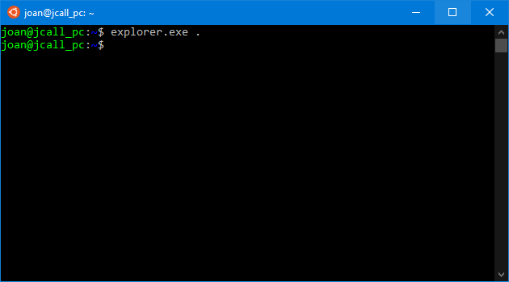
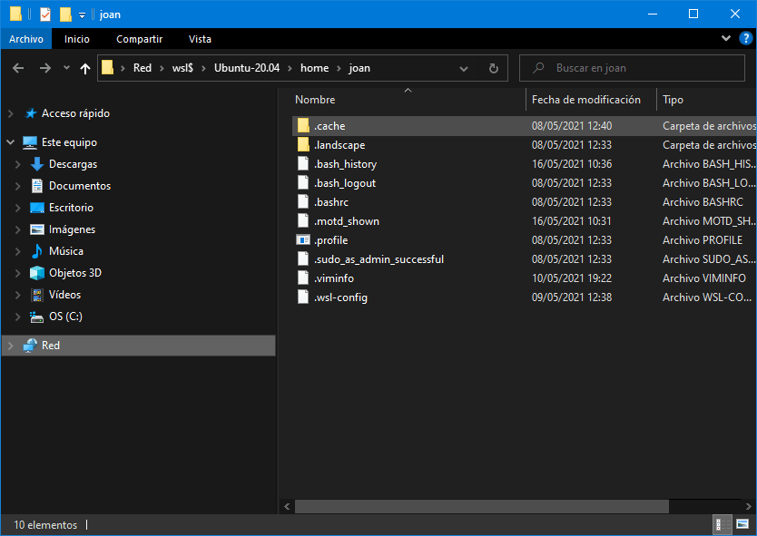
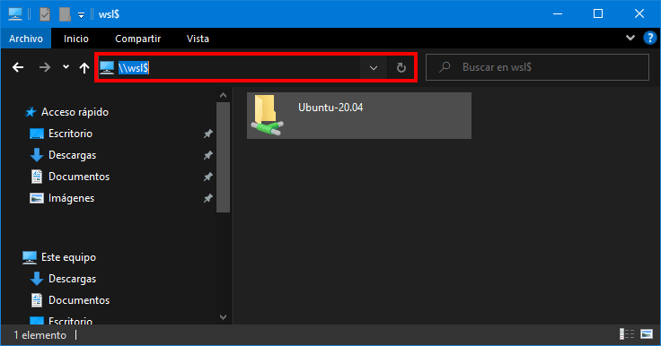
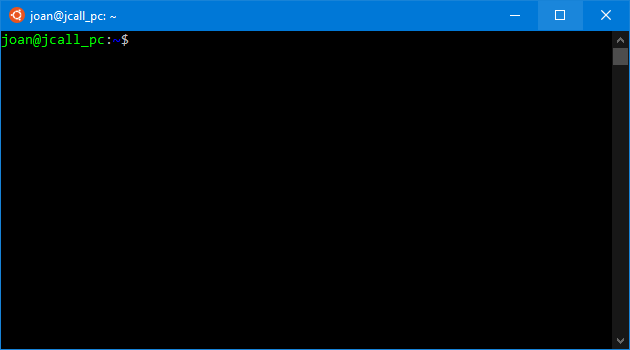
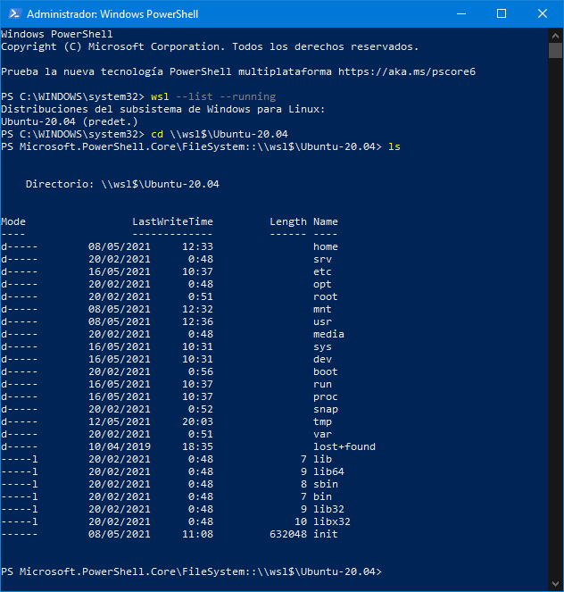

Anteriormente vimos como [instalar WSL y WSL 2 en Windows](). A continuación veremos como podemos acceder a ficheros y directorios que tenemos dentro de WSL desde Windows. Para conseguir lo que acabo de citar les recomiendo seguir los siguientes métodos.<!--more-->

**Nota**: La totalidad de ficheros de WSL están ubicados en `\wsl$\<nombre_distro>` **Nota:** Los archivos de WSL se montarán como si fueran una unidad de red. Por lo tanto al acceder a los ficheros tendremos las mismas limitaciones que tenemos en una unidad de red.

## ACCEDER A LOS FICHEROS DE WSL DES DEL EXPLORADOR DE ARCHIVOS DE WINDOWS

Lo primero que tenemos que realizar es acceder a la terminal de WSL. Una vez la tengan abierta tendrán que ejecutar el siguiente comando:

> ```shell
> explorer.exe .
> ```

[](images/abrir-WSL-en-windows.png)

Acto seguido se abrirá el explorador de archivos de Windows y podrán ver y operar con los ficheros que tenemos dentro de WSL.

[](images/archivos-WSL-de-del-explorador-de-windows.png)

### Método alternativo

Otra solución alternativa seria introducir la siguiente ruta en el explorador de archivos de Windows 10:

> ```shell
> \\wsl$
> ```

Al acceder dentro de esta ruta podrán ver la totalidad de archivos que tienen en los sistemas operativos que tengan en WSL.

[](images/acceder-a-los-ficheros-de-wsl-de-del-explorador-windows.png)

## ACCEDER A LOS FICHEROS DE WSL DESDE POWERSHELL

Inicialmente tenemos que abrir el subsistema de Windows para Linux (WSL).

[](images/abrir-wsl.png)

Una vez esté abierto abrimos una Powershell con permisos de administrador .

[](images/abrir-powershell-admin.png)

A continuación tenemos que teclear el siguiente comando en la consola de Powershell para ver la totalidad de distribuciones Linux que tenemos instaladas y levantadas en el equipo.

> ```shell
> wsl --list --running
> ```

En en mi caso solo tengo una distribución instalada y la salida del comando ejecutado ha sido la siguiente:

> ```shell
> Distribuciones del subsistema de Windows para Linux:
> Ubuntu-20.04 (predet.)
> ```

La totalidad de ficheros de WSL se almacenan en la ubicación `\wsl$\<nombre_de_nuestra_distribución>`. Acabamos de ver que el nombre de nuestra distribución es `Ubuntu-20.04`. Por lo tanto para acceder a la ubicación donde están nuestros ficheros ejecutaremos el siguiente comando en la Powershell de Windows:

```shell
cd \\wsl$\Ubuntu-20.04
```

Acto seguido mediante el comando `ls` podremos listar y trabajar con todos los ficheros y directorios de WSL.

[](images/archivos-wsl-desde-powershell.png)

**Nota**: A día de hoy estos son los mejores métodos para poder acceder a los archivos de WSL desde Windows 10. Es altamente probable que a medida que avancen las versiones de Windows aparezcan mejores alternativas.

Si quieren información más técnica sobre el mecanismo usado para acceder a los ficheros de WSL desde Windows pueden ver el siguiente vídeo.

https://www.youtube.com/watch?v=63wVlI9B3Ac

#### Fuentes

[https://www.tenforums.com/tutorials/127857-access-wsl-linux-files-windows-10-a.html](https://www.tenforums.com/tutorials/127857-access-wsl-linux-files-windows-10-a.html)
