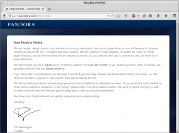
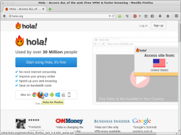
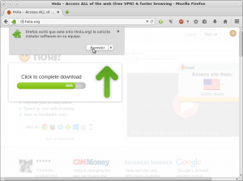
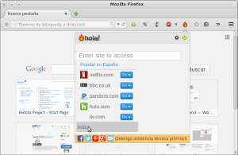
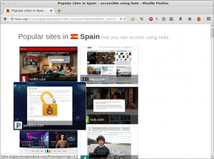
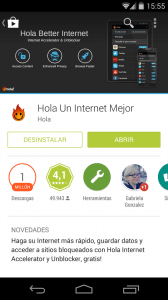
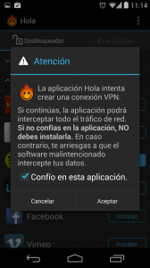
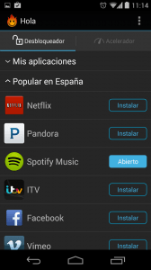
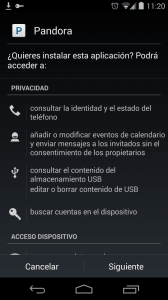

Muchos de vosotros navegando se habrán encontrado con la situación que quieren visualizar un vídeo o acceder a un contenido y sencillamente es totalmente imposible porqué el vídeo o contenido está restringido a usuarios de un determinado país. Seguro que la mayoría de personas también habrán escuchado a hablar de servicios como Netflix, Pandora, Hulu u otros que solo se pueden acceder desde determinados países.<!--more-->

**Si** esta es vuestra situación y **quieren saltarse estas limitaciones geográficas lo pueden realizar siguiendo el procedimiento que se muestran en este artículo**. Como podrán **el método mencionado es muy simple de aplicar y sirve tanto para ordenador como para dispositivos móviles**.

###### Nota: En este artículo detallamos el funcionamiento de [Hola](http://hola.org/ "Web de Hola"). Aparte de Hola existen otras soluciones equivalentes. Por lo tanto en el caso que alguna de ellas no funcione siempre tendremos alternativas como por ejemplo [Zenmate](https://zenmate.com/ "Web de Zenmate"), [Media Hint](https://mediahint.com/ "Web de Media Hint") (alternativa de pago), [Proxmate](http://proxmate.dave.cx/ "Web de Proxmate"), [Spotflux](http://www.spotflux.com/ "Web de Spotflux"), etc.

###### Nota: Lo más probable es que en breve realice un artículo para detallar la instalación y el uso de Zenmate u algún otro servicios similar a Hola.

## HERRAMIENTAS NECESARIAS PARA ACCEDER A SERVICIOS RESTRINGIDOS GEOGRAFICAMENTE

Para poder acceder a servicios restringidos geograficamente **tan solo necesitaremos instalar una simple extensión en nuestro navegador web, o una app en nuestro teléfono móvil o tablet**.

En la primera parte del post detallaremos como instalar y usar Hola en el Navegador Firefox. Finalmente veremos como instalar y usar Hola en un teléfono móbil con Android.

###### Nota: La extensión Hola actualmente se puede usar en Google Chrome, Firefox, Internet Explorer, Safari, Android, Windows Phone e iOS.

## FUNCIONAMIENTO DE HOLA

**Hola es un servicio VPN gratuito. Para quien quiera saber como funciona un servicio VPN y las ventajas que puede proporcionar a los usuarios les recomiendo la lectura del siguiente** [artículo]().

Además de funcionar como un servicio VPN, Hola tiene otras particularidades interesantes que también podremos ver descritas en este artículo.

###### Nota: En el caso de ser usuario de pago de hola ya no hay el peer to peer y se garantiza una velocidad de conexión óptima.

## ACCEDER A SERVICIOS RESTRINGIDOS GEOGRAFICAMENTE EN EL ORDENADOR

Si intentan acceder al servicio de música Pandora obtendrán un resultado parecido al que se muestra en la siguiente imagen:

Si leen el mensaje verán que se informa que por temas de licencias, el servicio únicamente está disponible en Estados Unidos, Australia y Nueza Zelanda. Para solucionar este problema tan solo tenemos que instalar la extensión Hola

**Para instalar la extensión Hola tenemos que abrir nuestro navegador e ingresar en la siguiente páginas web:**

[http://hola.org/](http://hola.org/ "Acceder a la web de hola para instalar la extensión")

Una vez hemos entrado en la web ya podemos proceder a instalar Hola. Para instalar la extensión hola, tal y como se puede ver en la captura de pantalla, **tenemos que clicar encima del icono del navegador o sistema operativo que estamos usando:**

Como **en mi caso** estoy usando el navegador que Firefox **clico encima del icono de Firefox**. Después de clicar encima del icono de Firefox aparecerá una ventana en la que tendremos que **presionar encima del botón** **Permitir** para que se pueda instalar la extensión en nuestro navegador.

Después de presionar en el botón **Permitir** aparecerá otra ventana en la que tendremos que **presionar el botón** **Instalar Ahora**. Una vez presionado el botón, la extensión Hola se instalará prácticamente al instante.

**Una vez instalada la extensión ya podemos usarla. Para usarla**, tal y como se puede ver la captura de pantalla, tenemos que **presionar encima del icono de la llama que ha aparecido en nuestro navegador:**

Una vez hemos clicado encima del icono tenemos que **introducir la dirección a la que queremos acceder o simplemente, como se puede en la captura de pantalla, clicar encima de la opción** **Más...** . **Después de clicar encima de la opción** **Más** aparecerá la siguiente pantalla:

De la multitud de servicios que aparecen en pantalla tan solo tenemos que **seleccionar el que queremos usar. Como en mi caso quiero usar Pandora clicaré encima de del servicio Pandora.com**. Después de clicar tan solo tenemos que esperar unos segundos para poder acceder al servicio. Una vez hemos accedido a Pandora, **nos hacemos una cuenta o ingresamos en nuestra cuenta,** **y** como se puede en la captura de pantalla, **ya podemos usar el servicio tranquilamente de forma fácil y sin complicaciones**.

###### Nota:  El servicio VPN de Hola solo funcionará en la pestaña del navegador en que hemos abierto Pandora. Si abrimos una nueva pestaña y accedemos a una web sin usar Hola navegaremos de forma habitual sin usar el servicio VPN.

###### Nota:  Hola permite crearnos una cuenta de usuario. En principio si no tenemos necesidad de hacernos usuarios premium no es necesario crearse una cuenta. Mas adelante en el post se citan las ventajas que obtendremos al hacernos usuarios premium.

###### Nota:  En el caso que un servicio ofrezca contenidos distintos en diferentes países no es ningún problema. Por ejemplo en si intentamos acceder a netflix podremos acceder a Netflix de Estados Unidos, México, etc. Tan solo tendremos que seleccionar el país que deseamos en el momento de acceder al servicio.

## ACCEDER A SERVICIOS RESTRINGIDOS GEOGRAFICAMENTE EN ANDROID

Si queremos acceder a un servicio restringido en nuestro teléfono o tablet con Android, el procedimiento que tenemos que seguir es igual de simple que en el caso anterior. Lo primero que tenemos que hacer es **acceder al Google Play y descargar la aplicación Hola**. **La aplicación hola la podéis descargar directamente accediendo al siguiente** [enlace](https://play.google.com/store/apps/details?id=org.hola&hl=es "Descarga de Hola en Google Play"). Para que no exista ningún tipo de duda que están instalando la aplicación adecuada les dejo la siguiente captura de pantalla:

**Una vez tenemos instalada la aplicación tan solo tenemos que abrirla**. Una vez abierta la aplicación les aparecerá una advertencia de seguridad. La advertencia de seguridad nos dirá que nos estamos conectando a través de un servicio VPN, y por lo tanto corremos el riesgo de comprometer nuestros datos e información si detrás del servicio VPN hay personas malintencionadas.

Como nosotros confiamos en el servicio de Hola **tildaremos la casilla de** **Confío en esta aplicaciń** **y seguidamente presionaremos el botón** **Aceptar**. Una vez conectados el VPN la pantalla de vuestro teléfono será la siguiente:

Ahora si queremos acceder a Pandora lo primero que tenemos que hacer es instalar su Aplicación. Para instalar la aplicación lo primero que hay que hacer es **localizar la aplicación que queremos instalar y seguidamente presionar el botón** **Instalar**. **Una vez presionado el botón empezará la instalación de pandora**.

Una vez instalada la aplicación, y obviamente estando conectado al servicio VPN que ofrece Hola, tenemos que que **abrir la aplicación Pandora**. Al abrirse la aplicación tendremos que **introducir los datos necesarios para poder acceder a nuestra cuenta**. **Una vez introducidos los datos**, tal y como se puede ver en esta captura de pantalla, ya podremos **disfrutar de Pandora o de cualquier otro servicio restringido geográficamente**.

###### Nota: Hola también esta disponible para iOS. No obstante para que este servicio funcione en iOS hay que disponer de una cuenta Premium. En contraposición con Android no hace falta ni crearse una cuenta para poder usar este servicio.

###### Hola: El procedimiento que acabáis de ver lo he realizado con un Nexus 5 con Android 4.4.4, y sin ser usuario Root. En el caso que dispongáis de teléfonos con una versión de Android 4.0 o superior no hay que tener problemas para que esta aplicación funcione. Si disponéis de teléfonos con versiones antiguas de Android tendréis que rootear el teléfono para que Hola funcione.

## ¿HOLA ES GRATIS?

**Tanto en Android como en cualquier ordenador personal podemos usar tranquilamente Hola siendo usuarios Free** y no tiene porque existir ningún problema. El servicio VPN funcionará perfectamente en la pestaña que hayamos seleccionado.

Hola se puede mantener free porqué el funcionamiento de este servicio es mediante [peer to peer](https://es.wikipedia.org/wiki/Peer-to-peer "Explicación del funcionamiento peer to peer"). Esto significa que no hay una serie de servidores centralizados que proveen un servicio de VPN a los clientes de esta plataforma. Quien realmente esta proveyendo servicio a los otros clientes somos nosotros mismos, ya que cuando estamos usando Hola nuestro ordenador estará actuando como cliente y como servidor. Así por lo tanto cuantas más persones usen este servicio mejor rendimiento ofrecerá.

###### Nota: Aunque diga que no existan servidores centralizados podría ser posible que este servicio usará una estructura híbrida. Es posible que existan servidores centralizados potenciados por una red peer to peer que forman los usuarios del servicio. De esta forma se consigue minimizar la inversión en servidores y por lo tanto se puede ofrecer un servicio gratuito a los clientes.

Como iOS es un sistema cerrado intuyo que no es posible aplicar esta filosofía de funcionamiento. Por lo tanto **quien quiera usar Hola en iOS no le queda más remedio que pagar y usar Hola como si se tratará de un servicio VPN convencional. Por lo tanto en iOS Hola es de pago.**

Quien decida o quiera usar el servicio premium obviamente obtendrá una serie de ventajas. En el momento de ser premium Hola se transformará en un servicio VPN tradicional. Por lo tanto el funcionamiento ya no será mediante peer to peer y en principio el rendimiento que se obtendrá será mejor.

###### Nota: Si consultáis la página web de Hola.org encontraréis información adicional acerca de las cuentas Premium. Veréis que existen promociones y tiempo de prueba considerables para testear el funcionamiento de las cuentas premium.

## OTROS BENEFICIOS APORTADOS POR HOLA

Aparte de los beneficios que pueda aportar cualquier servidor VPN y de los beneficios citados en el post, **Hola también ofrecerá un servicio para acelerar/optimizar nuestra navegación en Internet. Quien quiera mas información respecto a este beneficio puede consultar el siguiente** [enlace](http://hola.org/faq#index_fast "Optimizar la conexión a Internet con Hola").

En el enlace que acabo de mostrar verán que en el momento de conectarse a **Hola gracias a los algoritmos de compresión que se usan, la infraestructura basada en peer to peer y gracias a la memoria cache que se almacena en cada uno de los peers/clientes, conseguiremos optimizar nuestra conexión a Internet y de esta forma acceder a los contenidos de forma más rápida.**

###### Nota: Si usáis esta característica vuestro Internet no será más rápido. Vuestra velocidad de Internet siempre estará limitada por al ancho de banda de vuestra conexión. Lo único que conseguiréis con este servicio es resolver algunas peticiones a Internet de forma más rápida.

## ADVERTENCIA

A pesar de todas estas bondades hay que ser cauto y bajo mi punto de vista solo **hay que usar este tipo de servicios cuando sea estrictamente necesario**.

La conexión a través de un VPN o Proxy mucha gente dice y afirma que es segura y que soluciona los problemas de privacidad existentes en la red. Bajo mi punto de vista esto no es del todo cierto. **Este tipo de conexiones son seguras únicamente si el proveedor del servicio es fiable**. **En el caso que quien estuviera detrás del servicio fuera alguien con malas intenciones podríamos afirmar tranquilamente que es peor el remedio que la enfermedad.**

Por lo tanto siempre recomiendo usar este tipo de servicios con precaución y siempre que sea estrictamente necesario. En mi caso de momento solo uso este servicio para escuchar Pandora ya que gracias al chromecast y algunas aplicaciones realmente no necesito Netflix ni ninguna otra plataforma por el estilo.
