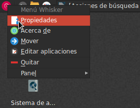
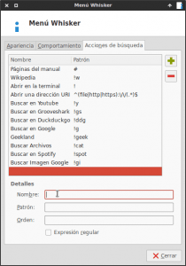
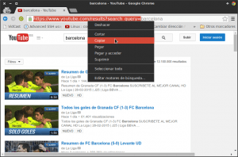
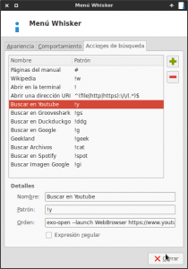
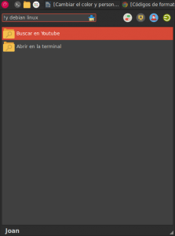
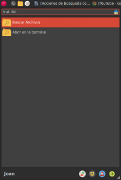
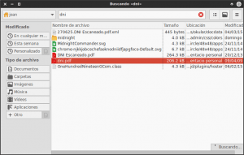

Para finalizar la serie de posts que hablan sobre Whisker menu hablaremos una de las funcionalidades más sorprendentes, interesantes y desconocidas que ofrece Whisker Menu. Estoy hablando de las acciones búsqueda, o search actions en Inglés.<!--more-->

## ¿QUÉ ES UNA ACCIÓN DE BÚSQUEDA?

El campo de búsqueda de Whisker menu no solo sirve para buscar y ejecutar aplicaciones que tenemos instaladas en nuestro ordenador. **El campo de búsqueda** también **lo podemos usar para ejecutar acciones de búsqueda** que nosotros mismos podemos configurar.

**Ejemplos de acciones búsqueda** **que podemos configurar y usar con Whisker menu** **son** las siguientes:

1. **Buscar canciones en Grooveshark** desde el menú de búsqueda de whisker menu.
2. **Buscar canciones en Spotify web** desde el menú de búsqueda de whisker menu.
3. **Buscar vídeos en Youtube** a través del cuadro de búsqueda de whisker menu.
4. **Realizar búsquedas en Google, Duckduckgo, o cualquier otro buscador** desde el cuadro de búsqueda de Whisker menu.
5. **Buscar archivos y carpetas almacenados en nuestro disco duro** desde el cuadro de búsqueda de Whisker menu.
6. **Realizar búsquedas en la wikipedia**, o incluso en mi blog usando del cuadro de búsqueda de Whisker menu.
7. **Abrir cualquier página web** a través del cuadro de búsqueda de whisker menu.
8. **Buscar imágenes en el buscador de Google** a través del cuadro de búsqueda de Whisker menu.
9. **Lanzar comandos a la terminal** a través del cuadro de búsqueda de whisker menu.

###### Nota: Existen muchos más tipos de acciones de búsqueda que podemos aplicar. Tan solo tenemos que usar nuestra imaginación e intentar buscar la forma de implementar la acción. Si alguien quiere realizar aportar otros ejemplos de acciones de búsqueda lo puede hacer a través de los comentarios de este post.

## CREAR Y CONFIGURAR ACCIONES DE BÚSQUEDA O SEARCH ACTIONS

En este apartado mostraremos como podemos crear nuestras propias acciones de búsqueda. Para entender como funcionan las acciones de búsqueda, y para ver como crearlas lo haremos mediante los siguientes ejemplos:

### 1- Buscar vídeos de youtube a través de whisker menu

Lo primero que tenemos que realizar es acceder al apartado donde tenemos que configurar las acciones de búsqueda. Para ello **posicionamos el puntero del mouse encima del icono de whisker menu**. Tal y como podemos ver en la captura de pantalla, **presionamos el botón derecho del mouse y seleccionamos la opción** **Propiedades**:

[](images/1-Acceso-configuración-de-Whisker-menu.png) Seguidamente aparecerá una ventana en la que tenemos que **seleccionar la pestaña de** **Acciones de búsqueda**. En estos momentos ya podemos empezar la configuración de la acción de búsqueda. Para ello **presionamos el botón +**. Una vez hayamos presionado el botón +, deberemos **rellenar los campos** **Nombre**, **Patrón** y **Orden** que se pueden ver en la siguiente captura de pantalla:

[](images/2-Rellenar-acciones-de-búsqueda.png)

**En campo Nombre** **introduciremos el nombre de la acción búsqueda**. Podéis elegir el nombre que queráis. En mi caso el nombre seleccionado será:

> ```
> Buscar en Youtube
> ```

**En el campo Patrón** tenemos que introducir los caracteres que queramos para poder invocar la acción de búsqueda. En mi caso he seleccionado los siguientes caracteres:

> ```
> !y
> ```

**En el campo Orden** **tenemos que escribir el comando que ejecutará la acción de búsqueda**. El comando para buscar un vídeo en Youtube es el siguiente:

> ```
> exo-open --launch WebBrowser https://www.youtube.com/results?search_query=%u
> ```

Es importante entender como hemos construido la orden, ya que de la misma forma que construimos la orden para buscar en Youtube, podemos crear una orden para buscar en el buscador Google, en el buscador de Duckduckgo, en Groveshark, en Spotify web, o incluso de mi blog.

La primera de las partes que conforma la orden es la siguiente:

> ```
> exo-open --launch WebBrowser
> ```

La primera de las partes de la orden lo único que hace es abrir nuestro navegador web por defecto que en mi caso es Google Chrome.

La segunda parte de la orden para realizar búsquedas en Youtube desde whisker menu es la siguiente:

> ```
> https://www.youtube.com/results?search_query=
> ```

La segunda parte de la orden se obtiene de la siguiente forma. Abrimos Youtube. Una vez abierto youtube nos vamos a su cuadro de búsqueda y buscamos el termino que queramos. En mi caso escribo barcelona y presiono teclar **Enter**.

Seguidamente, tal y como se puede ver en la captura de pantalla, Youtube nos ofrecerá los resultados de nuestra búsqueda.

[](images/3-comando-acción-personalizada.png)

Una vez mostrados los resultados de búsqueda, tal y como se puede ver en la captura de pantalla, tenemos que ir a la barra de direcciones de nuestro navegador y copiar la URL desde el principio hasta encontrar nuestra palabra de búsqueda que en mi caso es Barcelona. De este modo ya tenemos la segunda parte de nuestra orden.

Finalmente la tercera parte de la orden siempre será la siguiente:

> ```
> %u
> ```

La tercera parte es muy simple y siempre será igual. Tan solo tenemos que añadir %u. Lo que hace esta parte del comando es indicar que tenemos que introducir una cadena de texto. En otras palabras, %u es una variable que en el momento de ejecutarse la acción de búsqueda, tomará el valor de la palabra que estamos buscando en Youtube.

Una vez introducidos el Nombre, el Patrón y la Orden, tal y como se puede ver en la captura de pantalla, **presionamos el botón Cerrar**.

[](images/4-Acción-de-búsqueda-configurada.png)

Ahora ya podemos probar si la acción de búsqueda que acabamos de configurar funciona de la forma que esperamos. Para ello **en el cuadro de búsqueda de whisker menu**, tal y como se puede ver en la captura de pantalla, **introducimos el siguiente texto:**

> ```
> !y debian linux
> ```

[](images/5-busqueda-youtube.png)

###### Nota: El texto introducido en el cuadro de búsqueda empieza por !y, ya que !y, es el patrón que hemos seleccionado en la configuración. Después de !y introducimos el texto que queremos buscar en youtube que en mi caso es debian linux.

Finalmente **presionamos** **Enter**. Después de presionar Enter, tal y como se puede ver en la captura de pantalla, se abre nuestro navegador predeterminado con la búsqueda correspondiente:

[](images/6-Búsqueda-en-youtube-realizada.png)

Aplicando la metodología que acabamos de ver, podemos crear multitud de acciones de búsqueda. Seguidamente mostraremos el **Nombre**, el **Patrón** y la **Orden** a utilizar para configurar otras acciones de búsqueda diferentes a la que acabamos de crear.

### 2- Realizar búsquedas con el buscador de Google

El Nombre, Patrón y Orden para poder realizar búsquedas con el buscador de Google a través de Whisker menu son los siguientes:

> ```
> Nombre: Buscar en Google
> Patrón: !g
> Orden: exo-open --launch WebBrowser google.com/search?q=%u
> ```

Una vez configurada la acción de búsqueda, pueden comprobar su funcionamiento introduciendo y ejecutando el siguiente comando en el cuadro de búsqueda de whisker menu:

> ```
> !g geekland linux
> ```

### 3- Realizar búsquedas con el buscador Duckduckgo

El Nombre, Patrón y Orden para poder realizar búsquedas con el buscador de Duckduckgo a través de Whisker menu son los siguientes:

> ```
> Nombre: Buscar en Duckduckgo
> Patrón: !ddg
> Orden: exo-open --launch WebBrowser https://duckduckgo.com/?q=%u
> ```

Una vez configurada la acción de búsqueda, pueden comprobar su funcionamiento introduciendo y ejecutando el siguiente comando en el cuadro de búsqueda de whisker menu:

> ```
> !ddg geekland linux
> ```

### 4- Realizar búsquedas con el buscador Bing

El Nombre, Patrón y Orden para poder realizar búsquedas con el buscador de Bing a través de Whisker menu son los siguientes:

> ```
> Nombre: Buscar en bing
> Patrón: !b
> Orden: exo-open --launch WebBrowser http://www.bing.com/search?q=%u
> ```

Una vez configurada la acción de búsqueda, pueden comprobar su funcionamiento introduciendo y ejecutando el siguiente comando en el cuadro de búsqueda de whisker menu:

> ```
> !b geekland linux
> ```

### 5- Realizar la búsqueda de una imagen en el buscador de Google

El Nombre, Patrón y Orden para poder realizar búsqueda de imágenes con el buscador de Google a través de Whisker menu son los siguientes:

> ```
> Nombre: Buscar imagenes en google
> Patrón: !gi
> Orden: exo-open --launch WebBrowser https://www.google.com/search?site=&tbm=isch&source=hp&biw=1680&bih=913&q=%u
> ```

Una vez configurada la acción de búsqueda, pueden comprobar su funcionamiento introduciendo y ejecutando el siguiente comando en el cuadro de búsqueda de whisker menu:

> ```
> !gi tux
> ```

### 6- Realizar búsqueda de canciones en Grooveshark

El Nombre, Patrón y Orden para poder buscar canciones en Grooveshak a través de Whisker menu son los siguientes:

> ```
> Nombre: Buscar en Grooveshark
> Patrón: !gs
> Orden: exo-open --launch WebBrowser http://grooveshark.com/#!/search?q=%u
> ```

Una vez configurada la acción de búsqueda, pueden comprobar su funcionamiento introduciendo y ejecutando el siguiente comando en el cuadro de búsqueda de whisker menu:

> ```
> !gs Eric Clapton
> ```

### 7- Realizar búsqueda de canciones en Spotify Web

El Nombre, Patrón y Orden para poder buscar canciones en Spotify Web a través de Whisker menu son los siguientes:

> ```
> Nombre: Buscar en Grooveshark
> Patrón: !spot
> Orden: exo-open --launch WebBrowser https://play.spotify.com/search/%u
> ```

Una vez configurada la acción de búsqueda, pueden comprobar su funcionamiento introduciendo y ejecutando el siguiente comando en el cuadro de búsqueda de whisker menu:

> ```
> !spot the muse
> ```

### 8- Realizar búsquedas determinadas de un tema en mi blog

El Nombre, Patrón y Orden para poder realizar búsqueda de temas en mi propio blog son los siguientes:

> ```
> Nombre: Geekland
> Patrón: !geek
> Orden: exo-open --launch WebBrowser https://geekland.eu/?s=%u
> ```

Una vez configurada la acción de búsqueda, pueden comprobar su funcionamiento introduciendo y ejecutando el siguiente comando en el cuadro de búsqueda de whisker menu:

> ```
> !geek vpn
> ```

### 9- Buscar archivos y carpetas de nuestro disco duro con whisker menu

Gracias a las acciones de búsqueda también podemos buscar archivos y carpetas almacenados en nuestro disco duro con wisker menu.

Para ello lo primero que tenemos que realizar es asegurar que tenemos instalado el buscador de archivos Catfish. Por lo tanto **abrimos una terminal y tecleamos y ejecutamos el siguiente comando:**

> ```
> sudo apt-get install catfish
> ```

En el caso que Catfish no esté instalado veremos como se instala. En el caso que esté instalado simplemente el comando aplicado nos dará una salida informado que Catfish ya está instalado y se encuentra en su versión más reciente.

Una vez instalado Catfish, al igual que hicimos los apartados anteriores, tenemos que **acceder a la ventana para configurar las acciones de búsqueda**. Una vez dentro de la ventana, tenemos que **rellenar los campos Nombre, Patrón y Orden de la siguiente forma:**

> ```
> Nombre: Buscar archivos
> Patrón: !cat
> Orden: catfish --hidden --start /home/joan %s
> ```

Una vez introducidos el Nombre, el Patrón y la Orden, tal y como se puede ver en la captura de pantalla, **presionamos el botón Cerrar**.

Una vez más resulta importante entender como se ha construido la orden, ya que si comprendemos como la hemos realizado podremos realizar modificaciones para adaptar los parámetros de búsqueda a nuestras necesidades.

En la primera parte de la orden tenemos que indicar que se ejecute catfish al iniciar la acción de búsqueda. Para ello la primera parte de la orden es:

> ```
> catfish
> ```

La segunda parte de la orden para buscar archivos en nuestro disco duro, es donde se indican las opciones de búsqueda. En nuestro caso las opciones de búsqueda seleccionadas son hidden y start. Por lo tanto la segunda parte de la orden es:

> ```
> --hidden --start
> ```

Al escribir hidden estamos indicando que se busquen tanto archivos normales como archivos ocultos del sistema. Si no nos interesa buscar archivos ocultos de nuestro sistema podemos tranquilamente borrar esta parte.

Al escribir start lo que estamos haciendo es que en el momento que se abra catfish se inicie el proceso de búsqueda del archivos o carpetas de forma automática sin que nosotros tengamos que presionar ninguna tecla ni realizar ninguna acción.

###### Nota: Aparte de las opciones hidden y start, existen otras opciones que podemos usar como por ejemplo exact para diferenciar entre mayúsculas y minúsculas, fulltext para buscar texto dentro de archivos de texto, y thumbnails para previsualizar las imágenes en miniatura de los archivos de imagen. En función de vuestras necesidades se pueden usar distintas opciones. Para obtener más información acerca de las opciones disponibles en catfish, pueden abrir una terminal y teclear el comando man catfish.

En la tercera parte de la orden tenemos que indicar la ruta en que queremos que se realice la búsqueda de archivos y de carpetas. En mi caso quiero realizar las búsquedas en mi partición home. Por lo tanto la tercera parte del comando es

> ```
> /home/joan
> ```

En el caso que vosotros queráis realizar la búsqueda en otra partición tan solo tienen que modificar la ruta de búsqueda.

Finalmente la última parte de la orden siempre será la siguiente:

> ```
> %s
> ```

Introduciendo el símbolo %s en la orden, lo que estamos haciendo es indicar que hay que introducir una cadena de texto en el cuadro de búsqueda de Whisker menu. En otras palabras, %s es una variable que en el momento de ejecutarse la acción de búsqueda, tomará el valor de la palabra con la que estamos buscando el archivo o carpeta.

Una vez configurada la acción de búsqueda, lo único que falta es comprobar que funcione. Imaginemos el caso que tengo almacenado mi DNI en el disco duro de mi ordenador, pero no se la ubicación exacta. Para hallar la ubicación podemos usar la acción de búsqueda que acabamos de configurar de la siguiente forma. **Abrimos whisker menu e introducimos y ejecutamos el siguiente texto:**

> ```
> !cat dni
> ```

[](images/7-Buscar-un-archivo-en-el-disco-duro.png)

###### Nota: El texto introducido en el cuadro de búsqueda empieza por !cat, ya que !cat, es el patrón que hemos seleccionado en la configuración. Después de !cat introducimos dni ya que es el nombre, o parte del nombre, del archivo de imagen que contiene mi DNI.

Una vez introducido el texto **presionamos la tecla** **Enter**. Seguidamente se abrirá catfish y empezará a buscar la totalidad de archivos que contienen la palabra DNI ubicados en mi partición Home. Después de esperar unos segundos, tal y como se puede ver en la captura de pantalla, ya hemos encontrado el archivo que estábamos buscando:

[](images/8-dni-encontrado.png)

## USAR LAS ACCIONES DE BÚSQUEDA PRECONFIGURADAS

Aparte de las acciones de búsqueda que acabamos de crear y configurar, **Whisker menu viene con una serie de acciones de búsqueda preconfiguradas**. Las acciones de búsqueda preconfiguradas de Whisker menu son las siguientes:

1. Consultar como usar cualquier comando del sistema mediante man.
2. Hacer consultas de búsqueda en la wikipedia
3. Ejecutar comandos en la terminal
4. Abrir páginas web

**Para poder usar las acciones de búsqueda preconfiguradas tan solo tienen que seguir los siguientes pasos:**

### 1- Consultar como usar cualquier comando del sistema

Si queremos ver las instrucciones de uso del comando catfish lo podemos hacer muy fácilmente con whisker menu. Tan solo tenemos que **acceder al cuadro de búsqueda y teclear el siguiente comando:**

> ```
> # catfish
> ```

**Presionamos** la tecla **Enter** y a posteriori se abrirá una terminal con las instrucciones del comando catfish.

###### Nota: Si queréis ver las instrucciones de otros comandos, tan solo hay que reemplazar catfish por el comando que vosotros preciséis.

### 2- Hacer consultas en la Wikipedia

Si estamos buscando información de un tema en concreto, podemos hacer una consulta de este tema en la wikipedia a través de Whisker menu. Así por lo tanto en el caso que estemos buscando información sobre la persona de [Aaron Swartz](https://es.wikipedia.org/wiki/Aaron_Swartz "Información sobre Aaron Swartz"), podemos **abrir nuestro Whisker menu e introducir el siguiente comando:**

> ```
> !w aaron swartz
> ```

**Presionamos** la tecla **Enter** y seguidamente se abrirá nuestro navegador por defecto mostrando la información que contiene la wikipedia acerca del personaje Aaron Swartz.

###### Nota: Si quieren buscar información sobre otros temas, tan solo tienen que sustituir Aaron Swartz por el tema que les interese.

### 3- Ejecutar comandos en la terminal

Si lo precisamos también podemos ejecutar comandos que ejecutaríamos en la terminal a través de whisker menu. Así por lo tanto si queremos actualizar los repositorios de nuestro sistema a través de Whisker menu, tan solo tenemos que **abrir whisker menu y teclear el siguiente comando en el cuadro de búsqueda:**

> ```
> ! sudo apt-get update
> ```

**Presionan** **Enter**. Después de presionar Enter verán como se abre la terminal y se actualizan los repositorios de vuestra distribución.

###### Nota: El comando sudo apt-get update lo deberán modificar en función del gestor de paquetes que usen.

### 4- Abrir páginas Web

Acceder a cualquier página web a través de Whisker menu es sumamente fácil. Tan solo hay que acceder al cuadro de búsqueda de whisker menu e introducir la URL de la web que quieren visitar. Así por lo tanto, si quieren visitar mi blog, tan solo **hay que introducir la siguiente URL en el cuadro de búsqueda de Whisker menu:**

[https://geekland.eu](https://geekland.eu/ "Web geekland.eu")

**Una vez introducida la URL presionamos la tecla** **Enter**. Seguidamente se abrirá nuestro navegador web por defecto y accederá al blog geekland.eu

## CONCLUSIÓN FINAL SOBRE WHISKER MENU Y LAS ACCIONES DE BÚSQUEDA

Durante estas últimas he realizado una serie de 3 artículos adicionales hablando sobre la configuración, personalización y uso de Whisker menu:

1. [Instalar Whisker Menu y motivos para usarlo]()
2. [Configurar y personalizar Whisker Menu]()
3. [Usar Whisker Menu como un lanzador de aplicaciones]()

Después de leer detenidamente la totalidad de los artículos comprenderán la potencia y la totalidad de utilidades que le podemos dar a Whisker menu. Además usando vuestra imaginación, y en función de las necesidades de cada uno, se pueden crear otras acciones de búsqueda diferentes a las citadas en este último artículo.
