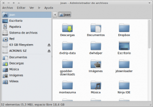
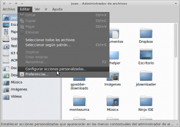
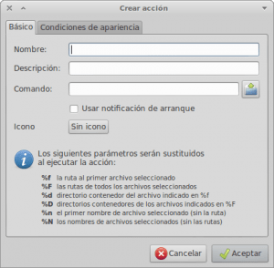

En este post el objetivo será ver como realizar acciones personalizadas en thunar. Primeramente veremos los pasos detallados para definir una acción y a posteriori citaremos la serie de comandos a introducir para ir crear distintas acciones personalizas.<!--more-->

### PASO 1. Abrir el gestor de Arhivos Thunar

[](images/1.png)

### PASO 2. Ir al menu Editar y elegir Configurar acciones personalizadas

[](images/2.png)

### PASO 3. Le damos al símbolo + que podéis ver en la imagen inferior:

[](images/3.png)

### PASO 4. Introducir los datos pertinentes en la pestaña básico:

[](images/4.png)

 

 

 

 

 

 

 

 

 

 

Campo nombre: Introducir el nombre que nos saldrá una vez le damos al botón derecho del mouse para poder aplicar las acciones personalizadas creadas. Por Ejemplo si queremos crear un enlace simbólico pondremos:

> ```
> Crear enlace simbólico
> ```

Campo Descripción: Introducir una descripción de lo que hará nuestra acción personalizada. En el caso que estemos creando un enlace simbólico:

> ```
> Crear enlace simbólico
> ```

Campo Comando: Introducir el comando que queremos que se ejecute. Por ejemplo para realizar un enlace simbólico el comando a ejecutar es:

> ```
> ln -s %f '%n (enlace)' 
> ```

Si clicamos encima del botón Icono podremos elegir un icono para la acción personalizada que queremos crear. En nuestro caso por ejemplo elegimos el siguiente icono para el enlace simbólico:

[](images/120px-High-contrast-emblem-symbolic-link.svg_.png)

### PASO 5. Introducir los datos pertinentes en la pestaña Condiciones de apariencia

[](images/Editar-acción_001.png)

En este paso tenemos que elegir bajo que condiciones aparecerá nuestro menú contextual. En el caso de crear enlaces simbólicos podemos decir que el 90% de los casos lo vamos a realizar en carpetas y archivos. Por lo tanto como podeis ver en el menú de arriba seleccionamos Directorios y Archivos de texto. De esta manera cada vez que seleccionemos un archivo de texto o una carpeta y presionamos el botón derecho del mouse nos apareza una opción llamada crear enlace simbólico.

[](images/Captura-de-pantalla-221212-1030231.png)

En El momento que hayamos presionado Crear enlace simbólico ya lo habremos creado.

## OTRAS ACCIONES PERSONALIZADAS QUE PODEMOS CREAR

Visto como crear una acción personalizada seguidamente indicamos como rellenar los distintos campos para poder crear más acciones personalizadas.

###  Crear Un enlace simbólico o acceso directo

El ejemplo que acabamos de ver es el siguiente:

```
Campo Nombre: Crear enlace simbólico
```

```
Campo Descripción: Crear enlace simbólico
```

```
Campo Comando: ln -s %f '%n (enlace)'
```

Sin icono: Elegir el icono que se crea conveniente, por ejemplo el icono de enlace simbólico. Si no se quiere que aparezca ninguno dejar sin icono.

En la pestaña **condiciones de apariencia** marcar las siguientes opciones: Directorios, Archivos de texto

### Abrir una terminal como root

En el caso que estamos navegando con thunar y deseemos abrir una terminal en modo root en la ruta que estamos en este momento:

```
Campo Nombre: Abrir terminal como root
```

```
Campo Descripción: Abrir terminal como root
```

```
Campo Comando: gksu "xfce4-terminal --working-directory %f"
```

Sin icono: Elegir el icono que se crea conveniente. Si no se quiere que aparezca ninguno dejar sin icono.

En la pestaña **condiciones de apariencia** marcar las siguientes opciones: Directorios

### Abrir un directorio como root

En el caso que deseemos abrir una carpeta en modo root:

```
Campo Nombre: Abrir directorio como root
```

```
Campo Descripción: Abrir directorio como root
```

```
Campo Comando: gksu Thunar %F
```

Sin icono: Elegir el icono que se crea conveniente. Si no se quiere que aparezca ninguno dejar sin icono.

En la pestaña **condiciones de apariencia** marcar las siguientes opciones: Directorios

### Buscar un archivo con catfish

En el caso que deseemos buscar un archivo dentro de una determinada carpeta:

\- Primero tenemos que asegurar que tenemos instalado catfish. En el caso de no tenerlo instalado procedemos a su instalación mediante:

> ```
> sudo apt-get install catfish
> ```

\- Seguidamente seguimos los pasos para crear las acciones personalizadas mediante los siguientes parámetros:

```
Campo Nombre: Buscar archivo
```

```
Campo Descripción: Buscar archivo
```

```
Campo Comando: catfish --path %f
```

Sin icono: Elegir el icono que se crea conveniente, Por ejemplo una lupa. Si no se quiere que aparezca ninguno dejar sin icono.

En la pestaña **condiciones de apariencia** marcar las siguientes opciones: Directorios

### Pegar un archivo en el escritorio

Como muchos saben XFCE 4.8 no permite copiar un archivo, ir al escritorio, accionar el botón derecho del mouse y pegar. Simplemente cuando le damos al botón derecho del mouse la opción pegar siempre estará desactivada. Para solucionar esto podemos configurar la siguiente acción personalizada:

```
Campo Nombre: Pegar en el escritorio
```

```
Campo Descripción: Pegar en el escritorio
```

```
Campo Comando: cp -a %N ~/Escritorio/ | (zenity --title="Copiando..." --progress --auto-close --no-cancel --text="Copiando archivos en el Escritorio.nEspere por favor..." --percentage=70)
```

Sin icono: Elegir el icono que se crea conveniente. Si no se quiere que aparezca ninguno dejar sin icono.

En la pestaña **condiciones de apariencia** marcar las siguientes opciones: Directorios, Archivos de texto, Archivos de sonido, Archivos de imagen, Archivos de vídeo, Otros archivos

De esta forma cada vez que le damos al botón derecho del mouse sobre cualquier archivo nos dará la opción de copiar automáticamente en el escritorio.

### Editar un archivo como root

En el caso que necesitemos modificar un archivo mediante un editor de texto y lo tengamos que hacer en modo root podemos aplicar la siguiente acción personalizada para facilitar el trabajo:

```
Campo Nombre: Editar como root
```

```
Campo Descripción: Editar como root
```

```
Campo Comando: gksu gedit %f
```

Sin icono: Elegir el icono que se crea conveniente. Si no se quiere que aparezca ninguno dejar sin icono.

En la pestaña **condiciones de apariencia** marcar las siguientes opciones: Archivos de texto

###### Nota: En el caso que no utilicéis gedit en el campo Comando tendréis que sustituir gedit por el editor de texto que uséis.

### Abrir una determinada carpeta con Nautilus

En mi caso esta acción personalizada la uso simplemente para dropbox. Otras personas la pueden usar para diferentes propósitos  Como saben Dropbox viene de serie para que la integración sea perfecta en Nautilus. Por lo tanto si estoy en Thunar y quiero abrir la misma ubicación de Thunar en Nautilus utilizo esta acción personalizada:

```
Campo Nombre: Abrir con nautilus
```

```
Campo Descripción: Abrir con nautilus
```

```
Campo Comando: nautilus --no-desktop
```

Sin icono: Elegir el icono que se crea conveniente, por ejemplo el icono de nautilus. Si no se quiere que aparezca ninguno dejar sin icono.

En la pestaña **condiciones de apariencia** marcar las siguientes opciones: Directorios

###### Nota: Existen formas de integrar dropbox con thunar pero provienen de fuentes de terceros y la verdad prefiero usar nautilus puntualmente solo para dropbox.

### Convertir archivos de libreoffice a pdf

En el caso que deseemos transformar archivos en formato odt, doc, xls, etc. a pdf de forma fácil mediante 2 clics de mouse podemos utilizar la siguiente acción personalizada:

\- Antes de crear la acción personalizada asegurar que tenemos instalado el paquete unoconv. En caso de no tenerlo instalado instalarlo mediante el siguiente comando:

> ```
> sudo apt-get install unoconv
> ```

\- Seguidamente seguimos los pasos para crear las acciones personalizadas mediante los siguientes parámetros:

```
Campo Nombre: Convertir a pdf
```

```
Campo Descripción: Convertir a pdf
```

```
Campo Comando: unoconv -f pdf %F
```

Sin icono: Elegir el icono que se crea conveniente, por ejemplo el icono de evince. Si no se quiere que aparezca ninguno dejar sin icono.

En la pestaña **condiciones de apariencia** marcar las siguientes opciones: Otros archivos

### Convertir de DOC y DOCX a ODT

En el caso que deseemos transformar archivos en formato doc, docx a dot de forma fácil mediante 2 clics de mouse podemos utilizar la siguiente acción personalizada:

\- Antes de crear la acción personalizada asegurar que tenemos instalado el paquete unoconv. En caso de no tenerlo instalado instalarlo mediante el siguiente comando:

> ```
> sudo apt-get install unoconv
> ```

\- Seguidamente seguimos los pasos para crear las acciones personalizadas mediante los siguientes parámetros:

```
Campo Nombre: Convertir de doc a odt
```

```
Campo Descripción: Convertir de doc a odt
```

```
Campo Comando: unoconv -f odt %F
```

Sin icono: Elegir el icono que se crea conveniente, por ejemplo el icono de writer. Si no se quiere que aparezca ninguno dejar sin icono.

En la pestaña **condiciones de apariencia** marcar las siguientes opciones: Otros archivos

### Escuhar una muestra de un archivo de audio

En el caso que deseemos escuchar una muestra de un archivo de audio podemos utilizar la siguiente acción personalizada:

\- Antes de crear la acción personalizada asegurar que tenemos instalado el paquete mplayer. En caso de no tenerlo instalado instalarlo mediante el siguiente comando:

> ```
> sudo apt-get install mplayer
> ```

\- Seguidamente seguimos los pasos para crear las acciones personalizadas mediante los siguientes parámetros:

```
Campo Nombre: Escuchar muestra de audio
```

```
Campo Descripción: Escuchar muestra de audio
```

```
Campo Comando: mplayer %f -really-quiet -ss 50 -endpos 15
```

###### Nota: El comando ss indica el segundo en que se inicia la reproducción, en nuestro caso el segundo 50, y el comando endpos indica el segundo en que se termina la reproducción, en nuestro caso 5 segundos.

Sin icono: Elegir el icono que se crea conveniente, por ejemplo el icono de cualquier reproductor musical. Si no se quiere que aparezca ninguno dejar sin icono.

En la pestaña **condiciones de apariencia** marcar las siguientes opciones: Archivos de sonido

Después de ver la potencia de Thunar me pregunto como he podido durante tanto tiempo usar nautilus... En este post solo hay una muestra de las posibilidades que nos ofrece thunar. Se pueden realizar muchas más acciones como por ejemplo transformar automáticamente formatos de imagen, de video, etc.
