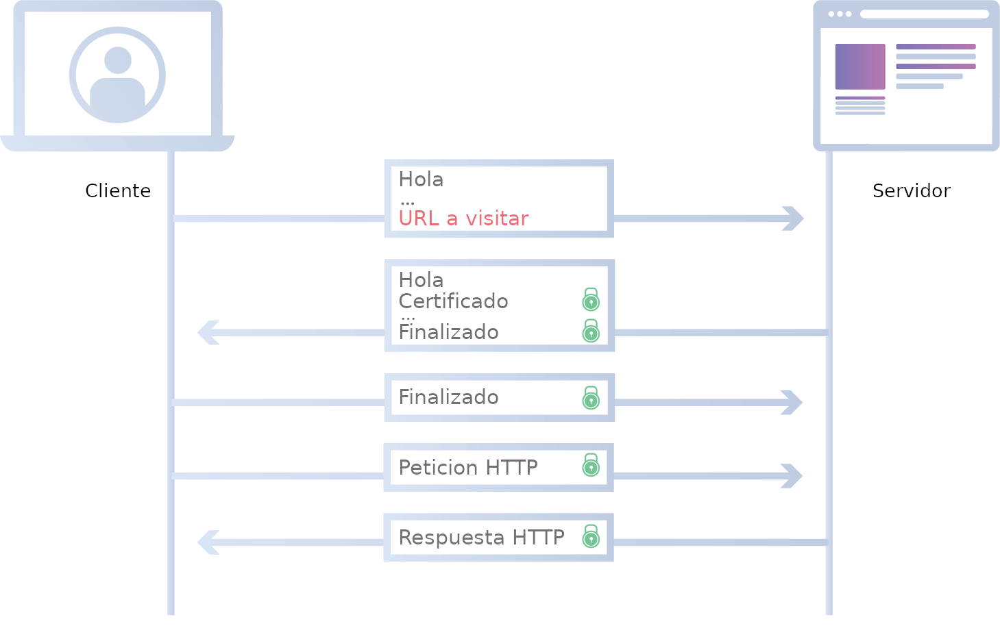
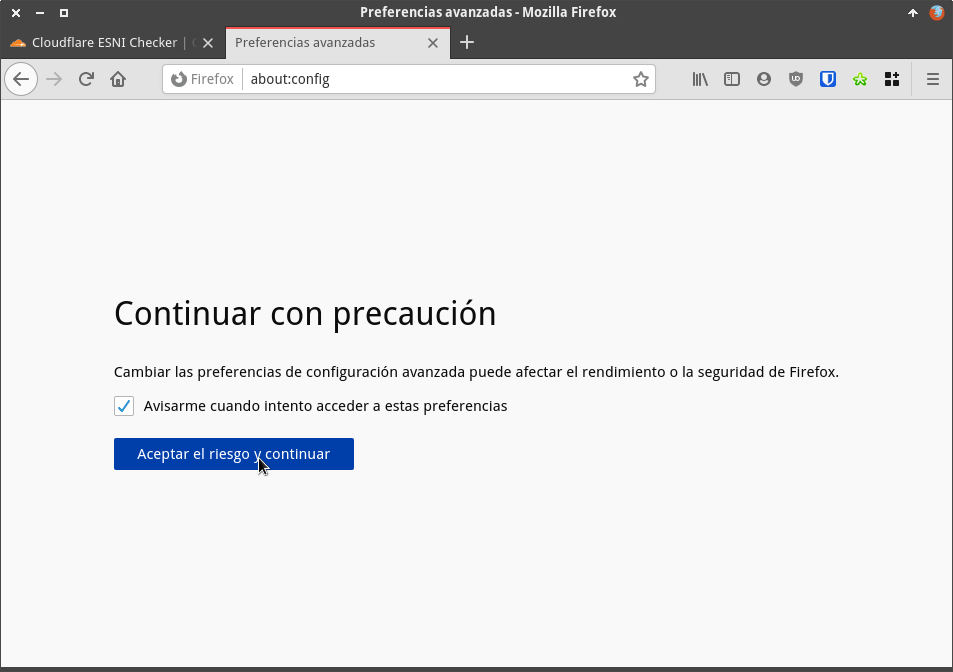
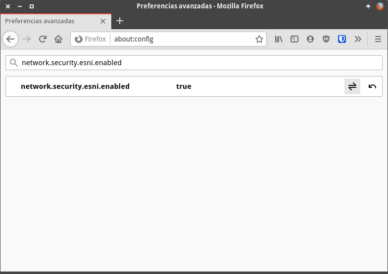
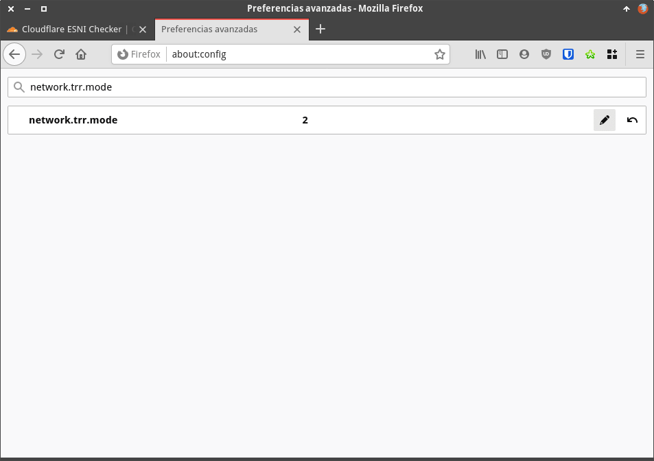
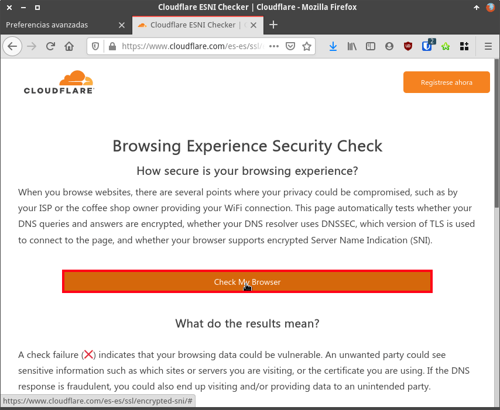
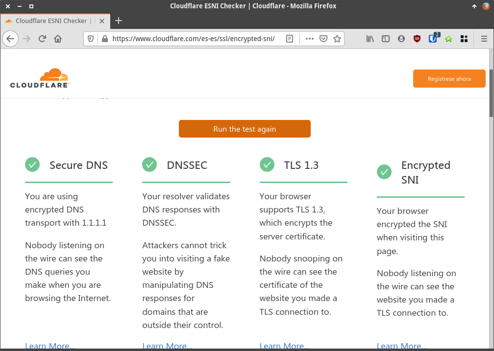
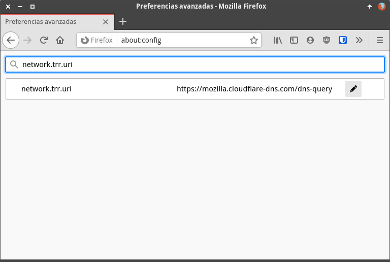

Nuestro proveedor de Internet, empresas de seguridad y gobiernos tienen varias formas para conocer y registrar las páginas web a las que nos conectamos. Muchos de vosotros pensaréis que usando DNS over HTTPS (DoH) nadie podrá saber las web que visitamos, pero esto no es así. Aunque usemos DoH nuestro proveedor de Internet, empresas de seguridad y otros actores pueden ver las URL que visitamos porque tienen la posibilidad de consultar el Server Name Indication (SNI). Frente a esta problemática en el siguiente artículo vermeos como activar ESNI y DoH para dificultar que un tercero observe o trafíque con nuestro historial de navegación.<!--more-->

## ¿POR QUÉ EL SNI REVELA LAS WEB QUE VISITAMOS AUNQUE ESTEMOS USANDO DoH?

Cuando introducimos una URL en el navegador que usa el protocolo https y presionamos la tecla enter se produce un intercambio de información entre nuestro navegador y el servidor web que queremos visitar (TLS handshake). El proceso inicial de intercambio de información entre cliente y servidor está sin cifrar e incluye la totalidad de datos necesarios para que entre nuestro navegador y el servidor web se pueda establecer una comunicación cifrada. Estos datos incluyen los tipos de cifrado que soporta nuestro navegador, un número de cliente, el **SNI**, etc.

El SNI que acabamos de citar no es más que la URL que queremos visitar y se envía del cliente al servidor sin cifrar. Por lo tanto nuestro proveedor de Internet, gobiernos y empresas de seguridad tendrán la posibilidad de interceptarlo y saber la web que que estamos visitando.

Por lo tanto el SNI informa sobre la URL que queremos visitar antes que se finalice el TLS handshake y como está sin cifrar es un claro problema de privacidad y seguridad.

**Nota**: A día de hoy prácticamente todas las peticiones web incluyen SNI. Esto es así porque el protocolo https está ampliamente implantado y detrás de una misma IP pueden haber centenares de páginas web. Por lo tanto en los primeros instantes de la comunicación entre el cliente el servidor tenemos que indicar el host al que nos queremos conectar, porque como hemos dicho antes detrás de una IP pueden haber centenares de páginas web.

## ¿QUÉ HACEN LAS EMPRESAS Y ENTES QUE INTERCEPTAN NUESTRO SNI?

Normalmente los ISP, gobiernos o empresas de seguridad contratadas por terceros pueden capturar los SNI para los siguientes fines:

1. Elaborar historiales de navegación con fines publicitarios o para simplemente venderlos a terceros y ganar dinero.
2. Bloquear el acceso a determinadas páginas web. Los proveedores de Internet (ISP) pueden conocer las web que queremos visitar antes de iniciar la conexión, por lo tanto pueden implementar reglas para bloquear el acceso a todos sus clientes a una determinada página web.
3. Conocer las páginas web visitadas por un usuario para posteriormente enviarlas a una autoridad competente como por ejemplo la policía, un juez, etc.
4. etc.

## ACTIVAR ESNI PARA CIFRAR EL SNI DURANTE EL PROCESO DE TLS HANDSHAKE

La solución al problema que acabamos de detallar es cifrar el SNI. En el momento que enviemos nuestro SNI cifrado (ESNI) evitaremos que gobiernos, compañías de seguridad y operadores de Internet puedan interceptar nuestro tráfico.

ESNI aún está en fase experimental y el único navegador que conozco que lo soporte es Firefox. Por lo tanto a continuación veremos como configurar DoH y ESNI en Firefox.

**Nota:** Veremos como se activa ESNI en Firefox, pero ESNI solo funcionará si el servidor que nos sirve la página web soporta ESNI. Por lo tanto la solución mostrada no soluciona completamente el problema que acabamos de citar. Para solucionar totalmente el problema deberíamos navegar a través de una VPN o esperar unos años para que ESNI esté presente en la gran mayoría de navegadores y servidores.

## ACTIVAR ESNI Y DoH EN FIREFOX

El procedimiento para activar ESNI y DoH en Firefox es el que se muestra a continuación.

### Entrar en la configuración avanzada de Firefox

Inicialmente tenemos que acceder a la configuración de Firefox. Para ello introducimos la URL `about:config` y presionamos Enter. Acto seguido tendremos que presionar en el botón **Aceptar el riesgo y continuar**.

### Activar ESNI "Encrypted server name indicator"

Una vez dentro de la configuración de Firefox buscan el parámetro `network.security.esni.enabled` y cambian su valor de **false** a **true**.

A partir de estos momentos, si el servidor web al que nos conectamos soporta ESNI y estamos usando DoH evitaremos:

1. Bloqueos de acceso a determinadas páginas web.
2. Que nos monitorizen y sepan las páginas web que estamos visitando.

### Activar DoH "DNS over HTTPS"

Activar ESNI es importante, pero de nada sirve de nada si no ciframos nuestras peticiones DNS. Firefox ofrece la posibilidad de cifrar las peticiones DNS mediante varios proveedores. Para ello en la configuración avanzada de Firefox buscamos el parámetro `network.trr.mode` y lo cambiamos de **0** a **2**.

Con el valor **2**, la totalidad de peticiones DNS se realizarán de forma cifrada y solo en el caso que la petición DNS cifrada falle se realizará con los DNS tradicionales. En función del valor que introduzcamos en `network.trr.mode` obtendremos el siguiente comportamiento:

| Valor | Detalle de como se resolverán las peticiones DNS |
| --- | --- |
| **0** | Es el valor que aplica la configuración predeterminada de Firefox. La configuración predeterminada actual de Firefox es que DoH esté desactivado. Por lo tanto la opción **0** es equivalente a la opción **5**. |
| **1** | DoH está activado. Firefox decidirá si las peticiones DNS se realizan cifradas o sin cifrar en función de la velocidad de resolución de las peticiones DNS. |
| **2** | DoH está activado. Todas las peticiones DNS estarán cifradas excepto en una situación. En el momento que falle una resolución DNS cifrada entonces se intentará resolver la petición DNS mediante los DNS tradicionales sin cifrar. |
| **3** | Aseguramos que el 100% de peticiones DNS que se realicen estén cifradas. |
| **5** | Las peticiones se realizarán sin cifrar porque DoH está desactivado. |

### Comprobar que DoH y ESNI están activados

Para comprobar que las configuraciones realizadas se han aplicado con éxito sugiero que cliquen en el siguiente [enlace](https://www.cloudflare.com/es-es/ssl/encrypted-sni/ "compración que las peticiones DNS se realizan de forma segura"). Una vez dentro de la web cliquen sobre el botón **Check My Browser**.

Acto seguido se realizarán las siguientes comprobaciones:

1. Que las peticiones DNS se estén realizando de forma cifrada.
2. Que nuestro navegador esté correctamente configurado para cifrar SNI (ESNI).
3. El navegador que estamos usando soporte TLS 1.3.
4. Que el proveedor que resuelve las peticiones DNS soporte DNSSEC.

Si han realizado el proceso de forma correcta verán que los resultados obtenidos son similares a los que se muestran en la siguiente captura de pantalla.

**Nota**: Aunque nuestro navegador esté correctamente configurado recuerden que si las web que visitan no soportan ESNI existe la posibilidad que alguien esté registrando las páginas web que visitamos.

### Cambiar el proveedor de DoH en Firefox

Si han seguido las instrucciones del artículo las peticiones DNS cifradas serán resueltas por CloudFlare. Para mi este no supone ningún inconveniente, pero si para vosotros lo es podéis cambiar el proveedor. Para ello en la configuración avanzada de Firefox tienen que buscar el parámetro `network.trr.uri`. Una vez lo encuentren verán lo siguiente:

Si quieren reemplazar Cloudflare, por otros proveedor deberán reemplazar `https://mozilla.cloudflare-dns.com/dns-query` por lo siguientes valores:

| Proveedor | Dirección URL para seleccionar el proveedor |
| --- | --- |
| Google | `https://dns.google/dns-query` |
| OpenDNS | `https://doh.opendns.com/dns-query` |
| Quad9 DNS IBM | `https://dns.quad9.net/dns-query` |
| Switch DNS | `https://dns.switch.ch/dns-query` |
| CIRA Canadian Shield DNS | `https://private.canadianshield.cira.ca/dns-query` |
| BlahDNS (IPv4) | `https://doh-fi.blahdns.com/dns-query` |
| ... | `etc.` |

## CONCLUSIONES FINALES

A pesar de todas las herramientas existentes hoy en día los gobiernos, las empresas de seguridad y los operadores telefónicos siguen disponiendo de herramientas para monitorearnos y para bloquear el acceso a las páginas web que ellos no consideran apropiadas. No obstante para dificultar su trabajo es bueno usar navegadores como Firefox y activar ESNI y DoH.

#### Fuentes

[https://blog.cloudflare.com/es/esni-es/](https://blog.cloudflare.com/es/esni-es/)

[https://www.eduardocollado.com/2020/09/29/bloqueo-de-webs-aprovechando-sni/](https://www.eduardocollado.com/2020/09/29/bloqueo-de-webs-aprovechando-sni/)
