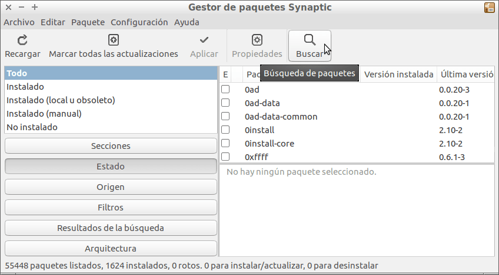
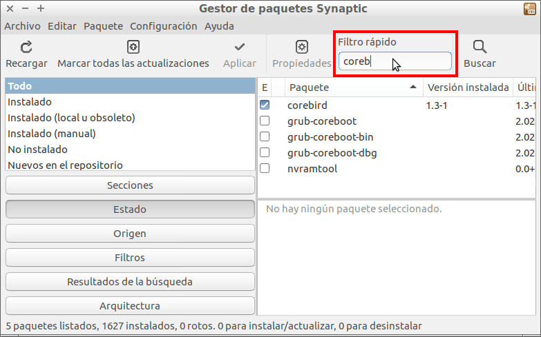

En ocasiones tengo la necesidad de instalar o buscar paquetes que no se exactamente su nombre. En estas ocasiones acostumbro a utilizar el filtro rápido de búsqueda de synaptic porque ofrece una velocidad de búsqueda inigualable.<!--more-->

No obstante acostumbra a pasar que cuando abrimos Synaptic nos encontramos con la situación que el filtro rápido de búsqueda no está disponible.

[](images/Synatic-sin-filtro-rápido-de-búsqueda.png)

## ACTIVAR EL FILTRO RÁPIDO DE BÚSQUEDA EN SYNAPTIC

Para solucionar este problema tienen que abrir una terminal e instalar el paquete **apt-xapian-index** ejecutando el siguiente comando en la terminal:

> ```
> sudo apt-get install apt-xapian-index
> ```

El paquete apt-xapian-index se encarga de construir un índice de la totalidad de paquetes disponibles en nuestra distribución. De este modo cuando tengamos que realizar una búsqueda obtendremos un resultado al instante.

A continuación tenemos que construir el índice de paquetes de nuestra distribución ejecutando el siguiente comando en la terminal:

> ```
> sudo update-apt-xapian-index -vf
> ```

###### Nota: La ubicación del índice construido es /var/lib/apt-xapian-index/cataloged\_times.p

Una vez construido el índice tan solo tenemos que abrir Synaptic y veremos que en el panel nos aparece el filtro rápido de Búsqueda.

En estos momentos tan solo tenemos ubicarnos encima del cuadro de búsqueda del filtro rápido y empezar a escribir el nombre del paquete que estamos buscando.

En mi caso realizo un búsqueda con el término “**coreb**” y tal y como pueden ver se realiza una búsqueda en tiempo real después de cada una de las letras introducidas en el campo de búsqueda.

[](images/Filtro-rápido-de-Synapic-activado.png)

## OTRAS UTILIDADES QUE PODEMOS DAR AL PAQUETE APT-XAPIAN-INDEX

En el presente artículo hemos instalado el paquete apt-xapian-index para activar el filtro rápido de búsqueda en Synaptic, pero esta no es su única utilidad.

Este paquete nos permitirá usar el motor de búsqueda Xapian para poder buscar paquetes en nuestra terminal a través del comando **axi-cache**.

La función que realizará el comando **axi-cache** es exactamente la misma que realiza **apt-cache**, pero con la diferencia que los resultados proporcionados por axi-cache serán muchos más precisos que apt-cache.

En definitiva axi-cache es un apt-cache que nos ofrecerá mejores resultados de búsqueda y además nos los ordenará por relevancia.

En futuro escribiré un artículo entero de axi-cache en el que ampliaré la información citada en este post.
