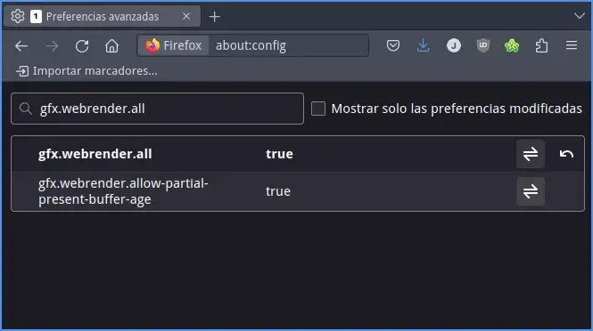

En el caso que estén usando Linux y tengan disponible un tarjeta gráfica Intel les recomiendo que sigan las siguientes instrucciones para habilitar la aceleración gráfica por hardware en Firefox. De este modo podrán mejorar significativamente el rendimiento, reducir la carga de la CPU y el consumo de energía, mejorar la calidad de la reproducción de vídeo y admitir tecnologías avanzadas como WebGL.<!--more-->

## VENTAJAS QUE TIENE USAR LA ACELERACIÓN GRÁFICA POR HARDWARE AL REPRODUCIR VÍDEOS EN FIREFOX

Usar la aceleración gráfica en Firefox proporciona diversas ventajas. Algunas de ellas son las siguientes:

1. **Mejora en el rendimiento:** La aceleración gráfica por hardware permite que los gráficos y la reproducción de vídeo se procesen en la GPU en lugar de la CPU, lo que puede mejorar significativamente el rendimiento y la velocidad de la navegación web.
2. **Reducción de la carga de la CPU:** Al utilizar la GPU para procesar gráficos y vídeos, la carga de la CPU se reduce significativamente. Esto puede tener un impacto positivo en el rendimiento general del sistema, especialmente en dispositivos con recursos limitados.
3. **Ahorro de energía:** Al reducir la carga de la CPU, también se puede reducir el consumo de energía del ordenador o el dispositivo móvil. Esto puede ser especialmente beneficioso para dispositivos móviles, donde la duración de la batería es un factor importante.
4. **Mejora en la calidad de reproducción de vídeo:** La aceleración gráfica por hardware puede mejorar la calidad de la reproducción de vídeo en línea, ya que permite que los vídeos se decodifiquen y reproduzcan de manera más fluida y sin interrupciones.

Si disponen de una tarjeta gráfica Intel y usan Linux pueden activar la aceleración gráfica por hardware en Firefox del siguiente modo.

## VER LA TARJETA GRÁFICA QUE TENEMOS Y LOS DRIVERS QUE ESTAMOS USANDO

Para ver la tarjeta gráfica que tenemos instalada podemos ejecutar el siguiente comando en la terminal:

> ```shell
> lspci -k | grep -EA3 'VGA|3D|Display'
> ```

El resultado obtenido es que tengo una tarjeta gráfica Intel `UHD Graphics 600`.

```shell
00:02.0 VGA compatible controller: Intel Corporation GeminiLake [UHD Graphics 600] (rev 06)
	DeviceName: Onboard - Video
	Kernel driver in use: i915
	Kernel modules: i915
```

Además también veo que estoy usando el driver open Source i915 de Intel. Por lo tanto parece que todo está en regla.

## INSTALACIÓN DEL DRIVER PARA MEJORAR EL RENDIMIENTO Y LA CALIDAD DE LA ACELERACIÓN POR HARDWARE

Aparte del driver i915 tendremos que instalar un controlador adicional para obtener aceleración gráfica por hardware a través de VA-API. Como mínimo existen los siguiente controladores adicionales:

| Nombre del driver (VAAPI) | Generaciones de GPU que usan este driver |
| --- | --- |
| `i965-va-driver` | Driver libre para habilitar la aceleración gráfica VA-API válido para las plataformas Cantiga, Ironlake, Sandy Bridge, Ivy Bridge, Haswell, Broadwell, Skylake, Kaby Lake, Coffee Lake y Cannon Lake. |
| `i965-va-driver-shaders` | Driver privatico para habilitar la aceleración gráfica VA-API válido para las plataformas Cantiga, Ironlake, Sandy Bridge, Ivy Bridge, Haswell, Broadwell, Skylake, Kaby Lake, Coffee Lake y Cannon Lake. |
| `intel-media-va-driver` | Driver libre para habilitar la aceleración gráfica VA-API válido para las plataformas Broadwell, Skylake, Broxton, Apollo Lake, Kaby Lake, Coffee Lake, Whiskey Lake, Cannon Lake, Ice Lake, Alchemist, Meteor Lake. |
| `intel-media-va-driver-non-free` | Driver privativo para habilitar la aceleración gráfica VA-API válido para las plataformas Broadwell, Skylake, Broxton, Apollo Lake, Kaby Lake, Coffee Lake, Whiskey Lake, Cannon Lake, Ice Lake, Alchemist, Meteor Lake. |

Para la tarjeta gráfica `UHD Graphics 600` puede funcionar cualquiera de los 4 drivers o controladores que he mencionado. En mi caso instalaré el **intel-media-va-driver-non-free** ejecutando el siguiente comando en la terminal:

> ```shell
> sudo apt install intel-media-va-driver-non-free vainfo
> ```

**Nota:** He instalado el driver `intel-media-va-driver-non-free` porque es más actual que el `i965` y además los drivers privativos ofrecen funcionalidades que no ofrecen los libres. Por ejemplo ofrecen aceleración por hardware a la hora de codificar ciertos formatos de vídeo como por ejemplo el H.265. El paquete `vainfo` servirá para obtener información de la configuración de la aceleración gráfica por hardware.

Una vez finalizada la instalación podemos intentar ver si existen los ficheros binarios en su ubicación correspondiente. Para ello ejecutaremos el siguiente comando:

> ```shell
> ls /usr/lib/x86_64-linux-gnu/dri/*drv_video.so
> ```

La salida del comando en mi caso es la siguiente:

```shell
Permissions Size User Date Modified Name
.rw-r--r-- 44M root 22 nov 05:47  /usr/lib/x86_64-linux-gnu/dri/iHD_drv_video.so
```

Por lo tanto puedo asegurar que tengo correctamente instalados los drivers `intel-media-va-driver-non-free`. En el caso que hubieran instalado los drivers `i965-va-driver-shaders` obtendrían la siguiente salida:

```shell
Permissions Size User Date Modified Name
.rw-r--r-- 8,1M root 11 jul  2020  /usr/lib/x86_64-linux-gnu/dri/i965_drv_video.so
```

## LISTAR LOS DISPOSITIVOS QUE RENDERIZAN CONTENIDO

A continuación listaremos la totalidad de dispositivos de hardware del equipo dedicados a renderizar contenido. Para ello ejecutaremos el siguiente comando en la terminal:

> ```shell
> ls /dev/dri
> ```

Una vez ejecutado el comando en mi caso he obtenido el siguiente resultado:

```shell
Permissions    Size User Date Modified Name
drwxr-xr-x        - root  4 dic 10:12  by-path
crw-rw----@   226,0 root  4 dic 10:12  card0
crw-rw----@ 226,128 root  4 dic 10:12  renderD128
```

Como mi equipo solo tiene una tarjeta gráfica solo aparecen los dispositivos `card0` y `renderD128`. En caso que tuviera más de una tarjeta gráfica también aparecerían `card1` y `renderD129`.

### Listar el Driver que está usando el dispositivo 128

Para ver el driver usado por el dispositivo `render128` ejecutaremos el siguiente comando en la terminal:

> ```shell
> sudo cat /sys/kernel/debug/dri/128/name
> ```

Y el resultado que he obtenido en mi caso es el siguiente:

```shell
i915 dev=0000:00:02.0 unique=0000:00:02.0
```

El driver i915 corresponde al driver gráfico de Intel y en mi caso tengo una tarjeta gráfica Intel. Por lo tanto todo parece indicar que no tendremos ningún problema.

## LISTAR LOS CÓDECS QUE PODRÁ CODIFICAR Y DECODIFICAR NUESTRA TARJETA GRÁFICA INTEL

En apartados anteriores hemos visto que después de instalar el driver `intel-media-va-driver-non-free` pasaremos a tener el archivo binario `/usr/lib/x86_64-linux-gnu/dri/iHD_drv_video.so` en nuestro disco duro. A partir de aquí tendremos que tener en cuenta que para referirnos al driver `intel-media-va-driver-non-free` tendremos que usar el término `iHD`.

Si en vez de instalar el driver `intel-media-va-driver-non-free` hubiéramos instalado el driver `i965-va-driver-shaders` tendríamos que usar el término `i965` en vez de `iHD` para hacer referencia al driver `i965-va-driver-shaders`. A continuación les dejo una tabla resumen:

| Paquete para instalar el Driver | **Archivo binario del driver VAAPI** | Denominación Driver VAAPI |
| --- | --- | --- |
| `intel-media-va-driver-non-free` | iHD\_drv\_video.so | `iHD` |
| `i965-va-driver-shaders` | i965\_drv\_video.so | `i965` |

Seguidamente listaremos la totalidad de códecs que nuestra tarjeta gráfica es capaz de codificar y decodificar con el driver `iHD`. Para ello ejecutaremos el siguiente comando en la terminal:

```shell
LIBVA_DRIVER_NAME=iHD vainfo --display drm --device /dev/dri/renderD128
```

Y el resultado obtenido será el siguiente:

```shell
libva info: VA-API version 1.16.0
libva info: User environment variable requested driver 'iHD'
libva info: Trying to open /usr/lib/x86_64-linux-gnu/dri/iHD_drv_video.so
libva info: Found init function __vaDriverInit_1_16
libva info: va_openDriver() returns 0
vainfo: VA-API version: 1.16 (libva 2.12.0)
vainfo: Driver version: Intel iHD driver for Intel(R) Gen Graphics - 22.6.3 ()
vainfo: Supported profile and entrypoints
      VAProfileNone                   :	VAEntrypointVideoProc
      VAProfileNone                   :	VAEntrypointStats
      VAProfileMPEG2Simple            :	VAEntrypointVLD
      VAProfileMPEG2Main              :	VAEntrypointVLD
      VAProfileH264Main               :	VAEntrypointVLD
      VAProfileH264Main               :	VAEntrypointEncSlice
      VAProfileH264Main               :	VAEntrypointFEI
      VAProfileH264Main               :	VAEntrypointEncSliceLP
      VAProfileH264High               :	VAEntrypointVLD
      VAProfileH264High               :	VAEntrypointEncSlice
      VAProfileH264High               :	VAEntrypointFEI
      VAProfileH264High               :	VAEntrypointEncSliceLP
      VAProfileVC1Simple              :	VAEntrypointVLD
      VAProfileVC1Main                :	VAEntrypointVLD
      VAProfileVC1Advanced            :	VAEntrypointVLD
      VAProfileJPEGBaseline           :	VAEntrypointVLD
      VAProfileJPEGBaseline           :	VAEntrypointEncPicture
      VAProfileH264ConstrainedBaseline:	VAEntrypointVLD
      VAProfileH264ConstrainedBaseline:	VAEntrypointEncSlice
      VAProfileH264ConstrainedBaseline:	VAEntrypointFEI
      VAProfileH264ConstrainedBaseline:	VAEntrypointEncSliceLP
      VAProfileVP8Version0_3          :	VAEntrypointVLD
      VAProfileVP8Version0_3          :	VAEntrypointEncSlice
      VAProfileHEVCMain               :	VAEntrypointVLD
      VAProfileHEVCMain               :	VAEntrypointEncSlice
      VAProfileHEVCMain               :	VAEntrypointFEI
      VAProfileHEVCMain10             :	VAEntrypointVLD
      VAProfileHEVCMain10             :	VAEntrypointEncSlice
      VAProfileVP9Profile0            :	VAEntrypointVLD
      VAProfileVP9Profile2            :	VAEntrypointVLD
```

**Nota:** Si no obtienen un resultado similar al mostrado es que su tarjeta gráfica no soporta el driver `iHD`. En este caso instalen el driver `i965-va-driver-shaders` y ejecuten el comando `LIBVA_DRIVER_NAME=i965 vainfo --display drm --device /dev/dri/renderD128` en la terminal.

Si leen e interpretan la salida del comando verán la totalidad de códecs soportados por nuestra tarjeta gráfica. Además sabremos si se soporta la codificación y decodificación por hardware en cada uno de ellos.

## MODIFICAR LAS VARIABLES DE ENTORNO PARA ASEGURAR QUE USAREMOS EL DRIVER iHD PARA LA ACELERACIÓN GRÁFICA POR HARDWARE EN FIREFOX

A continuación modificaremos las variables de entorno del sistema operativo para asegurar que usaremos el driver `intel-media-va-driver-non-free` para obtener la aceleración gráfica por hardware. Para ello ejecutaremos el siguiente comando:

> ```shell
> sudo nano /etc/environment
> ```

En momento de abrirse el editor de texto nano pegaremos el siguiente código:

```shell
LIBVA_DRIVER_NAME=iHD
```

Acto seguido guardaremos los cambios y cerraremos el fichero.

**Nota:** En caso que usarán el driver `i965-va-driver-shaders` deberían reemplazar la línea `LIBVA_DRIVER_NAME=iHD` por `LIBVA_DRIVER_NAME=i965` en el fichero `/etc/environment`.

## CONFIGURAR FIREFOX PARA DISPONER DE ACELERACIÓN GRÁFICA POR HARDWARE EN LINUX CON UNA GRÁFICA INTEL

A estas altura el sistema operativo está preparado y tan solo tenemos que configurar Firefox. Para ello abriremos Firefox, en su barra direcciones escribiremos `about:config` y presionaremos Enter. Acto seguido se abrirá la configuración de Firefox. En la configuración de Firefox modificaremos el valor `gfx.webrenderall` para que sea `True`. Al habilitar esta propiedad activaremos el motor de renderizado de gráficos `Webrender` y de este modo podremos usar la GPU para la representación gráfica de contenido en pantalla.



Del mismo modo que hemos cambiado los valores de `gfx.webrenderall` cambiaremos los siguientes valores:

| Parámetros a modificar | Valor | Función |
| --- | --- | --- |
| `media.ffmpeg.vaapi.enabled` | True | Permite habilitar la aceleración gráfica por hardware VA-API con el decodificador de vídeo ffmpeg. |
| `media.ffvpx.enabled` | False | Para deshabilitar el decodificador de vídeo FFVPX y de este modo asegurar que usaremos FFmpeg para la decodificación de vídeo. |
| `media.av1.enabled` | False | Para desactivar la reproducción de contenido de vídeo codificado con el códec AV1 |
| `layers.acceleration.force-enabled` | True | Permite forzar la aceleración por hardware en nuestro navegador. |
| `media.rdd-vpx.enabled` | True | Es para habilitar la aceleración por hardware con el códec VP9. El valor que recomiendo es True, pero si tienen una tarjeta gráfica que no es compatible con esté códec mejor que el valor sea False. |

Una vez realizados todos los cambios les recomiendo que reinicien Firefox.

## INSTRUCCIONES PARA INICIAR FIREFOX CON ACELERACIÓN GRÁFICA POR HARDWARE

El proceso de configuración ha finalizado. A partir de estos momentos Firefox está preparado para reproducir vídeo con aceleración gráfica por hardware. Pero para ello tendrán que iniciar Firefox ejecutando uno de los siguientes 2 comandos:

| Servidor gráfico usado | Comando para iniciar Firefox |
| --- | --- |
| X11 | `MOZ_WAYLAND_DRM_DEVICE=/dev/dri/renderD128 LIBVA_DRIVER_NAME=iHD MOZ_X11_EGL=1 firefox` |
| Wayland | `MOZ_WAYLAND_DRM_DEVICE=/dev/dri/renderD128 LIBVA_DRIVER_NAME=iHD MOZ_ENABLE_WAYLAND=1 firefox` |

**Nota:** Tengan en cuenta que deberán reemplazar `/dev/dri/renderD128` y `iHD` por los valores que correspondan en su caso. En mi caso como aún uso el servidor gráfico X11 uso el comando `MOZ_WAYLAND_DRM_DEVICE=/dev/dri/renderD128 LIBVA_DRIVER_NAME=iHD MOZ_X11_EGL=1 firefox`

### Comprobar que funciona la aceleración gráfica por hardware en Firefox

Una vez se abra Firefox reproduzcan un vídeo cualquiera y sigan las siguientes instrucciones para [comprobar que funciona la aceleración gráfica]() por hardware.

https://geekland.eu/saber-si-usamos-la-aceleracion-grafica-por-hardware-en-linux/

Además decir que si en la terminal mestra el mensaje `libva info: va_openDriver() returns 0` quiere decir que se ha cargado correctamente el controlador de aceleración de hardware de video VA-API (Video Acceleration API).

### Modificar el lanzador de Firefox para que siempre se inicie con aceleración gráfica por hardware

Si todo funciona correctamente entonces les recomiendo que modifiquen el lanzador de Firefox. De este modo podrán arrancar Firefox tal y como lo hacen habitualmente y dispondrán de aceleración gráfica. Para hacer lo que acabo de decir se tienen que dirigir a la ubicación del lanzador de Firefox. En mi caso la ubicación es `/usr/share/applications`

Una vez dentro editamos el lanzador de Firefox ejecutando el siguiente comando en la terminal:

> ```shell
> sudo nano /usr/share/applications/firefox.desktop
> ```

Una vez dentro localización la siguiente línea:

```shell
Exec=firefox %u
```

Y la reemplazan por la siguiente en el caso de estar usando X11:

```shell
Exec=MOZ_WAYLAND_DRM_DEVICE=/dev/dri/renderD128 LIBVA_DRIVER_NAME=iHD MOZ_X11_EGL=1 firefox
```

Finalmente guardan los cambios y cierran el editor de textos nano.

## SOLUCIÓN A POSIBLES PROBLEMAS AL REPRODUCIR VÍDEOS DE YOUTUBE EN FIREFOX

Si reproducen un vídeo de Youtube en Firefox tienen que saber que los codecs predeterminados de Youtube son el VP8 y el VP9. Estos 2 codecs son comunes pero existen muchas tarjetas gráficas antiguas que no los soportan. Esto hará que no tengamos aceleración por hardware y la CPU del ordenador tendrá que trabajar en exceso.

Para solucionar este problema, recomendamos instalar una de las siguientes extensiones en el navegador Firefox:

- [h264ify](https://addons.mozilla.org/es/firefox/addon/h264ify/): Extensión que fuerza a Youtube a utilizar el códec H.264. El códec H.264 es compatible con la mayoría de las tarjetas gráficas antiguas y por lo tanto al reproducir el vídeo tendremos aceleración gráfica por hardware.
- [Enhanced h264ify](https://addons.mozilla.org/es/firefox/addon/enhanced-h264ify/): La función de esta extensión es exactamente la misma que h264ify. De hecho Enhanced h264ify es un fork con funcionalidades añadidas de la extensión h264ify.

Con cualquiera de estas extensiones instaladas, deberían disfrutar de la aceleración gráfica en la mayoría de los vídeos que se reproducen en Firefox y Youtube, incluso si usan una tarjeta gráfica antigua.

Si a pesar de todas los esfuerzos no consiguen el resultado esperado les recomiendo que simplemente reviertan la configuración aplicada a lo largo de este artículo.

#### Fuentes

[https://notebookgpu.blogspot.com/2021/01/activar-y-configurar-la-aceleracion-por.html](https://notebookgpu.blogspot.com/2021/01/activar-y-configurar-la-aceleracion-por.html)

[https://amigotechnotes.wordpress.com/2022/07/20/enable-firefox-hardware-video-acceleration-on-ubuntu/](https://amigotechnotes.wordpress.com/2022/07/20/enable-firefox-hardware-video-acceleration-on-ubuntu/)
