En pasados artículos vimos que es el Ransomware y las precauciones que debemos tomar para prevenirlo. A raíz de este artículo a continuación veremos como activar la protección contra ransomware que trae  incorporada el sistema operativo Windows 10.<!--more-->

## ¿EN QUE CONSISTE LA PROTECCIÓN CONTRA RANSOMWARE DE WINDOWS DEFENDER?

El antivirus Windows Defender será el encargado de protegernos contra los posibles ataques de ransomware. La forma en que lo hace es implementando un control de acceso a las carpetas que nosotros especifiquemos. De esta forma el antivirus actuará de la siguiente forma:

1. Los archivos que estén dentro de la carpeta protegida no podrán ser modificados por ningún programa que Windows consideré peligroso o sospechoso. De este modo, si intentamos editar una fotografía con Photoshop no podremos guardar de ningún modo los cambios realizados en la fotografía.
2. Si queremos guardar los cambios realizados en la fotografía tendremos que dar los permisos pertinentes a Photoshop para que puede modificar los archivos que están dentro de la carpeta protegida. Una vez hayamos dado los permisos ya podremos modificar y guardar la foto sin ningún tipo de problema.

De esta forma tan simple, pero efectiva, conseguiremos proteger nuestra información contra los temidos ransomware. En el momento que un ransomware intente cifrar el contenido de una carpeta protegida, simplemente no podrá porque no tiene los permisos necesarios para realizar absolutamente nada en la carpeta que quiere atacar.

## REQUISITOS PARA USAR LA PROTECCIÓN CONTRA RANSOMWARE DE WINDOWS 10

Lo requisitos para poder seguir las indicaciones mostradas en este tutorial son los siguientes:

1. Disponer de una versión de Windows igual o posterior a la 1709. La versión 1709 corresponde a la versión Fall Creators update.
2. Tener activado el antivirus Windows Defender.

Si cumplimos con estos simples requisitos podremos asegurar nuestra información del siguiente modo.

## ACTIVAR Y CONFIGURAR LA PROTECCIÓN CONTRA RANSOMWARE EN WINDOWS 10

Los pasos a seguir para proteger nuestra información son extremadamente sencillos. Tan solo tenemos que proceder del siguiente modo.

### Activar la protección contra ransomware

Inicialmente tenemos que acceder al centro de seguridad de Windows Defender. Para ello en el cuadro de búsqueda de Windows tecleamos las palabras centro de seguridad. Una vez finalizada la búsqueda clicamos encima de la opción Centro de seguridad de Windows Defender.

[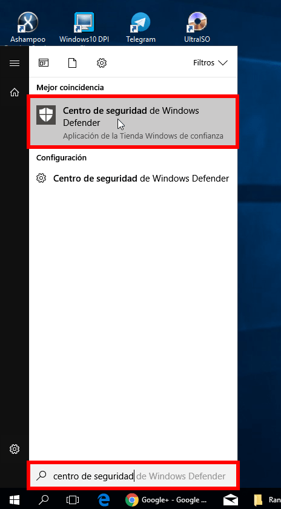](images/acceder-al-centro-de-seguridad.png)

Dentro del centro de seguridad clicamos en la opción Protección antivirus y contra amenazas.

[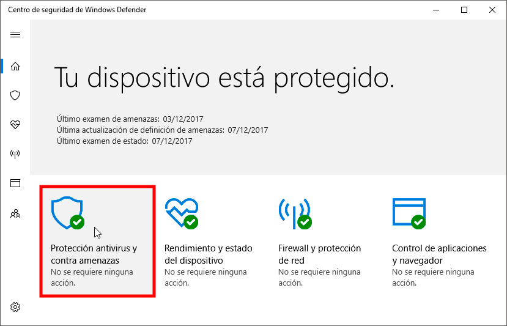](images/proteccion-antivirus-y-contra-amenazas.png)

Seguidamente clicamos en la opción Configuración de antivirus y protección contra amen.

[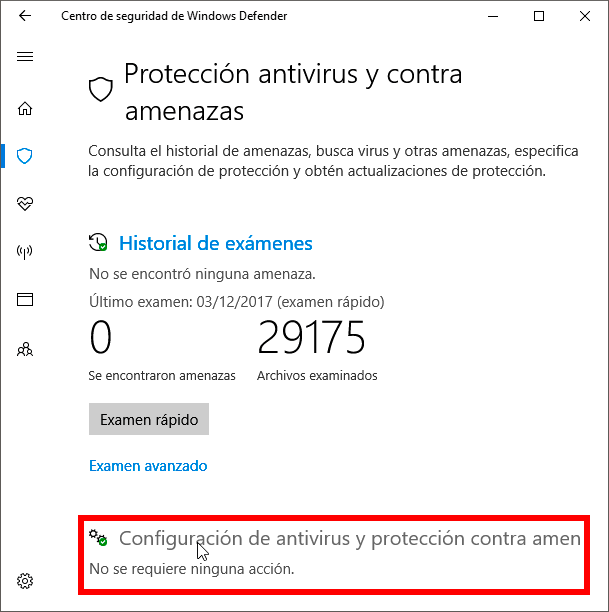](images/acceder-configuración-antivirus.png)

A continuación, aseguren que tienen activada la opción Protección en tiempo real.

[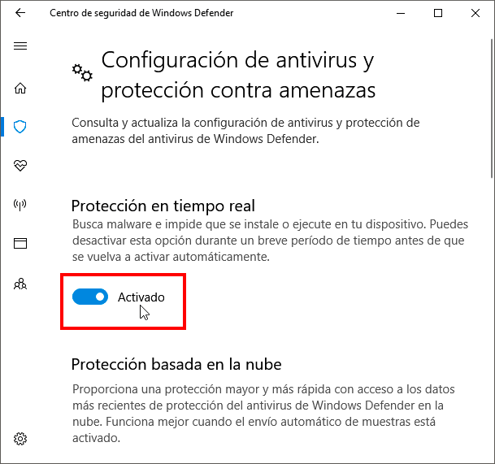](images/activar-protección-en-tiempo-real.png)

Finalmente activen la opción Controla el acceso a la carpeta.

[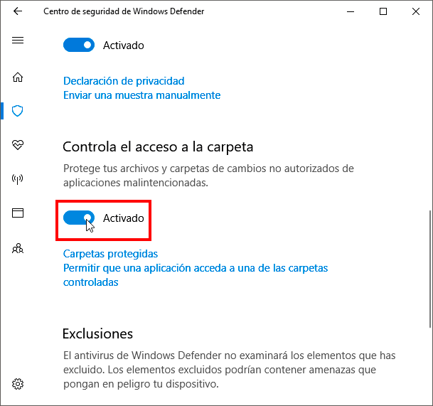](images/activar-controla-el-acceso-a-la-carpeta.png)

A partir de estos momentos la protección contra ransomware de Windows 10 ya está activada. Ahora tan solo nos falta configurar el comportamiento de esta característica para adaptarlo a nuestra necesidades.

### Definir las carpetas que queremos proteger contra el ransomware

Una vez activada la protección tenemos que definir las carpetas de nuestro equipo que queremos proteger. Para ello clicamos sobre la opción Carpetas protegidas.

[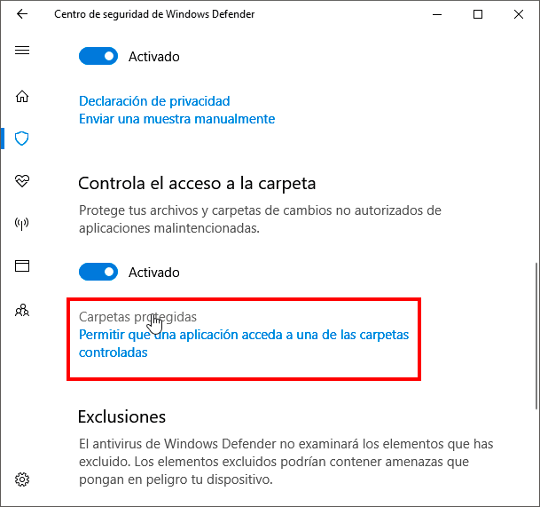](images/acceso-configuracion-carpetas-protegidas.png)

Después de clicar veremos la siguiente ventana en que se indican la totalidad de carpetas protegidas:

[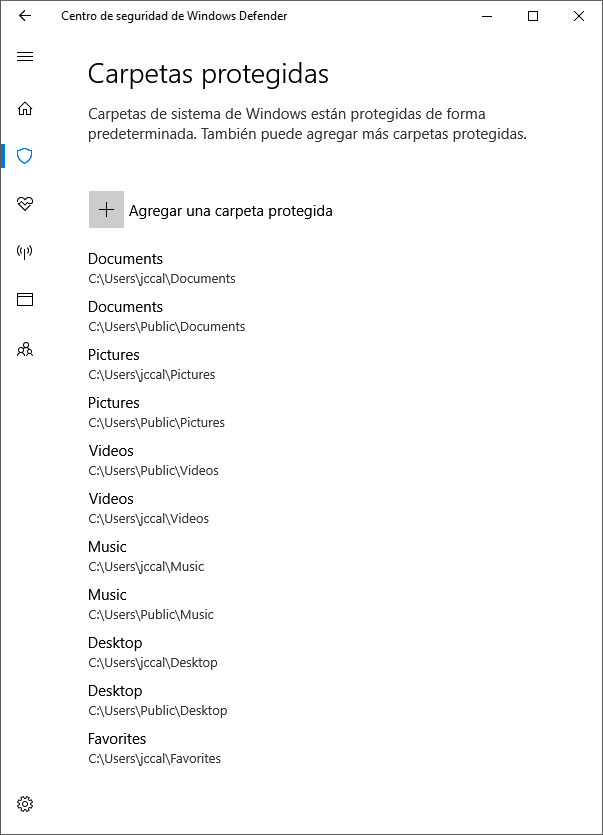](images/carpetas-protegidas-de-forma-predeterminada.png)

Vemos que de forma predeterminada las siguientes carpetas están protegidas:

1. Descargas.
2. Documentos.
3. Escritorio.
4. Imágenes.
5. Música.
6. Vídeos.

###### Nota: Estás carpetas siempre están protegidas y no tenemos permisos para desprotegerlas.

Si queremos proteger más carpetas tan solo tenemos que presionar sobre el botón +.

[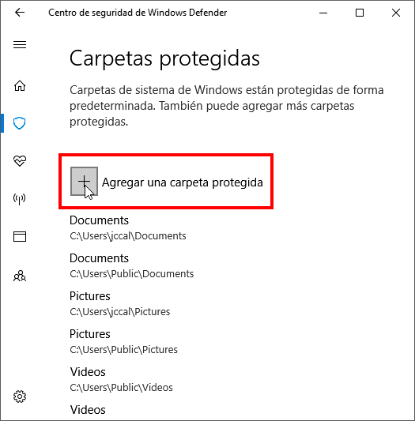](images/agregar-carpeta-protegida.png)

A continuación tan solo tenemos seleccionar la carpeta que queremos proteger y presionar el botón Seleccionar carpeta. En mi caso selecciono la carpeta D:/Dali.

[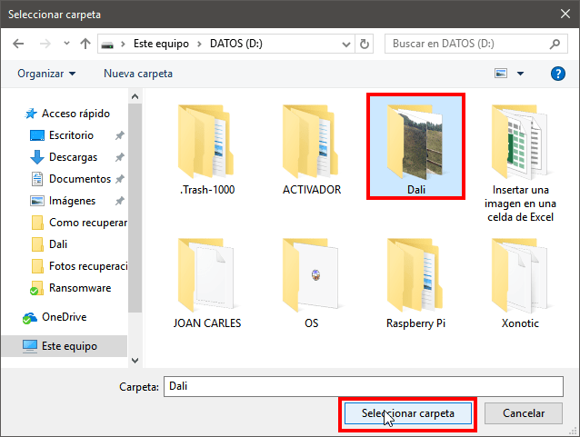](images/seleccionar-carpeta-a-proteger.png)

A partir de estos momentos, la carpeta la carpeta D:/Dali estará protegida contra los peligros del ransomware.

En el momento que algún malware intente dañar los archivos de la carpeta que hemos protegido será bloqueado.

Si en algún momento quieren desproteger una carpeta protegida, tan solo tenemos que seleccionar la carpeta que queremos desproteger y cuando aparezcan las opciones disponibles para aplicar presionamos sobre el botón Quitar.

[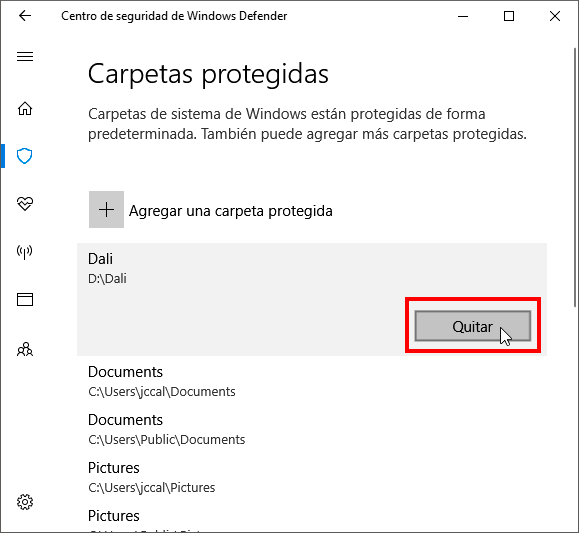](images/desproteger-una-carpeta-windows-defender.png)

A partir de estos momentos la carpeta D:\\Dali volverá a ser vulnerable contra ataques de malware.

### Dar permisos a los programas para que pueden editar el contenido de carpetas protegidas

Puede darse el caso que Windows consideré peligroso un programa normal y corriente que intenta modificar archivos de las carpetas protegidas. Este el caso de por ejemplo Photoshop.

En el momento que con Photoshop intento guardar una foto modificada de una carpeta protegida no puedo. Además de no poder obtengo la siguiente advertencia:

Para evitar que Windows defender no bloquee un programa determinado tenemos que proceder del siguiente modo.

Al igual que hemos realizado en el inicio del artículo accedemos a la configuración de carpetas protegidas. Seguidamente, en el apartado Controla el acceso a la carpeta clicamos en la opción Permitir que una aplicación acceda a una de las carpetas controladas.

[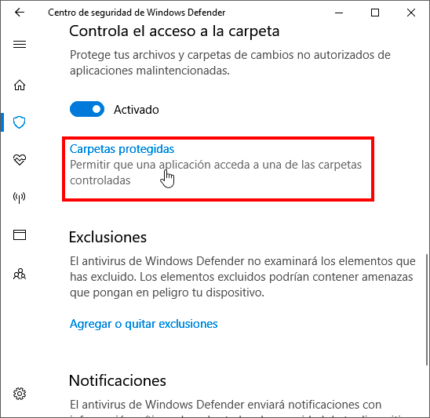](images/permitir-programa-modique-carpetas-protegidas.png)

Finalmente aparecerá el gestor de archivos en el que deberemos seleccionar el ejecutable del programa que queremos permitir que modifique los archivos de las carpetas protegidas. En mi caso, tal y como se puede ver en la captura de pantalla, selecciono el ejecutable de Photoshop y presiono el botón Abrir.

[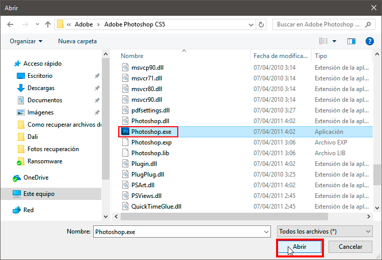](images/seleccionar-programa-a-permitir.png)

###### Nota: Los ejecutables de los programas se hallan dentro de la carpetas C:\\Archivos de programa y C:\\Archivos de programa (x86).

A partir de estos momentos podremos usar Photoshop para modificar y guardar archivos de imagen de las carpetas protegidas.

En el caso que deseemos revocar los permisos que acabamos de otorgar a Photoshop, tan solo tenemos que seleccionar el programa en cuestión y cuando aparezcan las opciones disponibles para aplicar presionamos sobre el botón Quitar.

[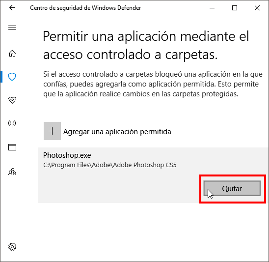](images/revocar-permisos-programa.png)

De este modo tan sencillo conseguiremos proteger más a nuestro equipo contra los temidos ransomware. Creo que a estas alturas no hace falta decir que los efectos de un ransomware pueden ser devastadores.
