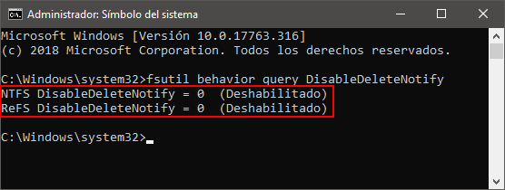
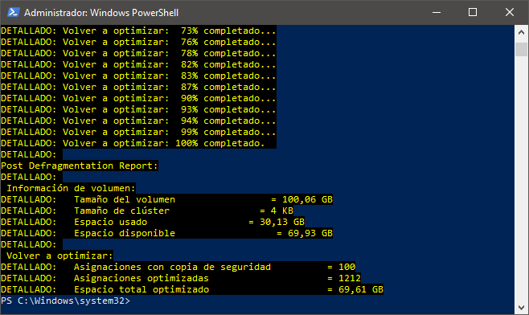
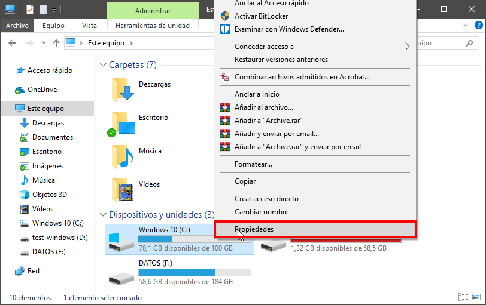
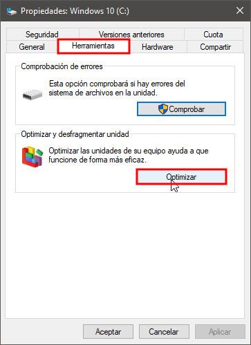
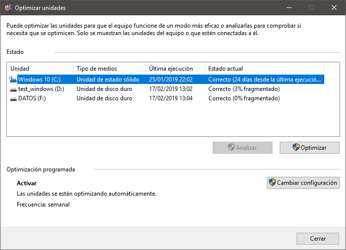
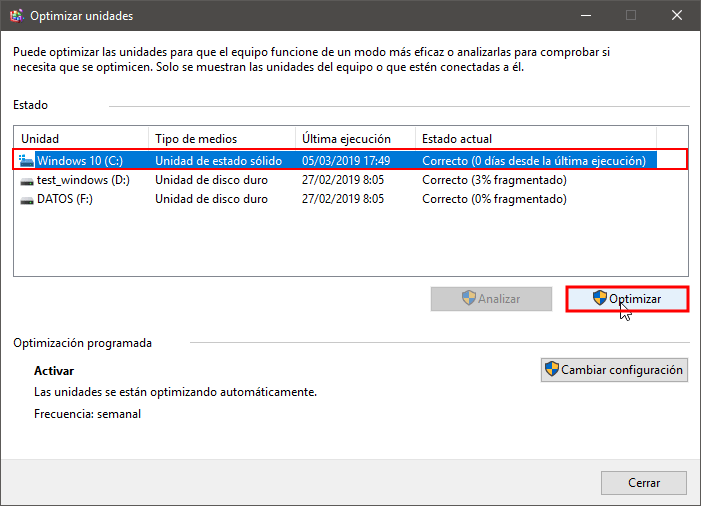
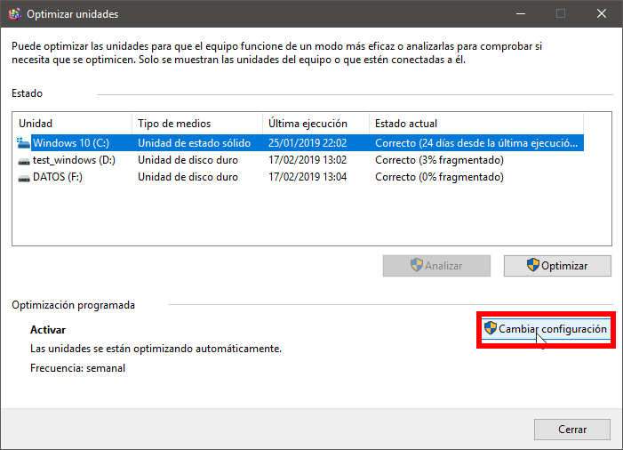
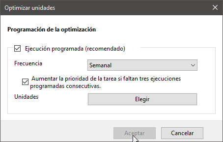
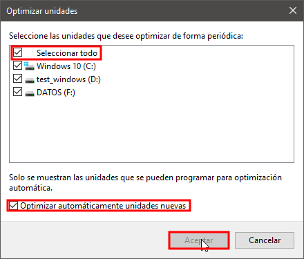

En pasados artículos vimos la [utilidad de TRIM]() y como [activarlo correctamente en Linux](). A continuación veremos como configurar correctamente el optimizador de unidades y como activar TRIM en Windows.<!--more-->

## REQUISITOS PARA PODER ACTIVAR TRIM EN WINDOWS

Los requisitos para usar TRIM en Windows son los siguientes:

1. La versión de **Windows** que usemos **tiene que soportar TRIM**. Todas las versiones de Windows a partir de Windows 7 soportan TRIM.
2. Disponer de **una unidad SSD con un firmware que soporte TRIM**. La totalidad de unidades SSD actuales tienen pleno soporte.
3. El **sistema de archivos** usado por Windows tiene que ser **NTFS** o **ReFS**.

Hoy en día la totalidad de equipos con una unidad de almacenamiento SSD deberían permitir activar TRIM sin problema alguno.

## ACTIVAR EL SOPORTE TRIM EN WINDOWS

En el momento que Windows detecta una unidad SSD activa TRIM de forma automática. Además, periódicamente realiza el mantenimiento necesario para asegurar los siguientes aspectos:

1. Obtener el máximo rendimiento de la unidad SSD.
2. Incrementar la vida de la unidad de almacenamiento SSD.

Por lo tanto en los siguientes apartados nos limitaremos a:

1. Comprobar que TRIM esté activado en Windows.
2. Configurar el mantenimiento que Windows realizará a nuestra unidad SSD.

## ¿CÓMO FUNCIONA TRIM EN WINDOWS?

Windows no es transparente en su funcionamiento. No obstante, después de informarme de las fuentes que encontraréis al final del artículo, el funcionamiento se puede resumir de la siguiente forma:

1. Al borrar información de la unidad SSD se almacena una solicitud de TRIM. Hay un número máximo de solicitudes que se podrán almacenar, por lo tanto es importante que periódicamente se ejecute el optimizador de unidades de Windows para que se haga un TRIM.
2. Cuando se ejecuta el optimizador de unidades se completan la solicitudes TRIM almacenadas. De esta forma, al ejecutarse el optimizador de unidades se liberará el espacio no usado de la unidad SSD.

## COMPROBAR QUE TRIM ESTÁ ACTIVADO EN WINDOWS

Para comprobar que TRIM está activado tenemos que abrir una consola de comandos como administrador.

[](images/abrir-consola-permisos-administrador.jpg)

Una vez abierta ejecutaremos el siguiente comando:

> ```
> fsutil behavior query DisableDeleteNotify
> ```

El resultado obtenido en mi caso es el siguiente:

[](images/Consultar-si-trim-está-activado.png)

Mi unidad SSD tiene un sistema de archivos NTFS y el valor de la variable **NTFS DisableDeleteNotify** es **0**. Por lo tanto, puedo asegurar que **TRIM está activado**.

Si el valor **NTFS DisableDeleteNotify** fuera **1** significaría que el soporte TRIM para sistemas de archivos NTFS está deshabilitado. Si estuviera deshabilitado deberíamos ejecutar el siguiente comando para habilitarlo:

> ```
> fsutil behavior set DisableDeleteNotify 0
> ```

En el hipotético caso que nuestro sistema de archivos fuera ReFS deberíamos asegurar que el valor de la variable **ReFS DisableDeleteNotify** sea **0**. Si el valor fuera 0 podríamos asegurar que TRIM está activado. Si el valor fuera 1 deberíamos activar TRIM ejecutando el siguiente comando:

> ```
> fsutil behavior set disabledeletenotify ReFS 0
> ```

De esta forma tan sencilla podemos asegurar que TRIM está activado en todas las versiones de Windows soportadas actualmente.

## FORZAR LA EJECUCIÓN DE TRIM EN WINDOWS

En estos momentos sabemos que TRIM está activado. Si queremos forzar TRIM en la unidad **C:** tan solo tenemos que abrir un Powershell y ejecutar el siguiente comando:

> ```
> Optimize-Volume -DriveLetter C -ReTrim -Verbose
> ```

###### Nota: Deberéis reemplazar la letra C por la letra que represente su unidad SSD.

Acto seguido se ejecutará TRIM obteniendo un resultado parecido al siguiente:

[](images/forzar-trim-en-windows.png)

En el caso que quieran aplicar más tareas de optimización a su unidad de almacenamiento pueden visitar el siguiente enlace:

[https://docs.microsoft.com/en-us/powershell/module/storage/optimize-volume?view=win10-ps](https://docs.microsoft.com/en-us/powershell/module/storage/optimize-volume?view=win10-ps)

## CONFIGURAR EL OPTIMIZADOR DE UNIDADES Y TRIM EN WINDOWS

Es importante remarcar que **el optimizador de unidades de Windows tiene que estar siempre habilitado**. Encontrarán artículos que recomiendan lo contrario y esto es un error por los siguientes motivos:

1. Windows es un sistema operativo diseñado para optimizar el rendimiento y vida de la totalidad de unidades SSD. No hace falta que se modifiquen las configuraciones por defecto de Windows.
2. El mantenimiento realizado por el optimizador de unidades de Windows será el más adecuado en todos los casos.
3. En el momento que Windows detecta una unidad SSD modifica la totalidad de configuraciones para optimizar la vida y rendimiento.

### Funciones que realiza el optimizador de unidades en Windows

El optimizador de unidades de Windows realiza la totalidad de tareas necesarias para incrementar el rendimiento y la vida de nuestra unidad SSD. Las funciones que realiza son:

1. **Forzar/programar la ejecución de TRIM** (retrim) en unidades SSD.
2. **Configurar la periodicidad** con que se realiza el mantenimiento de nuestras unidades de almacenamiento.
3. **Defragmentar** la unidad de almacenamiento SSD en el caso que usemos imágenes de recuperación del sistema (Shadow copies). En el caso que usemos puntos de restauración se realizará una tarea de defragmentación cada 28 días.
4. **Optimizar** los [sistemas de almacenamiento por capas](https://windowserver.wordpress.com/2014/04/08/windows-server-2012-r2-storage-tiers-combinar-discos-ssd-y-hdd/) (Tiered Storage Space). Este sistema de almacenamiento permite que los datos más usados siempre estén almacenados en nuestra unidad SSD. Los datos menos usados se almacenarán en un disco duro HDD.
5. **Consolidar la información almacenada**. La información almacenada en áreas poco densas se moverá hacia áreas más densas. El proceso de consolidación en un SSD es completamente distinto al de un HDD. En un HDD toda la información se agrupa al inicio del disco dejando el máximo espacio posible al final del disco. En unidades SSD la información se agrupa en diferentes áreas del disco duro de forma que la brecha entre área y área de información sea lo más grande posible.

### Acceder al optimizador de unidades de Windows

En el gestor de archivos de Windows seleccionamos una unidad cualquiera. Presionamos el botón derecho del ratón y cuando aparezca el menú contextual clicamos en la opción Propiedades.

[](images/propiedades-unidad-almacenamiento.png)

En la ventana de propiedades de Windows clicamos la pestaña Herramientas. Acto seguido presionamos en el botón Optimizar.

[](images/optimizar-unidades-almacenamiento.png)

Justo después aparecerá la ventana para configurar el optimizador de unidades:

[](images/ventana-optimizacion-unidades.png)

### Forzar la optimización de una unidad de almacenamiento SSD

Para forzar la optimización de una unidad tan solo la tenemos que seleccionarla y presionar el botón Optimizar. Acto seguido se realizada la optimización de la unidad.

[](images/forzar-optimizacion-ssd.png)

### Configuración recomendada para el optimizador de unidades

Si observáis el apartado Optimización programada verán que la configuración predeterminada consiste optimizar todas las unidades de almacenamiento una vez por semana. La configuración predeterminada es correcta y no hay porque cambiarla a no ser que sepamos muy bien lo que hacemos.

En el caso que queráis ver o modificar la opción de configuración predeterminada hay que clicar en botón Cambiar configuración.

[](images/cambiar-configuracion-optimizador-unidades.png)

Acto seguido verán la siguiente ventana en la que podrán configurar las siguientes opciones:

[](images/opciones-configuracion-optimizador-unidades.png)

1. Seleccionar si queremos **automatizar el proceso de optimización** de nuestra unidad SSD. En nuestro caso tenemos que automatizarlo y para ello **hay que tildar la opción** Ejecución programada (recomendado)
2. Definir la **frecuencia con que se realizará la optimización de la unidad** de almacenamiento. En mi caso recomiendo usar una frecuencia Semanal, pero si queréis podéis seleccionar Diariamente o Mensual.
3. **Tildamos** la opción Aumentar la prioridad de la tarea si faltan tres ejecuciones programadas definitivas. De este modo, si pasamos más de 3 semanas sin ejecutar la optimización se forzará cuando Windows lo considere oportuno.
4. Si tildamos el botón Elegir podremos **seleccionar las unidades en que se realizará la optimización**. Les recomiendo optimizar la totalidad de unidades. Para ello hay que tildar las opciones Seleccionar todo y Optimizar automáticamente unidades nuevas.

[](images/seleccionar-unidades-a-optimizar.png)

## CONCLUSIONES

Cuando compramos una unidad SSD no hay que configurar ni optimizar ningún parámetro. En el momento que Windows detecta que tenemos una unidad SSD aplicará una configuración predeterminada que será válida en el 99,9% de usuarios.

En Internet encontraréis multitud de tutoriales detallando como optimizar el rendimiento de una unidad SSD. No apliquéis ninguno de estos tutoriales. El motivo es que la configuración por defecto que aplicará Windows será la mejor para obtener un rendimiento óptimo y prolongar la vida de nuestro SSD.

###### FUENTES

[https://www.hanselman.com/blog/TheRealAndCompleteStoryDoesWindowsDefragmentYourSSD.aspx](https://www.hanselman.com/blog/TheRealAndCompleteStoryDoesWindowsDefragmentYourSSD.aspx)

[http://forum.corsair.com/v3/showthread.php?](http://forum.corsair.com/v3/showthread.php?)
