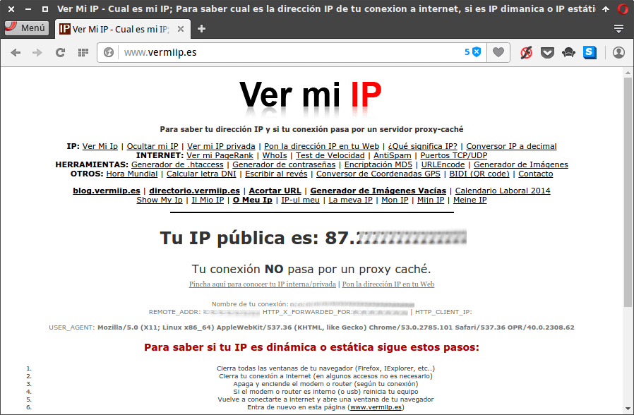
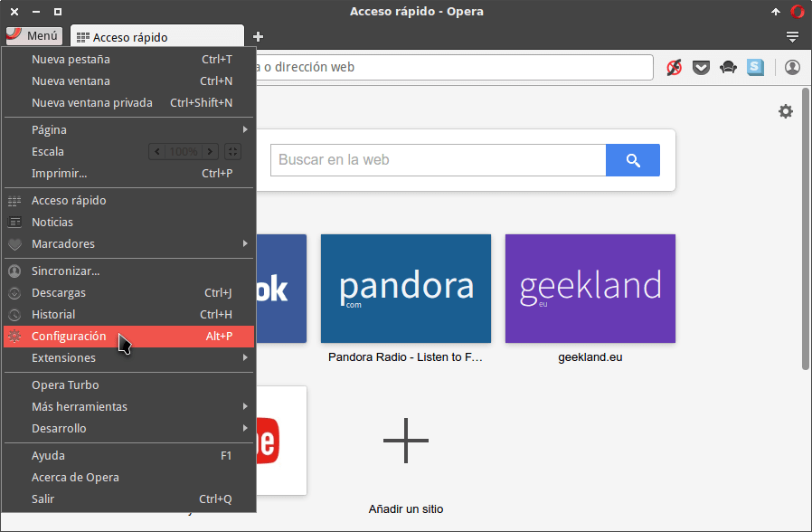
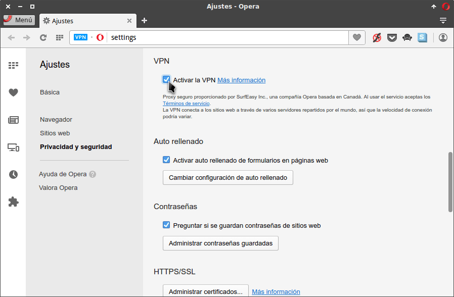
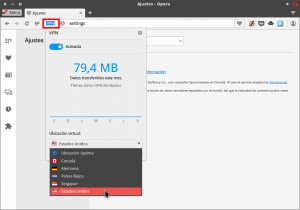
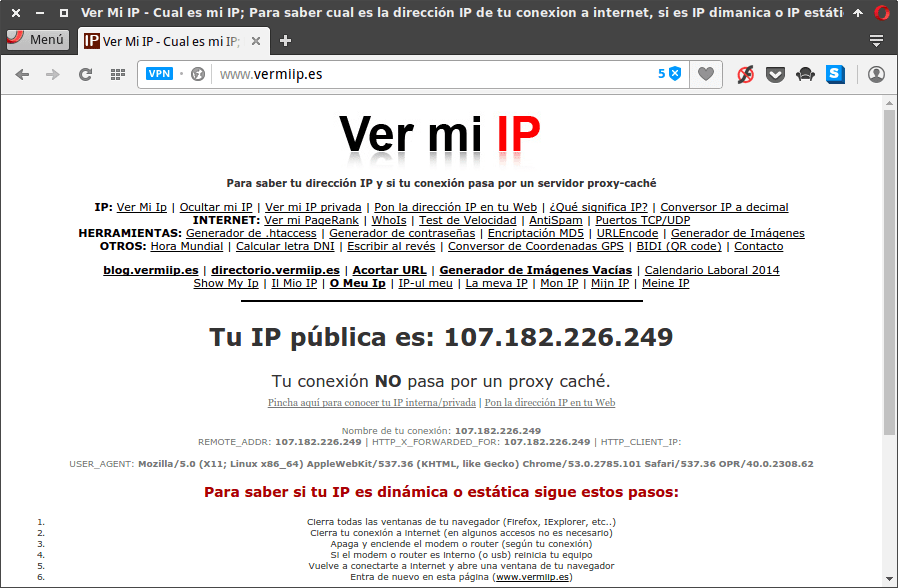
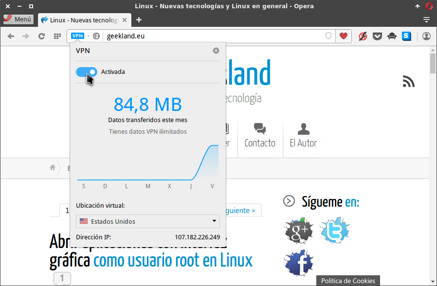

Desde la versión 40 Opera trae incorporado de serie un servicio VPN gratuito. Esto hace que Opera sea el primer navegador Web en traer un servicio VPN de forma nativa.<!--more-->

###### Nota: Si quieren saber que es un servicio VPN pueden consultar el siguiente [enlace]().

Para activar el servicio VPN de Opera tenemos seguir los siguientes pasos:

## CONSULTAR NUESTRA IP INICIAL

Para ver nuestra IP inicial accedemos a la siguiente página web:

[http://www.vermiip.es/](http://www.vermiip.es/ "Web para averiguar nuestra IP Pública")

Después de acceder a ella podemos ver que nuestra IP actual es la siguiente:

Una vez sabemos nuestra IP pública real activaremos el servicio VPN.

Cuando el servicio VPN esté activado nuestra IP Pública será diferente a la que hemos obtenido en este apartado.

## ACTIVAR EL SERVICIO VPN GRATUITO DE OPERA EN NUESTRO ORDENADOR

En primera instancia abrimos el navegador Opera.

###### Nota: En el caso que no tengan el navegador Opera instalado pueden seguir las instrucciones del siguiente [enlace]() para instalarlo.

A continuación accedemos a la configuración del navegador presionando encima del botón **Menú** y clicando encima de la opción **Configuración**.

###### Nota: También podemos acceder a la configuración del navegador presionando la combinación de teclas ALT+P.

Seguidamente en el panel lateral ciclamos en el apartado **Privacidad y seguridad** y buscamos la opción VPN. Una vez encontrada la activamos clicando encima de la casilla **Activar la VPN**.

Una vez activado el servicio VPN aparecerá un botón azul en la barra de direcciones en que pone **VPN**. Lo presionamos y en el menú que aparecerá podremos seleccionar la ubicación geográfica del servicio VPN que queremos usar. En mi caso selecciono **Estados Unidos**.

###### Nota: Si no es importa la ubicación del servicio es mejor seleccionar la opción Ubicación óptima porque la velocidad de navegación será superior.

Una vez realizados estos pasos ya estamos usando el servicio VPN gratuito de Opera.

## COMPROBAR QUE ESTAMOS USANDO EL SERVICIO VPN DE OPERA

Una vez activado y configurado el VPN podemos volver a comprobar nuestra IP Pública.

Por lo tanto al igual que que hicimos en el inicio de este artículo accedemos de nuevo a la siguiente página web:

[http://www.vermiip.es/](http://www.vermiip.es/ "Web para averiguar nuestra IP Pública")

Tal y como se puede ver en la captura de pantalla ahora la IP es diferente a la del inicio del artículo. Por lo tanto ahora tenemos la seguridad que estamos conectados al servicio VPN.

## DESACTIVAR EL VPN DE FORMA FÁCIL

En el momento que queramos desactivar el servicio VPN para navegar de forma normal lo podemos de forma muy fácil.

Pulsamos el botón VPN de color azul ubicado en la barra de direcciones y al abrirse el menú presionamos encima del botón **Activada**.

Después de presionar el botón ya no estaremos conectados al servicio VPN y podremos navegador de forma habitual.

## CARACTERÍSTICAS DEL SERVICIO VPN GRATUITO OFRECIDO POR OPERA

El servicio VPN de Opera es prestado por la empresa SurfEasy.

###### Nota: La empresa SurfEasy pertenece a Opera desde Octubre de 2015.

A grandes rasgos las condiciones que a día de hoy ofrece esta empresa son las siguientes:

1. El servicio VPN que se ofrece es completamente ilimitado y Gratis. No existe ningún límite de consumo de datos. No obstante si se detecta un uso anormal se nos puede suspender el servicio.
2. Es gratuito y no es necesario tener que realizar ninguna suscripción ni crear ninguna cuenta para usarlo.
3. Con tan solo un par de clics podemos activar y usar el servicio VPN.
4. Aunque personalmente no me lo creo dicen que no guardan logs de las IP conectadas al servicio VPN.
5. En su [política de privacidad](https://www.surfeasy.com/privacy_policy/ "Política de privacidad de Surfeasy") se especifica claramente que en el caso que una autoridad requiera información sobre sus usuarios se la van a proporcionar. Por lo tanto es claro que este servicio recopila datos de nuestro uso.
6. Obviamente este servicio no es para realizar actividades ilícitas. En el momento que se detecte que estamos realizando algo fuera de lo común nos suspenderán el servicio.
7. El servicio VPN es para uso personal. No está autorizado su uso para fines comerciales.

## VENTAJAS Y USOS QUE PODEMOS DAR AL SERVICIO VPN GRATUITO DE OPERA

Algunos de vosotros os preguntaréis las utilidades que puede tener el hecho de poder usar un servicio VPN.

Algunas de las utilidades que le podemos dar son las siguientes:

1. Con el servicio VPN de Opera ya no será necesario buscar extensiones y servicios de dudosa reputación para poder usar un servicio VPN.
2. Podremos navegar de forma segura cuando estemos usando una red Wifi abierta en un sitio que no es confiable. Cuando naveguemos a través de un servicio VPN la totalidad de nuestro tráfico está cifrado y por lo tanto nadie podrá podrá interceptar nuestro tráfico.
3. Tendremos la posibilitad de acceder a servicios que están bloqueados geográficamente como por ejemplo Pandora.
4. La totalidad de nuestro tráfico estará cifrado. Por lo tanto nuestro proveedor de Internet no tendrá forma de saber a las páginas que hemos visitado.
5. Por la misma razón que en el punto 4, nadie perteneciente a nuestra red local podrá interceptar nuestro tráfico y ver lo que estamos haciendo.
6. Navegar de forma relativamente “anónima” ya que en todo momento estaremos ocultando nuestra IP real.
7. Para saltarse el bloqueo de proxys y firewalls corporativos. De está forma podemos internar acceder a páginas web que bloquean los administrados de sistemas de algunas empresas.

En el caso que quieren detallar algún uso adicional del servicio VPN lo pueden hacer a través de los comentarios de este artículo.

## PUNTOS A TENER EN CUENTA DEL SERVICIO VPN DE OPERA

Al usar el servicio VPN de Opera hay una serie de puntos que hay que tener muy en cuenta.

El primero de ellos es que el servicio VPN únicamente lo podemos usar a través del navegador Opera. Los otros programas de nuestro ordenador no se podrán servir del servicio VPN. Por lo tanto más que un servicio VPN es un proxy que cifra nuestro tráfico.

La empresa que proporciona el servicio VPN registra y almacena nuestra actividad. Por lo tanto en términos de privacidad no es el servicio VPN ideal.

Como todo servicio VPN la seguridad radica en las intenciones que tiene la empresa que nos proporciona el servicio. En este caso el servicio nos los ofrece Opera que en principio es una empresa con recursos y seria. Por lo tanto en mi caso pienso que es un servicio en el que podemos confiar.

## ¿PODEMOS USAR EL SERVICIO VPN DE OPERA EN ANDROID Y EN IOS?

El servicio VPN de Opera también lo podemos usar en iOS y en Android. Para ello tan solo tiene que seguir las instrucciones que encontrarán en el siguiente enlace:

[https://geekland.eu/vpn-para-android-ios-gratis-ilimitado/]()
