Hace semanas vimos como [configurar]() e [instalar Nextcloud](). A día de veremos como podemos actualizar Nextcloud de forma extremadamente sencilla. Gracias a su asistente de actualización tan solo tendremos que apretar un botón y el proceso se realizará de forma automática.<!--more-->

## COMO AVERIGUAR SI EXISTE UNA ACTUALIZACIÓN

En el momento que haya una actualización disponible nos debería llegar una notificación en el panel de Nextcloud. El sistema de notificaciones funcionará siempre y cuando tengamos activada la aplicación Update notification.

## REALIZAR UNA COPIA DE SEGURIDAD DE NEXTCLOUD

El asistente de actualización de Nextcloud creará un punto de restauración en caso que haya problemas durante la actualización. No obstante antes de iniciar el proceso para actualizar Nextcloud es recomendable realizar una copia de seguridad de los siguientes elementos:

1. La base de datos de Nextcloud.
2. La carpeta de configuración.
3. La carpeta que contiene todos nuestros archivos.

Para ello pueden seguir las instrucciones que se muestran a continuación:

https://geeklandlinux.github.io/posts/copia-de-seguridad-backup-nextcloud/

## ACTUALIZAR NEXTCLOUD MEDIANTE SU ASISTENTE DE ACTUALIZACIÓN

Para iniciar el proceso para actualizar Nextcloud accedemos al apartado de Configuración.

[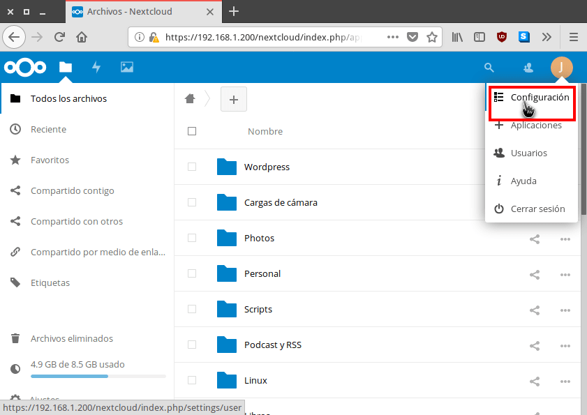](images/acceder-configuracion-nextcloud.png)

Dentro del apartado de configuración clicamos en el menú Ajustes básicos ubicado en la parte izquierda de la pantalla.

[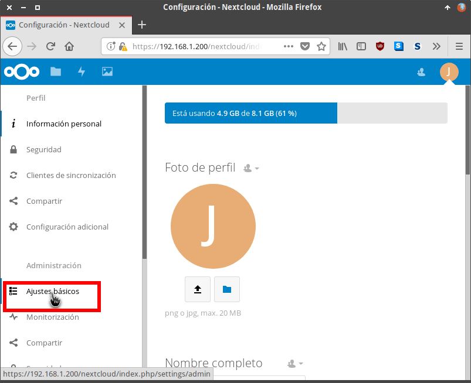](images/acceder-ajustes-basicos.png)

A continuación, en el apartado versión verán que existe una actualización disponible. Para iniciar el proceso de actualización tan solo tienen que presionar encima del botón Abrir actualizador.

[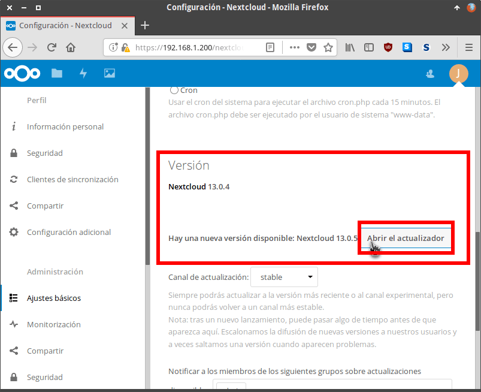](images/abrir-asistente-actualizacion.png)

Una vez abierto el asistente de actualización tan solo tan solo tenemos que presionar en el botón Start update.

[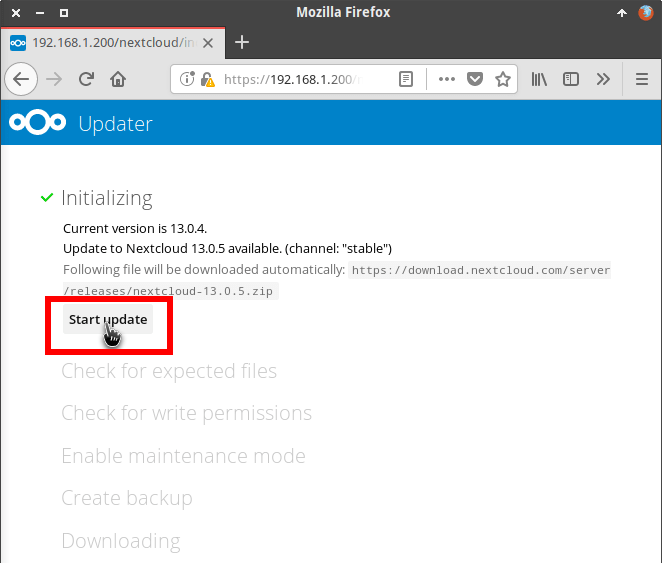](images/preparar-actualizacion-nextcloud.png)

Acto seguido se realizarán la totalidad de tareas previas a la actualización de forma completamente automática. Algunas de las tareas que se realizarán son:

1. Activar el modo mantenimiento para que el servidor no sea accesible para los usuarios o clientes.
2. Comprobar que los permisos de las carpetas sean los correctos.
3. Realizar una copia de seguridad por si existe algún problema durante el proceso de actualización.
4. Descargar y verificar los archivos para actualizar Nextcloud.
5. Descomprimir la actualización de Nextcloud.
6. Etc.

Al final del proceso de preparación para la actualización se nos preguntará si queremos mantener el modo de mantenimiento activado. Responderemos que No clicando sobre el botón No (For usage of the of the web based updater).

[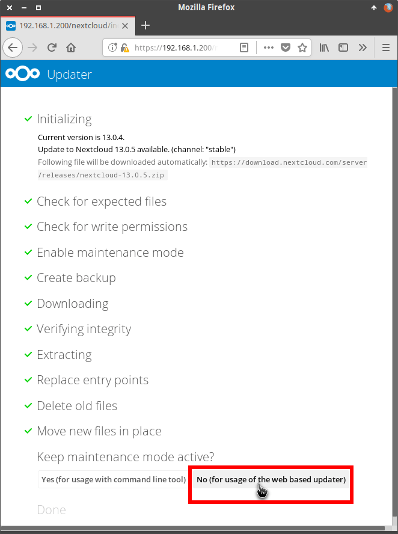](images/desactivar-modo-mantenimiento.png)

Una vez finalizadas las tareas previas a la instalación clicaremos sobre el botón Go back to your Nextcloud instance to finish the update.

[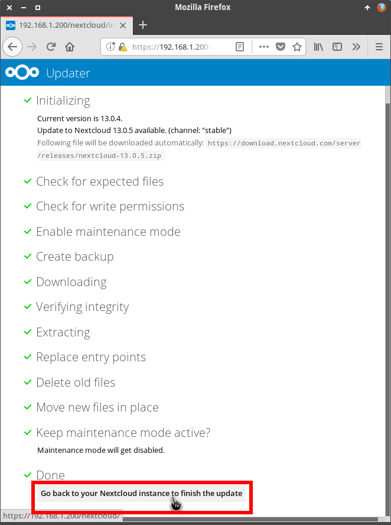](images/preparacion-actualizacion-finalizada.png)

Seguidamente el navegador nos dirigirá a la siguiente pantalla para iniciar el proceso de actualización. Para iniciar el proceso para actualizar Nextcloud clicaremos encima del botón Iniciar actualización.

[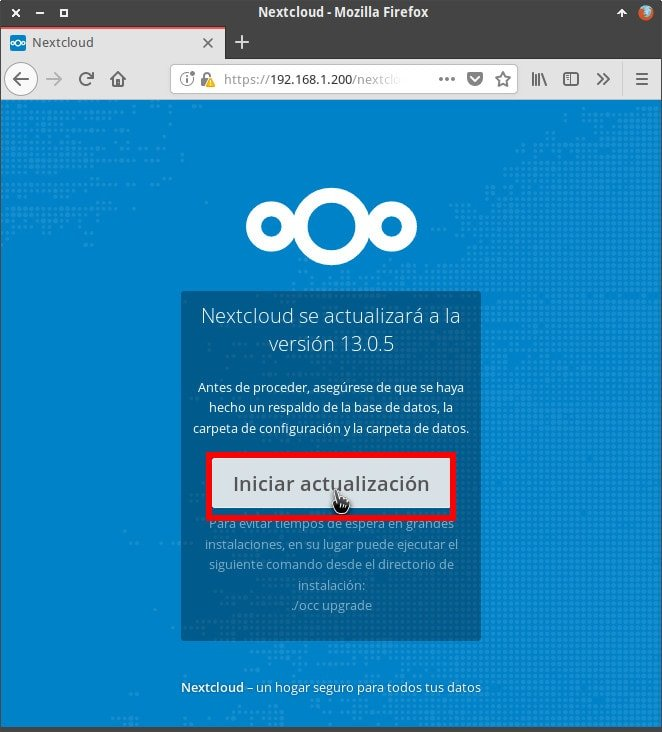](images/iniciar-proceso-actualizar-nextcloud.jpg)

A continuación tan solo tendremos que esperar unos pocos minutos para que se realice la actualización de forma completamente automática. Una vez finalizada la actualización tan solo tenemos que presionar el botón Continuar a Nextcloud.

[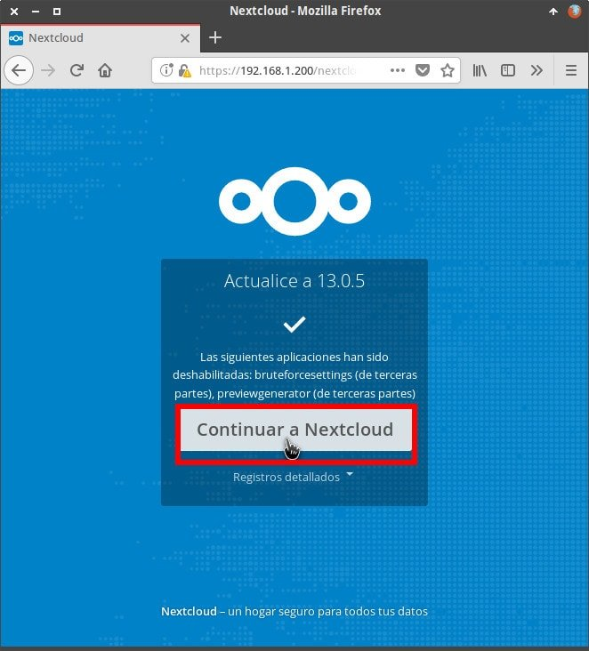](images/actualizacion-nextcloud-finalizada.jpg)

Finalmente se abrirá Nextcloud y estará completamente actualizado a la última versión.

[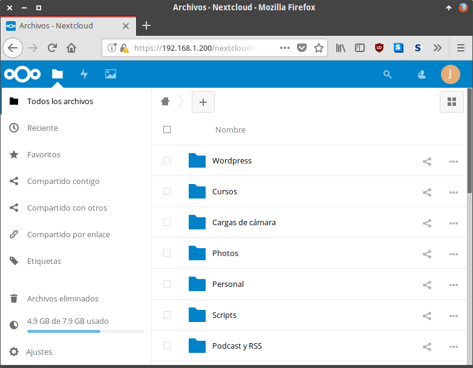](images/nextcloud-actualizado.png)

## HABILITAR APPS QUE SE HAN DESACTIVADO DURANTE LA INSTALACIÓN

Tras la actualización es posible que se desactiven algunas de las Apps. Por lo tanto al finalizar la actualizar accedan dentro del apartado de Aplicaciones.

[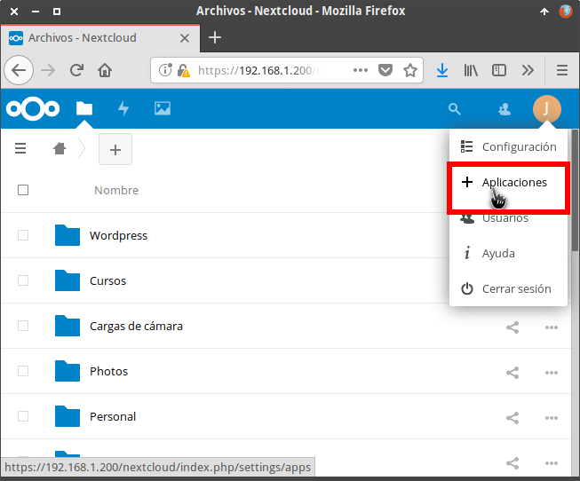](images/acceder-aplicaciones.png)

Dentro del apartado de aplicaciones cliquen sobre la opción Apps deshabilitadas.

[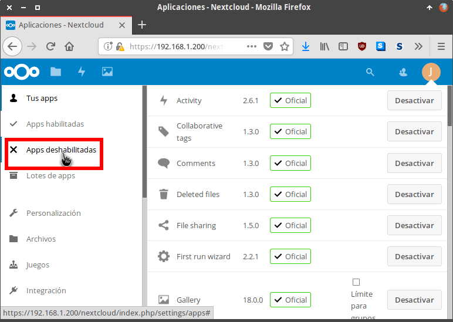](images/ver-aplicaciones-deshabilitadas.png)

Finalmente activen la totalidad de Apps que tenían activadas anteriormente.

[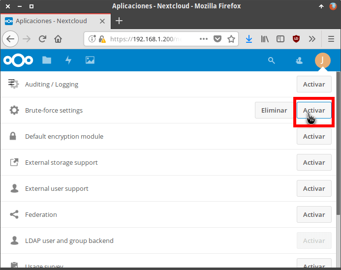](images/activar-aplicaciones.png)
