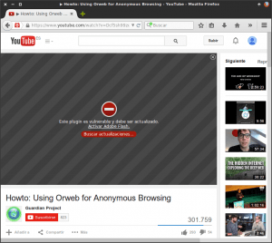

Actualmente Adobe no saca nuevas versiones de Flash en Linux, únicamente lanza actualizaciones de seguridad y es más que seguro que en un futuro no muy lejano acabará muriendo y siendo totalmente reemplazado por html5. No obstante en algunas web y en algunos casos aun sigue siendo necesario el uso de Flash.<!--more-->

Si somos usuarios de Firefox, u otros navegador que utilice el plugin de Adobe, es posible que queramos visualizar un vídeo y nos encontremos con la siguiente situación:

[](images/Plugin-de-Flash-desactualizado.png)

Tal y como se puede ver en la captura de pantalla obtenemos el siguiente mensaje:

**Este plugin es vulnerable y debe ser actualizado**

Por lo tanto Firefox no nos deja visualizar el vídeo porque el plugin de Adobe está desactualizado.

Para solucionar este problema y poder visualizar el vídeo tan solo tenemos que actualizar el plugin de Adobe siguiendo los siguientes pasos.

###### Nota: En la redacción de este post estoy suponiendo que disponen del plugin de flash instalado. En el caso que no lo tuvieran instalado y sean usuarios de Debian o una distro derivada de Debian lo pueden instalar abriendo una terminal y tecleando el comando sudo apt-get install flashplugin-nonfree

## COMPROBAR LA VERSION DEL PLUGIN QUE ESTAMOS USANDO

El primer paso a realizar es abrir una una terminal y **ejecutar el siguiente comando**:

> ```
> sudo update-flashplugin-nonfree --status
> ```

Después de ejecutar el comando en mi caso he obtenido el siguiente resultado:

> ```
> joan@debian:~$ sudo update-flashplugin-nonfree --status
> [sudo] password for joan: 
> FlashPlayer version installed on this system : 11.2.202.559
> FlashPlayer version available on upstream site: 11.2.202.616
> flash-mozilla.so - auto mode
>  link best version is /usr/lib/flashplugin-nonfree/libflashplayer.so
>  link currently points to /usr/lib/flashplugin-nonfree/libflashplayer.so
>  link flash-mozilla.so is /usr/lib/mozilla/plugins/flash-mozilla.so
> /usr/lib/flashplugin-nonfree/libflashplayer.so - priority 50
> ```

**Si observamos las 2 líneas de color color rojo podemos concluir que** la versión del plugin instalado en mi sistema es la 11.2.202.559 y la última versión disponible es la 11.2.202.616. Por lo tanto efectivamente mi plugin **no está actualizado**.

## ACTUALIZAR EL PLUGIN DE FLASH A LA ÚLTIMA VERSIÓN

Para actualizar a la última versión del plugin tan solo tenemos que **ejecutar el siguiente comando en la terminal**:

> ```
> sudo update-flashplugin-nonfree --install
> ```

Justo después de ejecutar el comando se procederá a la actualización.

## COMPROBAR QUE ESTAMOS USANDO LA ÚLTIMA VERSIÓN DEL PLUGIN

Una vez finalizada la actualización volvemos a **ejecutar el siguiente comando para comprobar si la versión instalada es la más actual**:

> ```
> sudo update-flashplugin-nonfree --status
> ```

Después de ejecutar el comando obtendremos el siguiente resultado:

> ```
> joan@debian:~$ sudo update-flashplugin-nonfree --status
> FlashPlayer version installed on this system : 11.2.202.616
> FlashPlayer version available on upstream site: 11.2.202.616
> flash-mozilla.so - auto mode
>  link best version is /usr/lib/flashplugin-nonfree/libflashplayer.so
>  link currently points to /usr/lib/flashplugin-nonfree/libflashplayer.so
>  link flash-mozilla.so is /usr/lib/mozilla/plugins/flash-mozilla.so
> /usr/lib/flashplugin-nonfree/libflashplayer.so - priority 50
> ```

**Si observamos el resultado obtenido podemos afirmar que disponemos de la última versión del plugin de Adobe**. Por lo tanto, tal y como se puede ver en la captura de pantalla, ahora si puedo visualizar el vídeo que no podía visualizar inicialmente.

[](images/Plugin-de-Flash-actualizado.png)

De esta forma tan sencilla podremos seguir visualizando nuestros vídeos con el navegador Firefox, o con cualquier otro navegador que haga uso del plugin de Adobe.
