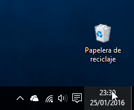
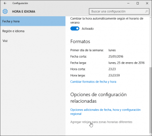
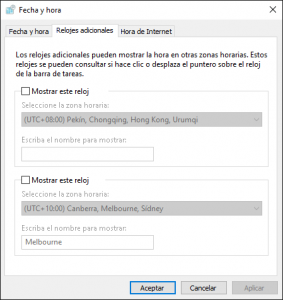
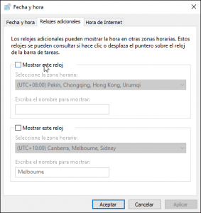
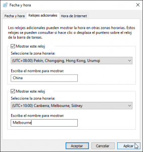
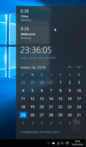

He decidido escribir un post en el que comentaré el procedimiento a seguir para agregar relojes de zonas horarias diferentes en Windows. El motivo por el cual escribo sobre este tema es porque en mi caso acostumbro a trabajar con proveedores y clientes ubicados en el extranjero y de vez en cuando surgen urgencias que hacen que tenga que contactar con ellos a horas no habituales. Por lo tanto a menudo me encuentro con situaciones similares a las siguientes:<!--more-->

1. Tengo que llamar a este proveedor porque ha surgido un problema. ¿Qué hora será en su país? ¿Lo puedo llamar ahora?
2. Tengo que llamar a un cliente porque es urgente comunicarle algo que ha pasado. ¿Qué hora será en su país? ¿Lo puedo llamar ahora?

Para no tener que perder tiempo entrando en Internet y buscando la hora que es en un determinado país, podemos usar una característica de Windows que nos permite mostrar la hora en cualquier país de forma inmediata. Para ello tan solo tenemos agregar relojes para distintas zonas geográficas realizando los siguientes pasos.

###### Nota: El proceso mostrado en este tutorial se ha realizado en Windows 10. El proceso para realizarlo en Windows 7 o en Windows 8 es exactamente el mismo.

## AGREGAR RELOJES PARA DISTINTAS ZONAS HORARIAS

Para agregar relojes que nos muestren la hora en distintos países, tal y como se puede ver en la captura de pantalla, primeramente tenemos que **posicionar el puntero del ratón encima del reloj de Windows y clicar el botón izquierdo del ratón**.

Seguidamente se desplegará un panel en el que se mostrará la hora y un calendario. En este panel, tal y como se puede ver en la captura de pantalla, tenemos que **clicar encima de la opción Configuración de fecha y hora**.

Justo después de clicar aparecerá la ventana de Hora e Idioma en la que, tal y como se puede ver en la captura de pantalla, tenemos que **clicar encima de la opción Agregar relojes para zonas horarias diferentes**.

A continuación aparecerá la ventana de Fecha y hora en la que ya podemos iniciar la configuración para obtener 2 relojes adicionales para ver la hora y el día en distintas partes del mundo.

Para iniciar la configuración, tal y como se puede ver en la captura de pantalla, tenemos que **tildar la celda Mostrar este reloj**.

Una vez tildada la celda, tal y como se puede ver en la captura de pantalla, deberemos **seleccionar la zona horaria**, que en mi caso quiero que sea **Pekín, Chongqing, Hong Hong Kong, Urumqi**, y finalmente **en el campo Escriba el nombre para mostrar escribimos el nombre de la Ciudad o país que queremos que aparezca en el reloj**. Una vez realizados estos pasos **presionamos el botón Aplicar** y finalmente **presionamos el botón Aceptar**.

###### Nota: En estos momentos tenemos configurados 2 relojes. Si queremos podemos configurar un tercer reloj repitiendo otra vez los pasos que hemos visto hasta el momento.

## CONOCER LA HORA Y EL DÍA EN PAISES DIFERENTES AL NUESTRO

Una vez finalizado el proceso de configuración, en el momento que queramos saber la hora en China tan solo tenemos que **posicionar el puntero del ratón encima del reloj de Windows y clicar el botón izquierdo del mouse**. Justo después aparecerá el siguiente panel:

Tal y como se puede ver en panel, en España actualmente son las 23:36 Horas del día 25 de Enero de 2016 mientras que en China son la 6:36 del día 26 de Enero de 2016. En mi caso también tengo configurado un tercer reloj que muestra la hora y el día de Melbourne.

## CIRCUNSTANCIAS EN LAS QUE NOS PUEDE SER ÚTIL DISPONER DE VARIOS RELOJES

Agregar distintos relojes a Windows para ver la hora en distintos países es una gran comodidad en las siguientes situaciones:

1. **En el caso que tenga que llamar a un cliente o a un proveedor a una hora poco habitual**. De esta forma evitaremos llamarlos a horas que son poco convenientes.
2. **En el caso de tener familiares en el extranjero** es útil para asegurar que no los llamamos a horas intempestivas.
3. **Las personas que viajan a menudo en el extranjero**, cuando se ponen delante del ordenador a trabajar acostumbran a preguntarse la hora que será en su país, o la hora que realmente es en el país en que están. Con este método podemos saber la hora de una forma muy fácil y muy rápida.

Si se les ocurren otras utilidades que se le pueden dar a Agregar relojes con distintas zonas horarias no duden en citarlas en los comentarios de este post.
