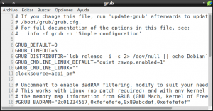
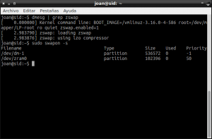

Me he decidido a escribir un post sobre Zswap por varios motivos. El primero de ellos es complementar una serie de post que escribí en el pasado que hablaban de como optimizar el rendimiento de nuestra memoria RAM. Estos post son los siguientes:<!--more-->

1. [Liberar memoria cache de nuestra RAM.]()
2. [Limitar el uso de nuestra memoria Swap y limpiarla en el caso que se active.]()
3. [Usar la RAM más eficientemente con ZRAM.]()
4. [Acelerar el inicio de nuestras aplicaciones con Preload.]()
5. [Acelerar el inicio de nuestras aplicaciones con Prelink.]()
6. **Aligerar nuestro sistema operativo con Zswap.**

El segundo de los motivos es a raíz de leer algunos post y comentarios en redes sociales sobre Zswap, que bajo mi punto de vista no son correctos y contienen imprecisiones. Algunas de las afirmaciones realizadas en estos post y que no estoy de acuerdo son las siguientes:

1. Zswap está integrado en el Kernel mientras que Zram no lo está. Esto es completamente falso porqué a día de hoy ambas utilidades están integradas en el Kernel. **Zswap está integrado en el Kernel a partir de la versión 3.11**, mientras que **Zram está integrado en el kernel a partir de la versión 3.14**.
2. No se recomienda usar **Zram y Zswap** de forma simultanea ya que ambas no son compatibles. En esto tampoco estoy de acuerdo. Aunque pienso que no tiene mucho sentido hacerlo, **se pueden usar simultáneamente** estas 2 herramientas sin ningún tipo de problema **ya que las 2 funcionan de forma diferente y no se deberían generar conflictos**. De hecho durante varios días he usado Zram y Zswap de forma simultanea y no he observado ningún tipo de anomalía.
3. También en algunos post y redes sociales leo que Zram únicamente es válido para equipos con pocos recursos, mientras que Zswap mejora el rendimiento en todo tipo de ordenadores. No entiendo el porqué de tal afirmación porqué un equipo cuando se queda sin memoria RAM da igual que sea viejo o nuevo. **Zram y Zswap realizaran su función independientemente de los recursos que tenga el ordenador**, y en el caso de tener un ordenador con muchos recursos ni Zram ni Zswap llegaran a trabajar porqué irán sobrados de memoria RAM.

Una vez vistos estos puntos pasaremos a ver que es Zswap, como funciona y como lo podemos usar.

## ¿QUÉ ES ZSWAP?

Zswap **es un módulo del kernel de Linux** desarrollado por Seth Jennings. Zswap se incorpora al Kernel de Linux a partir de la versión 3.11 y **su principal función**, al igual que Zram, **es evitar la paginación en disco** para de esta forma poder incrementar el rendimiento de nuestro sistema.

A pesar de que el propósito de Zram y Zswap sea similar, la forma que tienen para intentar conseguir esta finalidad es muy diferente y lo veremos en los siguientes apartados de este post.

## FUNCIONAMIENTO DE ZSWAP

A grandes rasgos el funcionamiento de Zswap es el que se describe en este apartado:

Partimos de la situación de una memoria RAM y una partición Swap vacías:

[](images/Situación-inicial.png)

A medida que vayamos usando nuestro equipo se dará perfectamente esta situación:

[](images/Memoria-antes-de-la-paginación.png)

**Cuando se genera la necesidad de paginación,** en vez de pasar el contenido a la partición Swap **lo que hace Zswap es lo siguiente:**

**1-** El contenido que se tendría que trasladar a la partición Swap se comprimirá y se intentará ubicar en una parte reservada de nuestra memoria RAM denominada Zswap.

**2-** Si el contenido que hay que ubicar en el espacio Zswap tiene una tasa de compresión baja, u es susceptible de generar problemas/errores, entonces Zswap paginará toda esta información a la partición Swap realizando un paginación de disco normal y corriente. Por lo tanto **para usar Zswap precisamos sí o sí de una partición Swap en nuestro equipo**.

**3-** Si el contenido a paginar tiene una tasa de compresión aceptable, y no es susceptible de generar problemas, entonces se almacena en la memoria RAM evitando o retardando su paginación. La información detallada en los puntos 1, 2 y 3 se puede representar en el siguiente diagrama:

[](images/Paginación-finalizada-con-Zswap.png)

###### Nota: Si observamos el diagrama que acabamos de representar veremos que hay parte del contenido paginado en Zswap y la otra parte en la partición Swap. Los motivos de esta separación son los que se explican en los puntos 2 y 3.

**4-** En el caso que la memoria reservada de nuestra RAM (Zswap) se llene, entonces se vaciará. El contenido vaciado se trasladará a la partición Swap realizando un paginación de disco normal y corriente. Por lo tanto, de nuevo volvemos a ver que Zswap requiere de una partición Swap para poder funcionar.

Por lo tanto, descrito de forma muy genérica, **Zswap hace de capa intermedia o puente entre la gestión memoria y nuestra partición Swap**. Esto sin duda es muy distinto a lo realizado por ZRAM que en ningún caso hace de puente con la partición Swap.

Una vez visto como funciona Zswap, **si quieren ver como funciona Zram tan solo tienen que consultar el siguiente** [enlace](). Si comparan el funcionamiento verán que efectivamente el funcionamiento de las 2 herramientas es muy diferente.

## BENEFICIOS APORTADOS POR ZSWAP

El resultado de todo esto proceso teóricamente debe aportar una serie de beneficios. Estos beneficios se pueden resumir en la siguiente lista:

1. Reducir la paginación en disco ayuda a **prolongar la vida de un disco SSD**.
2. **Al reducir la paginación en disco se gana fluidez en el sistema**. La mayoría de personas que lean este artículo seguro que serán conscientes del impacto negativo, en lo que rendimiento se refiere, que se genera cuando se inicia la paginación de disco.
3. Además de evitar la paginación del disco, también **se dice que la lectura del contenido comprimido almacenado en el espacio reservado de Zswap, es más rápida que la lectura del contenido almacenado en la Swap**. Por lo tanto este es otro factor que ayudará a que nuestro sistema operativo funcione con mayor fluidez.

###### Nota: Que cada uno juzgue si Zswap, u otras opciones similares, incrementan el rendimiento de su ordenador por si mismo. Es cierto que tanto Zram como Zswap reducirán la paginación en disco, pero cabe tener en cuenta que lo harán a costa de que la CPU del ordenador trabaje más. Por lo tanto es posible que lo que se gane por un lado se pierde por otro.

###### Nota: Según la información que se detalla en la web [kernel.org](https://www.kernel.org/doc/Documentation/vm/zswap.txt "Información de Zswap") Zswap aun se considera una característica experimental del kernel ya que no ha podido ser testeada todo lo necesario.

## COMO USAR ZSWAP EN CUALQUIER DISTRIBUCIÓN LINUX

Antes explicar como se puede activar Zswap, es necesario **asegurar que cumplimos con los requisitos mínimos** para poder utilizar esta característica. Los requisitos mínimos para poder usar Zswap son los siguientes:

1. **Precisamos de una partición Swap en nuestro ordenador**.
2. **La versión de Kernel que estemos usando tiene que ser como mínimo la 3.11**.

###### Nota: Es necesario realizar esta puntualización porqué en algún que otro blog he visto como están realizando pruebas de uso de Zswap sin disponer de partición Swap.

Si se cumplen estos dos requisitos podemos probar Zswap de la siguiente forma:

Abren una terminal y **ejecutan el siguiente comando**:

> ```
> sudo leafpad /etc/default/grub
> ```

###### Nota: En mi caso utilizo el editor de texto lefpad. Vosotros tenéis que sustituir leafpad por el nombre del editor de texto que acostumbréis a usar habitualmente.

Una vez se abra el editor de texto tendremos que **localizar una linea que empiece por el siguiente texto**:

```
GRUB_CMDLINE_LINUX_DEFAULT
```

En mi caso la linea mencionada contiene la siguiente información:

```
GRUB_CMDLINE_LINUX_DEFAULT="quiet"
```

**Dentro de las comillas, justo al final tenemos que añadir zswap.enabled=1**. Una vez realizado esto la linea modificada, en mi caso, quedará de la siguiente forma:

```
GRUB_CMDLINE_LINUX_DEFAULT="quiet zswap.enabled=1"
```

[](images/Grub-configurado.png)

Una vez realizadas las modificaciones **se guarda el archivo**. Una vez guardado el archivo tenemos que actualizar el grub para que se inicie Zswap en el próximo arranque de nuestro sistema operativo. Para ello **abrimos una terminal y ejecutamos el comando**:

> ```
> sudo update-grub
> ```

Una vez actualizado el grub tan solo tenemos que **reiniciar el ordenador**. Una vez reiniciado el ordenador ya tan solo tenemos que comprobar que Zswap esté activado y funcionando. Para ello abrimos una terminal y usamos el siguiente comando:

> ```
> dmesg | grep zswap
> ```

Si obtenemos un resultado parecido al de la siguiente captura de pantalla podemos estar seguros que Zswap esta activado y funcionando:

[](images/Zswap-funcionando.png)

###### Nota: En la captura de pantalla se puede ver que uso simultáneamente Zram y Zswap. Actualmente estoy experimentando si tener activadas las 2 opciones genera algún tipo de conflicto y de momento me atrevería a decir que no.

## PARÁMETROS QUE SE PUEDEN CONFIGURAR EN ZSWAP

No lo recomiendo a nadie. Pero a quien le guste experimentar sin preocuparle lo que pueda pasar puede modificar las siguientes opciones:

#### Porcentaje de memoria que puede ocupar zswap

Es el tanto por ciento de memoria RAM que queremos emplear para Zswap. El valor por defecto es del 20%. Por lo tanto si tuviéramos 10 GB de memoria RAM, estaríamos empleando 2GB para Zswap. Si queremos modificar este valor podemos **teclear el siguiente comando en la terminal**:

> ```
> sudo nano /sys/module/zswap/parameters/max_pool_percent
> ```

Una vez se abra el editor de texto nano, tan solo tendremos que **remplazar el valor 20 por el que nosotros consideremos apropiado**.

#### Algoritmo de compresión usado por Zswap

También podemos seleccionar el algoritmo de compresión que usa Zswap. Por defecto el algoritmo de compresión usado es lzo. Si queremos lo podemos reemplazar por lz4. Para ello tenemos que **teclear el siguiente comando en la terminal**:

> ```
> sudo nano /sys/module/zswap/parameters/compressor
> ```

Una vez se abra el editor de texto nano, tan solo tendremos que **remplazar el valor lzo por lz4**.

###### Nota: El algoritmo de compresión lz4 tiene una tasa de compresión menor a lzo, pero la velocidad de compresión es mucho mayor y se requiere menos carga de CPU para elaborar el proceso.

###### Nota: Según un post escrito por Jennifer Hopper, persona que colabora con el desarrollador de Zswap, también podemos configurar otro parámetro llamado max\_compressed\_page\_size. Este parámetro lo que hace es definir el tamaño máximo que puede admitir una página comprimida. Si el tamaño de la página comprimida es superior al especificado entonces la paginación se hará directamente a la memoria Swap. A pesar del artículo escrito y de tal información, no he encontrado en ninguna parte como modificar este parámetro.

###### Nota: Es posible que el post contenga algún error ya que la gestión de memoria no es un tema fácil. Por lo tanto si alguien detecta algo a mejorar que lo diga argumentando el porqué de la modificación a realizar.

## FUENTES DE INFORMACIÓN

Les recomiendo encarecidamente que consulten las fuentes de información que se detallan a continuación:

El primero de los links corresponde a un artículo realizado por fuentes cercanas del desarrollador de Zswap. En este link podremos ver datos adicionales sobre Zswap y también mediciones de rendimiento:

[https://www.ibm.com/developerworks/community/blogs/fe313521-2e95-46f2-817d-44a4f27eba32/entry/new\_linux\_zswap\_compression\_functionality7?lang=en](https://www.ibm.com/developerworks/community/blogs/fe313521-2e95-46f2-817d-44a4f27eba32/entry/new_linux_zswap_compression_functionality7?lang=en "Fuente de información sobre Zswap")

En el segundo de los links veremos un test de rendimiento realizado por un usuario final cualquiera. Como podrán ver en el enlace, el resultado obtenido por este usuario no fue positivo:

[http://www.hecticgeek.com/2013/11/zswap-responsiveness-ubuntu/](http://www.hecticgeek.com/2013/11/zswap-responsiveness-ubuntu/ "Experiencia negativa del funcionamiento de Zswap")
