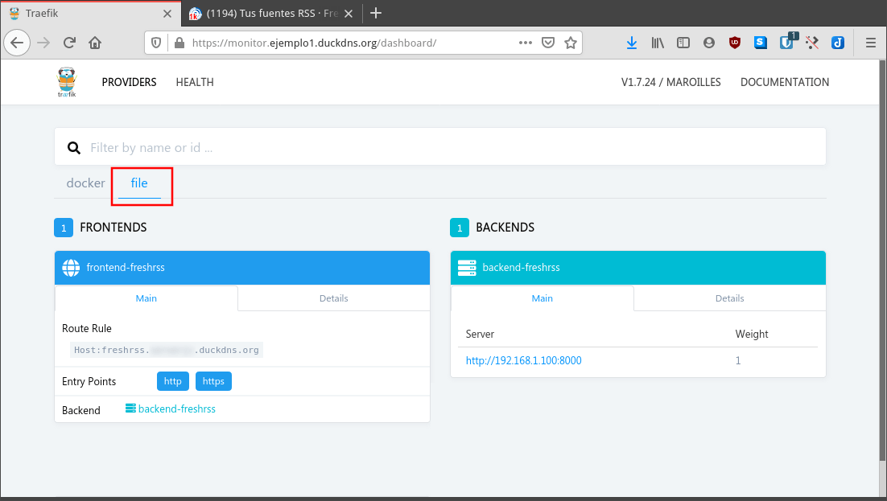
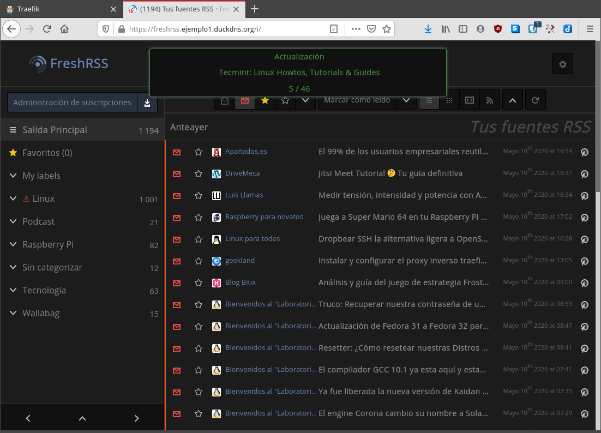
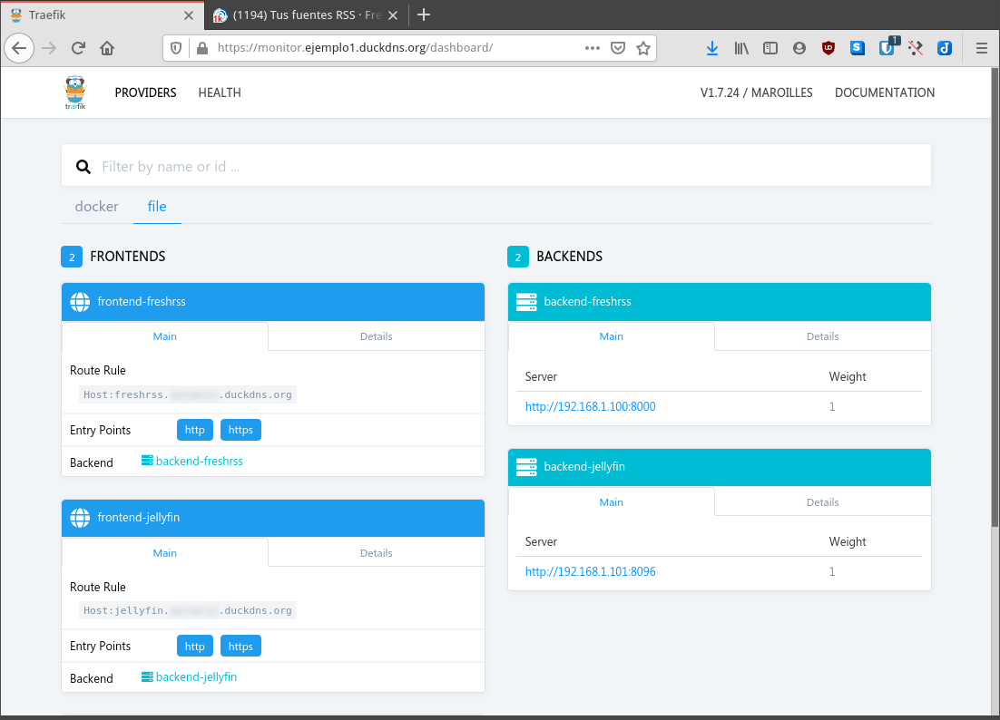
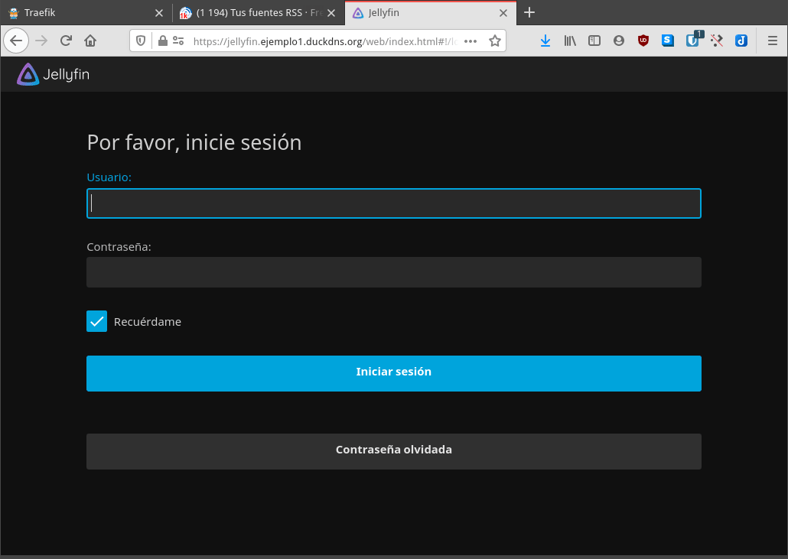

En el último artículo vimos como [instalar y configurar el proxy inverso Traefik]() en Docker. Con lo visto hasta el momento, desde fuera de nuestra red local podemos acceder a servicios que están corriendo dentro de la misma red en que instalamos el contenedor de Traefik. Si además queremos acceder a servicios que están corriendo en equipos remotos y/o fuera de contenedores deberemos editar manualmente el fichero de configuración de Traefik. Para añadir servicios a Traefik que están corriendo en máquinas remotas deberemos seguir el siguiente procedimiento.<!--more-->

## **CONOCER LOS PARÁMETROS PARA AÑADIR SERVICIOS A TRAEFIK**

Imaginemos que nuestro objetivo es el siguiente:

> “Quiero acceder al lector de feeds FreshRSS instalado en un equipo remoto cualquiera de mi red local.”

El equipo remoto en que está instalado FreshRSS:

1. Tiene la IP interna 192.168.1.100
2. El servicio FreshRSS está corriendo en el puerto 8000
3. El firewall está configurado para permitir la comunicación de entrada y salida con el equipo en que tenemos instalado Traefik.
4. Tal y como configuramos en el anterior artículo, tenemos el dominio ejemplo1.duckdns.org. Para acceder al servicio de freshrss lo haré añadiendo el subdominio freshrss al dominio principal. Por lo tanto la URL para acceder a freshrss será freshrss.ejemplo1.duckdns.org.
5. FreshRSS está instalado en un contenedor Docker. En el caso que estuviera instalado de forma local, el procedimiento sería exactamente el mismo.

## AÑADIR SERVICIOS A TRAEFIK QUE ESTÁN CORRIENDO EN EQUIPOS REMOTOS

Una vez tenemos claros los puntos que acabo de mencionar ya podemos añadir servicios a Traefik. Para ello editaremos el fichero de configuración de Traefik ejecutando el siguiente comando en la terminal:

> ```
> nano traefik.toml
> ```

Una vez se abra el editor de textos nano definiremos los backends y frontends del servicio que queremos añadir. Para ello tan solo tendremos que **pegar el siguiente código al final del archivo de configuración**:

> ```
> [file]
> [backends]
>  [backends.backend-freshrss]
>   [backends.backend-freshrss.servers]
>    [backends.backend-freshrss.servers.server-freshrss-ext]
>     url = "http://192.168.1.100:8000"
>     weight = 1
> 
> [frontends]
>  [frontends.frontend-freshrss]
>   backend = "backend-freshrss"
>   passHostHeader = true
>   [frontends.frontend-freshrss.routes]
>      [frontends.frontend-freshrss.routes.route-freshrss-ext]
>     rule = "Host:freshrss.ejemplo1.duckdns.org"
> ```

En el texto pegado solo deberéis reemplazar/adaptar las partes coloreadas. Las partes coloreadas las deberéis adaptar de la siguiente forma:

- El texto rojo debe ser reemplazado por un nombre cualquiera que ayude a identificar el backend y el frontend. En mi caso he puesto el nombre del servicio al que quiero acceder que es freshrss
- El texto azul corresponde a la dirección IP que tiene el servidor que está corriendo Freshrss. En mi caso es la 192.168.1.100.
- El texto en verde debe ser reemplazado por el puerto que está usando el servicio Freshrss. En mi caso es el puerto 8000.
- Finalmente el texto rosa lo debéis reemplazar por el dominio que queréis usar para acceder a Freshrss. Anteriormente definimos que el dominio para acceder al servicio sería freshrss.ejemplo1.duckdns.org.

Una vez aplicada la configuración guardan los cambios y reinician el contenedor de traefik.

A partir de estos momentos si abrimos el panel de control web de traefik veremos que ha aparecido la sección files. Si accedemos dentro de esta sección files veremos que los backends y frontends se han creado con los parámetros que hemos introducido en el fichero de configuración.

[](images/servicio-anadido-en-el-panel-de-control-traefik.png)

Si ahora ingresamos la URL freshrss.ejemplo1.duckdns.org en el navegador verán que podemos acceder a FreshRSS sin ningún tipo de problema.

[](images/freshrss-a-traves-proxy-inverso-traefik.png)

### Añadir servicios adicionales a traefik

Para añadir más servicios lo haremos del mismo modo que acabamos de realizar. Lo único que tenemos que tener en cuenta es lo siguiente:

1. Todos los nuevos backends que añadamos tienen que estar dentro de la etiqueta **\[backends\]**.
2. Todos los nuevos frontends que añadamos tienen que estar dentro de la etiqueta **\[frontends\]**.

Por lo tanto si ahora queremos acceder al servidor multimedia Jellyfin que está corriendo en la red Host de Docker desde fuera de nuestra red local añadiremos el siguiente código dentro del fichero de configuración de Traefik.

> ```
> [file]
> [backends]
>  [backends.backend-freshrss]
>   [backends.backend-freshrss.servers]
>    [backends.backend-freshrss.servers.server-freshrss-ext]
>     url = "http://192.168.1.100:8000"
>     weight = 1
> 
>  [backends.backend-jellyfin]
>   [backends.backend-jellyfin.servers]
>    [backends.backend-jellyfin.servers.server-jellyfin-ext]
>     url = "http://192.168.1.101:8096"
>      weight = 1
> 
> [frontends]
>  [frontends.frontend-freshrss]
>   backend = "backend-freshrss"
>   passHostHeader = true
>   [frontends.frontend-freshrss.routes]
>      [frontends.frontend-freshrss.routes.route-freshrss-ext]
>     rule = "Host:freshrss.ejemplo1.duckdns.org"
> 
>  [frontends.frontend-jellyfin]
>   backend = "backend-jellyfin"
>   passHostHeader = true
>   [frontends.frontend-jellyfin.routes]
>      [frontends.frontend-jellyfin.routes.route-jellyfin-ext]
>     rule = "Host:jellyfin.ejemplo1.duckdns.org"
> ```

**Nota:** Tal y como pueden ver en el archivo de configuración, Jellyfin está corriendo en un equipo que tiene la IP interna 192.168.1.101. Jellyfin está escuchando en el puerto 8096.

Una vez introducidos los cambios en el fichero de configuración los guardan y reinician Traefik.

Si ahora acceden al panel de control de traefik, verán que en la sección files se habrá añadido el backend y el frontend de Jellyfin.

[](images/jellyfin-en-el-panel-de-control.png)

En estos momentos tan solo tendremos que abrir el navegador e introducir la URL para ingresar a Jellyfin. Si todo funciona correctamente podrán acceder a Jellyfin sin ningún tipo de problema.

[](images/accediendo-a-jellyfin-a-traves-del-proxy-inverso.png)

### Notas finales

De esta forma tan simple podemos añadir servicios a Traefik que corren en máquinas remotas de nuestra red local. Por lo tanto el proxy inverso Traefik nos permitirá de forma extremadamente sencilla acceder a la totalidad de servicios que están corriendo en los diferentes equipos que tengamos dentro de nuestra red local.

**Fuentes**

[https://jellyfin.org/docs/general/networking/traefik.html](https://jellyfin.org/docs/general/networking/traefik.html)
