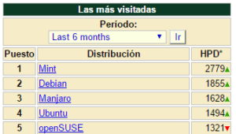

Cuando me enteré que Canonical abandona el desarrollo del escritorio Unity, la convergencia y Ubuntu Phone quede sorprendido, pero analizándolo fríamente pienso que han tomado la decisión correcta por los siguientes motivos.<!--more-->

## MOTIVOS POR LOS QUE UBUNTU TENIA QUE ABANDONAR UNITY, LA CONVERGENCIA Y UBUNTU PHONE

### Económicamente no es viable

Canonical ha invertido una gran cantidad de recursos en desarrollar la convergencia y Ubuntu for Mobiles. Después de realizar la inversión han visto que pierden y seguirán perdiendo dinero si continúan invirtiendo recursos en estos 2 proyectos. Por lo tanto desde el punto de vista empresarial abandonar la convergencia y Ubuntu para móviles es una decisión correcta.

Cabe recordar que Canonical es una empresa con ánimo de lucro. Por lo tanto, no tiene mucho sentido invertir en proyectos que no dan dinero.

### Canonical no tiene ninguna motivación para seguir desarrollando Unity

A partir del [anunció de Mark Shutleworth](https://insights.ubuntu.com/2017/04/05/growing-ubuntu-for-cloud-and-iot-rather-than-phone-and-convergence/ "Artículo en el fundador de Ubuntu explica su decisión"), Canonical centrará su esfuerzos en el Internet de las cosas y la nube.

Para centrarse en el Internet de las cosas y la nube no hace falta disponer de ningún escritorio propio como Unity. Por lo tanto, es lógico que Ubuntu pase a usar el escritorio de Gnome. Usando el escritorio de Gnome conseguirán los siguientes beneficios:

1. Podrán centrarse en la actividad que realmente les aporta beneficios económicos. Durante los últimos años, Canonical ha querido abarcar demasiados campos y lo único que han conseguido es que sus proyectos nacieran tarde y mal.
2. El entorno de escritorio de su distribución funcionará mejor.
3. Se liberarán de un coste y de un dolor de cabeza.

### Es inútil persistir en una idea equivocada

En Canonical han visto que no es posible desbancar a los gigantes que están en el mercado de la telefonía móvil y la convergencia.

Para competir con gigantes como Apple, Google o Microsoft se requiere de varios factores:

1. El primero de los factores es el dinero. Canonical no tiene el poderío económico para competir contra los gigantes que acabamos de citar.
2. El segundo de los factores es ofrecer un producto, o un sistema operativo, superior al de la competencia. Parecía que un buen camino para diferenciarse y enganchar a la gente era la convergencia y el software libre, pero el concepto de momento no ha calado en los usuarios.

Es posible que las ideas de Marc Shuttleworth no hayan calado por la ineficiencia o falta de recursos de canonical. Toda la implementación de Ubuntu para móviles, la convergencia y Unity 8 ha sido extremadamente lenta. Esto ha originado que el proyecto de canonical pierda gran parte de su credibilidad.

### Su camino actual les alejaba de la comunidad Linux

Mi sensación es que a partir del nacimiento de Unity, todas las decisiones de Canonical estaban enfocadas a separarse del resto de distribuciones Linux. Los motivos de tal afirmación son las siguientes:

1. Han desarrollado un escritorio nuevo que lo único que ha aportado es fragmentación. Para mi el escritorio Unity no es innovador en ningún aspecto.
2. Otro de los aspectos que les ha alejado de la comunidad es Mir. ¿Por qué Ubuntu tiene que crear el servidor gráfico Mir cuando pueden usar Wayland? ¿Es que acaso Mir es un servidor Gráfico innovador y superior a Wayland?
3. Ubuntu para móviles es otro claro ejemplo que en Canonical van a lo suyo sin importarles el resto de actores.
4. En la mayoría de sus apariciones públicas hacen anuncios de proyectos importantes que nunca llegan concretarse. Este tipo de comportamiento lo único que hace es que pierdan credibilidad y popularidad frente al público.

### Su popularidad ha caído en picado desde la implantación de Unity

La popularidad de Ubuntu y Unity han caído en picado durante los últimos años. Tan solo tenéis que consultar servicios como Google Trends o webs como distrowatch para ver lo siguiente:

Si analizamos la evolución de las tendencias de búsqueda en Google del término Ubuntu obtenemos los siguientes resultados:

Analizando el término Unity vemos lo siguiente:

Finalmente, si analizamos los resultados de Distrowatch vemos que en 2011 Ubuntu perdió su trono y nunca más lo ha vuelto a recuperar. Actualmente Ubuntu ocupa la 4ª posición en este ranking de popularidad.

\[caption id="attachment\_8259" align="alignnone" width="300"\] Datos desde noviembre 2016 hasta abril 2017\[/caption\]

Cabe recordar que Ubuntu ocupo la primera posición del ranking de distrowatch entre los años 2005 y 2010. Justo al implantar Unity perdieron la primera posición y nunca más la han vuelto a recuperar.

Por lo tanto podemos afirmar que desde la implantación del escritorio Unity, la popularidad de Ubuntu no ha hecho más que decrecer.

### El rendimiento y la funcionalidad de Unity no es correcta

Unity ha implementado funciones interesantes como por ejemplo:

1. Los menús globales.
2. Mejor aprovechamiento del tamaño de nuestra pantalla.
3. Etc.

No obstante, el rendimiento y funcionalidad del escritorio Unity ha sido más que cuestionable desde sus inicios hasta el día de hoy. Además, lo que se ha visto de Unity 8 tampoco es nada esperanzador. Unity 8 hace años que es la eterna promesa que nunca llega y al final es más que posible que no acabe llegando nunca.

Además, todo el mundo ha podido experimentar que las últimas versiones de Ubuntu venían con versiones poco actualizadas de partes básicas del sistema operativo como por ejemplo el gestor de archivos Nautilus.

Por otro lado, Unity es poco configurable y su artwork no me gusta. El aspecto que presenta Ubuntu después de su instalación es pésimo. Su artwork, sus iconos y otros aspectos del entorno de escritorio están poco cuidados.

## LAS CONSECUENCIAS DE LAS DECISIONES DE CANONICAL

Las consecuencias de la decisión de canonical nadie las sabe. Tan solo podemos especular y en mi caso creo que pasará lo siguiente:

### El futuro de Canonical

Las consecuencias de estas decisiones tienen que ser positivas para Canonical. Las decisiones tomadas sin duda tienen que ayudar a que Canonical obtenga beneficios de su actividad.

### El futuro de Gnome y de Ubuntu

El futuro de Ubuntu como distro está asegurado. Además cuando pasen a adoptar Gnome como escritorio predeterminado es posible que ocurra lo siguiente:

1. Tanto Ubuntu como el escritorio de Gnome ganaran en visibilidad y popularidad.
2. Gnome presumiblemente dispondrá de más recursos y apoyo para desarrollar su escritorio.
3. Las nuevas distribuciones de Ubuntu dispondrán de software más actualizado y sin problemas de dependencias.
4. Es posible que Ubuntu ayude a mejorar la experiencia estándar que ofrece el escritorio Gnome.

Cabe recordar que en el pasado, el binomio Gnome - Ubuntu consiguieron lo siguiente:

1. Que la comunidad asumiera que el escritorio base de Linux era Gnome.
2. Que el público asumiera Ubuntu como la distribución Linux más importante.

### El futuro de Unity 7

Tengo serias dudas sobre el futuro de Unity 7. El principal motivo es que absolutamente ninguna distribución ha adoptado Unity como escritorio predeterminado.

###### Nota: Arch es la única distribución que permite instalar Unity y es posible que su funcionamiento no sea del todo estable.

Unity está construido sobre tecnologías obsoletas, como por ejemplo Compiz, o exclusivas de Canonical.

Por lo tanto, no será fácil que la comunidad pueda y quiera hacerse cargo del desarrollo de Unity. Algunos de los problemas que tendrán que afrontar los desarrolladores que quieran hacerse cargo de Unity 7 serán los siguientes:

1. Unity 7 depende de Compiz. Hasta el momento no hay ninguna intención de [portar Compiz a Wayland](https://www.phoronix.com/scan.php?page=news_item&px=MTI2ODU "Anuncio de que Compiz no será portado a Wayland"), por lo tanto en el momento que X11 quede obsoleto veremos qué pasará con Compiz y con Unity.
2. Unity está basado en Gnome. Esto ocasiona que cada nueva actualización del escritorio Gnome implique una gran cantidad de trabajo de adaptación a los desarrolladores de Unity.

En conclusión, tirar adelante el escritorio Unity 7 requiere de una cantidad de trabajo grande por parte de la comunidad. Además mi impresión es que el fruto de este trabajo será pobre porque hay muchos usuarios de Ubuntu que únicamente usan Unity porque es el escritorio por defecto de Ubuntu.

###### Nota: Este es el triste resultado de querer ir aparte del resto de distribuciones Linux.

### El futuro de Unity 8

Tampoco soy nada optimista respecto el futuro de Unity 8. Aunque que parece que ya existen [forks](https://github.com/ubports/unity8 "Fork de Unity 8") de Unity 8, Unity 8 está diseñado para funcionar con el servidor gráfico Mir.

Esto sin duda es un problema grande para que la comunidad quiera y pueda hacerse cargo de desarrollar este escritorio. Además, tanto AMD como Nvidia no parecen dispuestos a dar soporte al servidor gráfico MIR y esto supondrá una cantidad de trabajo que dudo que la comunidad pueda y quiera asumir.
