A continuación analizaremos y detallaremos como pueden instalar y usar el complemento o extensión VPN de [RusVPN](https://rusvpn.com/es/ "Web de RusVPN") en su navegador. Esta extensión VPN nos permitirá usar un [servicio VPN]() en nuestro navegador de forma extremadamente sencilla.<!--more-->

## ¿PARA QUÉ PODEMOS USAR UN SERVICIO VPN A TRAVÉS DE UNA EXTENSIÓN O COMPLEMENTO DEL NAVEGADOR?

Las extensiones VPN que se instalan en el navegador tienen ventajas e inconvenientes respecto los servicios VPN tradicionales. Algunas de las ventajas y usos de los servicios VPN a través de una extensión en el navegador son las siguientes:

1. Podremos **acceder a servicios restringidos geográficamente** con mayor facilidad. Algunos ejemplos que se me ocurren son acceder a la web de rojadirecta y arenavisión, al servicio de radio online de Pandora, etc.
2. El extensión VPN **solo resolverá las peticiones que se envíen a través del navegador web** en que tenemos instalada la extensión. Esto implica que podremos controlar el tráfico y peticiones que enviamos al servicio VPN. Por lo tanto podemos abrir un navegador para navegar de forma tradicional y otro para navegar a través del servicio VPN.
3. **Funcionan** sin ningún problema **en todos los sistemas operativos**. Existen ocasiones en que los servicios VPN tradicionales no disponen de un cliente para conectarse desde sistemas operativos poco usados como por ejemplo Linux.

El principal inconveniente de este tipo de extensiones es que su grado de anonimato y privacidad es menor que en los VPN tradicionales. Por lo tanto, si tienen que realizar tareas sensibles no les recomiendo usar este tipo de soluciones.

## INSTALAR LA EXTENSIÓN VPN DE RUSVPN

Para instalar la extensión de RusVPN cliquen en el siguiente enlace para acceder a la Chrome Store de Google:

[https://chrome.google.com/webstore/detail/rusvpn-free-vpn-service/hipncndjamdcmphkgngojegjblibadbe](https://chrome.google.com/webstore/detail/rusvpn-free-vpn-service/hipncndjamdcmphkgngojegjblibadbe "URL para instalar la extensión de RusVPN en Chrome")

Una vez dentro de la URL cliquen en el botón Añadir a Chrome.

[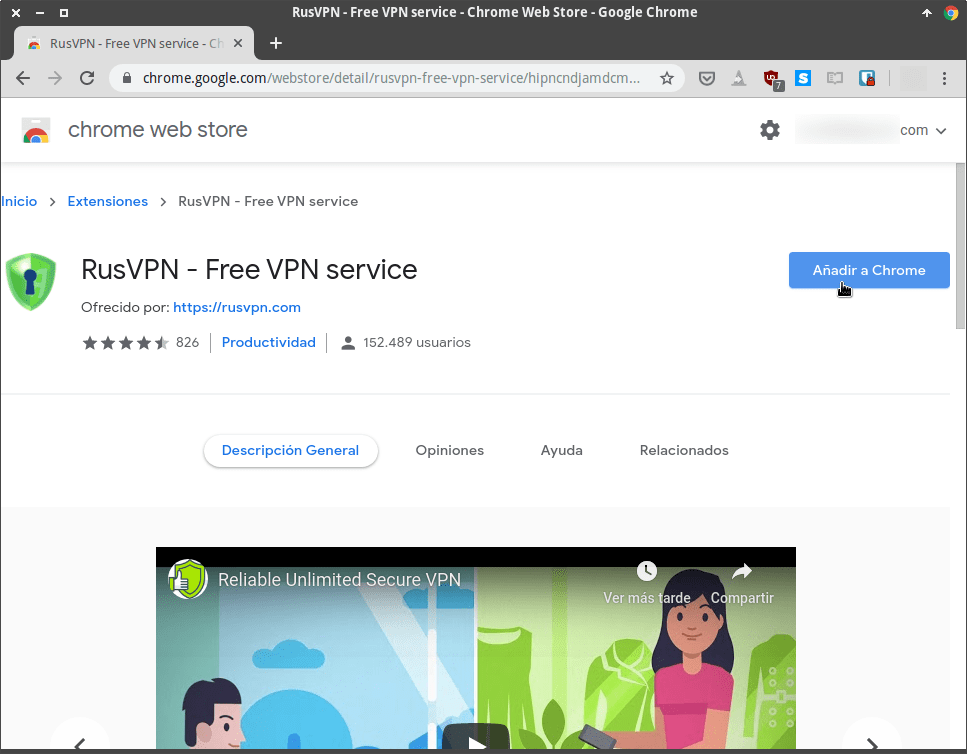](images/acceder-web-instalar-rusvpn.png)

Acto seguido aparecerá una ventana emergente en la que deberemos clicar sobre el botón Añadir Extensión.

[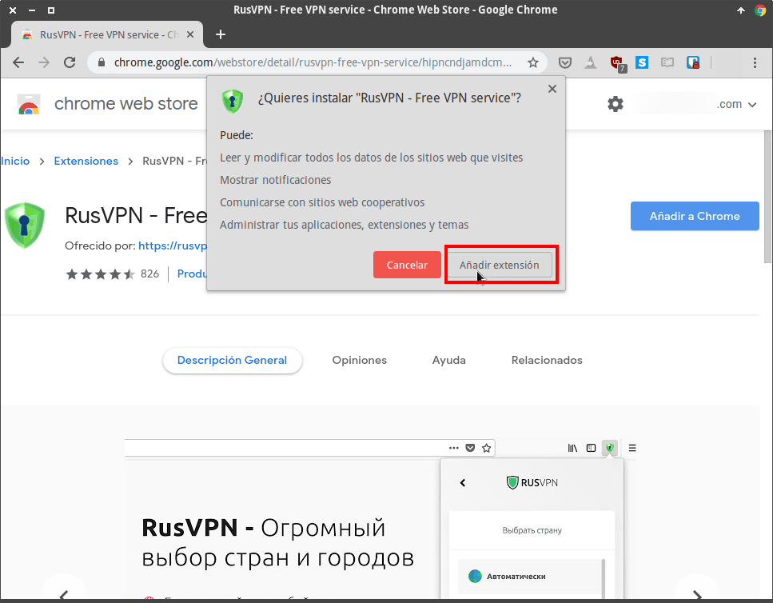](images/instalar-extension-rusvpn.png)

Una vez hayamos clicado tan solo tenemos que esperar unos segundos para que finalice la instalación.

## CONFIGURAR Y USAR LA EXTENSIÓN VPN DE RUSVPN

Una vez finalizada la instalación podemos empezar el proceso para conectarnos al servicio VPN. Para ello clicaremos encima del icono de RusVPN que aparece en el panel de Chrome. Acto seguido clicaremos sobre el botón Select Country.

[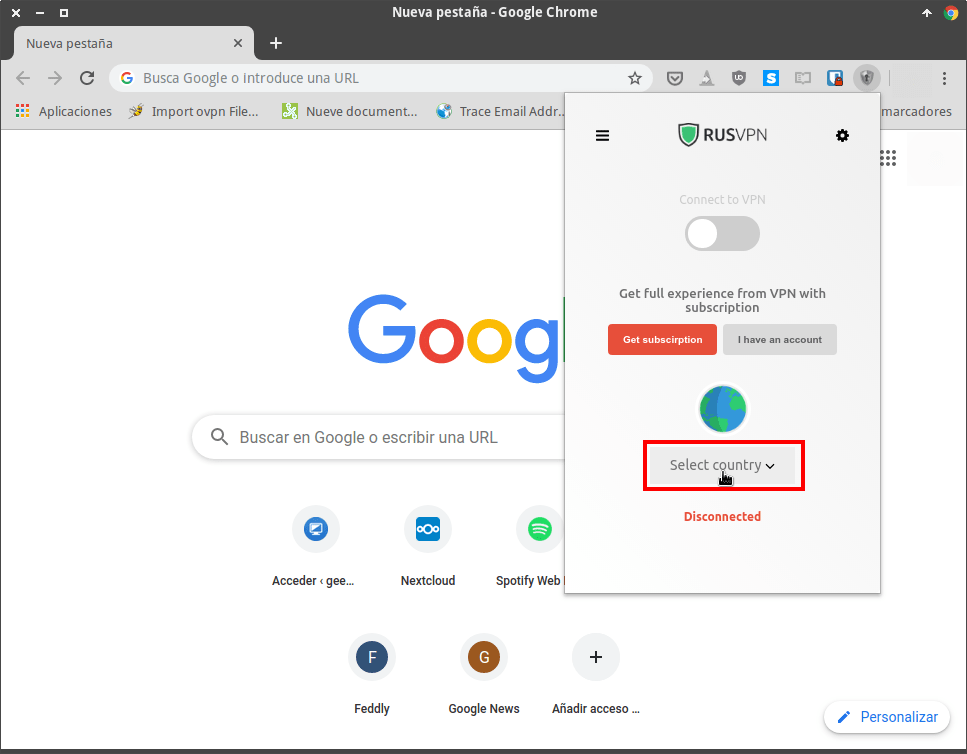](images/seleccionar-servidor-vpn.png)

A continuación tendremos que seleccionar el país al que queremos conectarnos. Con la opción gratuita de RusVPN podemos seleccionar Chequia, Francia, Reino Unido, Canadá y Holanda. En mi caso clico sobre la opción de Holanda.

[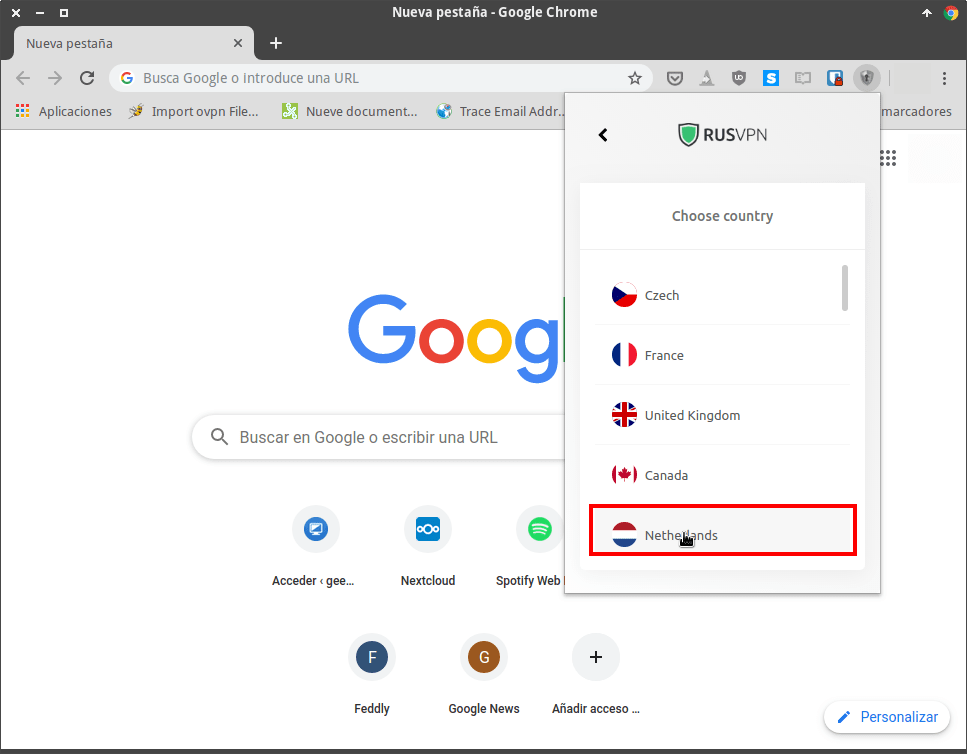](images/seleccionar-pais-servicio-vpn.png)

###### Nota: Cuando más cerca esté el servidor VPN, mayor será la velocidad obtenida. No obstante, cuanto más cerca el grado de anonimato y privacidad será menor.

###### Nota: Si quieren disponer de más países deberán [adquirir una cuenta Premium de RusVPN](https://affiliate.rusvpn.com/click.php?ctag=a574-b299-p "Adquirir una cuenta premium de RusVPN"). Mediante una cuenta premium también podrán usar el servicio en Android, iOS, Windows, MacOS e incluso Linux.

Una vez seleccionado el país se iniciará el proceso de conexión al servidor. En caso que no se realice la conexión cliquen de nuevo sobre el interruptor de conexión de RusVPN.

[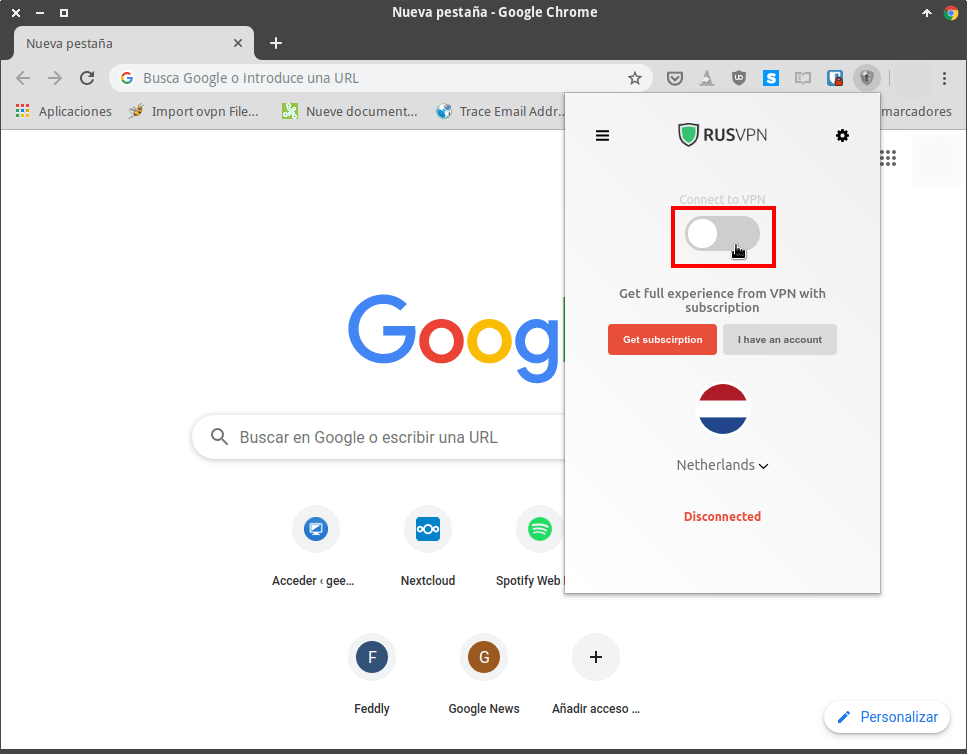](images/conectarse-al-servicio-vpn.png)

Si todo funciona de forma adecuada, en cuestión de segundos estaremos conectados al servidor VPN.

[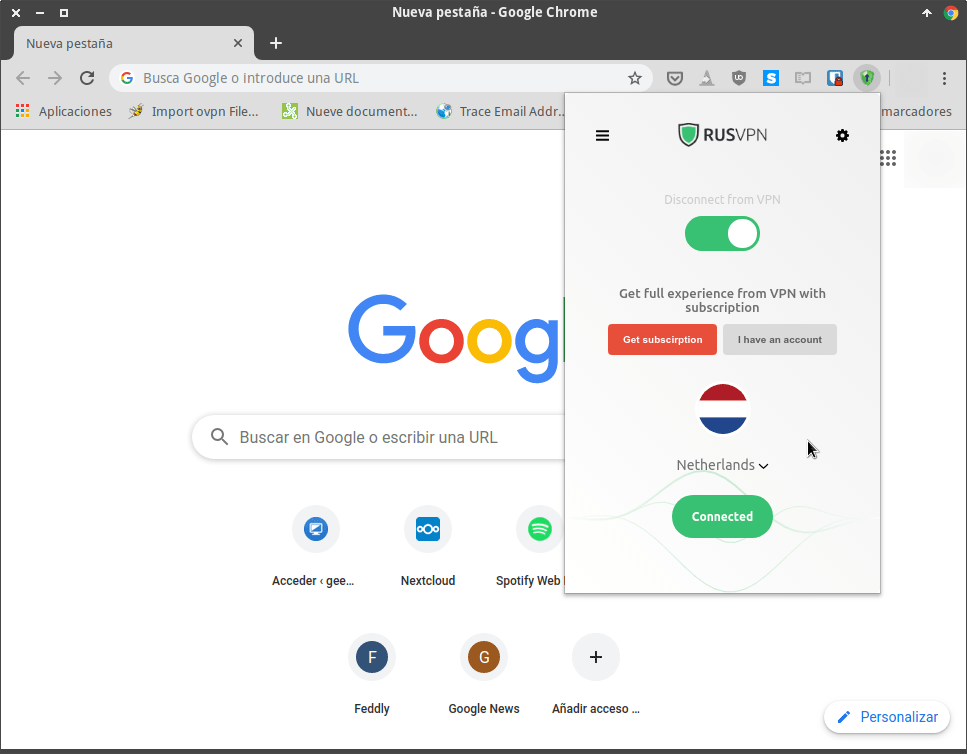](images/conectado-a-rusvpn.png)

Una vez conectados al servidor pasaremos a analizar su rendimiento.

## ANÁLISIS DE RENDIMIENTO OFRECIDO POR LA EXTENSIÓN VPN DE RUSPVN

Para analizar el rendimiento y prestaciones del servicio VPN analizaremos 4 aspectos:

1. La velocidad de conexión.
2. Las fugas de direcciones IP.
3. Las fugas de peticiones DNS.
4. El cifrado ofrecido por el servicio VPN.

### Velocidad de la conexión

En mi caso la velocidad y fluidez que obtengo al navegar es buena. La sensación que tengo es la de no estar conectado a un servicio VPN. Para corroborar esta sensación he realizado 2 test de velocidad obteniendo los siguientes resultados:

[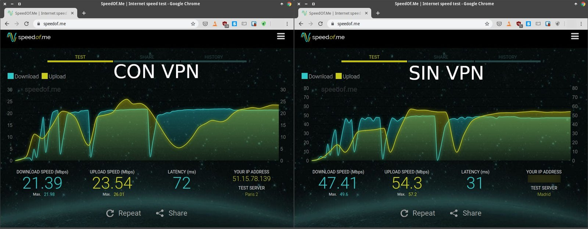](images/velocidad-conexion-servicio-vpn.jpg)

1. **La velocidad de descarga es 2,2 veces más lenta** cuando usamos el servicio VPN. A pesar de esto llegamos a alcanzar velocidades de descarga de 2,6 megas por segundo. Está velocidad es más que aceptable para un servicio VPN gratuito.
2. **La velocidad de carga se reduce 2,3 veces** cuando usamos RusVPN. No obstante, al igual que en el caso anterior obtenemos la no despreciable velocidad de 2,9 Megas por segundo.
3. Finalmente **el ping es 2,3 veces más alto**. No obstante un ping de 72ms con una conexión Wifi no está para nada mal.

Por lo tanto **el rendimiento ofrecido** por este VPN gratuito **es más que aceptable** y nos permitirá visualizar todo tipo de contenido en streaming sin ningún tipo de problema.

### ¿Existen fugas en las peticiones DNS?

Ahora analizaremos el grado de privacidad y anonimato evaluando si existen fugas de direcciones IP y fugas de peticiones DNS. Para ello he usado el servicio web de [DNS leaks](https://www.dnsleaktest.com/ "Análisis de fugas DNS en un servicio VPN"). Justo al entrar en la web muestra que estoy conectándome desde Holanda cuando realmente estoy en España. Por lo tanto a priori **no hay fugas de direcciones de IP**. Para analizar si existen fugas en las peticiones DNS clicaremos encima del botón Extented test.

[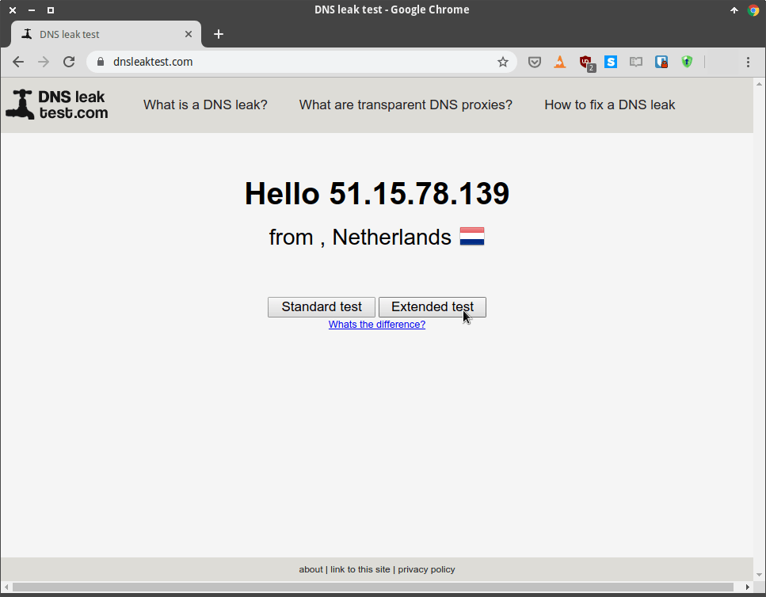](images/ip-servidor-vpn.png)

Después de esperar aproximadamente un minuto veremos que en mi caso aparecen la direcciones IP de los servidores DNS de Google. Los servidores DNS de Google son los que tengo configurado en mi equipo, por lo tanto **el servidor VPN tiene fugas DNS**.

[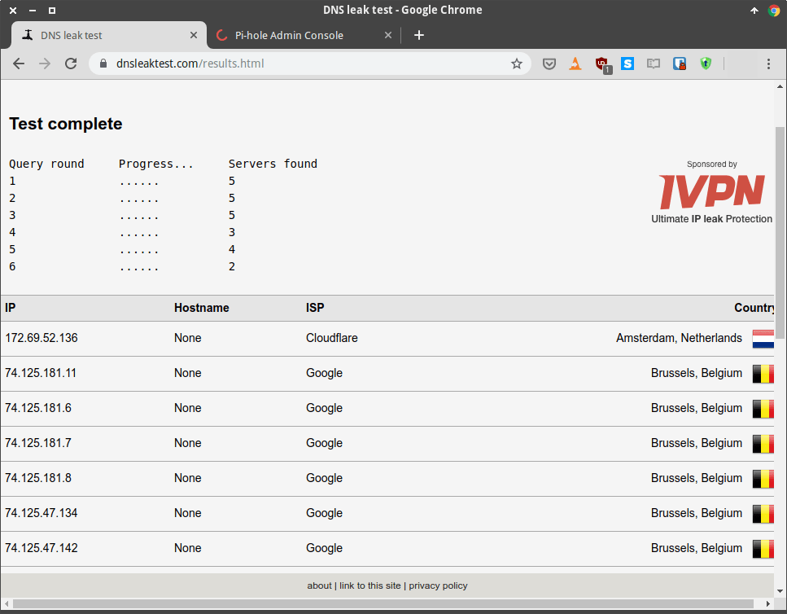](images/analisis-fugas-dns-en-vpn.png)

###### Nota: Idealmente, todas las peticiones DNS deberían ser resueltas por los DNS que tiene el servicio VPN.

Como las peticiones DNS pueden ser resueltas a través de los servidores DNS de Google, Google podrá recopilar información sobre las webs que visito y mis hábitos de navegación.

Frente a esta situación podemos optar por [cifrar la totalidad de peticiones DNS]() que realizamos.

### ¿Existen fugas de IP por parte del estándar WebRTC?

El estándar WebRTC (Web Real-Time Communication) puede revelar nuestra IP a los webmasters de las webs que visitamos o a un atacante. Para analizar si RusVPN nos protege contra este riesgo hemos usado el servicio de [BrowserLeaks](https://browserleaks.com/ "Detección de fugas IP por el estándar WebRTC").

Si observamos la captura de pantalla veremos una bandera Española y nuestra IP. Esto significa que a pesar de estar conectados el servicio VPN, nuestro navegador puede revelar nuestra IP real a los webmasters de las web que visitamos. Por lo tanto **RusVPN tiene fugas debido a WebRTC**.

[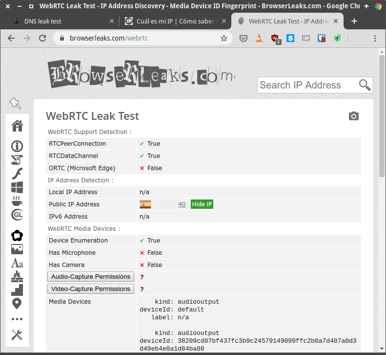](images/fugas-direccion-ip-webrtc.png)

**Frente a este problema podemos optar por deshabilitar WebRTC en nuestro navegador**. No obstante, si desactivan WebRTC tienen que ser conscientes que algunas aplicaciones y/o servicios web, como por ejemplo WhatsApp Web, dejarán de funcionar.

### Cifrado proporcionado por la extensión VPN

**Toda la información entre nuestro ordenador y el servidor VPN estará cifrada mediante el protocolo TLS 1.2**. Lo que acabo de mencionar se puede observar en la siguiente captura de pantalla:

[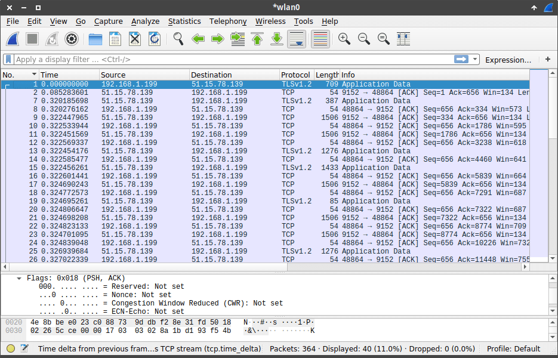](images/trafico-capturado.png)

###### Nota: Los datos de la captura de pantalla se han obtenido capturando los paquetes con Wireshark en el momento de acceder a una página web que aún usa el protocolo http.

Además, si analizamos el contenido de los paquetes capturados veremos que es totalmente ilegible:

[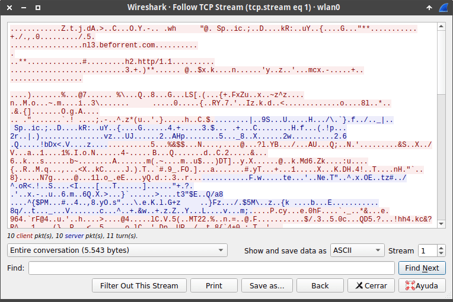](images/paquetes-capturados-con-contenido-cifrado.png)

Por lo tanto, mediante un análisis muy preliminar podemos concluir que a priori RusVPN cifra la totalidad del tráfico de nuestras peticiones web.

### Otros puntos a tener en cuenta (fugas de IPv6)

En el caso que vuestro ISP soporte el protocolo IPv6 tendréis que comprobar que las peticiones IPv6 se dirijan a través del túnel VPN.

Mi ISP o proveedor de internet no soporta IPv6. Además tengo IPv6 deshabilitado en mi sistema operativo. Por lo tanto no puedo sacar ninguna conclusión sobre este punto. Si vuestro caso es contrario al mio pueden visitar el siguiente servicio Web para analizar de forma clara y sencilla su existen fugas cuando se realizan peticiones mediante el protocolo IPv6.

[https://www.astrill.com/ipv6-leak-test](https://www.astrill.com/ipv6-leak-test "Detección de fugas por el protocolo IPv6")

## CONCLUSIONES FINALES DE LAS EXTENSIÓN VPN DE RUSVPN

La extensión VPN analizada funciona de forma correcta:

1. Su **funcionamiento es fluido** y ofrece una velocidad de carga y descarga aceptables.
2. La **conexión es estable**. Durante el tiempo que la he usado no he tenido ningún tipo de corte.
3. Aparentemente la totalidad de las **peticiones** realizadas en el servidor web están **cifradas mediante el protocolo TLS 1.2**.

No obstante, como muchos de los servicios VPN que funcionan a través de extensiones o complementos en el navegador web, **presenta fugas DNS y WebRTC**.

Por lo tanto, usar al extensión web de RusVPN **es una buena opción siempre y cuando no estemos realizando tareas extremadamente sensibles o confidenciales**.
