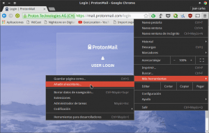
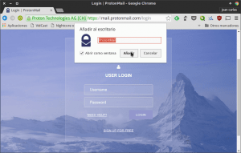
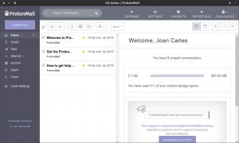
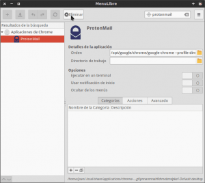

En Linux, y en otros sistemas operativos, es común que nos encontremos con la situación de que no está disponible un cliente de escritorio para un servicio o aplicación web que utilizamos habitualmente. Con el fin de solucionar esta situación detallaré una procedimiento para convertir fácilmente una página web en una aplicación de escritorio o WebApp.<!--more-->

Para conseguir el objetivo que acabo de citar existen varias soluciones, pero bajo mi punto de vista, la mejor opción es usar el navegador Chrome o Chromium por los siguientes motivos:

1. **Chrome y Chromium son navegadores multiplataforma**, por lo tanto la solución que veremos en este post es aplicable en cualquier sistema operativo.
2. **Chrome y Chromium son navegadores web actuales** que reciben actualizaciones de seguridad constantes y utilizan los últimos estándares web. Por lo tanto cuando ejecutemos nuestras aplicaciones de escritorio tendremos la garantía que el funcionamiento y la seguridad serán óptimos.
3. **Facilidad de instalación** ya que no hay que preocuparse de si nuestra distribución dispone de paquetes o repositorios ppa para instalar software alternativos que realizan lo mismo como por ejemplo Ice, etc.
4. Estos 2 navegadores reciben **soporte constante por parte de sus desarrolladores**. Por lo tanto, si la gente utiliza esta característica, no es previsible que acabe desapareciendo como pasa con otras.

Una vez vistas las razones por las cuales pienso que Chromium y Chrome son las mejores veremos los pasos a seguir para transformar una página web en un cliente o una aplicación de escritorio.

## CREAR UNA APLICACIÓN DE ESCRITORIO A PARTIR DE UN SERVICIO O PÁGINA WEB

En estos momento el servicio de correo electrónico **protonmail no dispone de ningún cliente de escritorio y** además **no permite integrarse en clientes de correo electrónico de terceros** como por ejemplo Outlook o Thunderbird. **Para solucionar este problema crearemos una aplicación de escritorio** de forma muy sencilla a partir de la página web de protonmail. De este modo evitaremos tener que abrir el navegador cada vez que queremos consultar nuestro correo y además mientras usemos Protonmail tendremos la sensación de que estamos usando un cliente de escritorio.

El primer paso a realizar es **acceder a la web de Protonmail con el navegador Chromium o el navegador Google Chrome. Una vez dentro de la web**, tal y como se puede ver en la captura de pantalla, **accedemos al menú de configuración de Chrome y dentro del apartado Más herramientas clicamos encima de la opción Añadir al escritorio...**

[](images/Añadir-al-escritorio.png)

Seguidamente aparecerá la siguiente pantalla en la que deberemos **poner nombre a nuestra aplicación** de escritorio, **tildar la opción Abrir como ventana y finalmente clicar encima del botón Añadir.**

[](images/Dar-nombre-a-nuestra-aplicación-de-escritorio.png)

**Después de seguir estos pasos tan simples el proceso ha finalizado**. En estos momentos, tal y como se puede ver en la siguiente captura de pantalla, si nos vamos a nuestro escritorio veremos que existe un Icono con la aplicación protonmail, y además si miramos en el menú de aplicaciones de nuestra distribución veremos que también aparece la aplicación de escritorio que acabamos de crear.

[](images/Aplicación-web-integrada-en-el-escritorio.png)

Por lo tanto **en estos momentos podemos afirmar que hemos creado un cliente de escritorio de Protonmail y además** podemos afirmar que **está perfectamente integrado en nuestro escritorio.**

###### Nota: Los clientes de escritorio creados no son equivalentes a los clientes de escritorio oficiales. Los clientes de escritorio creados tendrán las mismas funcionalidades que las versiones web a partir de las cuales son creados.

###### Nota: En XFCE la aplicación de escritorio se integra perfectamente en el menú de nuestra distribución. En el caso que no lo haga lo tendremos que realizar nosotros manualmente.

## MUESTRA DEL FUNCIONAMIENTO DE LA APLICACIÓN DE ESCRITORIO

Para abrir y usar la aplicación tan solo tenemos que **hacer doble clic encima de la aplicación de escritorio que acabamos de crear**. Después de ello, tal y como se puede ver en la captura de pantalla, podemos usar el correo Protonmail como si se tratara de una aplicación de escritorio.

[](images/Usando-protonmail-como-una-aplicación-de-escritorio.png)

###### Nota: Si observamos la captura de pantalla vemos que no hay rastro de la barra de direcciones ni de las decoraciones y opciones que ofrece un navegador Web. Gracias a esto la sensación que tenemos es equivalente a la de usar un cliente de escritorio de toda la vida.

## SITUACIONES EN LAS UTILIZO ESTE RECURSO Y BENEFICIOS OBTENIDOS

Existen **muchas empresas y servicios que no ofrecen aplicaciones de escritorio para Linux**. **En estos casos acostumbro a usar esta solución para disponer de mi propia aplicación de escritorio**. Ejemplos de lo que acabo de comentar son los siguientes:

1. Google Keep
2. Pocket
3. GNU Social (Dispone de cliente pero no lo quiero instalar)
4. Evernote
5. Protonmail
6. Spotify
7. Feedly
8. Wunderlist
9. Tune in Radio
10. etc

Además en el momento que estoy usando las aplicaciones creadas **obtengo los siguientes beneficios**:

1. **Mejor aprovechamiento de la pantalla** ya que ejecutando la aplicaciones de escritorio no están presentes las decoraciones del navegador y la barra de direcciones.
2. La **interfaz visual es mucho más limpia** que si lo ejecutaremos en un navegador web. De este modo conseguimos eliminar elementos que nos pueden distraer como por ejemplo las opciones de configuración de nuestro navegador, las extensiones que tenemos instaladas, etc.
3. **Disponer de un sistema operativo más ligero** ya que usando las aplicaciones de escritorio creadas con Chrome o Chromium no estamos instalando paquetes en nuestro sistema operativo.
4. **Aseguramos que no se consuman recursos innecesariamente** ya que muchos clientes de escritorio que instalamos ejecutan tareas en segundo plano sin nuestro conocimiento que consumen recursos.

## ELIMINAR LAS APLICACIONES DE ESCRITORIO CREADAS

Para eliminar las aplicaciones de escritorio creadas tan solo tenemos que **eliminar el acceso directo que se ha creado en el escritorio y eliminar la entrada que se ha creado en los menús de nuestra distribución.**

La primera acción es muy sencilla y por lo tanto no precisa de explicaciones adicionales.

La segunda acción dependerá del entorno de escritorio que usen. En el caso de disponer de XFCE tan solo tienen hay **abrir una terminal y teclear el siguiente comando:**

> ```
> menulibre
> ```

Seguidamente se abrirá una ventana en la que podremos organizar y seleccionar de forma gráfica los elementos que queremos que aparezcan en el menú de XFCE. En esta ventana, tal y como se puede ver en la captura de pantalla, **realizaremos una búsqueda con el nombre de la aplicación que queremos eliminar. Una vez encontrada la seleccionamos y presionamos el botón Eliminar.**

[](images/Eliminar-la-aplicación-de-escritorio-creada.png)

###### Nota: En el caso de usar un entorno de escritorio diferente a XFCE deberán buscar como editar los elementos que aparecen en su menú.

## ALTERNATIVAS A CHROME Y A CHROMIUM

La verdad es que **existen pocas alternativas** para convertir páginas web en aplicaciones de escritorio. Además los navegadores Chrome y Chromium son los únicos navegadores Web conocidos que implementan esta característica.

###### Nota: En el pasado Firefox disponía de la extensión Prism para transformar páginas web en aplicaciones de escritorio, pero por motivos que desconozco dejo de desarrollarse y en estos momentos la extensión ya no funciona.

Las alternativas reales disponibles para los distintos sistemas operativos de escritorio existentes en la actualidad son las siguientes:

### GNU-Linux

En Linux **hay alternativas, pero presentan el problema que son difíciles de instalar** **o han sido** aparentemente **abandonadas** **por sus desarrolladores.**

**Todo esto hace que a día la única alternativa** existente a Chrome y a  Chromium **sea el software Ice**. Ice es un software creado y mantenido por los desarrolladores de la distribución Peppermint y su principal función es la de crear aplicaciones de escritorio a partir de páginas Web. En el siguiente video pueden ver una muestra de su funcionamiento:

https://www.youtube.com/watch?v=yEWyXo4lr-A

Si quieren probar ICE pueden intentar descargar e instalar los paquetes binarios de la siguiente ubicacion:

[Descarga del binario de Ice](https://launchpad.net/~peppermintos/+archive/ubuntu/p6-release/+packages "URL para descargar el archivo binario de Ice correspondiente a Peppermint 6")

###### Nota: Para  que Ice funcione deberemos instalar la totalidad de dependencias necesarias y también deberemos tener instalado Chrome o Chromium en nuestro ordenador. Si realizan los pasos adecuadamente deberían poder instalarlo y usarlo sin problemas aunque usen una distro diferente a Peppermint.

###### Nota: En el pasado existían alternativas como Fogger o Webby, pero desafortunadamente parece que en ambos casos  los desarrolladores de estos programas han decidido abandonarlos.

### MacOS X

En MacOS X disponemos de varias alternativas. La más conocida es instalar y usar el software **Fluid**. Fluid **lo podemos descargar sin problema a partir de este** [link](http://fluidapp.com/ "Web para descargar el software Fluid") perteneciente a la página web de sus desarrolladores. **Para usar Fluid tan solo tienen que seguir los pasos que se muestran en el siguiente vídeo**:

https://vimeo.com/22820843

### Windows

**En Windows, aunque parezca mentira, no existen o no he sabido encontrar opciones alternativas** a Google Chrome o Chromium. Así que si alguien conoce alguna opción que sea fácil de aplicar para los usuarios que la deje en los comentarios del post.

###### Nota: En el caso que estén usando otra alternativa diferente a las citadas en este post lo pueden compartir sin problema en los comentarios de este post.
