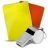

Me he decidido a escribir este post sobre Chromecast para detallar la totalidad de aplicaciones que utilizo con el dispositivo Chromecast. Espero que el artículo sea un éxito y sirva para que gente que tenga el Chromecast le pueda sacar el máximo partido, y también para que la gente que esté indecisa decida si va a comprárselo. Al mismo tiempo también espero que este artículo sirva para que los usuarios que lean este post puedan recomendarme las aplicaciones que usan ellos para sacar el máximo partido a este dispositivo.<!--more-->

###### Nota: En este artículo únicamente detallo las aplicaciones que uso y considero que para mi tienen alguna utilidad. Se que existen muchas otras aplicaciones para leer noticias, tener disponible el timeline de Twitter en la tele, usar nuestro teléfono como un micro, etc. En todo momento intentaré evitar que este artículo sea similar a los miles de artículos presentes en Internet y que según mi punto de vista parecen fotocopiados el uno del otro porqué todos se limitan a contar lo mismo.

###### Nota: La totalidad de aplicaciones que menciono intento que sean gratuitas. En el caso de no ser gratuitas lo advertiré en la descripción de la aplicación.

## APLICACIONES IMPRESCINDIBLES EN CHROMECAST (ANDROID E IOS)

### Apps para escuchar música, radio en Streaming

**[Google Music](https://music.google.com "Web de Google Music") (Android e iOS):** **Aplicación** y servicio archiconocido de Google **que utilizo para escuchar la música que quiero usando los altavoces de mi televisor**. Tan solo **tenemos que hacernos una cuenta de Google Music y de forma gratuita Google nos permitirá subir 20.000 canciones en su nube**. **Una vez subidas** las canciones y álbumes a la nube, tan solo tenemos que instalar la aplicación de Google Music a nuestro teléfono, tablet u ordenador para de este modo poder escuchar las canciones que tenemos almacenadas en la nube de Google. Las canciones se escucharan a través de nuestro teléfono, ordenador o tablet, pero en el caso de tener un Chromecast también lo **podremos escuchar nuestra música a través de un televisor**. Quien quiera usar Google Music en google Chrome deberá instalar la siguiente [extensión](https://chrome.google.com/webstore/detail/google-play-music/icppfcnhkcmnfdhfhphakoifcfokfdhg?hl=es "Link de instalación de Google Music para Chrome") para Google Chrome. Si queréis usar Google Music en Android deberéis instalar la siguiente [aplicación](https://play.google.com/store/apps/details?id=com.google.android.music&hl=es "Instalación de Google Music para Android") y finalmente lo usuarios de iOS deberán instalar esta [aplicación](https://itunes.apple.com/es/app/google-play-music/id691797987?mt=8 "Link de instalación de Google Music para iOS").

**[Deezer](https://www.deezer.com/ "Web de Deezer") (Android e iOS):** Empecé a usar Deezer porqué spotify no da soporte para chromecast y además no conocía la solución de Spoticast. Este servicio no tiene nada que envidiar a Spotify. Por lo tanto quien quiera probarlo adelante ya que dispone de compatibilidad con Chromecast de serie sin tener que realizar ningún tipo de invento ni de cosa rara. Sin duda **Deezer no tiene absolutamente nada que envidiar a Spotify**. Quien quiera usar Deezer en Android lo puede instalar clicando encima de este [link](https://play.google.com/store/apps/details?id=deezer.android.app&hl=es "Instalar Deezer en Android"). Quien quiera usarlo en iOS deberá acceder a este [link](https://itunes.apple.com/es/app/deezer-music/id292738169?mt=8 "Instalación de Deezer en iOS") para poder instalarlo.

**[Spoticast](https://plus.google.com/104963955277459800660/posts "Cuenta de Google + de Spoticast") (Android):** **La aplicación oficial de Spotify no está habilitada para transmitir sus canciones al dispositivo Chromecast** porqué los responsables de Spotify han decido que su aplicación no sea compatible con Chromecast. **Si queréis saltaros esta restricción tan solo tenéis que instalar la aplicación Spoticast**. La aplicación Spoticast la pueden descargar del Google Play Market a través de este [enlace](https://play.google.com/store/apps/details?id=com.nop.spoticast&hl=es "Link de Descarga de Spoticast"). Esta aplicación a veces se retira del google play, en el caso que no la encontréis **podéis descargar el archivo apk sin ningún tipo de problema a través de este** [enlace](https://plus.google.com/104963955277459800660/posts "Link de descarga de Spoticast"). Una vez instalado ejecutan la aplicación spoticast e introducen su nombre de usuario y contraseña de Spotify. Seguidamente abren la aplicación oficial de Spotify. Inician la reproducción de las canciones que quieren escuchar y el contenido musical de spotify se repoducirá en vuestro televisor a través del Chromecast sin ningún tipo de problema. Si no queréis realizar tanta historia siempre podéis utilizar otros servicios a Spotify como por ejemplo Google Music, Deezer, Grooveshark, etc.

**[Gmobile](http://www.scilor.com/ "Web del desarrollador de Gmobile") (Android):** **Aplicación similar a Deezer y a Spotify que uso para escuchar música proveniente de Grooveshark en mi televisor**. Quien quiera probar esta aplicación para Android la puede obtener de forma gratuita en la [Amazon App Store](http://www.amazon.es/Pontus-Holmberg-GMobile/dp/B00LQ9NK5Q "Link de descarga de la aplicación Gmobile") o directamente de la web de su desarrollador. Con esta aplicación podremos escuchar la totalidad de listas que tenemos almacenadas en Grooveshark y tendremos acceso total al contenido que ofrece Grooveshark.

**[Tune in Radio](http://tunein.com/ "Web de Tune in Radio") (Android e iOS)**: **Aplicación gratuita que utilizo para escuchar la radio a través de mi televisor**. Con Tune in Radio **puedo escuchar sin ningún tipo de problema más de 100.000 estaciones de radio, y más de 4000 podcast en televisor a través del dispositivo Chromecast**. Quien quiera está aplicación en Android la puede instalar a través del siguiente [link](https://play.google.com/store/apps/details?id=tunein.player&hl=es "Link de descarga de Tune in Radio para Android"). Quien la quiera instalar en iOS puede utilizar el siguiente [Link](https://itunes.apple.com/es/app/tunein-radio/id418987775?mt=8 "Link de descarga de Tune in Radio para iOS"). Los links de instalación que acabo de dejar corresponden a la versión gratuita del programa. Si quieren pueden instalar la versión Pro. La principal diferencia entre la versión Gratuita y la Pro es que la Pro no tiene banners de publicidad y nos permite grabar los programas de radio.

### Apps para escuchar Podcast

**[Beyonpod](http://www.beyondpod.mobi/android/ "Web de los desarrolladores de Beyondpod") (Android):** Beyonpod es un gestor de Podcast de pago. Normalmente acostumbro a escuchar la totalidad de mis podcast cuando conduzco o hago deporte. Pero **cuando estoy en casa a veces utilizo Beyonpod para enviar los podcast al Chromecast y de esta forma escucharlos usando los altavoces del televisor de forma cómoda, con una calidad de audio excelente y sin la necesidad de usar ningunos auriculares**. Aparte de Beyonpod existen otras aplicaciones alternativas que hacen exactamente lo mismo como por ejemplo [PocketCast](https://play.google.com/store/apps/details?id=au.com.shiftyjelly.pocketcasts&hl=es "Link de descarga de PocketCast para Android") (Android e iOS) y [Downcast](https://itunes.apple.com/es/app/downcast/id393858566?mt=8 "Link de descarga de Downcast para iOS") (iOS). También existe la posibilidad de escuchar los podcast con unos altavoces cualquiera que tengan conector minijack sin necesidad de disponer de un televisor, pero para ello necesitaremos disponer de un adaptador de HDMI a VGA y audio. Quien quiera instalar Beyond lo puede hacer usando el siguiente [link](https://play.google.com/store/apps/details?id=mobi.beyondpod&hl=es "Link de descarga de Beyondpod").

### Apps para ver series y películas

**[SeriesDroid S](http://lowlevel-studios.com/ "Web Desarrolladores de la App") (Android):** Es la aplicación que uso más y me sirve **para ver las series de televisión que más me interesan en Streaming y por mi televisor**. Si alguien se decide a instalar la aplicación quedará simplemente sorprendido por el extenso catálogo de series que se ofrecen. Da igual que la serie sea vieja o nueva. En SeriesDroid seguro que estará allí y la podremos ver en streaming con una calidad de imagen y sonido excelente. Sin duda **esta aplicación es un reemplazo excelente de Netflix**. Quien quiera instalar esta aplicación puede hacerlo a través de Aptoide usando el siguiente [enlace](http://m.ioob.store.aptoide.com/app/market/com.ioob.seriesdroid/53/8364234/SeriesDroid%20S%20\(Series%20Online\) "Link de descarga de Series Droid S"), o si lo prefieren lo pueden hacer a través de la [web de los desarrolladores](http://store.ioob.pw/ "Link alternativo de Descarga de Series Droid S") de esta App.

**[PelisDroid S](http://lowlevel-studios.com/ "Web de los desarrolladores de la App") (Android):** Aplicación desarrollada por los mismos creadores de SeriesDroid. A diferencia de la aplicación anterior, **en esta aplicación** únicamente **encontraremos películas que podremos visionar perfectamente en nuestro televisor**. Para poneros un ejemplo hoy veré la película Al filo del mañana estrenada el día 30 de Mayo de 2014. Por lo tanto sin ninguna duda en esta aplicación aparecen tanto películas recientes como películas viejas. Esta aplicación se ha retirado de la tienda Google play. Quien quiera instalar esta aplicación la única opción que tiene es instalarla a través de la [web de los desarrolladores](http://store.ioob.pw/ "Link de Descarga de Pelis Droid S"), o a través de la tienda de Apps Aptoide usando el siguiente [enlace](http://m.ioob.store.aptoide.com/app/market/com.ioob.pelisdroid/45/8248142/PelisDroid%20S%20\(Pel%C3%ADculas%20Online\) "Link de descarga alternativo de la App Pelis Droid S").

**[Vidownload](http://lowlevel-studios.com/ "Web de los desarrolladores de la App") (Android): Después de la entrada en vigor de la nueva ley de propiedad intelectual (LPI)** y después del cierre de apps como Let's Luk y otras, **Vidownload es una muy buena opción para visualizar series y películas con nuestro Chromecast**. **Para ver como poder instalar y usar Web Video Caster para poder visualizar series y películas con nuestro Chromecast tan solo tienen que consultar el siguiente** [enlace]().

****

**[Web Video Caster](http://www.instantbits.com/apps/webvideo/index.jsp "Página Web de Web Video Caster") (Android):** **Después de la entrada en vigor de la nueva ley de propiedad intelectual (LPI)** y después del cierre de apps como Let's Luk y otras, **Web Video Caster a pasado a ser una de las mejores apps para visualizar series y películas con nuestro Chromecast**. Para ver como poder instalar y usar Web Video Caster para poder visualizar series y películas con nuestro Chromecast tan solo tienen que consultar el siguiente [enlace]().

**[Tvsofa2](http://www.theclashsoft.com/ "Web desarrolladores de TVsofa2") (iOS):** Aplicación de pago que sustituye a la mítica aplicación Tvsofa, y que **nos servirá para ver multitud de películas y series en nuestro dispositivo móvil con iOS**. Esta aplicación de por si no es compatible con Chromecast, pero **gracias a la aplicación Video Web Downloader podremos visualizar la totalidad de contenido de Tvsofa2 en nuestro televisor**. Quien quiera instalar TVsofa2 en su dispositivo iOS puede usar el siguiente [enlace.](https://itunes.apple.com/es/app/tvsofa-2-gestiona-series-y/id955245682?mt=8 "Link de descarga de TVsofa2") La nueva aplicación es similar a la antigua, pero en vez de alimentarse de links de series.ly, lo hará de otras fuentes como por ejemplo pordede.com, etc.

**[Video Web Downloader](http://www.theclashsoft.com/ "Web desarrolladores de Video Web Downloader") (iOS):** **Después de la entrada en vigor de la nueva ley de propiedad intelectual (LPI)** y después del cierre de apps como TVsofa, **Video Web Downloader a pasado a ser una de las mejores apps para visualizar series y películas con nuestro Chromecast en iOS**. Esta aplicación también es **sumamente útil combinada con otras aplicaciones como por ejemplo TVsofa2 ya que Video Web Downloader nos permitirá reproducir los vídeos de TVsofa2 en nuestra Apple TV o Chromecast**. Para ver como poder instalar y usar Video Web Downloader para poder visualizar series y películas con nuestro Chromecast tan solo tienen que consultar el siguiente [enlace]().

**[Popcorntime](http://www.time4popcorn.eu/ "Web del desarrollador de Popcorntime") for Android (Android):** Aplicación 100 % compatible con Chromecast **para poder visualizar infinidad de películas en vuestro televisor**. La totalidad de películas que se incluyen acostumbran a ser en inglés pero la gran mayoría de películas disponen de subtitutulos en Español. Por lo tanto a quien les guste aprender idiomas y ver las películas en versión original disfrutaran mucho esta aplicación. Esta aplicación no se encuentra en el Google Play, por lo tanto quien quiera instalarla lo deberá hacerlo desde el siguiente [link](http://www.techspot.com/downloads/6549-popcorn-time-for-android.html "Link para descargar la aplicación Popcorntime for Android").

**[Vuze Torrent Downloader](http://www.vuze.com/?lang=es_ES "Web de Vuze Torrent Downloader") (Android):** Aplicación gratuita en cierto modo muy similar a Popcorntime for Andoird. **Uso esta aplicación en mi teléfono o tablet para descargar películas vía Torrent**. **Una vez descargadas las películas Vuze Torrent downloader me permite ver los videos** que he descargado siempre y cuando el formato de vídeo del archivo descargado sea compatible con Chromecast. Para descargar e instalar esta aplicación lo podemos utilizar el siguiente [enlace](https://play.google.com/store/apps/details?id=com.vuze.torrent.downloader&hl=es "Link de descarga de Vuze para Android").

### Apps para ver retransmisiones deportivas en directo

**[Libredirecto S](http://lowlevel-studios.com/ "Web de los desarrolladores de la App") (Android):** Aplicación realizada por los mismos desarrolladores que SeriesDroid y PelisDroid. Esta aplicación **es una de las opciones que uso para ver eventos deportivos importantes como partidos de fútbol, partidos de baloncesto, el mundial de motociclismo, torneos como la Ryder Cup, etc**. Esta app permite lanzar los vídeos que visualizamos de nuestro teléfono al televisor. **En el caso que el servicio de streaming no permita lanzar la aplicación al Chromecast siempre podemos hacer mirroring de nuestro teléfono al televisor**. La opción de mirroring únicamente está disponible a usuarios que dispongan de un Nexus 4, Nexus 5, Nexus 10, Nexus 7 de segunda generación, HTC One M7 y M8, LG G2, LG G3, LG G-Pro2, Samsung Galaxy Note 3, Samsung Galaxy Note 4, Samsung Galaxy S4 y Samsung Galaxy S5. Quien quiera instalar esta aplicación lo puede realizar a partir de la [web de los desarrolladores](http://store.ioob.pw/ "Link de descarga de Libredirecto S"), o a partir de la [tienda alternativa](http://m.ioob.store.aptoide.com/app/market/com.ioob.libredirecto/17/8248585/Libre%20Directo%20S%20\(Deportes%20Online\) "Link de descarga Aptoide para Libredirecto S") de Apps Aptoide.

### Apps para visualizar vídeos almacenados en nuestro teléfono, tablet u ordenador

**[Videostream](http://getvideostream.com/ "Web de los desarrolladores de Videostream") (Android, Chrome):** Aplicación que **permite reproducir cualquier archivo de vídeo o audio que tengamos almacenado en nuestro teléfono móvil Android o en nuestro ordenador**. Por lo tanto esta aplicación tiene exactamente el mismo uso que Plex con la ventajas que es gratuita y no necesitamos tener nuestro ordenador abierto con Plex Media server para poder visualizar nuestras archivos de vídeo en nuestro televisor. Quien quiera probar la aplicación para Android la puede encontrar fácilmente en la [Google Play Store](https://play.google.com/store/apps/details?id=com.videostream.Mobile&hl=es "Link de descarga de Videostream para Android"). Quien quiera probar Videostream en el ordenador se puede descargar la extensión de la [Chrome Store](https://chrome.google.com/webstore/detail/videostream-for-google-ch/cnciopoikihiagdjbjpnocolokfelagl?hl=es "Link de descarga de la extensión Videostream para Chrome") sin ningún tipo de problema.

**[Web Video Caster](http://www.instantbits.com/apps/webvideo/index.jsp "Página Web de Web Video Caster") (Android):** Web Video Caster es un **navegador web que utilizo para lanzar prácticamente cualquier vídeo presente en una página web a nuestro televisor**. Además **también utilizo Web Video Caster como reproductor para reproducir la totalidad de contenido de la aplicaciones que no tienen soporte para Chromecast a mi televisor**, ya que es capaz de transmitir todo tipo de contenido en streaming de servidores como StreamCloud, Allmyvideos y otros al dispositivo Chromecast. Quien quiera instalar esta aplicación tan solo tiene que clicar en el siguiente [link](https://play.google.com/store/apps/details?id=com.instantbits.cast.webvideo&hl=es "Link de descarga de Web Video Caster").

**[LocalCast - Media 2 Chromecast](https://plus.google.com/109720416927515295704/posts "Cuenta Google + de Localcast") (Android):** La función que doy a Localcast es **reproducir la totalidad de contenido de vídeo y audio que tengo almacenado en mi teléfono móvil o tablet a mi televisor**. Además **también utilizo esta aplicación para intentar reproducir contenido en streaming proveniente de la aplicaciones que no tienen soporte nativo para Chromecast**. Aparte de las funciones citadas Localcast tiene otras funcionalidades adicionales como por ejemplo reproducir contenido que tenemos almacenado en la nube, reproducir contenido almacenado en un servidor DLNA, etc. Quien quiera instalar esta aplicación tan solo tiene que clicar encima del siguiente [link](https://play.google.com/store/apps/details?id=de.stefanpledl.localcast&hl=es "Link de instalación de Localcast").

**[Ezcast](http://www.iezvu.com/ "Web de Ezcast") (Android e iOS):** Aplicación muy polivalente y que **permite realizar multitud de tareas**. Algunas de las tareas que podemos realizar con Ezcast son **visualizar fotos almacenadas en nuestro teléfono o tablet, reproducir vídeos y archivos de audio almacenados en nuestro teléfono, visualizar archivos de pdf, powerpoint ,etc en nuestro televisor, visualizar el contenido que capta la cámara trasera o delantera de nuestro teléfono al televisor, navegar por Internet a través de nuestro televisor, etc.** Esta aplicación la podemos descargar del [Google Play Store](https://play.google.com/store/apps/details?id=com.actionsmicro.ezcast&hl=es "Link de descarga de Ezcast para Android") o del [Appstore](https://itunes.apple.com/es/app/ezcast/id677053215?mt=8 "Link de descarga de Ezcast para iOS") sin ningún tipo de problema.

**[Plex](https://plex.tv/ "Web de Plex") (Android e iOS):** Poco hay que decir sobre Plex. **Con Plex podremos organizar y visualizar la totalidad de vídeos, películas, fotos y música que tenemos almacenadas en nuestro ordenador en nuestro televisor sin ningún tipo de problema**. Para ello tan solo tenemos que instalar Plex Media Server en nuestro ordenador y el cliente de Plex en nuestro dispositivo Android o iOS. A pesar de que Plex es una opción excelente no la uso. Prefiero usar Videostream ya que la cantidad de vídeos que tengo almacenados son pocos y además los clientes de Android para iOS y para Android son de pago. Quien quiera instalar Plex Media Server en su ordenador puede usar el siguiente [enlace](https://plex.tv/downloads "Link de descarga de Plex Media Server"). Para instalar el cliente de plex en vuestro dispositivo Android podéis usar este [link](https://play.google.com/store/apps/details?id=com.plexapp.android&hl=es "Link para comprar Plex en Android") y para iOS podéis utilizar el siguiente [link](https://itunes.apple.com/es/app/plex/id383457673?mt=8 "Link de instalación de Plex para iOS").

### Apps para poder ver vídeos ubicados en la web

**[Web Video Caster](http://www.instantbits.com/apps/webvideo/index.jsp "Página Web de Web Video Caster") (Android):** Web Video Caster es un **navegador web que utilizo para lanzar prácticamente cualquier vídeo presente en una página web a nuestro televisor**. Además **también utilizo Web Video Caster como reproductor para reproducir la totalidad de contenido de la aplicaciones que no tienen soporte para Chromecast a mi televisor**, ya que es capaz de transmitir todo tipo de contenido en streaming de servidores como StreamCloud, Allmyvideos y otros al dispositivo Chromecast. Quien quiera instalar esta aplicación tan solo tiene que clicar en el siguiente [link](https://play.google.com/store/apps/details?id=com.instantbits.cast.webvideo&hl=es "Link de descarga de Web Video Caster").

**[Video Web Downloader](http://www.theclashsoft.com/ "Web desarrolladores de Video Web Downloader") (iOS):** Aplicación de pago que sirve **para visualizar y descargar series y películas de nuestras webs favoritas**. Esta aplicación también es sumamente útil **combinada con otras aplicaciones como por ejemplo TVsofa ya que Video Web Downloader nos permitirá reproducir los vídeos de TVsofa en nuestra Apple TV o Chromecast**. Quien quiera descargar Video Web Downloader puede usar el siguiente [enlace](https://itunes.apple.com/es/app/video-web-downloader-reproduce/id761514283?mt=8 "Link de descarga de Video Web Downloader").

**[Ezcast](http://www.iezvu.com/ "Web de Ezcast") (Android e iOS):** Aplicación muy polivalente y que **permite realizar multitud de tareas**. Algunas de las tareas que podemos realizar con Ezcast son **visualizar fotos almacenadas en nuestro teléfono o tablet, reproducir vídeos y archivos de audio almacenados en nuestro teléfono, visualizar archivos de pdf, powerpoint ,etc en nuestro televisor, visualizar el contenido que capta la cámara trasera o delantera de nuestro teléfono al televisor, navegar por Internet a través de nuestro televisor, etc.** Esta aplicación la podemos descargar del [Google Play Store](https://play.google.com/store/apps/details?id=com.actionsmicro.ezcast&hl=es "Link de descarga de Ezcast para Android") o del [Appstore](https://itunes.apple.com/es/app/ezcast/id677053215?mt=8 "Link de descarga de Ezcast para iOS") sin ningún tipo de problema.

**Google Chrome (Android):** La verdad es que prácticamente no uso Google Chrome con el Chromecast. **Google Chrome se puede usar para lanzar la totalidad de vídeos que vemos cuando estamos navegando con nuestro teléfono o tablet a nuestro televisor**. A pesar de que esta funcionalidad es útil prefiero realizarla con otra aplicación mencionada en este post que se llama Web Video Caster. Quienes no quieran usar ninguna de estas dos aplicaciones pueden usar el navegador [Firefox para Android](https://play.google.com/store/apps/details?id=org.mozilla.firefox&hl=es "Link de descarga de Firefox para Android") que también permite realizar esta función.

### Apps para visualizar vídeos diversos

**[Youtube](https://www.youtube.com/ "Web de Youtube") (Android e iOS):** Gracias a la aplicación de Youtube, que **podemos** instalar en cualquier teléfono o tablet Android o iOS, y Chromecast puedo **visualizar la totalidad de vídeos disponibles en Youtube en mi televisor**. Utilizo prácticamente a diario esta aplicación para poder ver los vídeos de los canales en que estoy suscrito y también para ver los vídeos que me recomienda Google. Si alguna persona no quiere usar Youtube porqué odia a Google o por cualquier otra razón siempre puede usar aplicaciones como [DailyMotion](https://play.google.com/store/apps/details?id=com.dailymotion.dailymotion&hl=es "Link de Descarga de DailyMotion") o [Vimeo](https://play.google.com/store/apps/details?id=com.hermescavern.vimeo&hl=es "Link de Descarga de Vimeo for Chromecast") que también tienen soporte para Chromecast.

**[Vevo](http://www.vevo.com/ "Web de Vevo") (Android e iOS):** Aplicación disponible para Android e iOS que utilizo **para ver videoclips musicales en mi televisor**. Quien este interesado en probar la esta aplicación la puede descargar de la tienda [Google Play](https://play.google.com/store/apps/details?id=com.vevo&hl=es "Link de instalación de Vevo") o de la [App Store](https://itunes.apple.com/us/app/vevo-watch-music-videos/id385815082?mt=8 "Link de instalación de Vevo para iOS").

**[Twitch](http://es-es.twitch.tv/ "Webd e Twitch") (Android e iOS):** Aplicación indispensable para gamers  y que además es 100% compatible con Chromecast. **Esta aplicación nos servirá para ver partidas de videojuegos en directo en nuestro televisor**. Estas partidas que visualizamos son partidas que están retransmitiendo en directo usuarios de la plataforma Twitch. Quien quiera instalar Twitch en Android puede usar el siguiente [link](https://play.google.com/store/apps/details?id=tv.twitch.android.viewer&hl=es "Instalación de Twitch en Android") mientras quien quiera instalarlo en iOS deberá utilizar este [link](https://itunes.apple.com/es/app/twitch/id460177396?mt=8 "Instalación de Twitch en iOS").

### Apps para visualizar series y cadenas de televisión

**[Atresplayer](http://www.atresmedia.com/ "Web del grupo Atresmedia") (Android e iOS)**: Aplicación gratuita con la que **podremos visualizar en directo o a la carta prácticamente la totalidad contenido que ofrecen los canales de televisión pertenecientes a la plataforma Atresmedia** (Antena 3, la Sexta, Nova y Neox). La aplicación funciona perfectamente pero está plagada de publicidad y te exigen registrarte para poder ver determinados contenidos. Quien quiera descargar esta aplicación para iOS puede utilizar el siguiente [enlace](https://itunes.apple.com/es/app/atresplayer/id694169089?mt=8 "Link de descarga de Atresplayer para iOS"). Quien quiera descargarla y usarla en Android puede usar el siguiente [link](https://play.google.com/store/apps/details?id=com.a3.sgt&hl=es "Link de descarga de atresplayer para Android").

**[Rtve.es](http://www.rtve.es/ "Web Radio televisión Española") (Android e iOS)**: Aplicación gratuita con versión para móvil y para tabler que utilizo para visualizar la totalidad de vídeos almacenados en TVE a la carta. Esta aplicación, al contrario que la aplicación de Atresplayer, no permite visualizar programas en directo vía nuestro dispositivo Chromecast. Quien quiera probar esta aplicación en Android la puede descargar e instalar desde el siguiente [link](https://play.google.com/store/apps/details?id=rtve.tablet.android&hl=es "Link de descarta de Rtve.es para Android"). Quien la quiera descargar e instalar en iOS puede utilizar el siguiente [link](https://itunes.apple.com/es/app/rtve.es-tableta/id481097328?mt=8 "Link de instalación de rtve para iOS").

###### Nota: En iOS no utilizo muy a menudo el Chromecast y pienso que las aplicaciones que existen adaptadas para poder usar Chromecast son pocas si lo comparamos con Android. No obstante las aplicaciones que he citado para iOS seguro que serán de mucha utilidad para todos los usuarios.

## APLICACIONES IMPRESCINDIBLES EN CHROMECAST (GOOGLE CHROME)

**Google Cast (Google Chrome):** Google Cast es la extensión de Google para poder configurar nuestro Chromecast y **para poder enviar contenido de nuestro navegador a nuestro televisor**. Utilizo la extensión Google Cast para transmitir la totalidad de vídeos que veo en mi navegador a mi televisor. **Es la opción que uso para ver eventos deportivos como el fútbol o el mundial de motociclismo**. Podéis instalar la extensión Google Cast del siguiente [enlace](https://chrome.google.com/webstore/detail/google-cast/boadgeojelhgndaghljhdicfkmllpafd?hl=es "Link de instalación de Google Cast"). Por cierto, esta extensión también la podemos usar para mostrar la totalidad de contenido de nuestro ordenador a nuestro televisor.

**[Videostream](http://getvideostream.com/ "Web de los desarrolladores de Videostream") (Google Chrome):** Extensión de Google Chrome que utilizo **para poder reproducir la totalidad de archivos de audio y de vídeo que tengo almacenados en mi ordenador**. Para poder instalar y usar esta extensión en vuestro navegador Google Chrome lo podéis realizar mediante el siguiente [enlace](https://chrome.google.com/webstore/detail/videostream-for-google-ch/cnciopoikihiagdjbjpnocolokfelagl?hl=es "Instalación de Videostream para Chrome").

**[Vidcast](https://dabble.me/cast "Web de Vidcast") (Google Chrome):** Extensión para Google Chrome que uso **para ver los vídeos que me encuentro en la web cuando estoy navegando. Con esta extensión de Google Chrome puedo visualizar en mi televisor vídeos que encuentro en sitios web conocidos como por ejemplo Vimeo, Ted, Dailymotion, etc**. Quien quiera instalar esta extensión en su navegador lo tiene que hacer desde el siguiente [enlace](https://dabble.me/cast "Instalación de la extensión Vidcast").

## INFORMACIÓN ADICIONAL

Quien quiera ver la totalidad de aplicaciones que en este momento son compatibles con Chromecast puede visitar el siguiente enlace:

[https://www.google.es/chrome/devices/chromecast/apps.html#marquee-slide-youtube](https://www.google.es/chrome/devices/chromecast/apps.html#marquee-slide-youtube "Consulta de aplicaciones disponibles para Chromecast")

Si quieren visualizar las aplicaciones disponibles en vuestro dispositivo móvil también tienen la opción de instalar la app Cast Store. Pueden instalar la aplicación Cast Store accediendo al siguiente link:

[https://play.google.com/store/apps/details?id=goko.gcs&hl=es](https://play.google.com/store/apps/details?id=goko.gcs&hl=es "App que contiene la totalidad de aplicaciones disponibles para Chromecast")

De este modo siempre es fácil enterarse de la totalidad de aplicaciones que dan soporte a Chromecast y de las nuevas aplicaciones que dan soporte y que van apareciendo dia a dia

Para finalizar quien aun quiera mas aplicaciones y buenas recomendaciones pueden consultar el siguiente link:

[https://www.reddit.com/r/chromecast/wiki/apps](https://www.reddit.com/r/chromecast/wiki/apps "Link de recomendaciones de Reddit")
