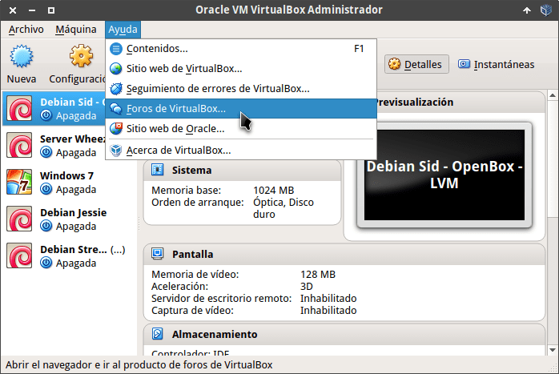
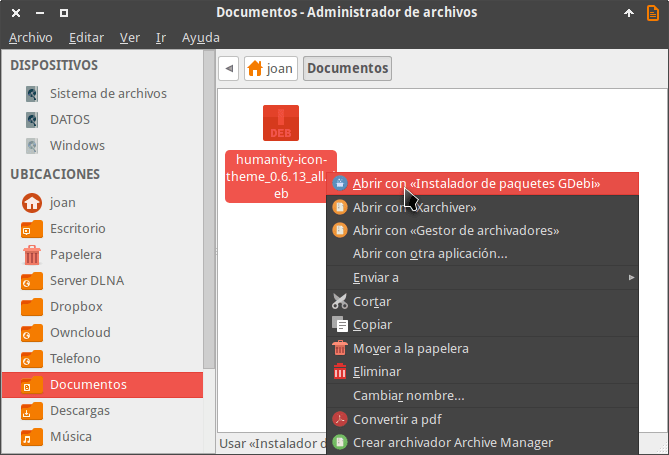
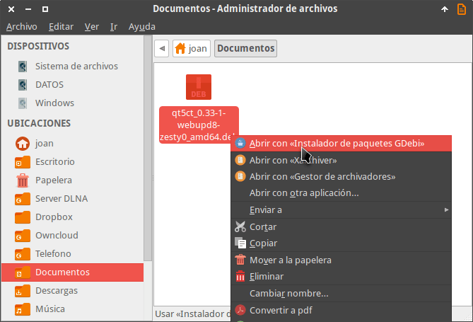
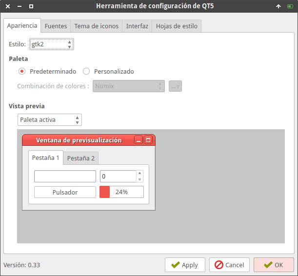
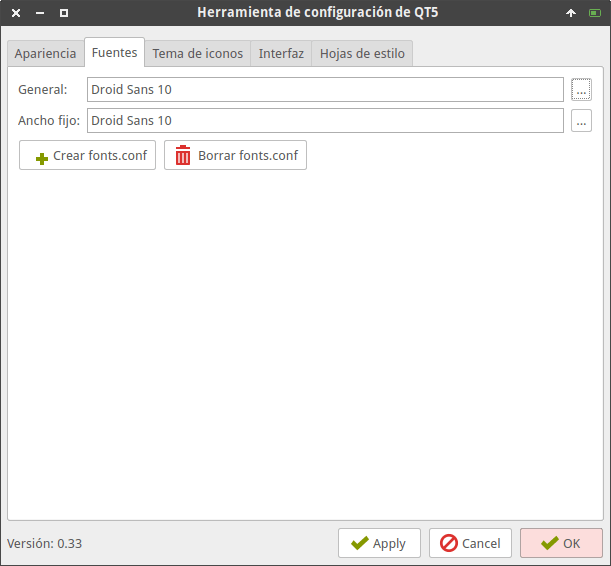
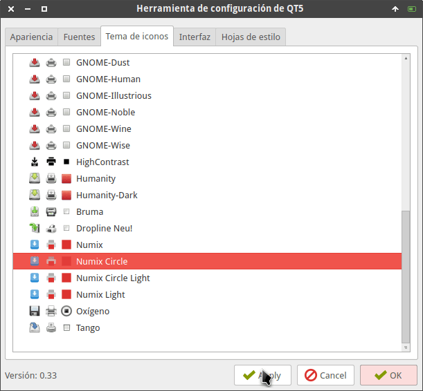
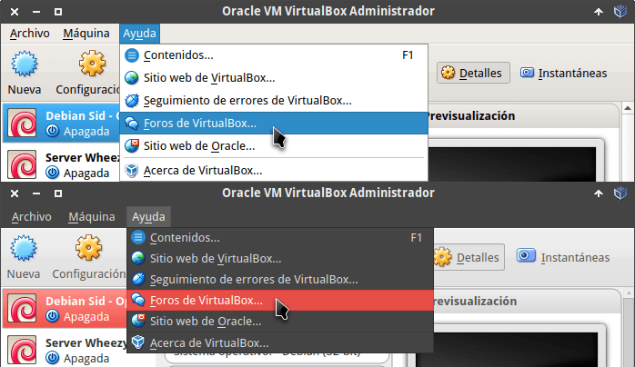
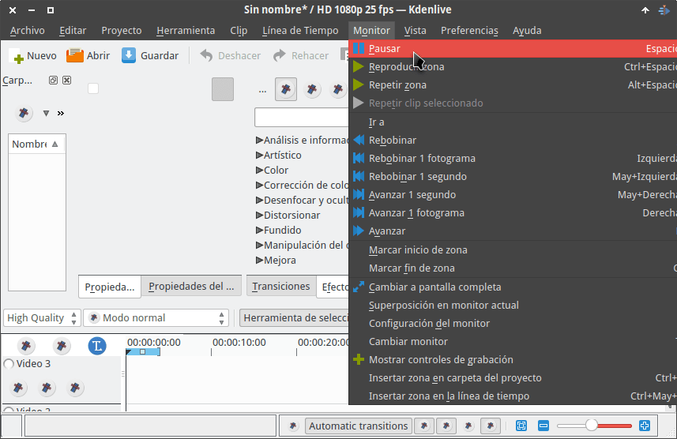

Ya hace mucho que tiempo que en Debian no se visualizan correctamente los programas en QT5. Un claro ejemplode ello es por ejemplo Virtualbox o Kdenlive.<!--more-->

[](images/aplicacion-qt5-no-se-adapta-al-tema-gtk.png)

Como pueden ver en la captura de pantalla, esta aplicación tienes los menús blancos y las selecciones son en color azul. Este estilo no se integra para nada con mi entorno de escritorio porque en mi caso estoy usando el tema Numix.

## INSTALACIÓN DE QT5CT PARA QUE LAS APLICACIONES QT5 SE INTEGREN CON EL TEMA GTK

En los repositorios de Debian no existe ni rasto del paquete qt5ct. Para instalarlo de forma adecuada seguiremos los siguientes pasos.

### Instalación de qt5-style-plugins

Primero instalaremos el paquete qt5-style-plugins ejecutando el siguiente comando en la terminal:

> ```
> sudo apt-get install qt5-style-plugins
> ```

### Instalar humanity-icon-theme

Seguidamente tendremos que instalar el tema de iconos humanity-icon-theme. Este tema de iconos no está disponible en los repositorios de Debian. Por lo tanto pueden usar el siguiente enlace para descargar el tema de iconos [humanity-icon-theme](https://launchpad.net/ubuntu/+archive/primary/+files/humanity-icon-theme_0.6.13_all.deb "Link para descargar humanity-icon-theme").

###### [Fuente de descarga](https://launchpad.net/ubuntu/+source/humanity-icon-theme "Fuente de descarga del tema de iconos")

Una vez descargado lo instalan de forma habitual. En mi caso, tal y como se puede ver en la captura de pantalla, lo instalo usando gdebi.

[](images/instalacion-humanity-icon-theme.png)

### Instalación de qt5ct

Finalmente descargaremos e instalaremos el paquete qt5ct. Como el paquete no está disponible en los repositorios de Debian lo descargaremos usando los siguientes enlaces:

[qt5ct para sistemas de 64 bits (amd64)](https://launchpad.net/~nilarimogard/+archive/ubuntu/webupd8/+files/qt5ct_0.33-1~webupd8~zesty0_amd64.deb "Link de descarga para qt5ct de 64 bits") [qt5ct para sistemas de 32 bits (i386)](https://launchpad.net/~nilarimogard/+archive/ubuntu/webupd8/+files/qt5ct_0.33-1~webupd8~zesty0_i386.deb "Link de descarga para qt5ct de 32 bits")

###### [Fuente de descarga](https://launchpad.net/~nilarimogard/+archive/ubuntu/webupd8/+packages?field.name_filter=qt5ct&field.status_filter=published&field.series_filter= "Fuente de descarga de qt5ct")

En mi caso uso un ordenador cuyo procesador tiene una arquitectura de 64 bits. Por lo tanto, una vez descargado el paquete de 64 bits lo instalo mediante gdebi.

[](images/intalacion-paquete-qt5ct.png)

## DEFINIR LA VARIABLE DE ENTORNO QT\_QTA\_PLATFORMTHEME

Para poder ejecutar la herramienta de configuración qt5ct deberemos definir la variable de entorno QT\_QTA\_PLATFROMTHEME. Para ello ejecutamos el siguiente comando en la terminal:

> ```
> sudo nano /etc/environment
> ```

Una vez se abra el editor de textos definimos la variable de entorno pegando el siguiente código:

> ```
> QT_QPA_PLATFORMTHEME=qt5ct
> ```

Una vez realizados las modificaciones guardamos los cambios y cerramos el fichero.

Después de realizar estos cambios tan solo tenemos que reiniciar el ordenador para finalizar el proceso.

## CONFIGURAR LA HERRAMIENTA DE CONFIGURACIÓN QT5CT

Finalmente solo nos falta cambiar el aspecto de las aplicaciones qt5 mediante el uso de la herramienta de configuración qt5ct.

Para arrancar qt5ct ejecutamos el siguiente comando en la terminal:

> ```
> qt5ct
> ```

Justo después de ejecutarlo se abrirá una ventana para que podamos configurar el aspecto de las aplicaciones qt5. Las modificaciones mínimas que debemos realizar son las que se muestran a continuación.

En la pestaña Apariencia únicamente hay que modificar el campo Estilo. El estilo que hay que seleccionar es el gtk2.

[](images/configurar-apariencia-programas-qt5.png)

Seguidamente clicamos en la pestaña Fuentes. En la pestaña Fuentes tenemos seleccionar el tipo y el tamaño de fuente que tenemos configurado en nuestro sistema operativo. Por lo tanto, en mi caso selecciono la letra Droid Sans con tamaño 10.

[](images/configurar-fuentes-programas-qt5.png)

Finalmente en la pestaña Tema de iconos seleccionaremos el tema de iconos que queremos que se muestre en las aplicaciones QT5. Como en mi caso utilizo el tema de iconos Numix Circle, seleccionaré los iconos Numix Circle y presionaré el botón Apply.

[](images/seleccionar-iconos-para-aplicaciones-qt5.png)

Una vez realizadas estas modificaciones nuestras aplicaciones en qt5 se deberían integrar a la perfección con nuestro tema GTK.

###### Nota: En este post solamente se realiza una configuración mínima. La herramienta qt5ct permite configurar más parámetros de los programas que usan librerías qt5.

## APLICACIONES QT5 INTEGRADAS CON MI TEMA GTK

En la siguiente imagen pueden ver la comparación entre el antes y el después de todo lo realizado en este artículo.

[](images/comparacion-antes-y-despues.png)

Como se puede ver en la imagen, ahora mi virtualbox luce de forma correcta y su tema es el Numix. Por lo tanto ahora todas las aplicaciones que usan qt5 se integran perfectamente con el resto de aplicaciones del sistema operativo. Otro ejemplo de ello es el programa Kdenlive.

[](images/kdenlive-adaptado-al-tema-gtk.png)
