Markdown es un lenguaje de marcado como html, pero con la particularidad que es mucho más sencillo y práctico de usar. Además su curva de aprendizaje es extremadamente sencilla y proporciona ventajas en lo que a productividad se refiere. Por este motivo, a continuación veremos como aprender Markdown de forma rápida y sencilla. En cuestión de minutos todo el mundo debería ser capaz de aprender Markdown.

<!--more-->

###### Nota: Existen diferencias entre editores de Markdown. Por lo tanto es posible que algunos de los editores no acepten alguna/s de las sintaxis mostrada en el artículo.

## APRENDER MARKDOWN: SALTOS DE LÍNEA Y PÁRRAFOS EN MARKDOWN

El primer concepto para aprender Markdown es entender los saltos de línea y párrafo. En nuestro editor de markdown podemos escribir como en un procesador de textos normal y corriente.

**Si empiezo a escribir se genera un párrafo. En el momento que presiono enter** para saltar a la siguiente línea **se producirá un salto de línea**.

**Si** terminamos de escribir un párrafo y **queremos generar un nuevo párrafo tenemos que dejar una línea en blanco**.

En la siguiente captura de pantalla veréis un texto en Markdown y justo al lado su equivalente en código html.

Si analizamos la equivalencia entre el texto Markdown y html veremos claramente lo que acabo de comentar:

[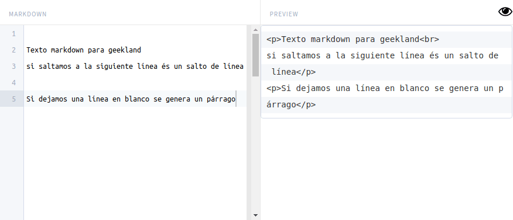](images/saltos-de-linea-y-parrafos-equivalencia-en-markdown.png)

## CREAR ENCABEZADOS O TÍTULOS EN MARKDOWN

Otro punto básico que tenemos que abordar para aprender Markdown son los encabezados. Mediante el carácter almohadilla **#** podemos crear encabezados de forma extremadamente sencilla.

Markdown permite crear títulos o encabezados de nivel uno, dos, tres, cuatro, cinco y seis de forma extremadamente sencilla.

**Para crear un encabezado de nivel 1** escribimos una almohadilla **#** seguido de un **espacio** y el nombre que queremos para el encabezado:

> ```
> # Encabezado nivel 1 geekland
> Párrafo del encabezado 1
> ```

**Si pretendemos crear un encabezado nivel 2** haremos exactamente los mismo, pero en vez de una almohadilla usaremos dos **##**:

> ```
> ## encabezado nivel 2 geekland
> Párrafo del encabezado 2
> ```

Y así de forma sucesiva podremos crear encabezados de nivel 3, 4, 5 y 6.

A continuación podéis ver un ejemplo de lo que acabamos de citar en este apartado:

[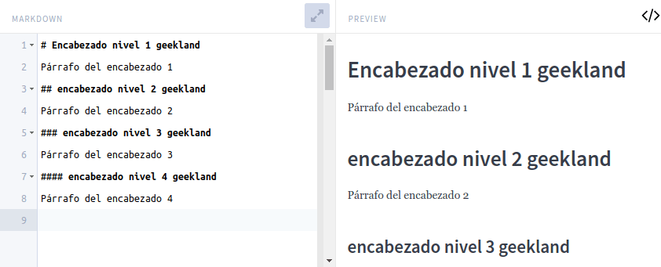](images/encabezados-markdown.png)

Si analizamos la equivalencia entre el código Markdown y html vemos que los encabezados en Markdown contienen id. De esta forma podremos realizar fácilmente un el índice del documento y el texto quedará más estructurado semanticamente.

[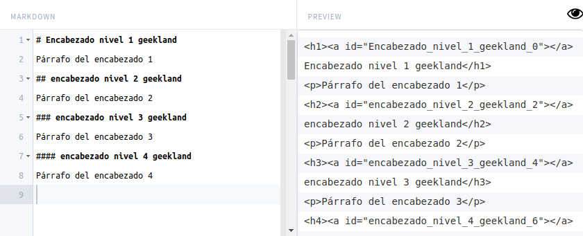](images/encabezados-markdown-equivalencia-html.png)

## INCLUIR CITAS EN NUESTROS TEXTOS

Para incluir una cita tenemos que usar el símbolo **\>** seguido de un **espacio** antes del **texto que queremos citar**. Por lo tanto, si quiero citar un comentario y replicarlo deberíamos usar el siguiente código:

> ```
> > Linux es un sistema operativo que no está a la altura de los demás.
> 
> No estoy de acuerdo
> ```

El código Markdown que acabamos de citar se visualizará del siguiente modo:

[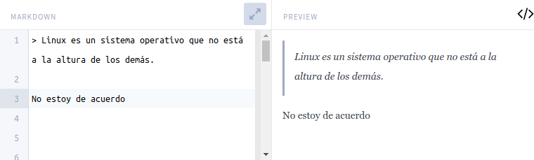](images/citar-texto-en-markdown.png)

## REALIZAR LISTAS EN MARKDOWN

La siguiente temática que abordaremos con el fin de aprender Markdown son las listas. A continuación veremos el procedimiento para crear listar desordenadas, listas ordenas y listas anidadas.

### Listas desordenadas en Markdown

Mediante el símbolo **\*** o **\-** podemos crear listas. Para crear una lista de los días de la semana escribiremos **\*** seguido de un **espacio** más el primer día de la semana.

Acto seguido presionaremos enter y cuando saltemos a la siguiente línea ya podremos escribir el siguiente día de la semana.

Por lo tanto, para realizar una lista de los días de la semana usaremos el siguiente código:

> ```
> * Lunes
> * Martes
> * Miércoles
> 
> - Lunes
> - Martes
> ```

La representación del texto en Markdown que acabamos de escribir es la siguiente:

[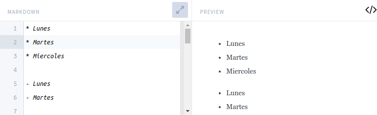](images/listas-desordenadas.png)

### Listas ordenadas o numéricas con Mardown

Para obtener listados ordenados numéricamente tenemos que **escribir un número seguido de un punto y un espacio** antes de comenzar a escribir.

Para escribir un lista numérica de las partes que tiene un día escribiremos lo siguiente:

> ```
> 1. mañana
> 2. tarde
> 3. noche
> ```

El texto que acabamos de escribir se representará de la siguiente forma:

[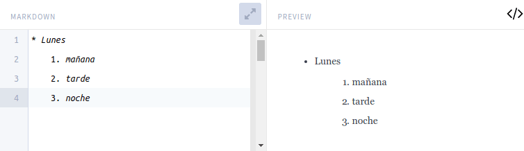](images/listas-numericas-ordenadas.png)

### Anidar listas en Markdown

Para anidar una lista tan solo tenemos que incluir un espacio presionando la tecla **Tab** (Tabulador).

Una ejemplo para que puedan ver lo que acabo de explicar es el siguiente:

> ```
> - Lunes
>      1- mañana
>      2- tarde
>      3- noche
> - Martes
> ```

El código Markdown que acabamos de escribir se representará del siguiente modo:

[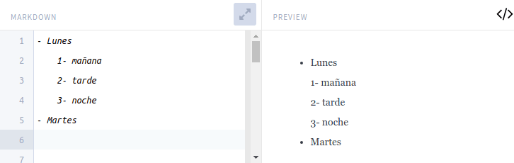](images/listas-anidadas.png)

## INCLUIR SEPARACIONES FÍSICAS ENTRE SECCIONES DE TEXTO

Entre dos secciones de texto podemos incluir una separación física. Para ello tenemos que **escribir 3 guiones bajos seguidos** **\_\_\_**

Un ejemplo de lo que acabo de citar es el siguiente:

> ```
> Aquí termina la explicación del lenguaje Markdown.
> ___
> A continuación iniciamos la explicación del código html.
> ```

El ejemplo mostrado se visualizará del siguiente modo:

[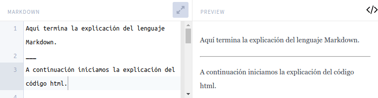](images/separacion-secciones-texto.png)

Para aprender markdown sigan leyendo los siguientes apartados.

## DAR ESTILO AL TEXTO QUE ESCRIBIMOS

Otro de los motivos para aprender Markdown es que permite dar estilo al texto que escribimos de forma extremadamente rápida. Podemos definir que un texto esté en negrita, cursiva o tachado. Para ello tendremos que utilizar el siguiente código:


|   **Formato**   |   **Código a emplear**   |
| --- | --- |
|   Negrita   |   **\*\***palabra**\*\***   |
|   Cursiva   |   **\***palabra**\***   |
|   Tachado   |   **~~**palabra**~~**   |
|   Negrita + Cursiva   |   **\*\*\***palabra**\*\*\***   |
|   Tachado, Negrita y Cursiva   |   **~~\*\***palabra**\*\*~~**   |
|   \+ Resto de combinaciones posibles   |  |

Una muestra o ejemplo de lo que acabo de citar es el siguiente:

[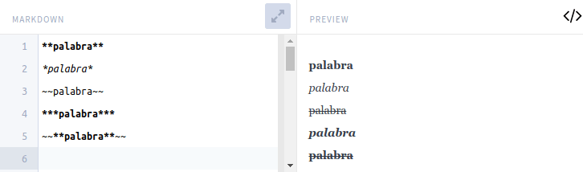](images/estilos-texto-markdown.png)

Para subrayar palabras deberemos usar código html. La mayoría de editores Markdown permitirán mezclar código markdown con html. Por lo tanto, para subrayar una palabra los haremos del siguiente modo:

> ```
> <u>aprender markdown</u>
> ```

## INSERTAR ENLACES DE TEXTO O DESCARGA

Para incluir enlaces en un texto tenemos que utilizar el siguiente tipo de sintaxis:

> ```
> [texto_de_ancla](URL_que_queremos_enlazar_o_enlace_de_descarga)
> ```

Por lo tanto si tenemos este texto:

> ```
> Pi-hole es una opción interesante.
> ```

Y queremos enlazar el texto Pi-Hole a una determinada URL tendremos que hacerlo del siguiente modo:

> ```
> [pi-hole]() es una opción interesante.
> ```

Si lo creemos oportuno también podemos añadir un título al enlace con la siguiente sintaxis:

> ```
> [texto_de_ancla](URL_que_queremos_enlazar)”titulo_del_enlace”
> ```

De este modo si en el ejemplo anterior queremos introducir el titulo ” explicación de como instalar Pi-hole” haremos lo siguiente:

> ```
> [pi-hole](https://geeklandlinux.github.io/posts/instalar-configurar-pi-hole-raspberry-pi/ ”Explicación de como instalar Pi-hole”) es una opción interesante.
> ```

El resultado obtenido de usar el código que acabamos de ver es el siguiente:

[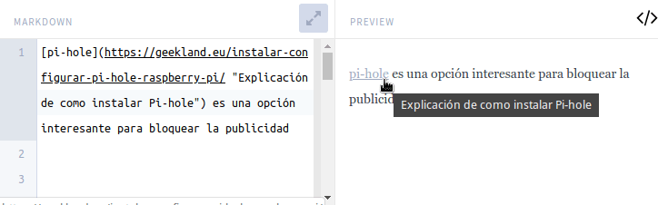](images/realizar-enlaces-a-una-url.png)

Si tan solo quiero enlazar una URL sin poner título alternativo, sin texto de ancla ni título lo podemos hacer del siguiente modo:

> ```
> https://geeklandlinux.github.io/posts/instalar-servidor-dlna-readymedia-raspberry-pi-linux/>
> ```

## INSERTAR IMÁGENES EN MARKDOWN

El método para insertar imágenes es similar al método para insertar enlaces. La sintaxis es la misma y lo único que tenemos que modificar es:

1. Reemplazar el texto de ancla por el texto alternativo de la imagen.
2. Añadir el símbolo **!** al principio de la sintaxis.

Por lo tanto su sintaxis es del siguiente tipo:

> ```
> 
> ```

###### Nota: La url puede ser una dirección local o una dirección que apunte a una imagen alojada en un servidor web.

Por lo tanto, si queremos insertar una imagen usaremos el siguiente código:

> ```
> 
> ```

Si queremos añadir un título a la imagen lo haremos del siguiente modo. Después del código que acabamos de usar:

1. Dejamos un espacio.
2. Abrimos comillas, escribimos el título que queramos y cerramos las comillas.

Por lo tanto el código Markdown final será el siguiente:

> ```
> 
> ```

El resultado obtenido de aplicar la sintaxis de este apartado será el siguiente:

[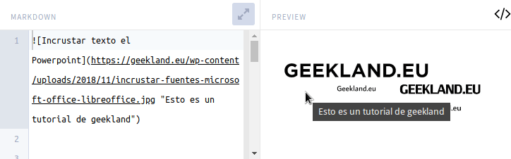](images/insertar-imagenes-documento-markdown.png)

La imagen siempre se insertará en tamaño real. Si la queremos redimensionar lo deberemos hacer en función del editor de markdown que usemos. Muchos editores de Markdown permitirán redimensionar las imágenes mediante código html.

## SIMPLIFICAR LA CREACIÓN DE ENLACES E INSERCIÓN DE IMÁGENES

En los 2 apartados anteriores hemos visto que crear enlaces e insertar imágenes puede resultar tedioso. Por esto motivo a continuación veremos como podemos simplificar su proceso.

### Crear enlaces de forma limpia y ordenada

Escribiremos un texto y cada vez que aparezca una palabra que queramos enlazar la pondremos entre corchetes:

> ```
> [Geekland] es un blog que acostumbra a publicar tutoriales. [Geekland] también da soporte a los usuarios que lo píden.
> ```

Una vez finalizado el texto, al final del documento definiremos los enlaces del siguiente modo:

> ```
> [Geekland]: https://geeklandlinux.github.io/
> ```

De este modo, todas las palabras Geekland del documento que estén entre corchetes se enlazarán con la URL geeklandlinux.github.io:

[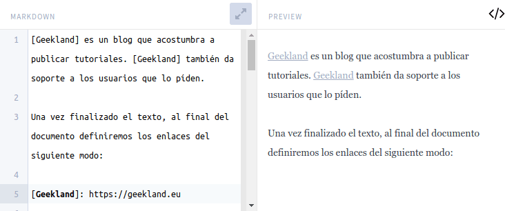](images/simplificar-la-creacion-enlaces.png)

### Insertar imágenes de forma simple y ordenada

La misma técnica que acabamos de ver también es útil para insertar imágenes. Si tenemos que insertar una imagen en varias partes del documento podemos escribir simplemente el texto alternativo de la imagen del siguiente modo:

> ```
> ![incrustar fuentes]
> 
> ![incrustar fuentes]
> ```

Al final del documento definiremos la URL de la imagen del siguiente modo:

> ```
> [incrustar fuentes]: images/incrustar-fuentes-microsoft-office-libreoffice.jpg
> ```

Si observamos el resultado obtenido vemos que podemos añadir una imagen tantas veces como queramos definiendo la URL solamente una vez.

[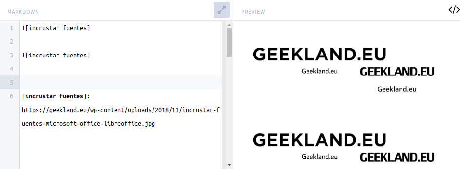](images/simplificar-insertar-imagenes.png)

## INSERTAR CÓDIGO EN MARKDOWN

Markdown permite crear cajetines para insertar código y resaltar código dentro de una frase o párrafo. Para ello sigan las siguientes indicaciones.

### Insertar cajetines de código

Markdown permite incluir cajetines de código en cualquier lenguaje de programación. Para ello tan solo tenemos que seguir el siguiente procedimiento:

1. Antes de iniciar el código **escribimos** tres acentos abiertos **\`\`\`** seguido del **nombre del lenguaje** que queremos insertar en el cajetín.
2. Presionamos **enter** y **escribimos el código**.
3. Para cerrar el cajetín volveremos a **escribir** tres acentos abiertos **\`\`\`**.

Un ejemplo de la explicación que acabo de dar es el siguiente:

> ```
> ```html
> <!DOCTYPE HTML>
> <html>
>   <head>
>     <title>Ejemplo</title>
>   </head>
>   <body>
> 
>     <?php
>      echo "¡Hola, mundo PHP!";
>     ?>
> 
>   </body>
> </html>
> ```
> ```

El resultado obtenido del código que acabamos de generar será el siguiente:

[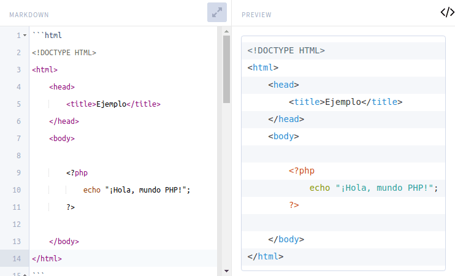](images/insertar-cajetin-codigo.png)

### Resaltar código dentro de un texto párrafo

Para resaltar código dentro de una frase tenemos que usar el símbolo de acento grave o abierto **\`**. Por lo tanto, para resaltar código tan solo tengo que poner entre acentos graves tal y como se muestra en el siguiente ejemplo:

> ```
> El comando para instalar LibreOffice es `sudo apt install libreoffice`.
> ```

El resultado del ejemplo que acabo de poner es el que se muestra a continuación:

[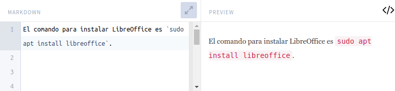](images/resaltar-codigo-frase.png)

## REALIZAR LISTAS DE TAREAS O CHECKLIST

Markdown nos permite crear listas de tareas de forma extremadamente sencilla. Para ello tan solo tenemos que abrir corchete, dejar un espacio y cerrar el corchete:

> ```
> [ ]
> ```

En el caso que queramos marcar la tarea como realizada tenemos que reemplazar el espacio por una **X** del siguiente modo:

> ```
> [X]
> ```

A continuación les dejo un ejemplo de como elaborar una lista de tareas:

> ```
> **Listado de tareas 14-12-2019**
> 
> - [X] llevar los niños a natación
> - [X] aprender markdown
> - [ ] renovar mi suscripción del gimnasio
> ```

El modo de visualización del texto Markdown que acabamos de ver es el siguiente:

[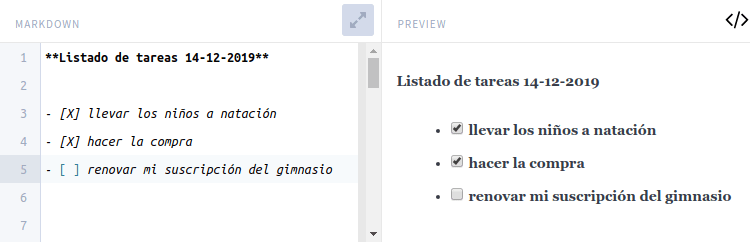](images/checklist-o-lista-tareas.png)

Por lo tanto, crear listas de tareas en Markdown es un proceso extremadamente rápido y sencillo.

## CREAR TABLAS EN MARKDOWN

Es mucho más fácil crear tablas en Markdown que en html. Para generar tablas en Markdown usaremos los siguientes símbolos:

1. **|**
2. **:**
3. **\---**

El primer paso para crear una tabla consiste en **definir los títulos de las columnas**. Para ello escribiremos los títulos de las columnas separados por tuberías **|** tal y como se muestra en el siguiente ejemplo:

> ```
> | Mes | Facturación | Comercial |
> ```

Acto seguido repetiremos la línea que acabamos de escribir sustituyendo los títulos de las columnas por **\---**

> ```
> | --- | --- | --- |
> ```

En estos momentos hemos generado una tabla que tiene 3 columnas y una fila que con los títulos de las columnas. Finalmente añadiremos el resto de filas de la misma forma que añadimos las columnas:

> ```
> | Enero | 100.000 | Feli |
> | Enero | 200.000 | Fran C. |
> | Febrero | 400.000 | Feli |
> | Febrero | 50.000 | Fran C. |
> ```

Con este simple código habremos generado una tabla. Si además queremos justificar a la derecha el contenido de la columna 2 y centrar todo el texto de la columna 3, lo haremos usando el símbolo **:** en la segunda fila del código Markdown:

> ```
> | Mes | Facturación | Comercial |
> | --- | ---: | :---: |
> | Enero | 100.000 | Feli |
> | Enero | 200.000 | Fran C. |
> | Febrero | 400.000 | Feli |
> | Febrero | 50.000 | Fran C. |
> ```

La representación gráfica del texto en Markdown que acabamos de generar es la siguiente:

[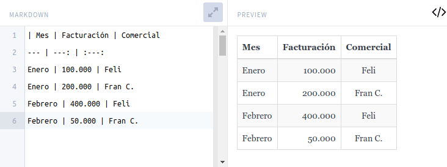](images/generar-tablas-markdown.png)

Por lo tanto realizar tablas en Markdown es increíblemente más fácil que en html. Por esto motivo es útil aprender Markdown.

## INSERTAR COMENTARIOS O NOTAS AL PIE DE PÁGINA

Para insertar una nota al pie de página lo haremos del siguiente modo.:

1. Justo después de la palabra que queremos añadir una nota al pie de página escribiremos un corchete **\[**
2. Acto seguido escribimos un acento circunflejo **^**
3. A continuación escribimos una palabra sin espacios que describa el tipo de comentario que pondremos al pie de página
4. El siguiente paso consistirá en cerrar el corchete **\]**.
5. Seguidamente, en cualquier parte del documento reproducimos los mismos caracteres realizados en las pasos 1,2.3 y 4. A continuación escribimos el carácter **:** y finalmente escribimos la nota que queremos poner al pie de página.

Un ejemplo de lo que acabamos de explicar es el siguiente:

> ```
> Este año visitaremos la Giralda[^1]. Será una visita importante.
> 
> Es importante ir este año.
> 
> [^1]: Nombre que recibe la torre campanario de la catedral de Santa Maria de la Sede.
> ```

A continuación les muestro el resultado del código que acabamos de generar:

[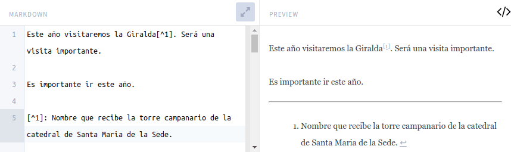](images/insertar-comentario-a-pie-de-pagina-1.png)

###### Nota: Para ser más ordenados sugiero definir la totalidad de notas al final del documento que estamos editando.

## DEFINIR ABREVIACIONES DE PALABRAS EN MARKDOWN

En muchas ocasiones escribimos abreviaciones o palabras que necesitan una breve definición.

Si queremos definir la abreviación TAS, en cualquier parte del documento hacemos lo siguiente:

1. Escribimos un **\***
2. Abrimos corchetes **\[**
3. Escribimos la abreviación de palabra a definir.
4. Cerramos corchetes **\]** y acto seguido escribimos **:**
5. Finalmente dejamos un espacio y escribimos la definición de la abreviación.

Un ejemplo de lo que acabo de citar es el siguiente:

> ```
> El TAS aprobó su solicitud.
> 
> *[TAS]: Tribunal de arbitraje del deporte.
> 
> A partir de estos momentos siempre que escribamos TAS tendremos su definición disponible.
> ```

La representación gráfica del código que acabamos de generar es la siguiente:

[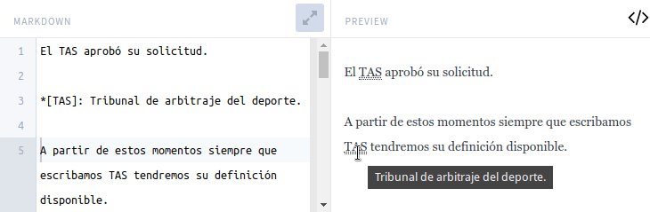](images/definir-significado-abreviaciones-markdown.png)

Como podéis ver, cuando pasamos el ratón por encima de la palabra TAS nos aparecerá su definición o significado.

###### Nota: Recomiendo que se definan todas las abreviaciones al final de documento. De este modo el documento quedará mucho más ordenado.

## DEFINIR PALABRAS EN MARKDOWN

Markdown permite realizar definiciones de palabras. Para ello tenemos que proceder del siguiente modo:

1. **Escribimos la palabra** a definir y presionamos la tecla Enter.
2. Acto seguido escribimos **:**, dejamos un **espacio** y empezamos a escribir la definición de la palabra.

Un ejemplo de lo que acabo de mencionar es el siguiente:

> ```
> Markdown
> : Es un lenguaje de marcado ligero creado por John Gruber
> ```

Si queremos realizar la definición de una palabra con 2 acepciones lo podemos hacer el siguiente modo:

> ```
> Markdown
> : Es un lenguaje de marcado ligero creado por John Gruber.
> : Es una palabra inglesa que significa reducción de precio.
> ```

El código que acabamos de generar se visualizará del siguiente modo:

[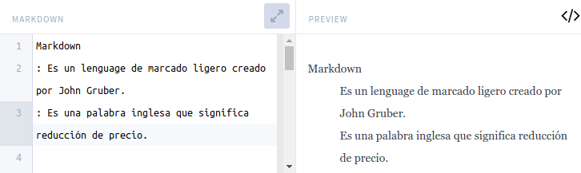](images/definir-significado-palabra.png)

## ANULAR CÓDIGO MARKDOWN

Markdown usa símbolos comunes para dar formato al texto que escribimos. Por lo tanto es posible que se den casos nos interese anular el código markdown.

Para anular el código Markdown tendremos que usar el carácter **\\**. A modo de ejemplo:

Si escribimos:

> ```
> *geekland*
> ```

Se mostrará el texto geekland en cursiva.

Si queremos que no se aplique el código markdown y se muestre el texto real que hemos escrito tendremos que añadir una contrabarra **\\** al inicio de la palabra del siguiente modo:

> ```
> \*geekland*
> ```

En la siguiente imagen podéis ver una ilustración gráfica de lo citado en este apartado:

[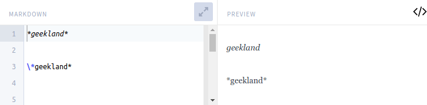](images/anular-codigo-markdown.png)

## INSERTAR VÍDEOS EN MARKDOWN

Otro aspecto que debemos abordar para aprender Markdown es la inserción de vídeos. El procedimiento será variable y en función del editor de Markdown que utilicen.

### Para usuarios de Markdown Editor en Nextcloud

Si en Nextcloud usan Markdown Editor tan solo tienen que realizar lo siguiente:

1. Escriben el símbolo de admiración **!**.
2. Acto seguido abren corchetes **\[** y escriben el **nombre del servicio** en que está alojado el vídeo.
3. Cierren corchetes **\]**. Finalmente, **entre paréntesis peguen la URL** del vídeo que quieren insertar.

A continuación les dejo 2 ejemplos de lo acabo de citar:

> ```
> 
> 
> ```

Y el resultado obtenido es el siguiente:

[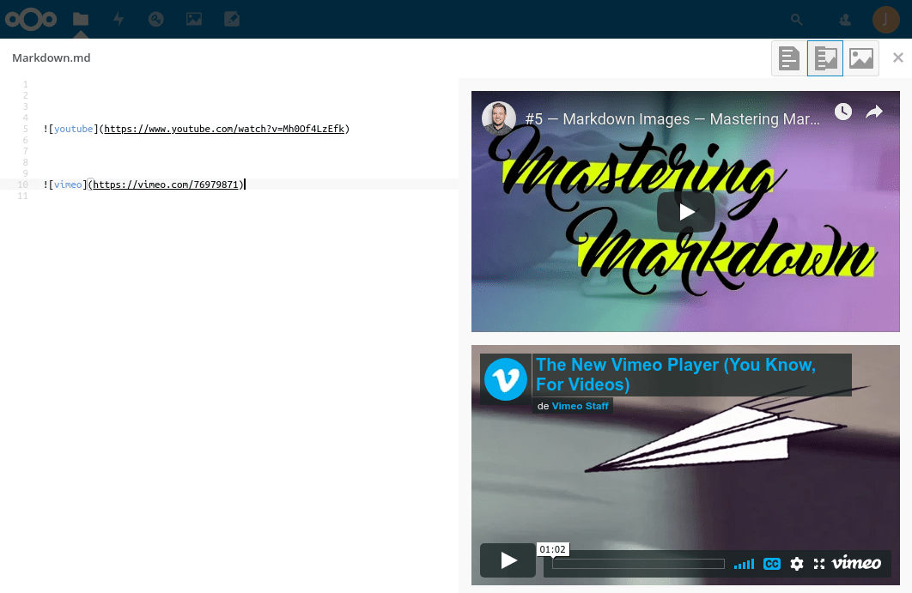](images/insertar-videos-markdown-nextcloud.png)

Para visualizar los videos tan solo tendremos que clicar sobre el icono Play.

### Insertar vídeos en el caso que su editor de Markdown acepte código html

En los editores de Markdown que acepten html tan solo tendremos que usar el link de inserción que proporcionan servicios como Youtube, Vimeo o DailyMotion para insertar los vídeos en las web.

Para obtener el link de Youtube que nos permitirá insertar un vídeo determinado lo haremos del siguiente modo. Empezamos a reproducir el vídeo que queremos insertar. Acto seguido, encima del vídeo presionamos el botón izquierdo del ratón y cuando aparezca el menú contextual clicamos encima de la opción **Copiar código de inserción**.

[](images/copiar-codigo-insercion.png)

Acto seguido nos vamos a nuestro editor de Markdown y pegamos el contenido del portapapeles. De este modo tan sencillo podremos insertar vídeos los servicios de vídeo online más populares:

[](images/videos-insertados-en-editor-markdown.png)

Si desean insertar sonidos de servicios de audio como soundcloud, el procedimiento es el mismo que se muestra en este apartado. Tan solo tienen que buscar el link para insertar el sonido y pegarlo en su editor de Markdown.

### Insertar vídeos en el caso usemos un editor de markdown sin ningún tipo de soporte

En el caso que su editor de markdown no tenga ningún tipo de soporte usaremos la siguiente sintaxis para insertar vídeos:

> ```
> [](url_del_vídeo_que_queremos_insertar)
> ```

Un ejemplo de lo que acabo de citar es el siguiente:

> ```
> [](https://www.youtube.com/watch?v=POWdnjYfWDo)
> ```

El resultado obtenido será el siguiente:

[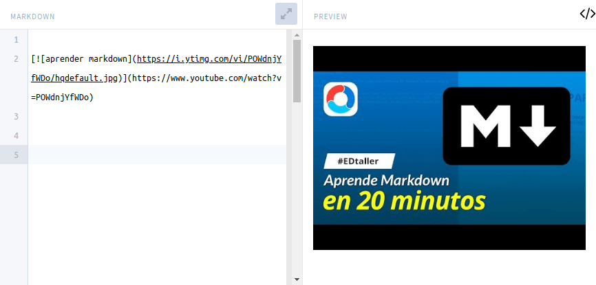](images/insertar-videos-markdown.png)

Para acceder a visualizar el vídeo tenemos que clicar encima de la imagen. En el momento de clicar la imagen se abrirá el navegador y se visualizará el vídeo.

## REALIZAR UNA TABLA O ÍNDICE DE CONTENIDOS EN MARKDOWN

Como comentamos anteriormente los encabezados en Markdown contienen el atributo id. Esto nos permitirá realizar tablas de contenido de forma extremadamente sencilla.

A modo de ejemplo, para crear un índice de contenido con el editor de markdown Typora tan solo tenemos que acceder al menú Párrafo y clicar encima de la opción Tabla de contenidos.

[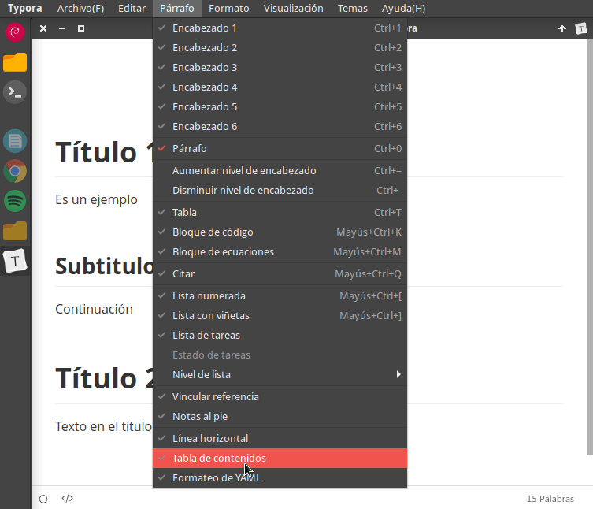](images/tabla-contenido-typora.png)

Si queremos realizar una tabla de contenido de forma manual el procedimiento es un poco más tedioso y no es práctico. Por lo tanto, en el caso que su editor de Markdown no pueda crear tablas de contenido de forma automática les recomiendo lo siguiente.

Accedan a la siguiente [URL](https://ecotrust-canada.github.io/markdown-toc/). Acto seguido peguen el texto Markdown que han generado a la columna de la izquierda y presionen el botón Convert. Acto seguido en la columna de la derecha se generará el código que generará la tabla de contenido.

[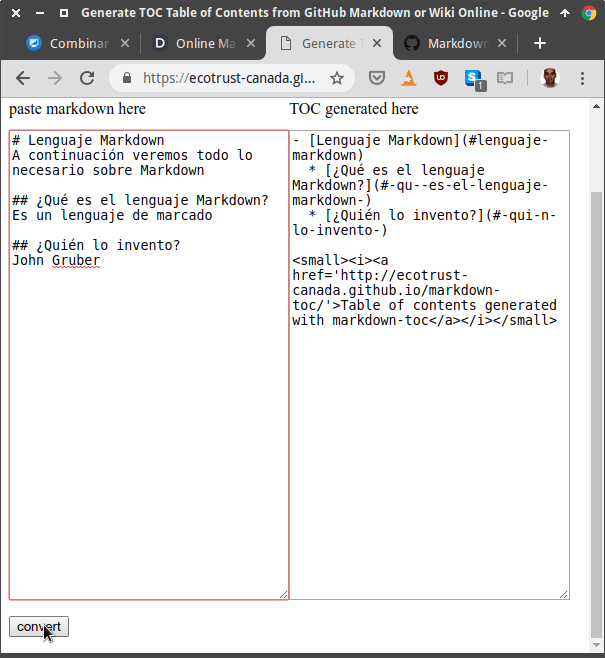](images/generar-codigo-tabla-contenido.png)

Finalmente copien el código de la columna de la derecha y peguenlo en su editor de Markdown. Acto seguido se generará la tabla de contenido:

[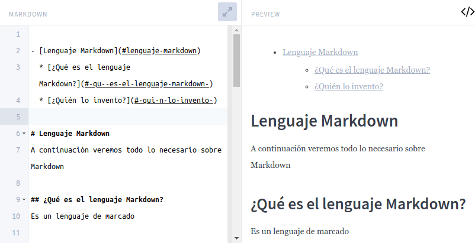](images/tabla-contenido-generada-markdown.png)

## OTRAS FUNCIONALIDADES DE MARKDOWN

Los editores de markdown permiten realizar prácticamente todo lo tengamos en mente. Tan solo tenemos que buscar información de como hacerlo y listo.

Los editores de Markdown permiten realizar tareas adicionales como por ejemplo:

1. Insertar ecuaciones.
2. Redimensionar imágenes de forma sencilla.
3. Etc.

Para terminar decir que si quieren pueden hacer vuestras propuestas y preguntas en los comentarios del artículo. Como habrán visto aprender Markdown no es tan complicado. Aprender Markdown es cuestión de minutos y ayuda a incrementar nuestra productividad.
