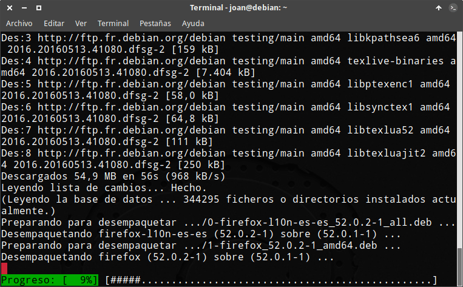
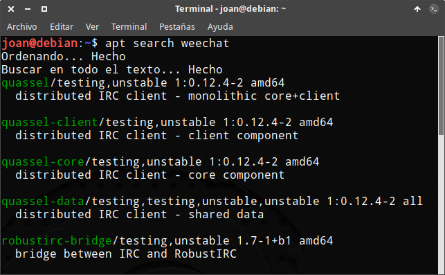

A estas alturas muchos de vosotros sabréis que en vuestras distros linux podéis realizar operaciones con vuestros paquetes utilizando los comandos apt y apt-get.

Ambos comandos son muy similares y muchos usuarios de Linux se preguntan cual es el comando que deberían usar. Para resolver estas preguntas a continuación listaremos las similitudes y diferencias existentes entre apt y apt-get.<!--more-->

## ¿QUÉ SIMILITUDES EXISTEN ENTRE APT-GET Y APT?

apt-get y apt son 2 herramientas para nuestra línea de comandos muy similares por los siguientes motivos:

1. Ambos comandos son interfaces para trabajar y dar ordenes al gestor de paquetes APT (Advanced Package Tool).
2. Apt y apt-get tienen la misma funcionalidad. Esta funcionalidad es gestionar y obtener información de los paquetes de nuestra distro.
3. A pesar de ser 2 herramientas distintas comparten gran parte de su código. Por lo tanto la eficiencia y la seguridad que ofrecen ambas alternativas son equivalentes.
4. Ambas interfaces fueron creadas y son mantenidas por los mismos [desarrolladores](https://anonscm.debian.org/git/apt/apt.git/tree/AUTHORS "Relación de los desarrolladores de apt") en el mismo repositorio. Algunos de los desarrolladores actuales de apt y apt-get pertenecen al equipo de desarrollo de Debian y de Ubuntu.
5. La funcionalidades que ofrecen apt y apt-get son prácticamente equivalentes.
6. La gran mayoría de comandos de apt y apt-get son equivalentes en funciones y tienen una sintaxis muy similar. No obstante cabe remarcar que el comportamiento en algunos comandos puede ser ligeramente diferente.

## ¿QUÉ DIFERENCIAS EXISTEN ENTRE APT Y APT-GET?

A pesar de las similitudes también existen diferencias. Algunas de las diferencias existentes entre apt y apt-get son las siguientes:

1. Apt fue lanzado en el año 2014, mientras que apt-get fue lanzado en 1998.
2. En algunos casos, los resultados mostrados por apt son más amigables y fáciles de leer que los de apt-get.
3. Los comandos para ejecutar las operaciones con nuestros paquetes son más simples en apt que en apt-get.
4. Pueden existir pequeñas diferencias en la ejecución de comandos teóricamente equivalentes. A modo de ejemplo, el comando apt-get upgrade solo actualiza los paquetes que tenemos instalados en nuestro equipo. Si alguno de los paquetes a actualizar requiere de nuevas dependencias entonces el paquete no se actualizará. En cambio si usamos apt upgrade se instalarán las nuevas dependencias y se actualizaran todos los paquetes que tengamos instalados en nuestro equipo.
5. Las versiones antiguas de apt contienen muchos menos comandos que apt-get. No obstante las versiones actuales de ambos comandos prácticamente contienen las mismas funcionalidades.
6. Apt es capaz de gestionar paquetes rpm. Por lo tanto en Fedora, mediante el comando apt-rpm podemos gestionar los paquetes rpm mediante apt.
7. Apt no tiene asegurada la compatibilidad entre versiones mientras que apt-get si.
8. El comportamiento y los resultados de salida de apt pueden variar versión tras versión. En cambio en apt-get los resultados de salida y comportamiento siempre serán los mismos.

## VENTAJAS PROPORCIONADAS POR APT

apt únicamente proporciona una ventaja sobre apt-get. Esta ventaja es que apt es más amigable que apt-get.

### Apt es más amigable que apt-get

apt es más amigable que apt-get básicamente por dos motivos:

El primero de ellos es que los comandos ejecutados con apt son más cortos, más lógicos, más coherentes y más fáciles de recordar.

La segundo motivo es que los resultados mostrados en la terminal son más fáciles de leer en apt. A modo de ejemplo podemos ver las siguientes capturas de pantalla:

Cuando instalamos paquetes se muestra una barra de progreso que nos indica de forma gráfica y clara el % de la instalación que hemos realizado.

Ciertos comandos como por ejemplo apt search presentan unos resultados mucho más claros que otros equivalentes como por ejemplo apt-cache search.

## ¿QUÉ COMANDO DEBEMOS UTILIZAR?

A día de hoy apt y apt-get son plenamente funcionales. Podéis usar cualquiera de los 2 comandos sin ningún tipo de problema. No obstante es importante ser consciente de los siguientes puntos:

1. Si queremos trabajar con scripts es mejor usar apt-get. El motivo es sencillo. Apt es una herramienta que puede cambiar su comportamiento entre versiones. Por lo tanto no es buena idea usar apt en tareas de programación. En cambio si usamos apt-get siempre obtendremos el mismo comportamiento y tendremos asegurada la compatibilidad entre las distintas versiones de apt-get.
2. Apt fue creado para ser una herramienta más amigable para el usuario final.

En mi caso estoy acostumbrado a usar apt-get y por lo tanto sigo y seguiré usando apt-get. Las supuestas ventajas que me proporciona apt no son suficientemente importantes para que me plantee cambiar mis hábitos.

Para finalizar este apartado solo quiero puntualizar una serie de puntos que considero importantes:

1. Encontraréis fuentes que dicen que apt-get es obsoleto. Esto es absolutamente falso. Apt-get es vigente y no os generará ningún tipo de problema.
2. También es posible que leáis que apt es más eficiente y ofrece más seguridad a sus usuarios. Esta afirmación a día de hoy no es cierta. El código usado para realizar operaciones como resolver dependencias, descargar los paquetes, etc es muy similar en ambos comandos. Por lo tanto ambos comandos ofrecen la misma seguridad y la misma eficiencia.

## EQUIVALENCIAS ENTRE LOS COMANDOS APT Y APT-GET

En el caso que queráis probar apt les recomiendo que visiten el articulo en el que detallo las [equivalencias de comandos entre apt-get y apt]().

Para finalizar el artículo pueden visitar el siguiente enlace en el que encontraran información sobre el [proceso de desarrollo de apt](https://lists.debian.org/deity/ "Lista de emails en que se discute el desarrollo de apt").
