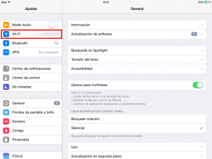
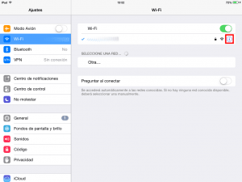
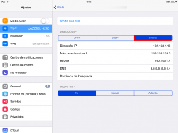
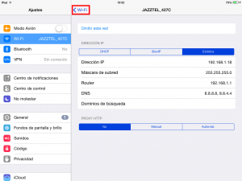

En el momento de conectarnos a una red wifi el servidor DHCP del router nos asigna una dirección IP cualquiera que acostumbra a ser aleatoria dentro de un rango de números. El hecho que esta Ip sea aleatoria puede representar un inconveniente en determinadas ocasiones, por lo tanto en este post comentaremos como podemos disponer de una IP estática en el iPad o en el iPhone.<!--more-->

## VENTAJAS DE DISPONER DE UNA IP ESTÁTICA

La principal ventaja de disponer de una IP estática es que **nuestro dispositivo con iOS siempre estará localizable dentro de nuestra red local**. **De esta forma**, entre otras cosas **podremos realizar las siguientes tareas de forma mucho más fácil**:

1. **Conectarnos a nuestro dispositivo con iOS mediante SSH, FTP**, etc de forma mucho más fácil ya que en todo momento sabremos cual es la IP de nuestro dispositivo iOS dentro de la red local.
2. En el caso de tener un servidor DLNA, o cualquier otro tipo de servidor en nuestro ordenador, **podremos configurar el firewall del servidor para que nuestro ipad pueda acceder a él sin problemas**.
3. En el caso que queramos **conectarnos a nuestro iPad o iPhone desde fuera de nuestra red local** también será útil, ya que si nuestro dispositivo no dispone de ip fija o estática, entonces nuestro router no sabrá a que equipo tiene que redirigir la petición que viene desde fuera de nuestra red local.
4. Cuando nos conectemos a Internet a través del wifi **el tiempo de conexión será mucho más rápido y evitaremos posibles problemas** en la asignación de la IP.

## INSTRUCCIONES PARA ASIGNAR UNA IP ESTÁTICA A NUESTRO iPad o iPhone

El proceso para asignar una Ip estática a un dispositivo iOS es sumamente fácil. Lo primero que tenemos que hacer es **clicar encima del icono de Ajustes**.

Una vez dentro de los ajustes, tal y como se puede ver en la captura de pantalla, tenemos que **presionar encima del apartado de Wi-Fi**.

Seguidamente, tal y como se muestra en la captura de pantalla, deberemos **clicar encima de la i dentro del circulo de la red wifi a la que estamos conectados**.

Después de presionar la i dentro del circulo accederemos al menú para configurar la asignación de la ip. Una vez en el menú hay que **presionar sobre la pestaña Estática** y seguidamente **rellenar** de forma adecuada **los campos Dirección IP, Máscara de subred, Router, DNS y dominios de búsqueda** tal y como se muestra en la captura de pantalla:

**Simplemente copiando los valores de la captura de pantalla la IP estática debería quedar configurada**. **En el caso de tener problemas** les recomiendo **leer el siguiente apartado** para rellenar adecuadamente cada uno de los campos:

**Dirección IP:** En este campo tenemos que **indicar la dirección IP estática que queremos tener**. **En mi caso** la IP es la **192.168.1.18**. En este apartado podemos elegir cualquier IP comprendida entre la puerta de entrada (Router) y la que fije la máscara de subred elegida. Como en mi caso mi puerta de entrada (Router) es 192.168.1.1 y mi máscara de subred es 255.255.255.0, puedo elegir cualquier dirección IP comprendida entre 192.16.1.2 y 192.168.1.254.

**Máscara de subred:** En este apartado tenemos que **elegir la máscara de subred. En mi caso he elegido que sea la** **255.255.255.0**. Prácticamente el 100% de redes domésticas utilizan está máscara. La máscara de red define el número máximo de host (equipos) que puede tener nuestra red. Al usar 255.255.255.0 el número máximo de dispositivos conectados a nuestra red local será de 254. En el caso de necesitar construir una red de más de 254 dispositivos tendríamos que configurar una red clase B que nos permitiría llegar a tener hasta 65534 conectados a la misma red local.

**Router:** En este apartado tenemos que **definir la puerta de entrada de nuestro router que en mi caso es** **192.168.1.1**. En la gran mayoría de casos acostumbra a ser la 192.168.1.1. Para poder consultar o modificar la puerta de entrada tan solo hay que acceder en al apartado LAN de la configuración del router.

**DNS:** En este apartado tenemos que **indicar la dirección de los [servidores DNS]()**. En mi caso, tal y como se puede ver en la captura de pantalla, indico las direcciones **8.8.8.8 y 8.8.4.4** que corresponden a los servidores DNS de Google. Vosotros podéis usar otros servidores VPN sin ningún tipo de problema.

**Dominios de búsqueda:** Este campo es mejor **dejarlo en blanco** ya que a mi modo de ver no tiene utilidad para un usuario normal y nada tiene que ver con la conexión de nuestra red wifi. Quien tenga interés en saber para lo que sirve este campo puede leer el siguiente [artículo](http://www.faq-mac.com/2015/04/os-x-dominios-de-busqueda/ "Explicación de los dominios de búsqueda en iOS y en OS x").

**Después de realizar los cambios indicados**, tal y como se puede ver en la captura de pantalla, tan solo **hay que** **presionar sobre Wi-Fi** para que la totalidad de cambios queden guardados.

En estos momentos deberíamos poder disponer de una IP fija dentro de nuestra red local.
