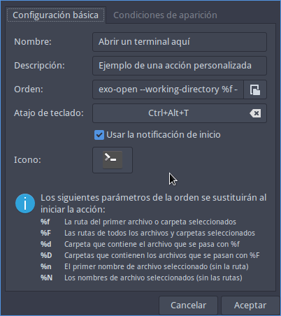
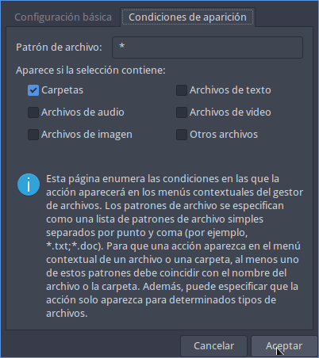
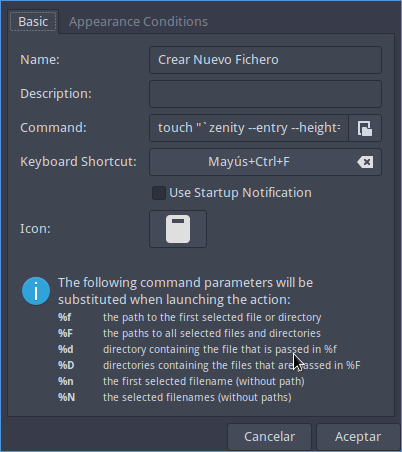
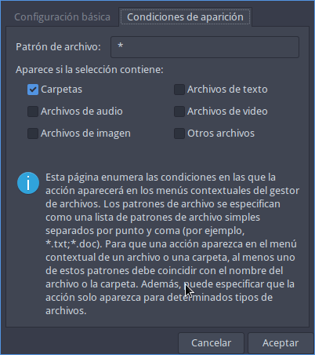
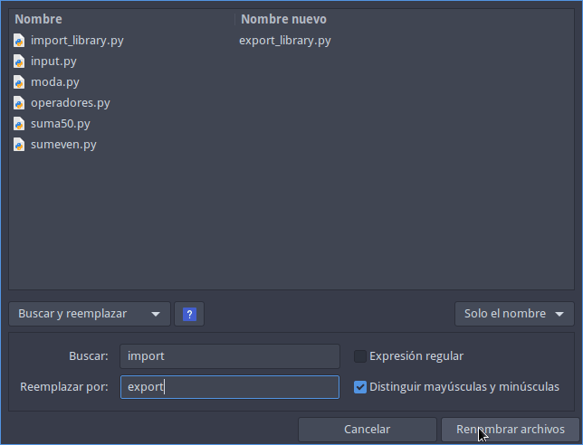
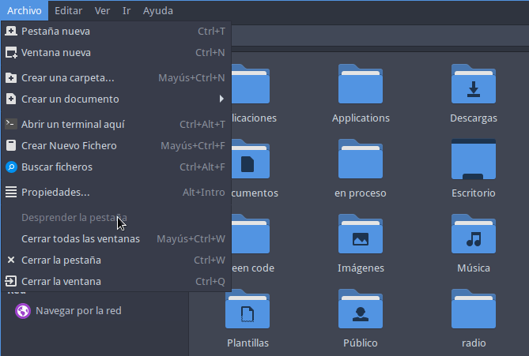

Si quieren usar el gestor de ficheros Thunar de forma rápida y eficiente a continuación les citaré prácticamente la totalidad de atajos de teclado disponibles. Además también verán como pueden añadir nuevos atajos de teclado y como modificar los atajos de teclado estándar. De esta forma podrán extraer el máximo rendimiento del gestor de ficheros Thunar.

**Nota**: Si le dan una oportunidad a Thunar verán que es un gestor de ficheros flexible y con más posibilidades de lo que a priori piensan. Espero que sus desarrolladores no lo destrocen añadiendo la side decoration de Gnome.<!--more-->

## ATAJOS DE TECLADO EN THUNAR PARA INCREMENTAR LA VELOCIDAD Y PRODUCTIVIDAD

Algunos de los atajos de teclado existentes, que pueden habilitar o que pueden generar para el gestor de ficheros Thunar son los siguientes:

### Abrir y cerrar pestañas mediante atajos de teclado en Thunar

Para abrir y cerrar pestañas pueden usar los atajos de teclados que se muestran a continuación.

| Atajo de teclado | Acción del atajo de teclado |
| --- | --- |
| `Ctrl`\+ `t` | Abrir nueva pestaña. |
| `Ctrl` + `Mayús` + `t` | Abrir el directorio seleccionado en una nueva pestaña. |
| `Ctrl` + `w` | Cerrar pestaña. |

### Moverse entre las distintas pestañas abiertas

Puede darse el caso que tengamos varías pestañas abiertas. Para movernos de una pestaña a otra pestaña usaremos los siguientes atajos de teclado.

| Atajo de teclado | Acción del atajo de teclado |
| --- | --- |
| `Ctrl` +  `Av Pág` | Para irnos a la siguiente pestaña. |
| `Ctrl` +  `Re Pág` | Ir a la pestaña anterior. |

Esta misma combinación de teclas también es válida para moverse entre las pestañas de la totalidad de ventanas abiertas por el gestor de ficheros Thunar.

### Desacoplar pestaña del gestor de ficheros y que se abra en una nueva ventana

Puede darse el caso que tengamos varias pestañas abiertas en una misma ventana y queramos desacoplar una de ellas para tenerla como ventana individual. Para realizar lo que acabo de citar tendréis ejecutar el comando `thunar -q` en la terminal y posteriormente acceder al fichero `.config/Thunar/accels.scm`. Una vez dentro deberán modificar la siguiente línea:

> **`'(gtk_accel_path "<Actions>/ThunarWindow/detach-tab" "")`**

Una vez la hayan encontrado la descomentan y definen el atajo de teclado que quieren usar para desacoplar la pestaña. En mi caso usaré el atajo de teclado `Ctrl` + `Alt` + `d` . Por lo tanto la línea quedará del siguiente modo:

> **`(gtk_accel_path "<Actions>/ThunarWindow/detach-tab" "<Primary><Alt>d")`**

**Nota:** `<Primary>` hace referencia a la tecla `Ctrl`.

A partir de estos momentos cada vez que presione `Ctrl` + `Alt` + `d`desacoplaré la pestaña que esté activa del gestor de ficheros.

| Atajo de teclado | Acción del atajo de teclado |
| --- | --- |
| `Ctrl` + `Alt` + `d` | Desacoplar una pestaña del gestor de ficheros. |

### Abrir el gestor de archivos Thunar

Normalmente no hay ningún atajo de teclado predeterminado para abrir el gestor de archivos Thunar. Os recomiendo que generéis uno. El proceso para generarlo dependerá del entorno de escritorio que estéis usando. Como en mi caso uso el escritorio i3 tan solo tendré que añadir la siguiente línea en el fichero de configuración del escritorio i3:

> **`bindsym $mod+t exec thunar`**

A partir de estos momentos se abrirá el gestor de ficheros Thunar cuando presione la combinación de teclas `Win` + `t`

| Atajo de teclado | Acción del atajo de teclado |
| --- | --- |
| `Win` + `t` | Abrir el gestor de ficheros Thunar. |

### Abrir y cerrar ventanas de Thunar mediante atajos de teclado

También podemos abrir y cerrar ventanas mediante atajos de teclado en Thunar. Los atajos de teclado que deberéis usar son los siguientes:

| Atajo de teclado | Acción del atajo de teclado |
| --- | --- |
| `Ctrl` + `Mayús` + `w` | Cerrar todas las ventanas de Thunar. |
| `Ctrl` + `t` | Abrir nueva ventana. |
| `Ctrl` + `q` | cerrar la ventana. |

### Intercambiar entre el menú de navegación, el panel lateral y la parte central del gestor de ficheros Thunar

El gestor de ficheros Thunar se separa en tres partes:

1. El panel de navegación.
2. El panel lateral.
3. La parte principal donde se muestran la totalidad de ficheros y directorios.

Para trasladar el foco activo de una parte a otra usaremos la tecla `TAB`.

| Atajo de teclado | Acción del atajo de teclado |
| --- | --- |
| `TAB` | Intercambiar el foco activo entre el panel principal, el panel de navegación y el panel lateral. |

En el momento de abrir Thunar el foco principal estará en el panel principal. Por lo tanto si movemos el cursor se seleccionará un fichero o un directorio. Si queremos posicionar el cursor en el panel de navegación presionaremos la tecla `TAB`. Y si queremos posicionar el cursor en el panel lateral volveremos a presionar la tecla `TAB`.

### Abrir un fichero o directorio o ejecutar un fichero con el teclado

Para abrir un fichero o un directorio tan solo tenemos que seleccionarlo. Una vez seleccionado pueden usar los siguientes atajos de teclado para abrirlo y/o ejecutarlo.

| Atajo de teclado | Acción del atajo de teclado |
| --- | --- |
| `Enter` | Permite abrir un fichero o directorio. |
| `Ctrl` + `o` | Abrir un fichero o directorio. |
| `Ctrl` + `Mayús` + `o` | Abrir un directorio en una nueva ventana. |

### Ir hacia adelante o detrás dentro de la estructura de directorios que previamente hemos visitado

Para navegar dentro de la estructura de directorios de forma rápida y precisa les recomiendo las siguientes teclas.

| Atajo de teclado | Acción del atajo de teclado |
| --- | --- |
| `Alt` + `←` | Ir hacía atrás en la estructura de directorios previamente abierta. |
| `Alt` + `→` | Ir hacía adelante en la estructura de directorios previamente abierta. |
| `Alt` + `↑` | Para bajar un nivel respecto al directorio en que estás ubicado. |

### Dirigirse a nuestro directorio /home/usuario

Para dirigirnos de forma inmediata a nuestro directorio home tan solo tenemos que usar las teclas `Alt` + `Inicio`

| Atajo de teclado | Acción del atajo de teclado |
| --- | --- |
| `Alt` + `Inicio` | Dirigirse al directorio `/home/nuestro_usuario` |

### Ir a la barra de direcciones del gestor de archivos

Para acceder a la barra de direcciones y de esta forma dirigirse a una ubicación o conectarse a un servidor remoto pueden usar el siguiente atajo de teclado.

| Atajo de teclado | Acción del atajo de teclado |
| --- | --- |
| `Ctrl` + `l` | Dirigirse a la barra de direcciones para acceder a otras ubicaciones. |

### Mostrar u ocultar el menú del gestor de archivos de Thunar

En mi caso no quiero que aparezca el menú del gestor de archivos Thunar. Para mostrar u ocultar el menú del gestor de archivos pueden usar las siguientes teclas.

| Atajo de teclado | Acción del atajo de teclado |
| --- | --- |
| `F10` | Mostrar los menús del gestor de archivos Thunar momentáneamente en el caso que esten ocultos. |
| `Ctrl` + `m` | Mostrar u ocultar el menú de Thunar. |

### Abrir una terminal en la ubicación actual donde nos encontramos

En mi caso uso una acción personalizada para abrir una terminal en la ubicación que estoy visualizando en el gestor de ficheros. La acción personalizada que uso es la siguiente:

[](images/abrir-una-terminal-aqui.png)

**Nota**: El comando entero que aparece en el campo orden es `exo-open --working-directory %f --launch TerminalEmulator`

Y en la pestaña condiciones de aparición tengo configuradas las siguientes opciones.

[](images/abrir-una-terminal-aqui-2.png)

Una vez configurada la acción personalizada que acabo de mostrar se abrirá una terminal en la ubicación actual cada vez que presionamos el atajo de teclado `Ctrl` + `Alt` + `t`.

| Atajo de teclado | Acción del atajo de teclado |
| --- | --- |
| `Ctrl` + `Alt` + `t` | Abrir una terminal en la ubicación actual del gestor de ficheros. |

Pueden visitar el siguiente enlace para aprender a crear [acciones personalizadas con Thunar](). Tengan en cuenta que las acciones personalizadas permiten ejecutar scripts generados por nosotros mismos. Esto sin duda permite dar usos adicionales al gestor de ficheros.

### Crear un nuevo directorio mediante un atajo de teclado

Si están en una ubicación cualquiera y pretenden crear un nuevo directorio tan solo tendrán que usar la siguiente combinación de teclas.

| Atajo de teclado | Acción del atajo de teclado |
| --- | --- |
| `Ctrl` + `Mayús` + `n` | Crear un nuevo directorio. |

### Crear un nuevo fichero de texto

El atajo de teclado de Thunar para crear un nuevo fichero de texto no me funciona. Por lo tanto en mi caso lo que hago es crear una acción personalizada para crear un nuevo fichero de texto. Hay varias formas de crear la acción personalizada, pero la que considero más simple es la que muestro a continuación:

En el apartado de configuración básica de las acciones personalizadas introduzco el siguiente contenido:

[](images/crear-nuevo-fichero.png)

**Nota**: El comando entero que aparece en el campo orden es:

> ```
> touch "`zenity --entry --height=100 --width=400 --title="Introduzca el nombre del fichero de texto" --text "Introducir el nombre del fichero nuevo:"`"
> ```

Y en la pestaña condiciones de aparición las opciones seleccionadas son las siguientes:

[](images/crear-nuevo-fichero-2.png)

A partir de estos momentos tan solo tendremos que presionar el siguiente atajo de teclado para generar un fichero de texto vacío.

| Atajo de teclado | Acción del atajo de teclado |
| --- | --- |
| `Ctrl` + `Mayús` + `f` | Crear un nuevo fichero de texto. |

**Nota:** Para que la acción personalizada funcione tendréis que tener instalado el paquete zenity.

### Ver las propiedades de un fichero o de un directorio mediante atajos de teclado en Thunar

Para ver las propiedades de un fichero o de un directorio usen la siguiente combinación de teclas.

| Atajo de teclado | Acción del atajo de teclado |
| --- | --- |
| `Alt` + `Intro` | Ver las propiedades de un fichero o de una carpeta. |

Una vez se abren las propiedades pueden usar los cursores y las teclas `TAB`, `Enter`, `Ctrl` + `Avpág` y `Ctrl` + `RePág` para navegar y modificar las propiedades de los ficheros y de los directorios.

### Seleccionar todos los ficheros y directorios mediante atajos de teclado en Thunar

Para seleccionar la totalidad de ficheros y directorios de la ubicación actual usen la siguiente combinación de teclas:

| Atajo de teclado | Acción del atajo de teclado |
| --- | --- |
| `ctrl` + `a` | Seleccionar la totalidad de ficheros y directorios. |

### Seleccionar los ficheros y directorios que siguen un patrón determinado

Para seleccionar la totalidad de ficheros y directorios que siguen un determinado patrón tan solo hay que presionar las siguientes teclas:

| Atajo de teclado | Acción del atajo de teclado |
| --- | --- |
| `ctrl` + `s` | Seleccionar los ficheros y directorios que siguen un patrón determinado. |

Al presionar la tecla les aparecerá una ventana para que defináis el patrón de búsqueda. Una vez definido tan solo hay que presionar la tecla `Enter`.

### Invertir la selección de ficheros o directorios

Este atajo de teclado no viene activado de forma predeterminada. Para activarlo tendrán que ejecutar el comando `thunar -q` en la terminal y acceder al fichero `.config/Thunar/accels.scm`. Una vez dentro deberán modificar la siguiente línea:

> **`; (gtk_accel_path "<Actions>/ThunarStandardView/invert-selection" "")`**

Por la siguiente:

> **`(gtk_accel_path "<Actions>/ThunarStandardView/invert-selection" "<Primary><Alt>i")`**

A partir de estos momentos si únicamente tengo seleccionado un fichero, al presionar la combinación la teclas `Ctrl` + `Alt` + `i` se invertirá la selección. Por lo tanto tendremos seleccionados la totalidad de ficheros y directorios menos el que teníamos seleccionado inicialmente.

| Atajo de teclado | Acción del atajo de teclado |
| --- | --- |
| `Ctrl` + `Alt` + `i` | Invertir la selección de ficheros y/o directorios. |

### Seleccionar y abrir un fichero o directorio de forma rápida

Tan solo hay que realizar las acciones que describiré a continuación:

1. Acceder a la ubicación donde están los ficheros y/o directorios que quieren seleccionar.
2. Empezar a escribir el nombre del fichero o directorio al que quieren acceder o abrir. Tan solo realizando lo que acabo de decir se seleccionará de forma automática el directorio o fichero en cuestión.
3. Una vez seleccionado el fichero o directorio que queremos tan solo tenemos que presionar la tecla `Enter` para abrir el fichero o acceder dentro del directorio. Si lo precisan también pueden acceder al menú contextual presionando la tecla de menú contextual de su teclado, ver las propiedades del fichero o del directorio mediante el atajo de teclado `Alt` + `Enter`, etc.

### Buscar ficheros y directorios en Thunar

Para buscar ficheros o directorios pueden seguir las instrucciones que se citan en el siguiente enlace:

[https://geekland.eu/buscar-archivos-en-thunar/]()

Es una lástima que el buscador de ficheros no disponga de un buscador que permita buscar ficheros por su contenido.

### Hacer o deshacer un Zoom mediante atajos de teclado en Thunar

Para cambiar el zoom de visualización de los ficheros y directorios mostrados por el gestor de ficheros usen las siguientes teclas:

| Atajo de teclado | Acción del atajo de teclado |
| --- | --- |
| `Ctrl` + `rueda_ratón` | Hacer y deshacer zoom. |
| `Ctrl` + `+` | Hacer zoom. |
| `Ctrl` + `-` | Deshacer zoom. |
| `Ctrl`+`0` | Poner el zoom predeterminado (100%). |

### Renombrar ficheros y directorios

Thunar es una herramienta potente para renombrar ficheros y directorios de forma masiva. Para ello tan solo tendrán que seleccionar los ficheros y directorios que quieren renombrar y presionar la tecla `F2`

| Atajo de teclado | Acción del atajo de teclado |
| --- | --- |
| `F2` | Renombrar un fichero o conjuntos de ficheros. |

Acto seguido aparecerá una ventana para que podamos definir y configurar el renombrado masivo de ficheros y directorios.

[](images/renombrar-ficheros-en-thunar.png)

**Nota**: La herramienta para renombrar ficheros incluso soporta expresiones regulares.

### Mostrar el menú contextual del fichero o directorio seleccionado

Para conseguir el propósito citado en esté apartado tan solo tenemos se que seleccionar los ficheros y directorios pertinentes y presionar tecla de menú contextual.

| Atajo de teclado | Acción del atajo de teclado |
| --- | --- |
| `Tecla de menú contextual del teclado` | Muestra el menú contextual del fichero o directorio que tengamos seleccionado. |

### Mostrar y ocultar los ficheros ocultos

Para mostrar u ocultar los ficheros ocultos de nuestro sistema de archivos podemos presionar la combinación de teclas `Ctrl` + `h`

| Atajo de teclado | Acción del atajo de teclado |
| --- | --- |
| `Ctrl` + `h` | Mostrar u ocultar los ficheros ocultos. |

### Copiar, cortar y pegar ficheros y directorios mediante atajos de teclado en Thunar

Copiar, cortar y pegar ficheros y directorios se hace con los mismos atajos de teclado que la mayoría de programas existentes.

| Atajo de teclado | Acción del atajo de teclado |
| --- | --- |
| `Ctrl` + `c` | Copiar un/os fichero/s y/o directorio/s. |
| `Ctrl` + `x` | Cortar un/os fichero/s y/o directorio/s. |
| `Ctrl` + `v` | Pegar un/os fichero/s y/o directorio/s. |

### Modos de visualización del gestor de ficheros Thunar

Tenemos los siguientes atajos de teclado para modificar la forma en que visualizamos nuestros directorios y ficheros.

| Atajo de teclado | Acción del atajo de teclado |
| --- | --- |
| `Ctrl` + `1` | Ver los directorios y ficheros en modo vista de iconos. |
| `Ctrl` + `2` | Permite ver los directorios y ficheros en modo lista. |
| `Ctrl` + `3` | Para ver los directorios y ficheros en modo compacto. |
| `F9` | Habilitar y deshabilitar el panel lateral. |
| `Ctrl` + `b` | Sirve para activar la vista de accesos directos en el panel lateral. |
| `Ctrl` + `e` | Para activar la vista de árbol en el panel lateral. |

### Definir el orden de visualización de nuestro ficheros y/i directorios

En mi caso no hay ningún atajo de teclado predeterminado para definir el orden en que quiero visualizar los ficheros y directorios. Por lo tanto lo que hay que hacer es abrir una terminal y ejecutar el comando `thunar -q`. Acto seguido acceden al fichero `.config/Thunar/accels.scm`. Una vez abierto el fichero tenéis que buscar las siguientes líneas:

```shell
; (gtk_accel_path "<Actions>/ThunarStandardView/sort-ascending" "")
; (gtk_accel_path "<Actions>/ThunarStandardView/sort-descending" "")
; (gtk_accel_path "<Actions>/ThunarStandardView/sort-by-size" "")
; (gtk_accel_path "<Actions>/ThunarStandardView/sort-by-type" "")
; (gtk_accel_path "<Actions>/ThunarStandardView/sort-by-mtime" "")
; (gtk_accel_path "<Actions>/ThunarStandardView/sort-by-name" "")
```

Una vez localizadas las descomentan y definen los atajos de teclado que quieren usar del siguiente modo:

```shell
(gtk_accel_path "<Actions>/ThunarStandardView/sort-ascending" "<Primary><Alt>a")
(gtk_accel_path "<Actions>/ThunarStandardView/sort-descending" "<Primary><Alt>z")
(gtk_accel_path "<Actions>/ThunarStandardView/sort-by-size" "<Primary><Alt>s")
(gtk_accel_path "<Actions>/ThunarStandardView/sort-by-type" "<Primary><Alt>y")
(gtk_accel_path "<Actions>/ThunarStandardView/sort-by-mtime" "<Primary><Alt>m")
(gtk_accel_path "<Actions>/ThunarStandardView/sort-by-name" "<Primary><Alt>n")
```

**Nota**: `<Primary>` hace referencia a la tecla `Ctrl`.

Acto seguido guardan los cambios y la siguiente vez que abran Thunar estarán disponibles los siguientes atajos de teclado.

| Atajo de teclado | Acción del atajo de teclado |
| --- | --- |
| `Ctrl` + `Alt` + `a` | Ver los ficheros y directorios en orden ascendente. |
| `Ctrl` + `Alt` + `z` | Ver los ficheros y directorios en orden descendente. |
| `Ctrl` + `Alt` + `s` | Para organizar los ficheros y directorios por tamaño. |
| `Ctrl` + `Alt` + `y` | Organizar los ficheros y directorios por tipo. |
| `Ctrl` + `Alt` + `m` | Permite organizar los ficheros y directorios por fecha de modificación. |
| `Ctrl` + `Alt` + `n` | Organizar los ficheros y directorios por nombre. |

### Borrar moviendo a la papelera de reciclaje mediante atajos de teclado en Thunar

Para enviar uno o varios ficheros o directorios a la papelera de reciclaje lo seleccionamos y presionamos la tecla `Supr`.

| Atajo de teclado | Acción del atajo de teclado |
| --- | --- |
| `Supr` | Borrar un fichero o directorio para que se almacene en la papelera de reciclaje. |

### Borrar un fichero sin pasar por la papelera de reciclaje

Para borrar uno o varios ficheros o directorios de forma definitiva y sin pasar por la papelera reciclaje los seleccionamos y presionamos la combinación de teclas `Mayús` + `Supr`.

| Atajo de teclado | Acción del atajo de teclado |
| --- | --- |
| `Mayús` + `Supr` | Borrar un fichero o directorio de forma definitiva. |

### Recargar el contenido mostrado por el gestor de ficheros

En ocasiones puede que creemos un fichero o un directorio nuevo y no se muestre en el gestor de ficheros. Para que se muestre hará falta refrescar el contenido mostrado por el gestor de ficheros mediante los siguientes atajos de teclado.

| Atajo de teclado | Acción del atajo de teclado |
| --- | --- |
| `Ctrl` + `r` o `F5` | Refrescar el contenido mostrado por el gestor de ficheros. |

## MODIFICAR LOS ATAJOS DE TECLADO EN THUNAR

A lo largo de este artículo han visto numerosos atajos de teclado, pero si lo precisan los pueden modificar. Además también pueden configurar otros atajos de teclado para por ejemplo realizar las siguientes opciones:

- Dirigirse al directorios de plantillas.
- Abrir o dirigirse a la papelera de reciclaje.
- Borrar la papelera de reciclaje.
- Duplicar un fichero.
- Crear un enlace.
- Enviar un fichero al escritorio mediante un enlace.
- Acceder a un elemento del apartado `Lugares` como por ejemplo podría ser un directorio de acceso frecuente.
- Etc.

Para ello lo primero que tienen que realizar es abrir una terminal y ejecutar el siguiente comando para cerrar completamente todos los procesos del gestor de ficheros Thunar.

> ```shell
> thunar -q
> ```

Una vez cerrado Thunar tendrán que editar el fichero `~/.config/Thunar/accels.scm`. Para ello ejecuten el siguiente comando en la terminal:

> ```shell
> nano ~/.config/Thunar/accels.scm
> ```

Una vez se abra el editor de texto deberán editar el código para configurar los atajos de teclado. Cada una de las líneas del fichero sirve para configurar uno de los atajos de teclado existentes en Thunar. Para añadir o modificar un atajo de teclado tan solo tendrán que descomentar la línea correspondiente y definir el atajo de teclado que quieren usar.

Las acciones que realizaran algunas de las entradas del fichero `~/.config/Thunar/accels.scm` son:

| Líneas del fichero accels.scm | Función de cada una de las líneas |
| --- | --- |
| ; (gtk\_accel\_path "/ThunarWindow/open-templates" "") | Dirigirse al directorios de plantillas. |
| ; (gtk\_accel\_path "/ThunarWindow/empty-trash" "") | Borrar la papelera de reciclaje. |
| ; (gtk\_accel\_path "/ThunarStandardView/duplicate" "") | Duplicar un fichero. |
| ; (gtk\_accel\_path "/ThunarStandardView/make-link" "") | Crear un enlace. |
| ; (gtk\_accel\_path "/ThunarLauncher/sendto-desktop" "") | Enviar un fichero al escritorio mediante un enlace. |
| ; (gtk\_accel\_path "/ThunarWindow/open-computer" "") | Para dirigirse a la ubicación equipo del gestor de ficheros. |
| ; (gtk\_accel\_path "/ThunarWindow/open-desktop" "") | Para ver el contenido que almacenamos en el escritorio. |
| ; (gtk\_accel\_path "/ThunarLauncher/open-with-other" "") | Abrir un fichero mediante un programa diferente al predeterminado. |
| ; (gtk\_accel\_path "/ThunarWindow/open-trash" "") | Ver el contenido de dentro la papelera de reciclaje. |
| ; (gtk\_accel\_path "/ThunarWindow/empty-trash" "") | Borrar la papelera de reciclaje. |
| ; (gtk\_accel\_path "/ThunarWindow/open-network" "") | Ver las ubicaciones de red disponibles. |
| ... | ... |

El procedimiento para modificar cada una de las líneas es:

1. Descomentar la línea borrando `;`
2. Definir al atajo de teclado que queremos usar dentro del espacio delimitado por las dos comillas `""`

Una vez realizados los cambios pertinentes tan solo tiene que guardar los cambios. Los atajos de teclado definidos estarán disponibles la próxima vez que inicien el gestor de ficheros Thunar.

Además si miran en los menú de Thunar verán que aparecen la totalidad de atajos de teclado definidos y que podemos usar.

[](images/muestra-atajos-teclado-en-menu.png)

#### Fuentes

[https://docs.xfce.org/xfce/thunar/faq](https://docs.xfce.org/xfce/thunar/faq)
