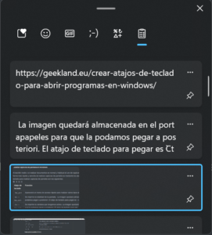

Como todos los que leen el blog sabrán siempre que puedo utilizo Linux. No obstante en mi vida laboral estoy forzado a usar Windows y la verdad es que no funciona mal. Por lo tanto para todos los usuarios que usan o tienen que usar Windows les dejo una serie de atajos de teclado en Windows que les ayudarán a ser más productivos en sus tareas.<!--more-->

## Atajos de teclado para ser productivos usando el explorador de archivos de Windows

Algunos de los atajos de teclado que nos ayudarán a ser más productivos en el explorador de archivos de Windows son los siguientes:

| Atajo de teclado | Función |
| --- | --- |
| `Win + e` | Abrir el explorador de archivos. |
| `F2` | Renombrar un fichero o un directorio que tengamos seleccionado. |
| `Ctrl + e` | Seleccionar la totalidad de ficheros que aparecen en el gestor de archivos. |
| `Ctrl + Mayús + e` | Mostrar todos los directorios que están a un solo nivel superior del directorio seleccionado. |
| `Bloq_Num + *` | Apretando el asterisco del teclado numérico mostramos todos los subdirectorios del directorio seleccionado. |
| `Bloq_Num + -` | Para Ocultar/Contraer la estructura de directorios del directorio seleccionado. |
| `Bloq_Num + +` | Para Ver/Expandir la estructura de directorios del directorio seleccionado. |
| `Ctrl + f` o `F3` | Acceder al apartado de búsqueda del gestor de archivos. Recuerden que previa configuración, Windows permite buscar archivos por su contenido. |
| `Ctrl + l` o `Alt + d` o `F4` | Acceder al apartado para editar la ruta mostrada en el gestor de archivos. |
| `Ctrl + n` o `Win + e` | Abrir una nueva ventana del gestor de archivos. Para abrir 2 ventanas tan solo tendremos que usar el atajo 2 veces. En un futuro cercano el explorador de archivos de Windows tendrá pestañas. |
| `Ctrl + w` o `alt + F4` | Cerrar la ventana del explorador de archivos. |
| `Ctrl + c` | Copiamos los archivos y/o directorios que tengamos seleccionados. |
| `Ctrl + x` | Cortamos los archivos y/o directorios que tengamos seleccionados. |
| `Ctrl + v` | Para pegar los archivos y/o directorios que hayamos cortado o pegado. |
| `Ctrl + z` | Deshacer la última acción realizada. |
| `TAB` o `F6` | Hacer que el cursor se desplace entre las distintas secciones y elementos del explorador de archivos. |
| `Mayús + TAB` | Hacer que el cursor se desplace en orden inverso entre las distintas secciones y elementos del explorador de archivos. |
| `F6` | Cambiar del panel de la derecha al panel de la izquierda (panel de navegación). Para conseguir este propósito tendremos que presionar `F6` varias veces. |
| `Alt + →` y `Alt + ←` | Para retroceder o avanzar dentro de la estructura de carpetas previamente abiertas. |
| `retroceder` | Para retroceder al directorio anterior. Este atajo de teclado es equivalente a `Alt + ←`. |
| `Alt + ↑` | Para bajar un nivel respecto al directorio en que estás ubicado. |
| `Alt + p` | Mostrar el panel de vista previa. |
| `Mayus + F10` o `tecla_menu_contextual` | Ver el menú contextual del fichero o carpeta que tenemos seleccionado. Este atajo es muy útil en caso que no os guste el menú contextual que ofrece Windows 11. |
| `Alt + Mayús + p` | Abrir el panel de detalles para ver los metadatos de un archivo. |
| `Alt + Enter` | Ver la ventana de propiedades del fichero o carpeta que tenemos seleccionado. |
| `Ctrl + rueda_del_ratón` | Cambiar el tamaño del contenido mostrado por el gestor de ficheros. |
| `Ctrl + Mayús + n` | Crear una nueva carpeta. |
| `Inicio` | Desplazar el cursor hacia primer fichero o directorios. |
| `Fin` | Desplazar el cursor hasta el último de los ficheros o directorios. |
| `Re pág` | Hacer que el cursor que selecciona un fichero o directorio retroceda una página. |
| `Av pág` | Hacer que el cursor que selecciona un fichero o directorio avance una página. |
| `Mayús + Fin` | Seleccionar des del fichero o directorio que tenemos seleccionado hasta el final. |
| `Mayús + Inicio` | Seleccionar des del fichero o directorio que tenemos seleccionado hasta el inicio. |
| `Supr` | Borrar ficheros y directorios enviándolos a la papelera de reciclaje. |
| `Mayús + Supr` | Eliminar o borrar de forma permanente los ficheros y/o directorios seleccionados. Los ficheros y/o directorios eliminados no se almacenarán en la papelera de reciclaje. |
| `F11` | Ver el explorador de archivos en pantalla completa. |

Aparte de los atajos de teclado que acabamos de citar les recomiendo añadir accesos rápidos a los directorios que acostumbran a acceder con más asiduidad.

## Atajos de teclado en Windows para gestionar y trabajar con los escritorio virtuales

La verdad es que no acostumbro a trabajar con los escritorios virtuales. La principal razón es que le faltan funcionalidades y atajos de teclado como por ejemplo los siguientes:

- Cambiar programas de un escritorio virtual a otro escritorio virtual mediante atajos de teclado.
- Hacer que determinados programas siempre se abran en un escritorio virtual determinado.
- Que se indique el escritorio virtual en que estamos ubicados en cada momento.

No obstante para quien decida trabajar con los escritorios virtuales les dejo los siguientes atajos de teclado que seguro le serán de utilidad.

| Atajo de teclado | Función |
| --- | --- |
| `Win + Ctrl + d` | Abrir y direccionarse a un nuevo escritorio virtual. |
| `Win + Ctrl + F4` | Cerrar el escritorio virtual en que estamos. |
| `Win + TAB` | Abrir la vista de tareas para gestionar los escritorios virtuales. |
| `Esc` | Cerrar la vista de tareas. |
| `Win + Ctrl + →` | Ir al siguiente escritorio virtual. Si estamos en el 1 iremos al 2. |
| `Win + Ctrl + ←` | Ir al escritorio virtual anterior. Si estamos en el 2 iremos al 1. |

## Atajos de teclado en Windows para moverse entre las distintas ventanas abiertas

En el siguiente apartado veremos algunos atajos de teclado en Windows que nos ayudarán a movernos entre las distintos aplicaciones que tenemos abiertas de forma rápida y eficiente.

| Atajo de teclado | Función |
| --- | --- |
| `Alt + TAB` | Podemos ir cambiando fácilmente entre las ventanas que tenemos abiertas. |
| `Alt + Ctrl + TAB` | Aparece una pantalla fija en la que podemos ver todas las ventanas abiertas. Una vez abierta tendremos que seleccionar la ventana que queremos abrir. |
| `Alt + Esc` | Para recorrer los programas de la barra de tareas en el orden en que se hizo clic por última vez. |
| `Win + TAB` | Se abre la vista de tareas. Allí podremos seleccionar la ventana o aplicación que queremos ver. |
| `Win + t` | Para irnos moviendo hacia adelante en las aplicaciones que tenemos en la barra de tareas de Windows. |
| `Win + Mayús + t` | Para irnos moviendo hacia atrás en las aplicaciones que tenemos en la barra de tareas de Windows. |
| `Win + número` | Para ir directamente a las aplicaciones que tenemos en la barra de tareas de Windows. Si queremos ir a la segunda aplicación de la barra de tareas usaremos `Win + 2`. Este atajo de teclado será bastante útil si anclamos aplicaciones a la barra de tareas porque de este modo un número estará asociado a un programa. |

## Abrir aplicaciones y programas de forma rápida mediante atajos de teclado

Para abrir las aplicaciones y programas que tenemos instalados de forma rápida y eficiente usaremos los siguientes atajos de teclado.

| Atajo de teclado | Función |
| --- | --- |
| `Win + escribir_nombre_aplicación` | En el momento de presionar la tecla `Win` se abrirá el menú de inicio. Cuando esté abierto empiecen a teclear el nombre del programa que quieran abrir y cuando el menú lo encuentre presionen Enter. Para abrir aplicaciones de esta forma es recomendable deshabilitar la búsqueda web del menú de inicio. |
| `Win + número_aplicación_anclada_menu` | Presionar la tecla `Win` conjuntamente con el número de la aplicación anclada en el menú de tareas que queremos abrir. |
| `Ctrl + Mayús + clic_ratón` | Para abrir una aplicación como administrador. |
| `Win + c` | Abre la aplicación meetings de Windows 11. Si presionamos el atajo de teclado una segunda vez se cerrará la aplicación. |
| `Ctrl + Mayús + clic_ratón_en_programa_anclado_en_barra_de_tareas` | Abrir una aplicación que tengamos anclada en el menú de tareas como administrador. |

Aparte de todo lo citado en este apartado pueden seguir las siguientes instrucciones para crear [atajos de teclado personalizados para abrir aplicaciones](). Si lo creen oportuno pueden instalar launchers de aplicaciones. En su día use y me gusto el lanzador [Launchy](https://www.launchy.net/download.php). En estos momentos no uso Launchy porque el menú de inicio de Windows me permite realizar exactamente lo mismo.

## Distribuir las ventanas en el monitor de la forma que queramos

Para distribuir las ventanas de la forma que queremos de una forma rápida y eficiente podemos usar los siguientes atajos de teclado en Windows.

| Atajo de teclado | Función |
| --- | --- |
| `Win + cursores` | Mediante la tecla `Win` y los cursores `→` `←` `↑` `↓` podemos mover y anclar una ventana en la posición que queramos. Incluso la podemos minimizarla o maximizarla. Una vez ubicada la ventana tendremos la posibilidad de ubicar el resto de ventanas. |
| `Win + z` | Para seleccionar la distribución deseada en el caso que queramos visualizar múltiples ventanas en un monitor. |
| `Win + Inicio` | Si tenemos varias ventanas abiertas se ocultarán todas menos la que tenemos activa que quedará como principal. |

**Nota:** Si tenemos varias ventanas abiertas mediante uno de los layout de Windows las podremos redimensionar mediante el ratón o mediante el atajo de teclado `Alt + espacio + t`. Una vez las redimensionamos la distribución de ventanas seguirá ocupando el 100% de la pantalla.

## Maximizar , minimizar, redimensionar y cerrar ventanas mediante atajos de teclado

Otro grupo de atajos de teclado interesantes son aquellos que hacen referencia a maximizar, minimizar, redimiensionar y cerrar ventanas. Algunos de los atajos de teclado que podemos utilizar para las tareas que acabo de citar son:

| Atajo de teclado | Función |
| --- | --- |
| `Win + ↑` | Para maximizar una ventana que tenemos activa. |
| `Alt + espacio + x` | También sirve para maximizar la ventana que tengamos activa. |
| `Alt + espacio + r` | Para Desmaximizar una ventana activa que tengamos maximizada. |
| `Win + ↓` | Para minimizar una ventana. Si de inicio la ventana está maximizada tendremos que usar el atajo 2 veces. |
| `Win + m` | Minimiza todas las ventanas que tenemos abiertas. |
| `Win + d` | Minimiza todas las ventanas abiertas. Una vez minimizadas podemos volver a presionar `Win + d` para restaurar el estado de las ventanas antes de minimizarlas. |
| `Win + ,` | Se minimizarán todas las ventanas y se mostrará el escritorio mientras tengamos presionado `Win + ,`. En el momento que dejemos de presionar `Win + ,` se volverán a maximizar toda las ventanas que teníamos abiertas. |
| `Alt + espacio` | Al presionar el atajo de teclado `Alt + espacio` se abrirá el submenú de la ventana que tengamos activa. Este menú nos permitirá maximizar, minimizar, mover y redimensionar las ventanas. |
| `Alt + espacio + n` | Minimizar la ventana que tenemos activa. |
| `Alt + espacio + t` | Para redimensionar la ventana que tengamos activa. Una vez hayamos presionado el atajo de teclado podremos redimensionar la ventana con los cursores. |
| `Alt + espacio + m` | Para mover la ventana que tengamos activa. Una vez hayamos presionado el atajo de teclado podremos mover la ventana con los cursores. |
| `Alt + F4` | Cierra la ventana que tenemos activa. |

## Usar la lupa de Windows para hacer zoom en alguna parte de la pantalla o activar el sintetizador de voz para que nos lea el texto mostrado por un programa

La lupa de Windows permitirá ampliar zonas de la pantalla para visualizarlas mejor. También permitirá que un sintetizador de voz lea el texto mostrado por cualquier aplicación de Windows. Por lo tanto, las personas que tienen algún tipo de deficiencia visual pueden hacer uso de la lupa de Windows mediante atajos de teclado del siguiente modo:

| Atajo de teclado | Función |
| --- | --- |
| `Win + +` | Para hacer un zoom de lo que estamos visualizando en pantalla. |
| `Win + -` | Para deshacer un zoom que hayamos aplicado. |
| `Ctrl + Alt + clic_ratón_izquierdo` | Activar el sintetizador de voz para que empieza a reproducirse el texto de cualquier programa. |
| `Ctrl + Alt + Enter` | Para pausar o reanudar la lectura del sintetizador de voz. |
| `Win + Esc` | Para cerrar la lupa de Windows. |

## Realizar capturas de pantalla en Windows

Al escribir mails o al realizar documentos es normal y habitual el uso de capturas de pantalla. Como imaginarán la forma más rápida y sencilla de realizar capturas de pantalla es mediante los atajos de teclado. Algunos de los atajos de teclado para realizar capturas de pantalla son los siguientes:

| Atajo de teclado | Función |
| --- | --- |
| `Imp_pant` | Aparecerá un menú de acceso rápido para realizar varios tipos de captura de pantalla. Recorte rectangular, recorte de forma libre, recorte de ventana y recorte de pantalla completa. La imagen quedará almacenada en el portapapeles para que la podamos pegar a posteriori. El atajo de teclado para pegar es `Ctrl + v` o `Win + v`. |
| `Win + Imp_pant` | Se captura la totalidad de la pantalla. La imagen quedará almacenada en el portapapeles para que la podamos pegar a posteriori. El atajo de teclado para pegar es `Ctrl + v` o `Win + v`. |
| `Alt + Imp_pant` | Únicamente se captura la ventana que tengamos activa. La imagen quedará almacenada en el portapapeles para que la podamos pegar a posteriori. El atajo de teclado para pegar es `Ctrl + v` o `Win + v`. |

Si además quieren almacenar la captura de pantalla en un fichero pueden usar la Herramienta Recortes de Windows. Para abrir está aplicación de forma rápida les recomiendo que [realicen un atajo de teclado]() para abrir la aplicación. Si lo prefieren también pueden usar software de terceros para realizar capturas de pantalla. Uno de los software que podría recomendar es Snagit.

## Pegar textos e imágenes gestionando el portapapeles de Windows

El portapapeles de Windows va almacenando todo lo que copiamos. Por lo tanto si queremos pegar una imagen o un texto que copiamos hace media hora lo podremos hacer sin ningún problema. Tan solo tendremos que presionar la combinación de teclas `Win + v`. Acto seguido mediante los cursores pueden seleccionar el contenido que quieren pegar y pulsar `Enter`.

Por lo tanto los atajos de teclado para pegar texto e imágenes de forma rápida y eficiente son:

| Atajo de teclado | Función |
| --- | --- |
| `Ctrl + v` | Para pegar el último contenido copiado al portapapeles. |
| `Win + v` | Para que se abra el portapapeles y podamos seleccionar la imagen o texto que queremos pegar. |

## Atajos de teclado que podemos usar cuando navegamos en Chrome o en Firefox

Si navegamos intentando evitar el uso del ratón también seremos mucho más rápidos y productivos. Por lo tanto les recomiendo que intenten usar los siguientes atajos de teclado durante su navegación.

### Abrir y cerrar pestañas en el navegador

Para **Abrir, cerrar pestañas** en el navegador usen los siguientes atajos de teclado:

| Atajo de teclado | Función |
| --- | --- |
| `Ctrl + t` | Abrir una nueva pestaña en el navegador. |
| `Ctrl + n` | Abrir una nueva ventana del navegador. |
| `Ctrl + Mayús + n` | Abrir una ventana de navegación en modo incógnito en Chrome. |
| `Ctrl + Mayús + p` | Abrir una ventana de navegación en modo incógnito en Firefox. |
| `Ctrl + w` o `Ctrl + f4` | Para cerrar la pestaña actual en el navegador. |
| `Ctrl + Mayús + t` o `Ctrl + Mayús + c` | Recuperar las pestañas cerradas recientemente. Cada vez que presionemos el atajo de teclado restauraremos una pestaña cerrada. |

### Realizar búsquedas web

Un atajo de teclado imprescindible para **realizar búsquedas** de forma rápida y eficaz es:

| Atajo de teclado | Función |
| --- | --- |
| `Ctrl + l` | Poner el cursor en la barra de direcciones o búsqueda del navegador. |

Al presionar `Ctrl + l` el cursor se posicionará en la barra de direcciones del navegador. Acto seguido tan solo tienen teclear el tema o palabra sobre la que quieren realizar la búsqueda y presionar `Enter`.

### Moverse entre las distintas pestañas abiertas del navegador

Para **moverse entre las distintas pestañas que tenemos abiertas** en el navegador usen los siguientes atajos de teclado.

| Atajo de teclado | Función |
| --- | --- |
| `Ctrl + número_pestaña (1-8)` | Para dirigirnos a la pestaña que queramos. Podemos elegir cualquier pestaña de la 1 a la 8. Para ello es interesante usar alguna [extensión que te numere las pestañas](). |
| `Ctrl + 9` | Para dirigirnos a la última pestaña del navegador. |
| `Ctrl + TAB` | Para ir a la pestaña siguiente. |
| `Ctrl + Mayús + TAB` | Para ir a la pestaña anterior. |

### Navegar y desplazarse dentro de la web que estamos visitando

Algunos atajos de teclado que les ayudaran en la **navegación y en el desplazamiento** son los siguientes:

| Atajo de teclado | Función |
| --- | --- |
| `Ctrl + fin` o `fin` | Nos dirige al final de la página web. |
| `Ctrl + inicio` o `inicio` | Nos dirige al inicio de la página web. |
| `Av Pág` o `Espacio` | Para avanzar en la lectura del contenido de la web que estamos visitando. Si queremos que el desplazamiento sea más lento podemos usar los cursores. |
| `Re Pág`o `Mayús + Espacio` | Para retroceder en la lectura del contenido de la web que estamos visitando. Si queremos que el desplazamiento sea más lento podemos usar los cursores. |
| `Alt + →` y `Alt + ←` | Para avanzar o retroceder en las páginas que ya hemos visitado. |
| `F5` | Para recargar la página web en que estamos. |
| `+ F5` | Para recargar la página web en que estamos ignorando la cache que tiene almacenada el navegador. |

### Realizar zoom para navegar de forma más cómoda

Para **realizar zoom y poder visualizar de forma más cómoda** la web que están visitando tengan presentes los siguientes atajos de teclado:

| Atajo de teclado | Función |
| --- | --- |
| `Ctrl +` | Para hacer zoom. De esta forma incrementar el tamaño del texto. |
| `Ctrl -` | Para deshacer el zoom o para hacer más pequeño el texto que estamos visualizando. |
| `Ctrl 0` | Para deshacer todos los zoom que hemos aplicado y dejar el zoom predeterminado (100%). |
| `F11` | Para navegar a pantalla completa. |

Además recuerden que también pueden hacer uso de la lupa de Windows.

### Buscar texto dentro de la web que estamos visitando

En el caso que pretendan **buscar palabras o frases específicas** dentro de la web que están visitando les recomiendo usar los siguientes atajos de teclado:

| Atajo de teclado | Función |
| --- | --- |
| `Ctrl + f` | Para entrar en el cuadro de búsqueda y buscar texto dentro de la página web que estamos visitando. |
| `Enter` o `F3` | Ir a la siguiente palabra o frase que coincide con nuestra búsqueda. |
| `Mayús + Enter` o `Mayús + F3` | Ir a la anterior palabra o frase que coincide con nuestra búsqueda. |
| `ESC` | Cerrar la barra de búsqueda. |

### Gestionar los marcadores del navegador

Obviamente los marcadores del navegador web nos serán de utilidad para recordar y acceder a una web que visitamos previamente. Para gestionar los marcadores de forma eficiente pueden hacer uso de los siguientes atajos de teclado:

| Atajo de teclado | Función |
| --- | --- |
| `Ctrl + d` | Añadir una web a la barra de marcadores. |
| `Ctrl + Mayús + d` | Introducir las páginas abiertas en los marcadores. |
| `Ctrl + Mayús + b` | Mostrar/ocultar la barra de marcadores. |
| `Ctrl + Mayús + o` | Administrar las URL que que tenemos a la barra de marcadores. |

### Gestionar el historial de navegación y de descargas

En ciertas ocasiones puede resultar interesante y necesario acceder y gestionar el historial de navegación y el historial de descargas. Para estos menesteres pueden usar los siguientes atajos de teclado.

| Atajo de teclado | Función |
| --- | --- |
| `Ctrl + h` | Abrir el historial de navegación. |
| `Ctrl + Mayús + Supr` | Borrar el historial de navegación. |
| `Ctrl + j` | Abrir el historial de descargas. |
| `Alt + c` | Para borrar el historial de descargas. |

### Atajos de teclado específicos del navegador Chrome

Los atajos de teclado que acabamos de ver funcionarán en la totalidad de navegadores Web. No obstante cada uno de los navegadores web tiene atajos de teclado específicos. Algunos de los atajos de teclado específicos de Google Chrome son los siguientes:

| Atajo de teclado | Función |
| --- | --- |
| `Alt + f` | Abrir el menú de Chrome. |
| `Alt + Esc` | Abrir el administrador de tareas de Chrome |
| `Mayús + Alt + t` | Poner foco en el primer elemento de la izquierda de la barra de herramientas de Chrome. |
| `F10` | Poner foco en el primer elemento de la derecha de la barra de herramientas de Chrome. |
| `F6` | Presionando simultaneas veces accederemos a la barra de direcciones, a las pestañas, a la barra de favoritos o a la ventana de navegación. |

### Atajos de teclado específicos del navegador Firefox

Si son usuarios de Firefox deben saber que algunos de los atajos de teclado más importantes específicos de Firefox son los siguientes:

| Atajo de teclado | Función |
| --- | --- |
| `/` | Realizar una búsqueda de texto rápida en la web que estamos visitando. |
| `'` | Realizar una búsqueda de texto rápida en los hiperenlaces de la web que estamos visitando. |
| `Esc` | Cerrar la barra de búsqueda rápida. |
| `Ctrl + Mayús + a` | Acceder al administrador de extensiones o complementes. |
| `Mayús + F7` | Acceder al administrador de estilos. |

## Atajos de teclado relacionados con el sistema operativo Windows

Además de todos los atajos de teclado vistos hasta el momento también podemos usar otros atajos de teclado más relacionados con la configuración y utilidades de Windows. Algunos de estos atajos de teclado son los siguientes:

| Atajo de teclado | Función |
| --- | --- |
| `Win` | Abre el menú de inicio de Windows. |
| `Win + x` | Abrir el menú rápido. |
| `Win + b + Enter` | Para mostrar los iconos ocultos en la barra de tareas. |
| `Win + w` | Para abrir el panel de widgets de Windows 11. |
| `Win + i` | Para abrir las opciones de configuración de Windows. |
| `Win + r` | Abriremos la ventana de ejecutar comando. |
| `Win + n` | Abrir el calendario y el panel de notificaciones. |
| `Win + a` | Abrir el panel de ajustes rápidos. |
| `Win + k` | Buscar dispositivos que acepten conexión inalámbrica para por ejemplo mostrar nuestra pantalla en un televisor. |
| `Win + l` | Para bloquear la pantalla. Puede ser útil cuando nos vayamos al mediodía de la oficina y evitar la mirada de curiosos. |
| `Win + p` | En el caso de tener más de una pantalla podemos definir si queremos ver el contenido duplicado, solo en una de las pantallas, etc. |
| `Win + s` | Abrir la barra de búsquedas. Allí podremos buscar ficheros, directorios, programas, fotos, etc. |
| `Win + .` | Abrir el selector de emojis. De este modo podremos escribir emojis en cualquier procesador de textos. |
| `Ctrl + Mayús + Esc` | Abrir el administrador de tareas de Windows 11. |

## Ver las opciones que ofrece el teclado que tenemos disponible

Otra opción interesante es analizar las teclas de nuestro teclado. Si os fijáis veréis que la gran mayoría de teclados incorporan teclas predefinidas para realizar funciones como por ejemplo las siguientes:

- Subir y bajar el volumen.
- Seleccionar el brillo de la pantalla.
- Bloquear la pantalla del ordenador.
- Bloquear la cámara Web.
- Mostrar el menú contextual de un fichero.
- Etc.

## Conclusiones finales y otras opciones a considerar

Obviamente no he citado todos los atajos de teclado existentes. Solo he citado los que en mi caso me parecen más útiles. Si creéis que falta algún atajo de teclado importante os invito a dejarlo en los comentarios de artículo.

Además tengan en cuenta que cualquier programa que uséis en Windows tendrá sus atajos de teclado. Por lo tanto vale la pena investigar un poco ya que en el momento que uséis atajos de teclado realizaréis vuestras tareas de forma más rápida. También puede resultar interesante usar todas las propiedades y gestos que les puede ofrecer el touchpad de su ordenador portátil.

#### Fuentes

[https://support.microsoft.com/en-us/windows/keyboard-shortcuts-in-windows-dcc61a57-8ff0-cffe-9796-cb9706c75eec](https://support.microsoft.com/en-us/windows/keyboard-shortcuts-in-windows-dcc61a57-8ff0-cffe-9796-cb9706c75eec)
