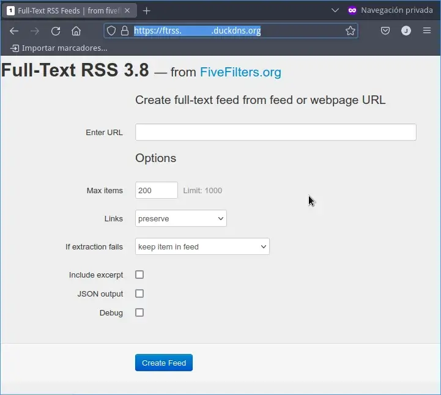

Hay ocasiones en que levantamos un servicio autoalojado que no tienen ningún método de autenticación con usuario y contraseña. Esto significa que este servicio estará abierto a todo el mundo y será un problema en el caso que no queramos abrir el servicio al público. Si se encuentran en esta situación y están usando el [proxy inverso traefik]() pueden usar un middleware de autenticación básico del modo que verán en este artículo. De este forma todo usuario que quiera usar el servicio tendrá que introducir un usuario y su correspondiente contraseña.<!--more-->

## DEFINIR LAS CREDENCIALES DE AUTENTICACIÓN PARA ACCEDER AL SERVICIO

Lo primero que tenemos que realizar es definir un usuario y una contraseña para acceder al servicio. Si por ejemplo quieren generar un usuario con nombre `geekland` que tenga la contraseña `1234` deberán ejecutar el siguiente comando:

> ```shell
> echo $(htpasswd -nB geekland) | sed -e s/\\$/\\$\\$/g
> ```

Una vez ejecutado el comando tendremos que teclear 2 veces la contraseña que queremos para el usuario `geekland`. En mi caso he definido que la contraseña sea `1234`

> ```shell
> New password: 1234
> Re-type new password: 1234
> ```

Finalmente obtendremos nuestro usuario y nuestra contraseña en forma de hash. Guarden bien el usuario y la contraseña en forma de hash porque tendremos que usarlos a posterior para configurar el middleware de autenticación básico de Traefik.

> ```shell
> geekland:$$7y$$05$$fYQlLhS5TksK3Ir4KtzpbeWyU4g2lqSJLkHzInCeW5FZcKQ5vP3z.
> ```

**Nota:** Si lo precisan pueden generan múltiples usuarios y contraseñas para un mismo servicio.

## AÑADIR LA AUTENTICACIÓN SIMPLE MEDIANTE USUARIO Y CONTRASEÑA A UN SERVICIO MEDIANTE EL PROXY INVERSO TRAEFIK

Una vez tengo el usuario y la contraseña en forma de hash iré al docker-compose del servicio en que quiero añadir la autenticación con usuario y contraseña. Por ejemplo el docker-compose que usamos en el artículo anterior era el siguiente:

```shell
version: '3.7'
services:

  fullfeedrss:
    build: .
    image: "heussd/fivefilters-full-text-rss:latest"
    environment:
      # Leave empty to disable admin section
      - FTR_ADMIN_PASSWORD=
    volumes:
      - "rss-cache:/var/www/html/cache"
    ports:
      - "8086:80"

    networks:
      - web

    labels:
      - traefik.http.routers.ftrss.rule=Host(`ftrss.geekland.duckdns.org`)
      - traefik.http.routers.ftrss.tls=true
      - traefik.http.routers.ftrss.tls.certresolver=lets-encrypt
      - traefik.docker.network=web
      - traefik.port=8086
      - traefik.enable=true

volumes:
  rss-cache:

networks:
  web:
    external: true

```

Si obserbamos las etiquetas del docker-compose vemos que son las siguientes:

```
labels:
  - traefik.http.routers.ftrss.rule=Host(`ftrss.geekland.duckdns.org`)
  - traefik.http.routers.ftrss.tls=true
  - traefik.http.routers.ftrss.tls.certresolver=lets-encrypt
  - traefik.docker.network=web
  - traefik.port=8086
  - traefik.enable=true
```

Para añadir la autenticación tan solo tendremos que añadir las siguientes 2 líneas a las etiquetas del docker compose:

```shell
  - traefik.http.middlewares.ftrss-auth.basicauth.users=geekland:$$7y$$05$$fYQlLhS5TksK3Ir4KtzpbeWyU4g2lqSJLkHzInCeW5FZcKQ5vP3z.
  - traefik.http.routers.ftrss.middlewares=ftrss-auth@docker
```

**Nota:** La primera de las líneas define un middleware de autenticación básico que tiene el nombre `ftrss-auth`. Si queréis usar otro nombre para el middleware deberéis reemplazar `ftrss-auth` por el nombre que quieran usar. También deberéis reemplazar `geekland:$$7y$$05$$fYQlLhS5TksK3Ir4KtzpbeWyU4g2lqSJLkHzInCeW5FZcKQ5vP3z.` por el usuario y contraseña en forma de hash que hayan obtenido en el apartado anterior.

**Nota:** En la segunda de la líneas lo que se realiza es conectar el middlware `ftrss-auth` con el router `ftrss`. En vuestro deberéis reemplazar `ftrss-auth` y `ftrss` por el nombre del router y middleware que necesitan interconectar.

Una vez añadidas las 2 líneas el docker-compose quedará de la siguiente forma:

```shell
version: '3.7'
services:

  fullfeedrss:
    build: .
    image: "heussd/fivefilters-full-text-rss:latest"
    environment:
      # Leave empty to disable admin section
      - FTR_ADMIN_PASSWORD=
    volumes:
      - "rss-cache:/var/www/html/cache"
    ports:
      - "8086:80"

    networks:
      - web

    labels:
      - traefik.http.routers.ftrss.rule=Host(`ftrss.geekland.duckdns.org`)
      - traefik.http.routers.ftrss.tls=true
      - traefik.http.routers.ftrss.tls.certresolver=lets-encrypt
      - traefik.http.middlewares.ftrss-auth.basicauth.users=geekland:$$7y$$05$$fYQlLhS5TksK3Ir4KtzpbeWyU4g2lqSJLkHzInCeW5FZcKQ5vP3z.
      - traefik.http.routers.ftrss.middlewares=ftrss-auth@docker
      - traefik.docker.network=web
      - traefik.port=8086
      - traefik.enable=true

volumes:
  rss-cache:

networks:
  web:
    external: true
```

Finalmente tan solo tienen que guardar los cambios y cerrar el fichero. Para ver que todo funciona a la perfección pararemos el contenedor `fivefilters-full-text-rss-docker_fullfeedrss_1`, lo eliminaremos y lo volveremos a levantar de nuevo. Para ello ejecutaremos los siguientes comandos en la terminal.

Con el fin de parar el contenedor:

> ```shell
> docker stop fivefilters-full-text-rss-docker_fullfeedrss_1
> ```

Para eliminar el contenedor:

> ```shell
> docker rm fivefilters-full-text-rss-docker_fullfeedrss_1
> ```

Finalmente para levantar el nuevo contenedor con el middleware de autenticación básico:

> ```shell
> docker-compose up -d
> ```

## COMPROBAR QUE NUESTRO SERVICIO TIENE AUTENTICACIÓN POR USUARIO Y POR CONTRASEÑA

Acto seguido intenten acceder al servicio que acaban de levantar y verán que se les pide un usuario y contraseña. Una vez los hayan introducido presionan sobre el botón Iniciar sesión.


Si el usuario y la contraseña son correctas podrán acceder y usar el servicio sin ningún tipo de problema. En caso que no sea así no podrán usar el servicio.



En el caso que lo crean necesario también pueden usar Traefik y Fail2ban para bloquear a los usuarios que introduzcan las credenciales incorrectamente de forma reiterada. Para ello pueden usar las instrucciones que encontrarán en el siguiente enlace:

https://geekland.eu/usar-fail2ban-con-traefik-para-proteger-servicios-que-corren-en-docker/

#### Fuentes

[https://doc.traefik.io/traefik/middlewares/http/basicauth/](https://doc.traefik.io/traefik/middlewares/http/basicauth/)
