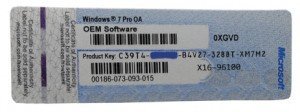
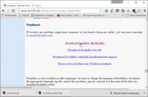
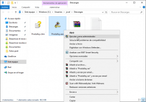
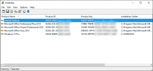

Es posible que muchos de vosotros tengáis instalado Microsoft Windows, Microsoft Office y otros productos de Microsoft en vuestro ordenador y desconozcáis por completo su clave de activación. Por este motivo escribo el siguiente post en el que se detalla cómo podemos averiguar la clave de activación de diversos productos de Microsoft como por ejemplo Windows, Office, Explorer, etc.<!--more-->

## RAZONES HABITUALES POR LAS QUE NO SABEMOS NUESTRA CLAVE DE ACTIVACIÓN

La gran mayoría de usuarios de productos de Microsoft desconocen su clave de activación y los motivos para ello pueden ser variados. Algunos de ellos pueden ser los siguientes:

1. Los CD y los documentos del producto original se pierden o se tiran.
2. En ocasiones se han instalado sistemas operativos Windows 10 a través del programa Insider Preview y después de instalarlo los usuarios han perdido la clave de activación que se les dio.
3. Las pegatinas de nuestro ordenador que contienen esta información se borran o simplemente no están.
4. Si actualizamos a Windows 10 a partir de Windows 7 o Windows 8.

## CONSECUENCIAS DE PERDER UNA CLAVE DE ACTIVACIÓN

El hecho de perder la clave de activación es algo importante. **La función de la clave de activación es activar un software** como por ejemplo Windows. Además la clave de activación es la encargada de demostrar que somos los propietarios de una licencia legítima.

Por lo tanto **si perdemos nuestra clave de activación**, la próxima vez que instalemos Windows o cualquier otro producto de Microsoft nos encontraremos con los siguientes problemas:

1. **No podremos activar el producto**. Al no poder activar el producto no podremos usar la totalidad de características y funciones del Software.
2. Al haber perdido la clave de activación **no nos quedará más remedio que volver a comprar el producto**.
3. **En el caso de tratarse de Windows 10 habremos perdido una licencia de por vida**. Cabe recordar que Windows otorga una licencia de por vida de Windows 10 a todos los usuarios que actualicen a Windows 10 antes del 29 de Julio de 2016.

Por estos motivos es importante que todo el mundo sepa en todo momento cuales son las claves de activación del software que tienen instalado en su equipo.

## REQUISITOS PARA SEGUIR LAS INSTRUCCIONES DE ESTE POST

Tener los productos de Microsoft instalados y activados en el equipo. En el caso de no estar activados quiere decir que nunca habremos usado una clave de activación y por lo tanto no tiene sentido intentar averiguarla porque nunca la hemos tenido.

## RECUPERAR NUESTRA CLAVE DE ACTIVACIÓN DE WINDOWS Y OFFICE

Lo primero que debemos realizar es **mirar la documentación del producto** del cual hemos perdido la clave de activación. En caso de no tener éxito otra posibilidad es la de **mirar si nuestro ordenador dispone de pegatinas similares a la siguiente**:

Como se puede ver en foto, en este tipo de pegatinas acostumbra a venir la clave de activación. Por lo general está pegatina está en la parte trasera de las torres o de los ordenadores portátiles.

En el caso que tampoco existan esta pegatinas podemos **usar el Software Produkey**. Para usar este software primero **lo tenemos que descargar accediendo a la siguiente página Web**:

[http://www.nirsoft.net/utils/product\_cd\_key\_viewer.html](http://www.nirsoft.net/utils/product_cd_key_viewer.html "Web de descarga del software Produkey")

Una vez dentro de la página web, tal y como se puede ver en la captura de pantalla, nos **vamos a la parte inferior de la página y presionamos sobre el link de descarga**.

Una vez realizada la descarga **descomprimimos el archivo zip que hemos descargado** y seguidamente, tal y como se puede ver en la captura de pantalla, **seleccionamos el archivo Prodykey.exe, presionamos el botón derecho del ratón y cuando aparezca el menú contextual clicamos encima de la opción Ejecutar como administrador**.

**Segundos después**, tal y como se puede ver en la captura de pantalla, **obtendremos la clave de activación de varios de los productos de Microsoft** que tenemos instalados en nuestro equipo.

Algunos de los productos de los cuales hemos obtenido la clave de activación son:

1. Internet Explorer.
2. Microsoft Office.
3. Windows 10.

Una vez tengamos nuestras claves de activación las deberemos guardar en un sitio seguro por si las necesitamos en un futuro.
