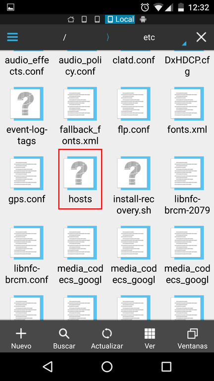
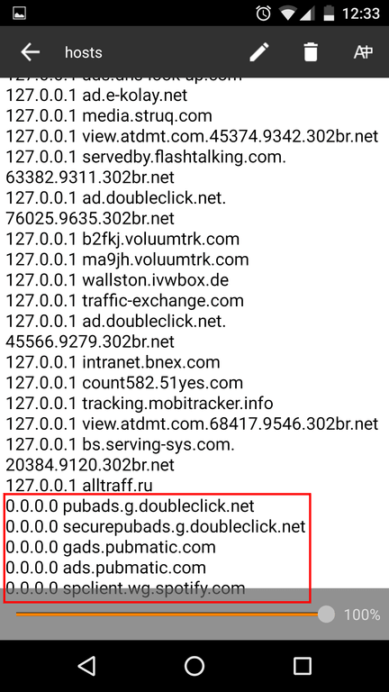
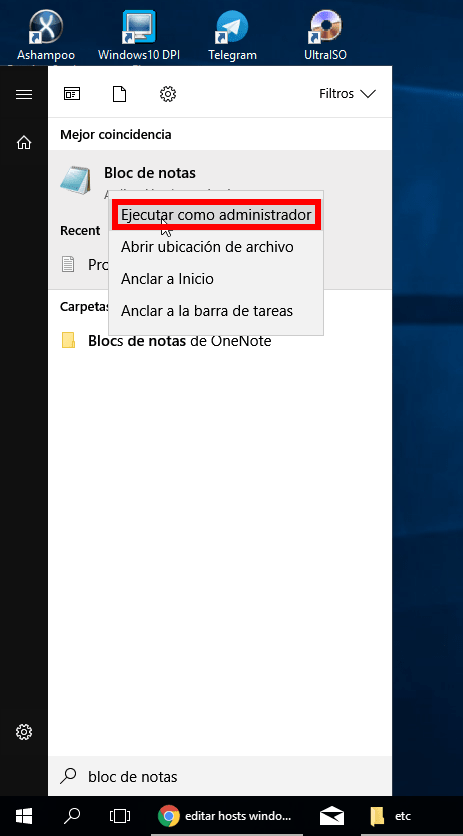
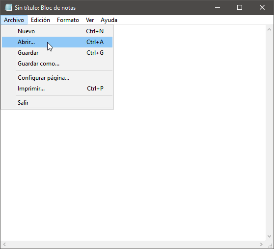
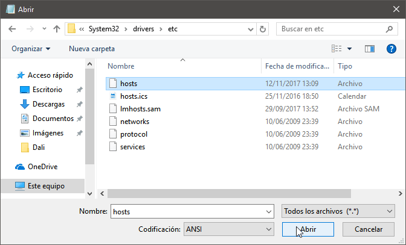
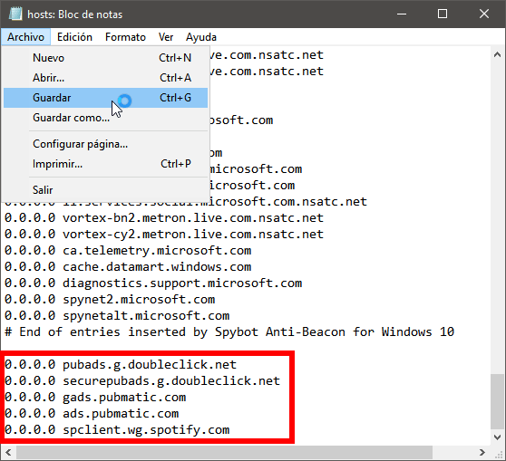
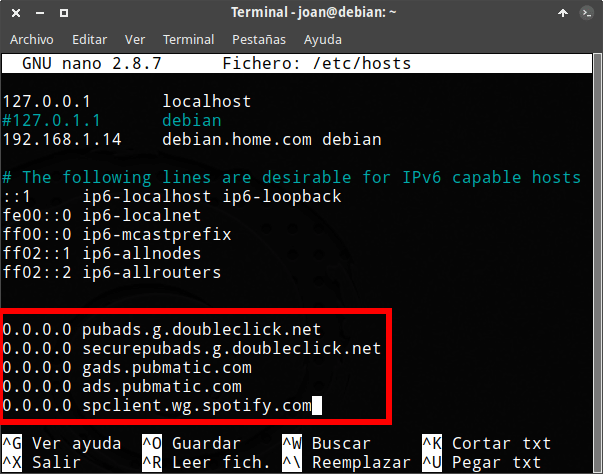
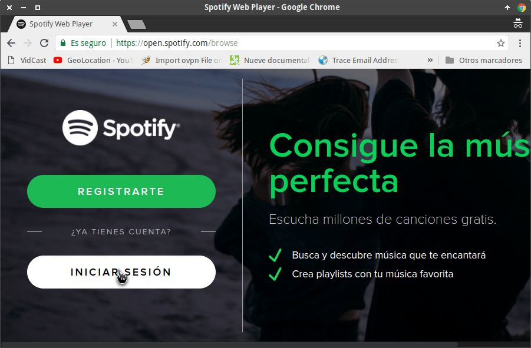

A través del canal de Youtube [Alternativa a Windows](https://www.youtube.com/watch?v=-_fXSbz5CAc) me enteré que en la actualidad es sumamente fácil bloquear la publicidad de Spotify tanto en Windows, como en Android como en Linux.

El procedimiento para ello es extremadamente sencillo. Únicamente tenemos que añadir 5 líneas en el archivo hosts del siguiente modo.<!--more-->

## BLOQUEAR LA PUBLICIDAD DE SPOTIFY EN ANDROID

Para bloquear la publicidad de Spotify en Android necesitamos disponer de un terminal con acceso root.

A continuación también precisamos un explorador de archivos que permita el acceso como Root. En mi caso [ES Explorer](https://play.google.com/store/apps/details?id=com.estrongs.android.pop.pro "Link para instalar ES Explorer en Android"), pero pueden usar otras aplicaciones como por ejemplo [Root Explorer](https://play.google.com/store/apps/details?id=com.speedsoftware.rootexplorer&hl=es "Link para instalar Root Explorer en Android").

Si cumplimos con los requisitos mínimos para aplicar este método abrimos el explorador de archivos, que en mi caso ES Explorer, y navegamos en la ubicación **/system/etc**.

Dentro de la ubicación encontraremos el archivos hosts. Para editarlo tan solo tenemos que presionar encima del archivo y seleccionar el editor de textos que queremos usar.

[](images/editar-archivo-hosts-android.png)

Una vez se abra el editor de textos nos vamos al final del archivos hosts y pegamos el siguiente código:

> ```
> 0.0.0.0 pubads.g.doubleclick.net
> 0.0.0.0 securepubads.g.doubleclick.net
> 0.0.0.0 gads.pubmatic.com
> 0.0.0.0 ads.pubmatic.com
> 0.0.0.0 spclient.wg.spotify.com
> ```

En mi caso, después de realizar las modificación el archivo hosts queda del siguiente modo:

[](images/archivo-hosts-android-modificado.png)

Guardamos los cambios realizados y seguidamente reiniciamos nuestro teléfono. La próxima vez que iniciemos Spotify ya no aparecerá ningún tipo de anuncio en la aplicación.

###### Nota: Este método funciona para versiones de Spotify iguales o inferiores a la 8.4.42.722. Si usan una versión superior deberán hacer un downgrade de la app de Spotify.

## BLOQUEAR LA PUBLICIDAD DE SPOTIFY EN WINDOWS

El primer paso a realizar es abrir el bloc de notas con derechos de administrador.

Para ello escribimos bloc de notas en el campo de búsqueda de Windows.

Una vez encontrado el programa posicionamos el puntero del ratón sobre el y cuando aparezca el menú contextual clicamos encima de la opción Ejecutar como administrador.

[](images/ejecutar-administrador-bloc-de-notas.png)

Cuando se abra el bloc de notas presionamos la tecla Ctrl+A o nos vamos al menú Archivo y clicamos en la opción Abrir.

[](images/abrir-archivo-bloc-de-notas.png)

A continuación navegamos a la ubicación **C:/windows/system32/drivers/etc**. Dentro de esta ubicación seleccionamos el archivo **hosts** y presionamos el botón Abrir.

[](images/abrir-archivo-hosts-como-administrador.png)

Finalmente pegamos el siguiente código en el archivo hosts y guardamos los cambios:

> ```
> 0.0.0.0 pubads.g.doubleclick.net
> 0.0.0.0 securepubads.g.doubleclick.net
> 0.0.0.0 gads.pubmatic.com
> 0.0.0.0 ads.pubmatic.com
> 0.0.0.0 spclient.wg.spotify.com
> ```

En mi caso, después de realizar todo el proceso el archivo hosts queda del siguiente modo:

[](images/hosts-modicado-bloquear-publicidad.png)[](images/hosts-modicado-bloquear-publicidad.png)

En estos momentos ya puedo estar seguro que la próxima vez que inicie Spotify no recibiré ningún tipo de anuncio.

## BLOQUEAR LA PUBLICIDAD DE SPOTIFY EN LINUX

En el caso que queramos bloquear la publicidad de Spotify en Linux editaremos el fichero hosts ejecutando el siguiente comando en la terminal:

> ```
> sudo nano /etc/hosts
> ```

Una vez se abra el editor de textos pegamos el siguiente código al final del archivo:

> ```
> 0.0.0.0 pubads.g.doubleclick.net
> 0.0.0.0 securepubads.g.doubleclick.net
> 0.0.0.0 gads.pubmatic.com
> 0.0.0.0 ads.pubmatic.com
> 0.0.0.0 spclient.wg.spotify.com
> ```

Una vez realizados los cambios mi fichero hosts queda del siguiente modo:

[](images/archivo-hosts-linux-bloquear-publicidad-spotify.png)

Finalmente guardamos los cambios realizados. La próxima vez que iniciemos Spotify, tal y como se puede ver en la captura de pantalla, no contendrá ningún rastro de publicidad.

## OPCIONES ALTERNATIVAS PARA BLOQUEAR LA PUBLICIDAD DE SPOTIFY

Si únicamente usan Spotify en el ordenador pueden usar el servicio web de Spotify. A diferencia de la aplicación de Spotify, el servicio web de Spotify no contiene publicidad.

Para usar el servicio web de spotify tan solo tienen que ingresar en la siguiente URL

[https://open.spotify.com/browse](https://open.spotify.com/browse "Acceso al servicio web de Spotify")

Clican encima del botón Iniciar Sesión y seguidamente introducen su usuario y contraseña.

[](images/iniciar-sesion-spotify-web.png)

Una vez logueados podrán disfrutar del servicio de Spotify sin ningún tipo de problema.
