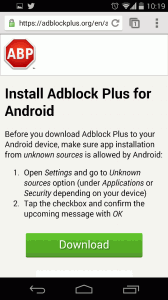
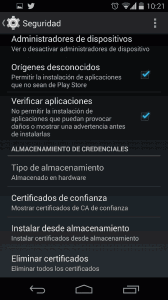
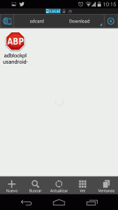
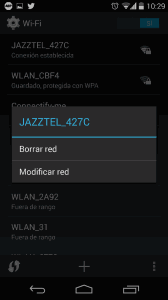
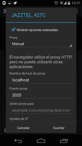
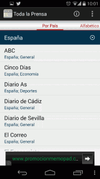
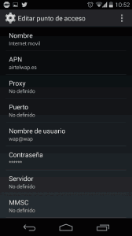
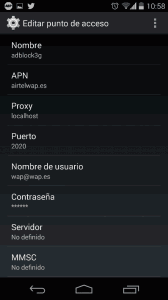
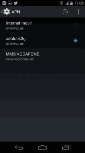
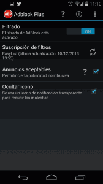

**Realmente hoy en día en Android pienso que existen pocos motivos para rootear nuestro teléfono**. Los único motivos de peso son probar ROM modificadas o instalar alguna aplicación que requiera de acceso Root. **Otro de los motivos que se me podría ocurrir es la bloquear los molestos anuncios que aparecen en algunas apps y cuando estas navegando, pero hoy en día para librarte de los anuncios ya no necesitamos ser root gracias a** [Adblock Plus](https://adblockplus.org/es/chrome "Web de Adblock Plus") para Android.<!--more-->

**Con Adblock Plus sin necesidad de ser root conseguiremos bloquear prácticamente la totalidad de publicidad existente en nuestro navegador web y en las aplicaciones. Adblock plus funciona tanto en 3G como con Wifi.**

###### Nota: En el caso de ser root existen otras muy buenas aplicaciones para bloquear la publicidad en aplicaciones. Una de ellas se llama [Adfree](http://adfree.bigtincan.com/ "Web de Adfree"). Otras aplicación útiles para remover la publicidad y crackear aplicaciones son [Adaway](http://sufficientlysecure.org/index.php/adaway/ "Web de Adaway") y [Lucky Patcher](http://lucky-patcher.netbew.com/ "Web de Lucky Patcher").

## ¿QUE ES ADBLOCK PLUS?

Adblock plus **es un proyecto de código abierto desarrollado por y para la comunidad**. El fin de Adblock plus es conseguir que Internet sea un lugar mejor. Para conseguir que Internet sea un lugar mejor, **Adblock Plus lucha para eliminar todo tipo de publicidad intrusiva que suele aparecer en [Banners](https://es.wikipedia.org/wiki/Banner "Explicación de que es un Banner"), [Overlays](http://pyme.lavoztx.com/qu-es-una-publicidad-overlay-9327.html "Explicación de la publicidad Overlay"), [pop-ups o ventanas emergentes](https://es.wikipedia.org/wiki/Ventana_emergente "Explicación de que es un Pop-up"), etc**.

Para lograr esto objetivo multitud de voluntarios actualmente están contribuyendo en el desarrollo y mantenimiento de está aplicación.

Personalmente **pienso que la cantidad de publicidad que podemos encontrar en la red no es para nada normal**. Tan solo tenéis que usar el teléfono u ordenador sin ningún tipo de bloqueador de publicidad para daros cuenta que esto de la publicidad es una auténtica pesadilla.

Además **no es lógico que después de comprar un ordenador, teléfono o tablet y estar pagando mensualmente una conexión a internet, hayan empresas y personas que persigan sacar un beneficio de nosotros colocándonos publicidad con calzador a los sitios que acostumbramos a visitar**. Después de pagar nuestros dispositivos y nuestra conexión a internet deberíamos ser capaces de seleccionar y filtrar el contenido que aparece en nuestra pantalla.

Muchos de vosotros quizás pensaréis que la publicidad es un medio para los desarrolladores para monetizar su trabajo, pero lo que no puede ser es que compres un teléfono como por ejemplo un [Nexus 5](http://www.google.es/nexus/5/ "Web de compra del Nexus 5"), y no tengas una aplicación para SMS que no incluya publicidad. Incluso estaba dispuesto a pasar por caja pero ni así conseguí una aplicación libre de publicidad. Desde luego este problema en iOS está mucho mejor resuelto que en Android.

## INSTALAR ADBLOCK PLUS EN ANDROID

**Inicialmente Adblock Plus fue una aplicación que aceptaron en el Google Play**, **pero** imagino que por razones obvias, **Google decidió retirarl**a de su tienda ya que Google en principio se gana la vida con la publicidad. **Además se rumorea que Google ha pagado a Adblock plus para que su publicidad no sea bloqueada**. Si esto es verdad, bajo mi punto de vista, es un punto negativo para los desarrolladores de Adblock Plus.

**A pesar de todo lo que cuento** y de la retirada de la aplicación de la tienda de Google a día de hoy **podemos instalar Adblock Plus en Android fácilmente ejecutando los siguientes pasos:**

**El Primer paso** que hay que realizar **es ingresar la siguiente dirección en el navegador web**:

[https://adblockplus.org/en/android-install](https://adblockplus.org/en/android-install "Web para descargar Adblock Plus")

###### Nota: Es importante descargar adblock plus del link que proporciono que es el de la página oficial de adblock plus. Desde que la aplicación de adblock Plus fue retirada de google han aparecido muchas imitaciones de esta aplicación que en realidad son malware. Incluso en Google Play se han colgado imitaciones maliciosas de esta aplicación.

Una vez hemos accedido a la web de Adblock ahora tenemos que descargar la aplicación. **Para descargar la aplicación tenemos que presionar sobre el botón** **INSTALAR** que podrán ver en la pantalla de su teléfono.

Después de presionar el botón instalar aparecerá la siguiente captura de pantalla:

**Seguidamente tenemos que presionar el botón de color verde** **DOWNLOAD**. Una vez presionado el botón **DOWNLOAD** de descargará la aplicación y se guardará en la ubicación que tenemos configurada por defecto en nuestro teléfono. En mi caso la ubicación es **/sdcard/Download**.

**Ahora tenemos que comprobar que este permitida la instalación de archivos de Orígen desconocido**. **Para ellos nos vamos al menú** **Ajustes** **y** seguidamente **seleccionamos** la opción **Seguridad**. **Dentro de este menú tal y como pueden ver en la captura de pantalla tienen que activar la opción Orígenes desconocidos**.

Una vez activada la instalación de orígenes desconocidos **tenemos que abrir nuestro navegador de archivos y navegar hasta encontrar el archivo .apk de adblock plus** que hace unos instantes nos acabamos de descargar. Como se puede ver en la captura de pantalla, en mi caso tengo que navegar hasta la ruta **/sdcard/Download**

**Una vez encontrado el archivo .apk de Adblock Plus tan solo tenemos hacer click encima del icono y elegir la opción** **INSTALAR**.

Una vez realizados los pasos mencionados ya tenemos Adblock Plus instalado en nuestro teléfono. Ahora tan solo nos falta configurarlo para que pueda bloquear la totalidad de la publicidad.

###### Nota: Otra opción para instalar Adblock plus es a través de tiendas alternativas como por ejemplo Aptoide o Blackmart. No obstante siempre es mucho más fiable instalar la aplicación de la fuente original.

## CONFIGURAR ADBLOCK PLUS PARA EL USO CON WIFI

Lo primero que haremos es entrar en una página web cualquiera que contenga publicidad. En mi caso he elegido la página web de Marca.

###### Nota:  Solo hacer falta observar la captura de pantalla para ver que en la parte superior aparecen anuncios.

Pare remover este anuncio o cualquier anuncio que aparezca en cualquier aplicación tenemos que seguir los siguientes pasos:

**1-** **Accedemos dentro de los Ajustes** de nuestro teléfono.

**2-** Dentro de los ajustes de nuestro teléfono **seleccionamos la opción Wi-Fi**.

**3-** Seguidamente **realizamos una presión larga encima de la red Wifi donde estamos conectados**, y nos aparecerán las siguientes opciones:

**4-** Seguidamente **seleccionamos la opción Modificar Red**.

**5-** Una vez seleccionada la opción modificar Red se abrirá una ventana. Una vez abierta la ventana tienen que ir a **buscar la opción Mostrar opciones avanzadas y seleccionarla**.

**6-** Una vez activadas las opciones avanzadas **tienen que rellenar las opciones Proxy, Nombre de host de proxy y Puerto proxy tal y como se muestra en la siguiente captura de pantalla**:

Tal y como se puede ver en la captura de pantalla **en el apartado Proxy tenemos que elegir Manual**. **En el apartado que pone Nombre de host de proxy tienen que escribir localhost** y **en el apartado Puerto de proxy tienen que escribir 2020**. **Una vez terminados estos pasos tan solo tienen que apretar en Guardar.**

Para comprobar que la configuración funciona perfectamente tan solo tenemos volver a acceder a la página web donde anteriormente aparecía publicidad:

Como se puede ver en la captura de pantalla ahora no aparece la publicidad. Por lo tanto podemos decir que Adblock Plus está funcionando adecuadamente.

## CONFIGURAR ADBLOCK PLUS PARA EL USO CON DATOS

Acabamos de configurar nuestra conexión wifi para que bloquee la publicidad. **Ahora deberemos realizar los pasos equivalentes para bloquear la publicidad en el caso que nos conectemos con nuestro plan de datos.**

Lo primero que realizaremos es abrir una aplicación cualquiera:

Como se puede ver en la captura de pantalla la aplicación abierta contiene publicidad en la parte inferior de la pantalla, que para mi gusto es muy intrusiva y molesta. Para eliminarla tan solo tenemos que seguir los siguientes pasos:

**1-** **Accedemos dentro de los** **Ajustes** de nuestro teléfono.

**2-** Dentro de los ajustes de nuestro teléfono **seleccionamos la opción Más...**.

**3-** Una vez hemos seleccionado la opción Más... se abrirá otra pantalla y entonces tendremos que **seleccionar la opción Redes móviles**.

**4-** Dentro del menú de Redes móviles **seleccionamos la opción APN**. Una vez seleccionada la opción APN aparecerá la siguiente captura de pantalla:

En la captura de pantalla podemos ver que tengo configurado un punto de acceso [APN](https://es.wikipedia.org/wiki/Nombre_de_punto_de_acceso "Explicación de que es un APN") que es airtelwap.es. Vosotros en función de la compañía telefónica que tengáis es posible que vuestro punto de acceso APN sea diferente.

**5-** **Clicamos encima de la red APN que tengamos configurada**, que en mi caso es airtelwap.es, y se abrirá la siguiente ventana donde se pueden ver la totalidad de parámetros de configuración del punto de acceso APN:

**6-** Una vez abierta la ventana tienen que **anotar cuidadosamente, o hacer una foto, de las opciones de configuración de nuestro punto de acceso APN**. **En la captura de pantalla pueden ver que hay una opción que pone contraseña y no podemos ver. Para averiguar cual es vuestra contraseña pueden consultar los siguientes post:**

[Link 1 para poder consultar la contraseña APN](http://wiki.bandaancha.st/APN_de_las_operadoras_para_configurar_el_m%C3%B3dem_de_Internet_m%C3%B3vil_3G "Consultar contraseñas APN")

[Link 2 para poder consultar la contraseña APN](http://www.tecnologiacero.com/consejos/apn-de-las-companias-espanolas "Consultar contraseñas APN")

[Link 3 para poder consultar la contraseña APN](http://www.elandroidelibre.com/2010/04/todas-las-apn-para-tu-android.html "Consultar contraseñas APN")

**Después de consultar los post que acabo de citar como en mi caso el APN que tengo es airtelwap.es mi contraseña es wap125**.

###### Nota: Si después de buscar en los links que os dejo no encontráis la contraseña de vuestro APN tendréis que usar google y buscarla por vuestra cuenta. Si no la encontráis podéis llamar a vuestra compañía telefónica.

**7-** Una vez disponemos de todos los datos, incluida nuestra contraseña, **crearemos un nuevo APN. Para crear el nuevo APN cuando están en la siguiente pantalla tienen que apretar el botón +**.

**8-** Una vez presionado el botón + se abrirá una ventana donde tendrán que **introducir los datos de vuestro nuevo APN**. **Los datos del nuevo APN tienen que ser exactamente los mismos que los anotados en el punto 6 con excepción de los siguientes campos:**

**Nombre:** **Elegir uno cualquiera que sea diferente del actual APN**. **En mi caso** como se puede ver en la captura de pantalla he elegido **adblock3G**.

**Proxy:** En este campo elegimos la opción **localhost**.De este modo estamos indicando que estamos configurando un proxy local.

**Puerto:** En este campo elegimos la opción **2020**. De este modo estamos indicando indicando que nuestro proxy local estará escuchando en el puerto 2020.

Una vez introducidos todos los datos vuestro menú tiene que tener un aspecto parecido al siguiente:

**Ahora tan solo tenemos tenemos que guardar la configuración introducida y el proceso de configuración del nuevo APN ha concluido.**

**9-** **Una vez concluida la configuración del nuevo APN lo vamos a activar**. **Para activarlo tienen que ir dentro del menú** **Ajustes / Más... / Redes móviles / APN**. Una vez dentro del menú verán que ahora tendremos 2 puntos de acceso. El que venia configurado de serie y el que acabamos de crear:

Tal y como se puede ver en la captura de pantalla tan solo **tenemos que seleccionar y clicar encima del nuevo APN y el proceso ha concluido.**

Ahora tan solo falta comprobar que todo funciona a la perfección. Por lo tanto volveremos a acceder a la misma aplicación que al principio hemos visto que tenia publicidad.

Como se puede ver en la captura de pantalla ahora la publicidad ha desaparecido completamente. Por lo tanto ya podemos dar el proceso por concluido.

## OPCIONES DE CONFIGURACIÓN DE ADBLOCK PLUS

A partir de estos momentos todo funciona a la perfección. **Es posible que a alguien de vosotros le moleste el icono ABP que aparece en la parte izquierda del menú superior. En el caso que quieran ocultar el icono tan solo tienen que acceder dentro de la aplicación de Adblock Plus y activar la opción Ocultar icono**. Una vez realizado el proceso el icono desaparecerá.

El filtro de anuncios que lleva por defecto Adblock Plus es Easy List. **En el caso que quieran reemplazar el filtro que lleva por defecto tan solo tienen que clicar encima de la opción Suscripción del filtros**, que pueden ver en la captura de pantalla, y seleccionar otro filtro.

## ¿CÓMO FUNCIONA ADBLOCK PLUS?

Como se puede ver en la configuración de Adblock Plus, estamos configurando un proxy local en el puerto 2020.

Esto significa que **la totalidad de tráfico y peticiones que generamos son forzadas a salir por un proxy local ubicado en el puerto 2020 hasta los servidores de Adblock Plus**.

**En los servidores de Adblock plus es donde se procesará la información y donde se realizará el filtrado de anuncios** analizando nuestras peticiones [http](https://es.wikipedia.org/wiki/HTTP "Explicación de que es http") de acuerdo a su dirección de origen y bloqueando [Iframes](https://es.wikipedia.org/wiki/IFrame "Explicación de que es un Iframe"), [Scripts](https://es.wikipedia.org/wiki/JavaScript "Explicación de lo que es un Script"), [Flash](https://es.wikipedia.org/wiki/Adobe_Flash "Explicación de lo que es Flash"), etc, en función de una lista negra.

**Una vez realizado el filtrado de la información, Adblock plus nos enviará el resultado de nuestra petición pero con la publicidad bloqueada**.

## POSIBLES INCONVENIENTES QUE PUEDE GENERAR ADBLOCK PLUS

Ya llevo cerca de un mes utilizando Adblock plus y la verdad es que **funciona aceptablemente bien**. **Pienso mantenerlo instalado hasta que al menos no aparezca una opción mejor** para eliminar la publicidad.

Según mi experiencia **los únicos puntos de mejora de adblock plus son los siguientes**:

1. **Es posible que alguna vez el teléfono se nos quedé sin conexión a internet**. Para volver a recuperar la conexión tan solo tienen que desactivar y volver a activar Adblock Plus. Afortunadamente esto problema sucede con muy poca frecuencia.
2. **Me da la sensación que el** [ping](https://es.wikipedia.org/wiki/Ping "Explicación de que es el Ping") **para conectarte a las paginas web es ligeramente más elevado cuando estamos usando adblock plus**. Seguramente esto se produce porqué nuestro tráfico tiene que salir por el proxy local que hemos configurado. A pesar de esto hecho merece la pena usar Adblock Plus.
3. Realmente este punto no es un problema pero vale la pena comentar que si miráis vuestros datos veréis que Adblock Plus consumirá bastantes datos. Con total seguridad será la aplicación que consumirá más datos pero esto es normal debido a que prácticamente la totalidad del tráfico generado tendrá que pasar por el proxy local que hemos creado. Esto ocasionará que Android atribuya el tráfico generado por nuestro navegador, whatsapp u otras aplicaciones a Adblock Plus. En realidad el consumo de datos debe ser menor ya que evitaremos cargar la publicidad de muchos sitios webs y de las apps.
