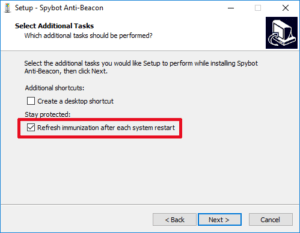
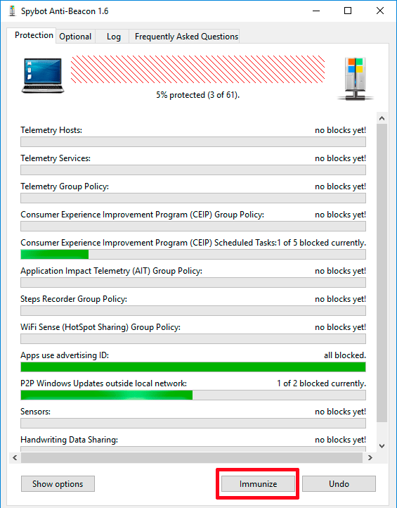
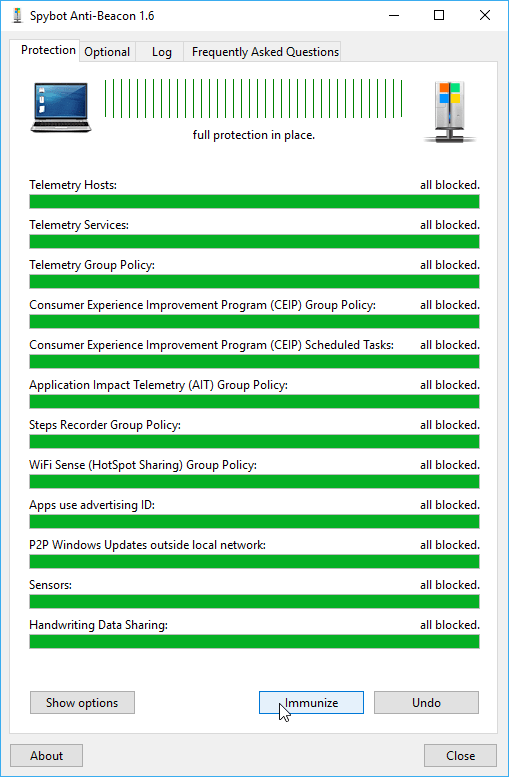
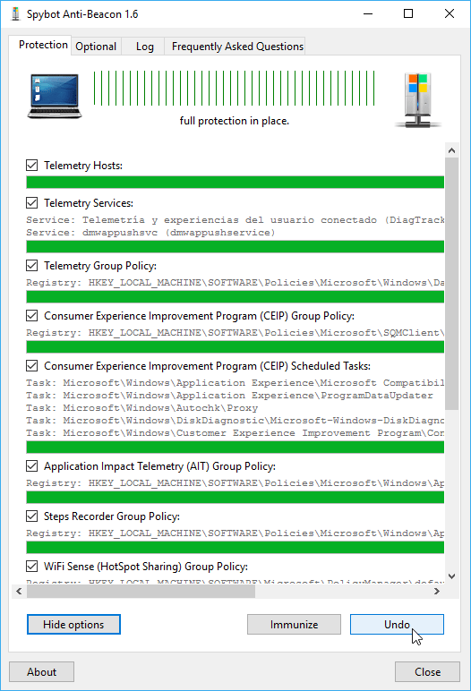
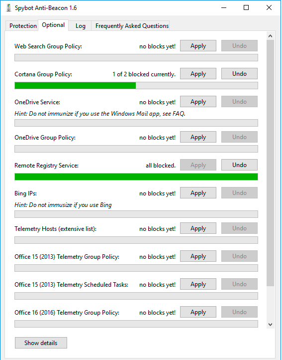
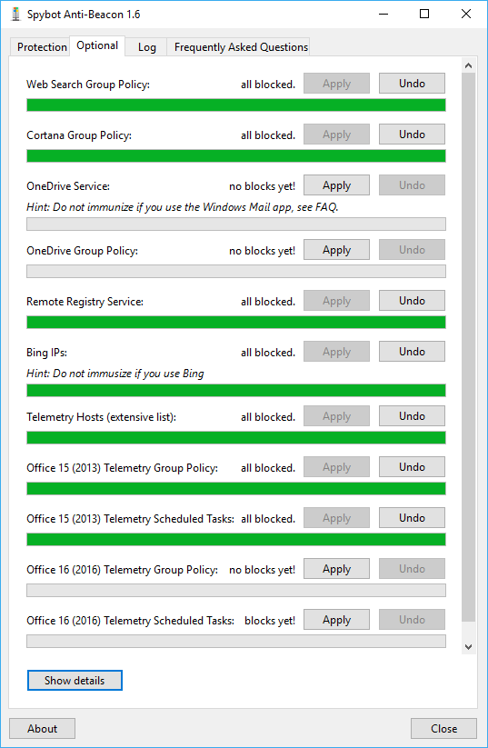
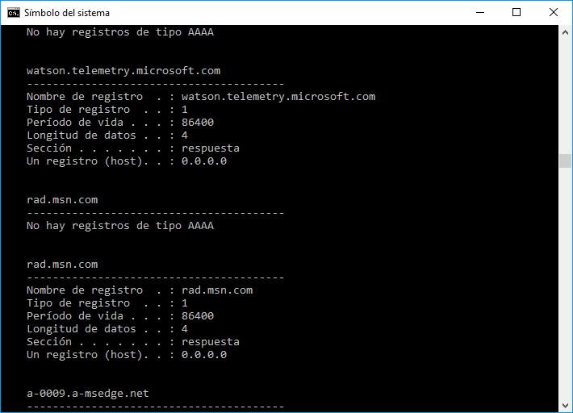

Hace unas semanas vimos las instrucciones para [configurar las opciones de privacidad en Windows](). A pesar de configurar las opciones de privacidad, Windows sigue recopilando datos de sus usuarios de forma inevitable porque no ofrece las herramientas necesarias para configurar de forma adecuada nuestra privacidad. Para solucionar este problema en este artículo les presentaré el programa Spybot Anti-Beacon.<!--more-->

## ¿QUE HACE SPYBOT ANTI-BEACON?

Spybot Anti-Beacon es un software cuyo objetivo principal es bloquear la totalidad de datos telemétricos que Microsoft recopila de nuestros equipos.

Con los datos telemétricos Microsoft obtiene información del funcionamiento del sistema operativo y de esta forma pueden corregir problemas. No obstante existen muchos usuarios que no se fían de las intenciones de Microsoft y hacen bien porque con el rumbo que ha tomado la tecnología me costaría creer que únicamente se capturen los datos para mejorar el rendimiento de Windows.

Aparte de bloquear el envío de datos telemétricos, Spybot también realiza otras funciones como por ejemplo las siguientes:

1. Evitar que Microsoft pueda usar nuestro ancho de banda para actualizar equipos con Windows fuera de nuestra red local. En mi caso no me apetece que un desconocido use mi ancho de banda para descargar parte de las actualizaciones que se han descargado en mi PC.
2. Eliminar la posibilidad de conectarnos a redes Wifi que Windows nos sugiera.
3. Evitar que Windows recopile información de nuestro equipo y persona para almacenarla mediante un Identificador (Id).
4. Introduce código en el fichero C:\\Windows\\System32\\drivers\\etc\\hosts para evitar el envío de información a Microsoft cuando usamos aplicaciones de Microsoft como por ejemplo Skype.
5. Cada vez que se reinicia el sistema comprueba que Windows no haya modificado ningún parámetro relativo a nuestra privacidad.
6. Etc.

Para los usuarios que no se fíen de Microsoft les recomiendo usar Spybot Anti-Beacon

## ¿POR QUÉ CONSIDERO SPYBOT ANTI-BEACON LA OPCIÓN MÁS FIABLE?

Existen otros programas que realizan la misma función, pero para mí Spybot anti-beacon es la opción más fiable. Los motivos son los siguientes:

1. Spybot anti-beacon pertenece y es desarrollado por una empresa de seguridad reconocida por crear Antivirus como [Spybot-Search & Destroy](https://es.wikipedia.org/wiki/Spybot_-_Search_%26_Destroy "Más información sobre quien es Spybot").
2. Se trata de una solución transparente. El programa te informa de todas las claves del registro que modifica. De este modo si no nos fiamos del programa podemos ser nosotros mismos quienes modifican el comportamiento de nuestro sistema operativo.
3. El programa se actualiza periódicamente. Nació en Agosto de 2015 y desde entonces ya han sacado 7 actualizaciones.
4. Una vez realizados los cambios los podremos revertir sin ningún tipo de problema. Existen programas similares que una vez aplicado los cambios ya no podemos revertirlos.
5. Lo he usado durante más de un año y no me ha generado ningún tipo de problema.
6. Si no quieres instalar el programa en el ordenador no hay problema. Hay disponible una versión portable del programa.
7. En Virus Total ninguno de los 58 Antivirus lo detecta como Virus. En cambio otros programas similares son detectados como Virus. Existen programas similares a Anti-Beacon que nos inyectan publicidad o son keylogger o Troyanos.
8. Cada vez que se reinicia el sistema, el programa comprueba que Windows no haya modificado los parámetros de privacidad del sistema operativo. En ocasiones Windows acostumbra modificar ciertos parámetros de privacidad después de una actualización.

###### Nota: Existen muchos programas que realizan la misma función que Spybot Anti-Beacon. Vayan con mucho cuidado a la hora de instalar programas alternativos a Spybot Anti-Beacon. Existen muchos programas que son Malware o Spyware. Algunos de los programas a evitar son Do not Spy 10 o DWS Lite Rollup.

## DESCARGAR E INSTALAR EL PROGRAMA

Existen 2 versiones del programa, la normal y la portable. En mi caso prefiero instalar la normal. Para descargar la versión normal accedemos a la siguiente página web:

[https://www.safer-networking.org/spybot-anti-beacon/](https://www.safer-networking.org/spybot-anti-beacon/ "Link para descargar Spybot Anti-Beacon")

Una vez dentro de la página web descargamos el ejecutable y lo instalamos de forma habitual. Durante la instalación del programa aseguren tildar la opción Refresh inmunization after each system restart. De esta forma cada vez que iniciemos el ordenador se comprobará que Windows no ha modificado nuestra configuración de privacidad.

[](images/comprobacion-bloqueo-servicios-inicio.png)

Una vez finalizada la instalación ya podemos ejecutar el programa.

###### Nota: Si prefieren usar la versión portable del programa la pueden descargar de la siguiente [página web](https://forums.spybot.info/downloads.php?id=56 "Link para descargar la versión portable de Spybot Anti-Beacon"). Periódicamente vayan comprobando si han salido nuevas versiones del programa. Cuanto más actual sea la versión, mayor será la protección que tendremos.

###### Nota: Este programa se puede usar en Windows 7, Windows 8 y Windows 10.

## CONFIGURAR Y USAR SPYBOT ANTI-BEACON

Una vez instalado el programa lo abrimos. Justo al abrirlo veremos que existen las pestañas Protection, Optional, Log y Frequently Asked Questions. En nuestro caso clicamos en la opción Protection.

### Configuración de la pestaña Protection

El contenido de la pestaña Protection es el siguiente:

[](images/pestana-configurar-spybot-anti-beacon.png)

Por lo tanto queda claro que aunque configuremos nuestra privacidad aún siguen existiendo muchas fugas de información hacia Microsoft. Para solucionar este problema de privacidad tan solo tenemos que presionar encima del botón Immunize para obtener el siguiente resultado:

[](images/sistema-inmunizado.png)

###### Nota: En mi caso bloqueo absolutamente todas las opciones de la pestaña Protection.

En estos momentos de forma completamente automática se han bloqueado todos los mecanismos que Microsoft usa para recopilar información de nuestro equipo.

Si queremos ser conscientes de las modificaciones aplicadas y realizar una configuración personalizada de los parámetros que queremos activar y desactivar debemos clicar en el botón Show Options.

[](images/detalle-bloqueos-aplicados-a-windows.png) Después de clicar en el botón Show Options podremos realizar las siguientes acciones:

1. Conocer los servicios que desactiva Spybot Anti-Beacon.
2. Saber las claves de registro modificadas por el programa.
3. Conocer las modificaciones realizadas por el programa. De este modo, si no nos fiamos del programa tendremos la posibilidad de aplicar las modificaciones nosotros mismos de forma manual.
4. Activar o desactivar servicio por servicio de forma personalizada.

Una vez finalizada la configuración de la pestaña Protection pasaremos a ver el contenido de la pestaña Optional.

###### Nota: En el caso que quieran deshacer los cambios realizados simplemente tenemos clicar encima del botón Undo

### Configuración de la pestaña Optional

Al acceder en la pestaña Optional veremos el siguiente contenido:

[](images/informacion-pestana-optional.png)

Al igual que en el caso anterior Microsoft aún tiene la capacidad de seguir obteniendo información del uso que hacemos de algunos de los servicios de Microsoft.

Para solventar el problema tenemos que ir clicando sobre el botón Apply en cada una de las opciones que nos interese desactivar. La configuración final en mi caso es la siguiente:

[](images/servicios-de-microsoft-bloqueados.png)

En la pestaña Optional hay que ir con cuidado. En función de las opciones que bloqueemos, algunos programas o servicios pueden dejar de funcionar correctamente. Así por ejemplo:

1. Si usáis One Drive o la aplicación de email de Windows, no bloqueéis las opciones One Drive Service y OneDrivePolicyGroup. Si bloqueamos estas 2 entradas la aplicación de email y OneDrive dejaran de funcionar correctamente.
2. En el caso que uséis el buscador Bing no bloqueéis la opción Bing IPs.
3. Los usuarios de Cortana no deben bloquear la opción Cortana Group Policy. Los usuarios que quieran bloquear Cortana tienen que estar tranquilos. Aunque bloqueemos Cortana, el buscador de archivos de Windows continuará trabajando de forma efectiva.
4. Si mediante el cuadro búsqueda de Windows quieren obtener resultados pertenecientes a búsquedas web no desactiven la opción Web Search Group Policy.
5. Recomiendo activar siempre la opción Telemetry Host. Al activar la opción se introducirá código en el archivo hosts para evitar que los servidores de Microsoft recopilen información de nuestro equipo.
6. En el caso de las entradas pertenecientes a Office intenten bloquearlas para ver qué pasa. En mi caso no utilizo Office, por lo tanto no puedo detallar si Office sigue funcionando de forma correcta.

Al igual que en el caso podemos clicar encima del botón Show Details. De esta forma podrán ver todas y cada una de las modificaciones realizadas por Spybot Anti-Beacon.

De esta forma tan sencilla y rápida podemos controlar de forma precisa la información que nosotros decidimos proporcionar a Microsoft.

### Configuración de la pestaña Log

En la pestaña Log veremos los log que genera el programa. De este modo en caso que haya algún problema en el programa lo podremos detectar de forma fácil y rápida.

## COMPROBACIÓN DE LA EFICACIA

Algunas comprobaciones que podemos realizar para ver si Spybot Anti-Beacon está funcionando de forma adecuada son las siguientes:

Primero podremos comprobar las peticiones DNS que se han resuelto recientemente. Para ello abrimos la consola de Windows, o PowerShell y ejecutamos el siguiente comando:

> ```
> ipconfig /displaydns
> ```

Después de ejecutar el comando obtendrán unos resultados parecidos a los siguientes:

[](images/datos-telemetricos-bloqueados.png)

En la captura de pantalla se observa que los servidores encargados de obtener datos de telemetría están siendo neutralizados. Las respuestas que nos piden los servidores de Microsoft son enviadas a la IP 0.0.0.0. Por lo tanto los servidores no recibirán los datos de funcionamiento de nuestro ordenador.

Otras comprobaciones que podéis realizar son comprobar los log del programa e intentar utilizar los servicios que habéis deshabilitado. Si los log no muestran signos de errores y los servicios deshabilitados no funcionan es indicativo que el programa está funcionando bien.
