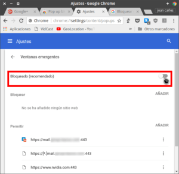
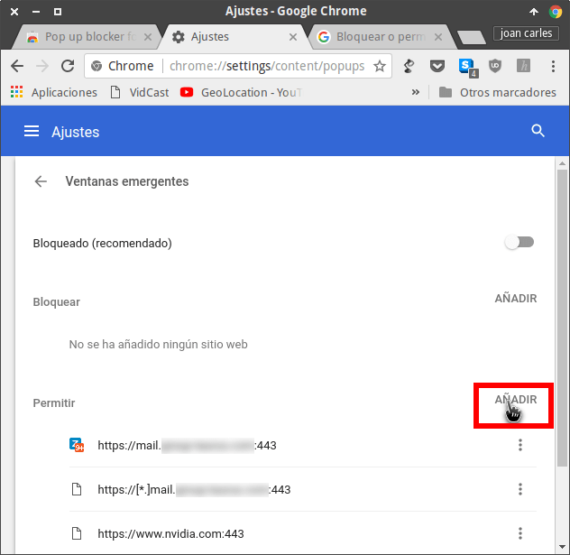
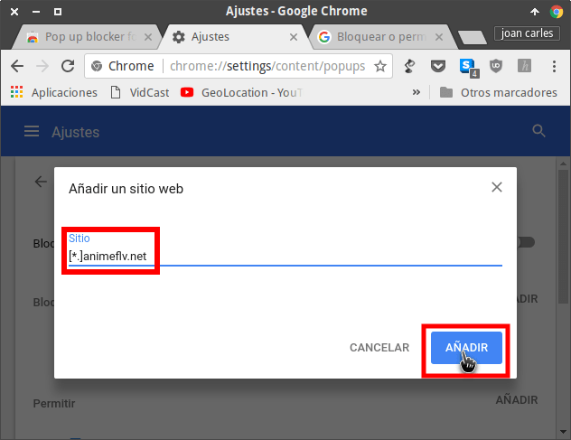
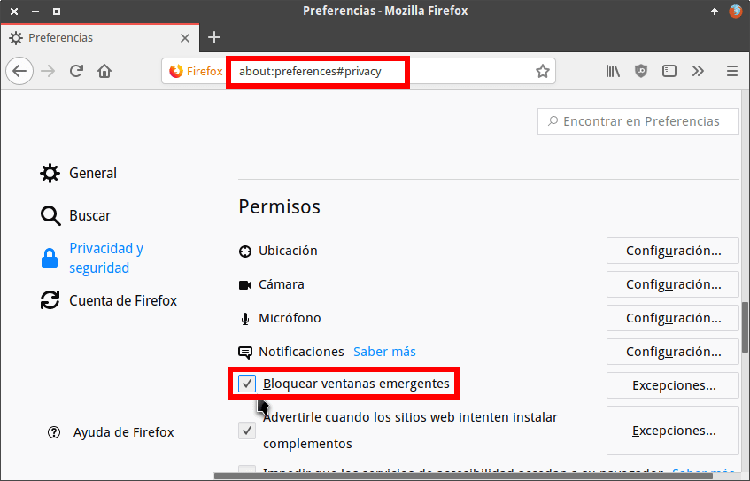
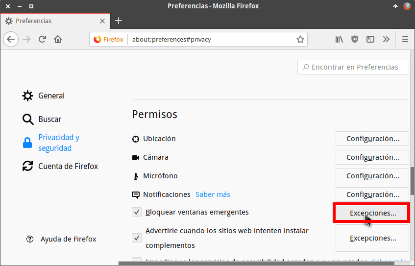
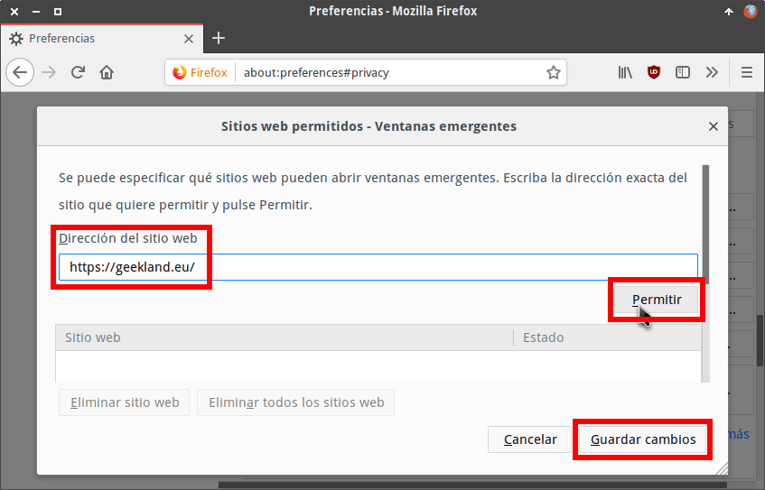
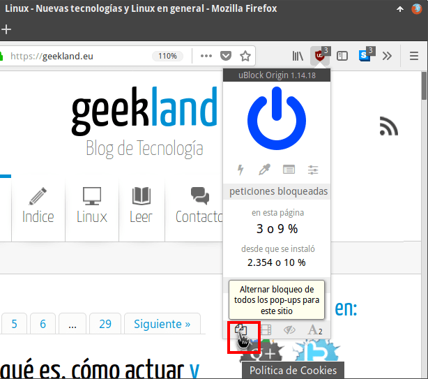
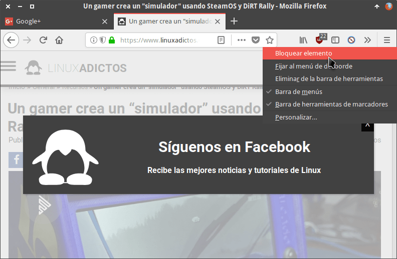
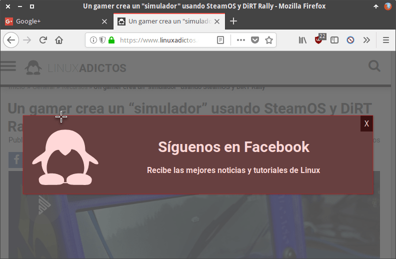
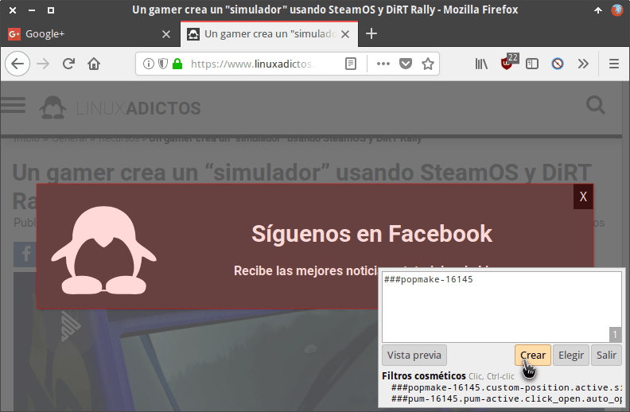

Si hay algo tan molesto como la publicidad son los pop-ups o ventanas emergentes. ¿A alguien le son familiares las siguientes situaciones?

1. En el momento de entrar en una web nos sale un pop-up pidiendo que nos suscribamos a una página Facebook, les demos un like, nos suscribamos a su newsletter, etc.
2. A los pocos segundos de estar leyendo un post aparece una ventana para que compremos un producto o servicio.
3. Al dar play para visualizar un vídeo nos aparecen múltiples ventanas emergentes de publicidad. Esto suele pasar a todos los usuarios que frecuentan webs para descargar torrent o ver vídeos en streaming.
4. Estamos intentando comprar un artículo y de repente nos bombardean con pop-ups.

<!--more-->

Sin duda este tipo de comportamiento es igual o peor que la publicidad ya que lo único que genera es una mala experiencia de navegación. En mi caso, cuando detecto los comportamientos citados acostumbro a cerrar la página web e intento no visitarla nunca más. No quiero visitar este tipo de sitios web.

###### Nota: Los pop-up son tan molestos que incluso Google [penaliza el posicionamiento web](https://pukkas.com/los-pop-ups-son-buenos-o-malos-para-seo/ "Google penaliza los pop-up") de los sitios que los usan.

## ¿QUÉ SON Y QUE CARACTERÍSTICAS TIENEN LAS VENTANAS EMERGENTES O POP-UPS?

Son ventanas que aparecen de forma inesperada mientras estamos navegando, comprando o consumiendo un contenido en la red. Al aparecer acostumbran ubicarse delante del contenido que estábamos consumiendo ocasionando molestias importantes.

El contenido que hay en las ventanas emergentes es altamente molesto por los siguiente motivos:

1. El contenido que se muestra no es de interés para los lectores.
2. En la mayoría de ocasiones no es más que publicidad para vender o promocionar un producto o servicio.
3. Buscan el beneficio personal del administrador de la web que visitamos.
4. En muchos casos únicamente pretenden conseguir nuestros datos de contacto para enviarnos spam vía email.
5. Algunos pop-up pueden llegar a infectar nuestro equipo con malware.
6. En ocasiones, la ventana emergente oculta el contenido que estábamos viendo.
7. Etc.

Para evitar de forma total las ventanas emergentes les recomiendo seguir las instrucciones que verán a continuación.

## BLOQUEAR LAS VENTANAS EMERGENTES EN CHROME

El primer paso que debemos realizar es acceder a la configuración del navegador para bloquear las ventanas emergentes.

Para ello en la barra de direcciones de nuestro navegador ingresamos la siguiente dirección y presionamos la tecla Enter:

> ```
> chrome://settings/content/popups
> ```

Cuando aparezca la ventana de ajustes de Google Chrome deberemos asegurar que la opción Ventanas emergentes esté en **Bloqueado** tal y como se muestra en la captura de pantalla:

[](images/bloquear-ventanas-emergentes-chrome.png)

De este modo bloqueamos la totalidad de ventanas emergentes en nuestro navegador. A partir de este momento podemos tener la certeza que ninguna ventana emergente se abrirá en nuestro navegador. Si en algún caso precisamos permitir las ventanas emergentes de alguna web, en el apartado **Permitir** clicamos el botón Añadir.

[](images/anadir-excepcion-chrome.png)

Cuando aparezca la ventana de **añadir un sitio web** escribimos \[\*.\] seguido del dominio en que queremos permitir los pop-up. Por lo tanto, para permitir las ventanas emergentes en animeflv.net debemos escribir:

> ```
> [*.]animeflv.net
> ```

Seguidamente presionamos el botón Añadir.

[](images/permitir-ciertos-pop-ups.png)

De esta forma tan sencilla podemos bloquear ventanas emergentes y añadir excepciones en Google Chrome.

## BLOQUEAR LAS VENTANAS EMERGENTES O POP-UPS EN FIREFOX

Para bloquear la totalidad de ventanas emergentes en Firefox tenemos ingresar la siguiente la siguiente URL en la barra de direcciones y presionar la tecla Enter:

> ```
> about:preferences#privacy
> ```

Cuando se abra la pestaña de configuración de Firefox iremos al apartado **Permisos** y tildaremos la opción bloquear ventanas emergentes. Una vez tildada la opción estaremos bloqueando la totalidad de ventanas emergentes.

[](images/bloquear-popups-firefox.png)

En determinados casos hay servicios y webs que precisan de ventanas emergentes para funcionar de forma adecuada. Si usáis uno de esto servicios podemos añadir Excepciones. Para ello tan solo tenemos que presionar encima del botón Excepciones.

[](images/anadir-excepciones-ventanas-emergentes-firefox.png)

A continuación aparecerá la ventana en que deberán introducir las excepciones. Para añadirlas, en el campo **Dirección del sitio web** escribiremos la URL de la web en la que que queremos permitir ventanas emergentes y presionaremos sobre el botón botón Permitir. Finalmente clicaremos en la opción Guardar cambios.

[](images/permitit-popups-dominio-firefox.png)

Siguiendo este sencillo procedimiento podremos bloquear la totalidad de ventanas emergentes añadiendo las excepciones que consideremos oportunas.

## INSTRUCCIONES A SEGUIR PARA BLOQUEAR LAS VENTANAS EMERGENTES DE FORMA DEFINITIVA

A pesar de bloquear las ventanas emergentes en el navegador existen sitios web que nos seguirán mostrando pop-ups.

Para solucionar el problema de una vez por todas la mejor opción es instalar uBlock Origin. Es la mejor opción porque además de bloquear la publicidad, también bloquea de forma efectiva las ventanas emergentes.

## Instalar uBlock Origin

Para instalar ublock origin deberán seguir las instrucciones que se muestran en el siguiente enlace:

https://geekland.eu/instalar-ublock-origin-chrome-firefox/

### Bloquear los pop-up con uBlock origin

Una vez finalizada la instalación no tenemos que realizar nada más. uBlock Origin bloqueará la totalidad de pop-ups usando los filtros que trae incorporados y activados de serie.

En el caso, poco recomendable, que quieran bloquear el 100% de pop-ups de un sitio web determinado deben seguir las siguientes instrucciones.

Una vez dentro de la web en que quieren bloquear los pop-ups posicionan el puntero del ratón encima del icono de uBlock Origin. Presionan el botón izquierdo del ratón y cuando aparezcan las opciones de configuración clican sobre el icono Alternar bloqueo de todos los Pop-ups para este sitio.

[](images/bloquear-pop-up-ublock-origin.png)

De este modo se bloquearán la totalidad de pop-ups de una web determinada.

Es poco recomendable bloquear la totalidad de pop-ups porque habrá muchos servicios y webs que no funcionarán correctamente. La mejor opción es usar la configuración predeterminada de uBlock Origin.

### Bloquear ventanas emergentes creadas mediante código javascript

A pesar de todo lo realizado seguirán apareciendo algunas ventanas emergentes. El motivo es que algunos administradores web introducen ventanas emergentes personalizadas mediante ejecución de código javascript.

En este caso deberemos bloquear las ventanas del siguiente modo.

Cuando nos aparezca una ventana emergente clicamos encima del icono de uBlock Origin. Cuando aparezca el menú de configuración clicamos en la opción Bloquear elemento.

[](images/bloquear-elementos-ublock-origin.png)

A continuación seleccionamos el elemento que queremos bloquear clicando encima.

[](images/seleccionar-elemento-bloquear.png)

Seguidamente, en la parte inferior derecha de la pantalla aparecerá una ventana en el que se mostrará el elemento que hemos seleccionado. Para bloquearlo tenemos que presionar en el botón Crear.

[](images/crear-regla-eliminar-pop-up.png)

De este modo nunca nos volverá a aparecer el mismo pop-up en la web que estabamos visitando.

## SOLUCIONES MÁS RADICALES PARA COMBATIR LOS POP-UPS

Otras opciones más radicales que podemos adoptar son las siguientes:

1. Si detectan una web que usa pop-ups de forma abusiva salgan inmediatamente y no accedan nunca más.
2. La mayoría de pop-up se muestran mediante la ejecución de código javascript. Por lo tanto para que no aparezcan podemos [bloquear la ejecución de código javascript]() en nuestro navegador. Si aplicamos este tipo de procedimiento es posible que hayan partes de ciertas páginas web que dejen de funcionar.

Espero que los consejos mostrados a lo largo del artículo les sean útiles para minimizar las molestias ocasionadas por los pop-ups.
