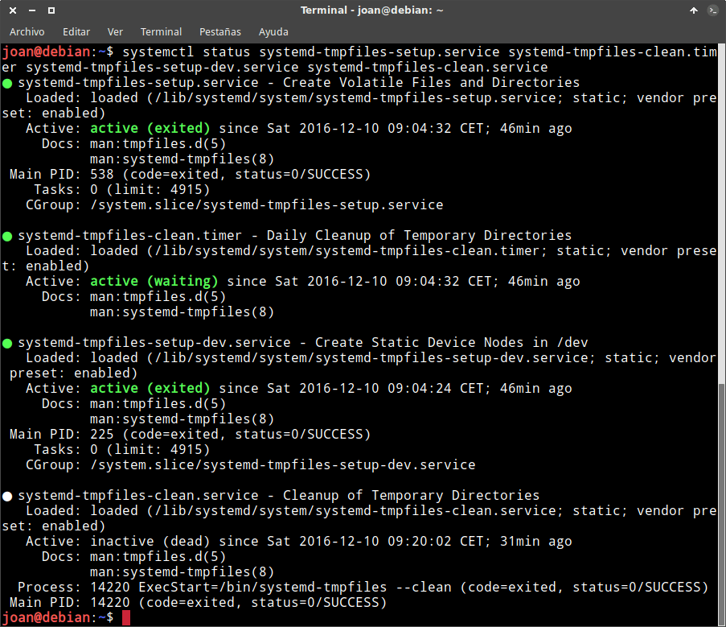
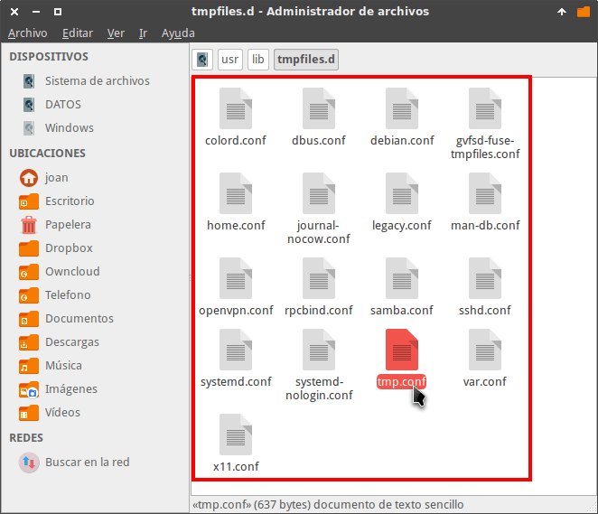

Hace unos días publique un artículo en el que hablaba de [los directorios temporales en Linux](). Como complemento a este artículo seguidamente detallaremos como borrar los archivos temporales de forma completamente automática y periódica.<!--more-->

## CONFIGURAR SYSTEMD PARA BORRAR LOS ARCHIVOS TEMPORALES

Hoy en día prácticamente la totalidad de distribuciones Linux usan Systemd. Esto hace que systemd sea una opción a tener en cuenta para borrar los archivos temporales de forma automática y periódica.

### Servicio de borrado de archivos temporales de Systemd

Systemd dispone del servicio systemd-tmpfiles para crear, borrar y limpiar archivos y directorios temporales.

### Comprobar que los servicios necesarios de systemd están activos

Para comprobar que los servicios para borrar los archivos temporales están activados ejecutamos el siguiente comando:

> ```
> systemctl status systemd-tmpfiles-setup.service systemd-tmpfiles-clean.timer systemd-tmpfiles-setup-dev.service systemd-tmpfiles-clean.service
> ```

Después de ejecutar deberían obtener los siguientes resultados:

[](images/Estado-servicio-borrado-de-los-archivos-temporales.png)

Si los resultados obtenidos son similares a los de mi captura de pantalla podemos afirmar que los servicios están listos para usarse.

### Configurar cuando se ejecuta el servicio para borrar los archivos temporales

Para averiguar cuando se ejecutará el servicio de limpieza de systemd abrimos una terminal y ejecutamos el el siguiente comando:

> ```
> nano /lib/systemd/system/systemd-tmpfiles-clean.timer
> ```

Seguidamente se abrirá el editor de textos nano y verán que dentro del fichero systemd-tmpfiles-clean.timer aparece el siguiente contenido:

> ```
> [Unit]
> Description=Daily Cleanup of Temporary Directories
> Documentation=man:tmpfiles.d(5) man:systemd-tmpfiles(8)
> 
> [Timer]
> OnBootSec=15min
> OnUnitActiveSec=1d
> ```

El significado de este código es el siguiente:

1. A los 15 minutos de arrancar el ordenador se ejecutará el servicio de limpieza de systemd.
2. Si dejamos nuestro ordenador encendido, cada 24 horas se activará el servicio que nos permitirá, entre otras cosas, borrar los archivos temporales.

Para modificar la frecuencia de uso del servicio de limpieza de systemd tenemos que modificar los parámetros del archivo /lib/systemd/system/systemd-tmpfiles-clean.timer

Como en mi caso la frecuencia estándar me parece correcta dejo los valores 15min y 1d.

### Configurar la frecuencia en que se borran los directorios temporales

En la ubicación /usr/lib/tmpfiles.d/ están presentes la totalidad de archivos de para configurar la creación, el borrado y limpieza de archivos y directorios temporales del sistema.

[](images/Archivos-configuración-borrado-archivos-temporales.png)

Como en nuestro caso solo queremos gestionar el borrado de archivos temporales de los directorios /tmp y /var/tmp editamos el fichero tmp.conf ejecutando el siguiente comando en la terminal:

> ```
> sudo nano /usr/lib/tmpfiles.d/tmp.conf
> ```

El contenido del archivo en mi distro Debian Testing Stretch es el siguiente:

> ```
> # Clear tmp directories separately, to make them easier to override
> D /tmp 1777 root root -
> #q /var/tmp 1777 root root 30d
> 
> # Exclude namespace mountpoints created with PrivateTmp=yes
> x /tmp/systemd-private-%b-*
> X /tmp/systemd-private-%b-*/tmp
> x /var/tmp/systemd-private-%b-*
> X /var/tmp/systemd-private-%b-*/tmp
> ```

Si leemos la sintaxis concluimos que mi sistema operativo gestiona los directorios temporales de la siguiente forma:

1. El directorio /tmp se borra cada vez que enciendo mi ordenador. Si dejo mi ordenador permanente encendido nunca so borrarán los archivos temporales.
2. El directorio /var/tmp no se borra absolutamente nunca porque la línea está comentada. Además está línea no es correcta ya que el parámetro q se utiliza para crear subvolumenes en sistemas de archivos btrfs y en mi caso uso ext4.
3. Finalmente vemos que hay una serie de rutas que no se borrarán nunca. Los directorios systemd-private-xxx contienen archivos temporales de servicios y/o programas que tienen activada la propiedad Privatetmp.

Modificando las líneas azules, rojas y verdes podremos configurar el servicio de borrado de los archivos temporales. De este modo borrar los archivos temporales automáticamente y periódicamente.

#### Ejemplos de configuración que podemos usar para borrar los archivos

Para borrar los archivos temporales del directorio /tmp con un antigüedad superior a 10 días cuando encendemos el ordenador o cuando se ejecute el servicio de limpieza de systemd usamos el siguiente comando:

> ```
> D /tmp 1777 root root 10d
> ```

###### Nota: Anteriormente hemos visto que el servicio de limpieza de systemd se ejecuta 15 minutos después del arranque y una vez cada 24 horas.

El significado de cada uno de los parámetros del comando es el siguiente:

**D :** Se usa para indicar que se cree un directorio determinado. Si el directorio ya está creado se actualizarán los permisos y propietarios del directorio. Como la D es mayúscula, cada vez que encendamos el ordenador se comprobará si hay archivos para borrar en el directorio /tmp.

**/tmp:** Es el directorio que estamos configurando.

**1777:** Son los permisos que otorgamos al directorio /tmp. Con los permisos 1777, el contenido del directorio /tmp solo podrá ser modificado y ejecutado por el propietario del archivo y por el usuario root. Además todos los usuarios podrán crear contenido dentro de la directorio /tmp.

**root root:** Indicamos el usuario y el grupo para el directorio /tmp

**10d:** Indicamos que los archivos del directorio/tmp que tienen una antigüedad superior a 10 días se borren.

En el siguiente link encontraran una una [explicación detallada de la sintaxis](https://www.freedesktop.org/software/systemd/man/tmpfiles.d.html "Sintaxis para configurar acciones con los archivos temporales") que podemos usar para configurar el borrado de los archivos temporales. Si lo leen verán que las posibilidades de configuración son enormes.

Para borrar los archivos temporales del directorio /tmp y /var/tmp con un antigüedad superior a 15 días cuando encendemos el ordenador o cuando se ejecute el servicio de limpieza de systemd usamos el siguiente comando:

> ```
> D /tmp 1777 root root 15d
> D /var/tmp 1777 root root 15d
> ```

Si nuestra intención es que cada vez que se ejecute el servicio de limpieza de systemd se borren los archivos temporales de los directorios /tmp y /var/tmp con una antigüedad superior a 2 días usamos el siguiente código:

> ```
> d /tmp 1777 root root 2d
> d /var/tmp 1777 root root 2d
> ```

Si queremos que nunca se borre el contenido de los directorios /tmp y /var/tmp podemos comentar las líneas o usar el siguiente comando:

> ```
> d /tmp 1777 root root -
> d /var/tmp 1777 root root -
> ```

## FORZAR LA EJECUCIÓN DE LOS SERVICIOS DE LIMPIEZA DE ARCHIVOS TEMPORALES

Como hemos visto en el inicio del artículo, los servicios de limpieza de systemd se ejecutan 15 minutos después de arrancar el ordenador o cada 24 horas si no reiniciamos el ordenador

Si tenemos necesidad de borrar los archivos de los directorios temporales según la configuración establecida y no queremos esperar 24 horas a que se ejecute el servicio de limpieza, abrimos una terminal y ejecutamos el siguiente comando:

> ```
> sudo systemd-tmpfiles --clean
> ```

Al ejecutar el comando se ejecutará el servicio de limpieza y se borrarán los archivos temporales según los parámetros definidos en el archivo /usr/lib/tmpfiles.d/tmp.conf

## FORMAS INCORRECTAS DE BORRAR LOS ARCHIVOS TEMPORALES

No es recomendable borrar los archivos temporales de los directorios /tmp y /var/tmp a la fuerza mientras usamos el ordenador. ¿Por qué?

Es posible que en el momento de borrar los archivos temporales un programa esté haciendo uso de ellos. Si se da el caso podemos tener problemas.

###### Nota: Si usamos systemd en principio este problema no tiene que darse porque los archivos temporales que se borran son viejos y no están en uso.

En el caso que precisen forzar el borrado de los archivos temporales de forma inmediata y segura, hay que hacerlo en el proceso de encendido o apagado del ordenador. El procedimiento a seguir para ello lo pueden encontrar en el siguiente enlace:

[Instrucciones para forzar el borrado de los archivos temporales en Linux]()
