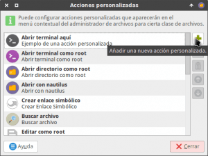
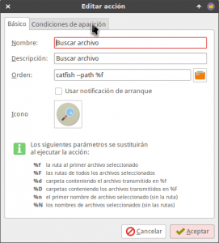
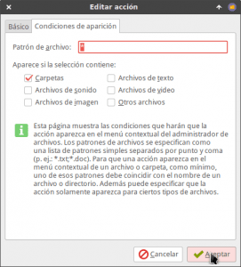
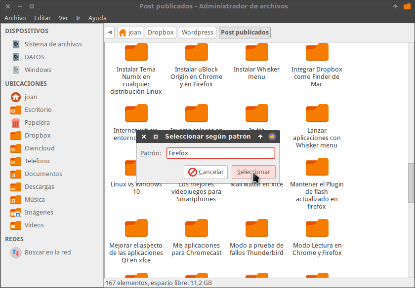
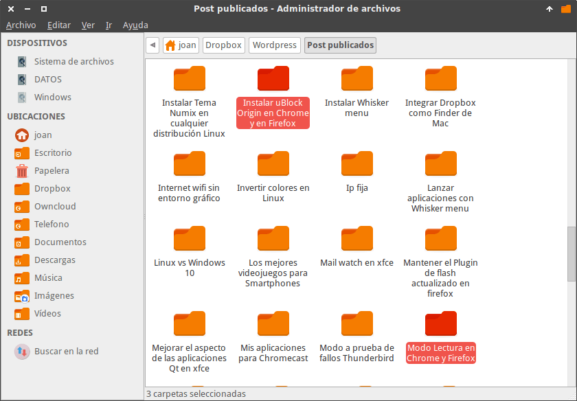

En contraposición a otros gestores de archivos, como por ejemplo Nautilus o Dolphin, Thunar aparentemente no trae incorporado un buscador de archivos de serie. No obstante a continuación veremos unas simples instrucciones que nos permitirán buscar archivos en Thunar de forma fácil y efectiva.<!--more-->

## OPCIÓN 1: BUSCAR ARCHIVOS EN THUNAR CON CATFISH

Una de las opciones para poder buscar archivos en Thunar es usar el buscador Catfish.

### Instalar Catfish

Para hacerlo lo primero que tenemos que realizar es es instalar Catfish ejecutando el siguiente comando en la terminal:

> ```
> sudo apt-get install catfish
> ```

### Configurar una acción personalizada de búsqueda

Una vez instalado abrimos Thunar, accedemos al menú **Editar** y a posteriori clicamos encima de la opción **Configurar acciones personalizadas…**

[](images/Configurar-una-acción-personalizada.png)

Seguidamente aparecerá la siguiente ventana en la que deberemos presionar encima del botón **+** para empezar a definir una acción personalizada.

[](images/Añadir-nueva-acción-personalizada.png)

A continuación en la pestaña de edición de la acción personalizada tenemos que introducir los siguientes valores:

[](images/Comandos-a-usar-para-la-acción-personalizada.png)

**Campo Nombre:** Introducimos el nombre que queremos que nos aparezca en el menú contextual de las acciones personalizadas. En mi caso elijo **Buscar archivo**

**Campo Descripción:** Escribimos una descripción de lo que hará nuestra acción personalizada. En mi caso uso la descripción **Buscar archivo**

**Campo Orden:** Escribimos el comando para que se abra catfish y pueda realizar la búsqueda de los archivos y carpetas. En mi caso la orden que uso es la siguiente:

> ```
> catfish --path %f
> ```

Si queremos que las búsquedas de catfish puedan distinguir entre mayúsculas y minúsculas deberemos usar la orden:

> ```
> catfish --exact --path %f
> ```

Si además queremos buscar ficheros de texto que en su interior contengan una determinada palabra podemos usar la siguiente orden:

> ```
> catfish --fulltext --path %f
> ```

###### Nota: El campo orden lo podemos modificar de la forma que queramos para adaptarlo a nuestras necesidades. Para ver las opciones del comando catfish pueden abrir una terminal y ejecutar el comando man catfish

**Campo Icono:** Si queremos definir un icono para la acción personalizada clicamos encima del botón **Sin icono**. A continuación se abrirá una ventana en la que deberemos seleccionar el icono que queremos usar.

Una vez cumplimentados los campos clicamos encima de la pestaña **Condiciones de aparición**. Finalmente destildamos la opción **Archivos de texto**, tildamos la opción **Carpetas** y presionamos el botón **Aceptar**.

[](images/Condiciones-de-aparición-de-la-acción-personalizada.png)

### Demostración de como buscar archivos y carpetas con Thunar y Catfish

Una vez definida la acción de búsqueda ya podemos buscar archivos en Thunar de forma sencilla.

Para ello tan solo tienen que emular los pasos que pueden ver en el siguiente vídeo:

https://www.youtube.com/watch?v=VMO4Byq\_pCg

## OPCIÓN 2: BUSCAR ARCHIVOS EN THUNAR CON EL BUSCADOR DE PATRONES DE THUNAR

En numerosas ocasiones he escuchado que el gestor de archivos Thunar no dispone de ningún buscador de archivos integrado y esto no es del todo cierto.

Thunar dispone de un buscador de archivos básico que en algunas situaciones nos puede resultar útil. Para usarlo tenemos que proceder de la siguiente forma.

Abrimos el gestor de archivos justo en la ubicación en la que queremos realizar la búsqueda. Una vez dentro de la ubicación presionamos la combinación de teclas **Ctrl+S** y cuando aparezca la ventana de **Seleccionar según patrón** escribimos la palabra que estamos buscando que en mi caso es **Firefox**.

[](images/Buscar-archivo-con-el-gestor-integrado-de-Thunar.png)

Presionamos el botón **Seleccionar** y a continuación se seleccionarán la totalidad de archivos y carpetas que contienen la palabra Firefox.

[](images/Archivos-encontrados-con-Thunar.png)

### Demostración de como buscar archivos con el buscador integrado de Thunar

Acabamos de ver un ejemplo de como podemos buscar archivos con el buscador que Thunar trae integrado de serie.

A continuación veremos un vídeo en que se muestra otro ejemplo uso:

https://www.youtube.com/watch?v=2QJZTzXxoxY

### Limitaciones del buscador de archivos de XFCE

Obviamente el buscador de archivos que Thunar trae integrado tiene limitaciones importantes. Algunas de ellas son las siguientes:

1. No tiene capacidad de realizar búsquedas de forma recursiva. Por lo tanto este tipo de búsqueda únicamente será útil para buscar archivos y carpetas en la ubicación en que estamos.
2. Este método de búsqueda distingue entre mayúsculas y minúsculas. Por lo tanto si no somos meticulosas a la hora de nombrar nuestros archivos tendremos dificultades cuando tengamos que buscarlos.
3. Si la ubicación en la que estamos buscando contiene un número elevado de archivos y/o carpetas, se nos puede hacer difícil encontrar lo que estamos buscando.

## CONCLUSIONES

Thunar no tiene nada que envidiar a ninguno de los gestores de archivos existentes en Linux.

Como hemos visto a lo largo de este post, con Thunar podemos buscar archivos de forma flexible, efectiva y rápida.

Existen más opciones para buscar archivos con Thunar que se basan en la creación de nuestro propios scripts. No obstante no mostraré ningún script porque lo único que haría es complicar la vida a la gente para obtener una peor experiencia de búsqueda.
