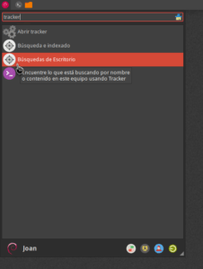
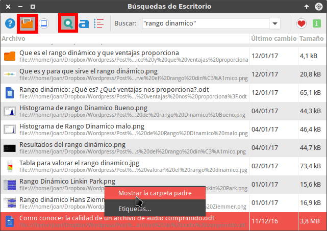
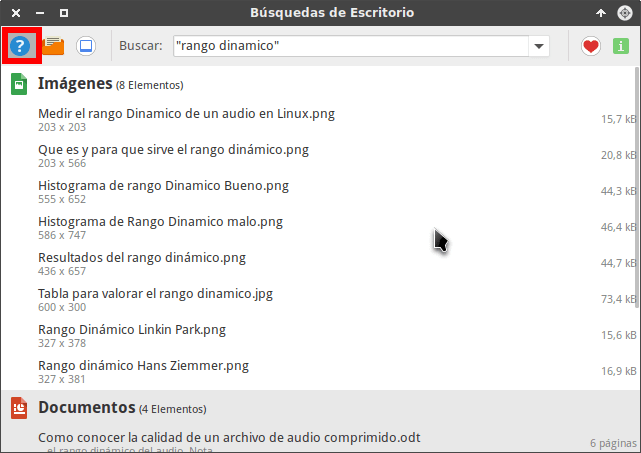
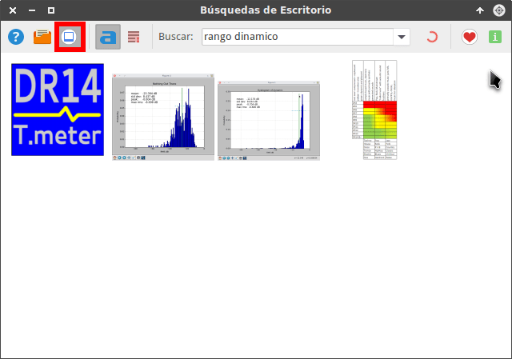
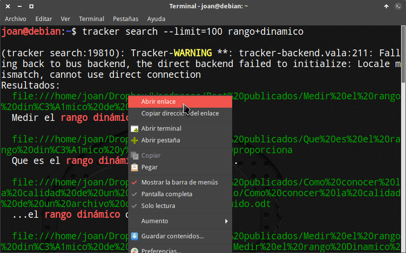

En el pasado vimos el proceso a seguir para [instalar y configurar Tracker]() en nuestro equipo. Como continuación de este post pasaremos a ver como podemos buscar archivos por su contenido utilizando Tracker.<!--more-->

## BUSCAR ARCHIVOS POR SU CONTENIDO CON TRACKER

Una vez finalizada la configuración de Tracker podemos empezar a utilizarlo.

A día de hoy disponemos de 2 formas para usar Tracker. Son las siguientes:

1. Usando la interfaz gráfica que nos proporciona Tracker.
2. Mediante la terminal.

Me parece mal que el equipo de Gnome no se haya esmerado en integrar Tracker en Nautilus o en el Dash de Gnome Shell. Existían algunas extensiones de Gnome que integraban Tracker en el dash, pero como acostumbra a pasar con las extensiones de Gnome dejan de funcionar con las actualizaciones porque su desarrollador las abandona.

A continuación pasaremos a ver de forma detallada cada una de las opciones que acabo de citar.

### Buscar archivos por su contenido mediante la interfaz gráfica de tracker

Imaginemos que en su día escribí varios documentos en los que hablaba sobre el rango dinámico.

Para buscar estos documentos de forma rápida accedo al menú de aplicaciones de mi distro y abro la interfaz gráfica de tracker:

[](images/abrir-tracker.png)

Existen otras formas para abrir la interfaz gráfica de tracker de forma rápida. Algunas de ellas son las siguientes:

1. Abrirlo mediante un [atajo de teclado]().
2. Ejecutando el comando tracker-needle en la terminal.

Una vez abierta la interfaz gráfica clicamos en el icono de la lupa y posteriormente en el de la carpeta. Finalmente tecleamos la palabra que queremos buscar dentro de los documentos que tenemos indexados.

En mi caso quiero buscar la totalidad de archivos que contienen la palabra rango dinámico en su interior. Por lo tanto escribo el siguiente texto:

> ```
> “rango dinamico”
> ```

Fíjense que el término de búsqueda está entrecomillado. Las comillas son un operador de búsqueda para acotar mejor nuestra búsqueda. Algunos ejemplos de búsquedas que podemos realizar son los siguientes:

 
|   **Término de búsqueda**   |   **Resultado de búsqueda obtenido**   |
| --- | --- |
|   “rango dinamico”   |   buscaremos archivos que en su nombre o en su interior contienen la palabra rango dinámico.   |
|   rango dinamico   |   buscamos archivos que en su nombre o en su interior contienen la palabra rango **y** la palabra dinámico.   |
|   Rango OR dinamico   |   Buscamos archivos que en su nombre o en su interior contienen la palabra rango **o** la palabra dinámico.   |

Justo después de teclear el término de búsqueda obtenemos el siguiente resultado:

[](images/archivo-encontrado.png)

Disponemos de varios documentos que en su nombre o en su interior contienen la palabra rango dinámico. Una vez localizados podemos realizar las siguientes acciones:

1. Hacer doble click sobre los documentos para abrirlos y editarlos.
2. Seleccionar uno de los archivos, presionar el botón derecho del ratón y cuando salga el menú contextual clicar en Mostrar la carpeta padre. De este modo se abrirá nuestro gestor de archivos en la ubicación del archivo.

En el caso que los resultados de búsqueda sean muy extensos, el entorno gráfico nos permite clasificar las búsquedas por tipos de archivo. Para ello una vez finalizada la búsqueda clicamos encima del icono de la redonda con el interrogante. A continuación veremos que la búsqueda se clasifica por tipo de archivo:

[](images/busquedas-clasificadas.png)

Si lo único que pretendemos es buscar imágenes que contengan un nombre determinado clicamos en el icono de mostrar imágenes y tecleamos el nombre que estamos buscando. A continuación veremos una miniatura de la totalidad de imágenes que contienen la palabra que estamos buscando.

[](images/buscar-fotos-tracker.png)

De esta forma tan simple conseguiremos buscar archivos por su contenido mediante la interfaz gráfica Tracker-needle

### Buscar archivos por su contenido usando la terminal

Los amantes de la terminal deben saber que también es posible buscar archivos por su contenido con la terminal. Para buscar la totalidad de archivos  que en su nombre o en su interior contienen la palabra rango dinámico tenemos que ejecutar el siguiente comando en la terminal:

> ```
> tracker search --limit=100 rango+dinamico
> ```

El significado de cada uno de los parámetros del comando es el siguiente:

**tracker:** Parte del comando que ejecuta el software Tracker. **search:** Corresponde a la acción que queremos realizar con tracker. **\--limit=100:** El número máximo de resultados que nos mostrará Tracker en pantalla. **rango+dinamico:** Corresponde a las palabras que estamos buscando en el interior o en el nombre de nuestros documentos.

Una vez ejecutado el comando veremos que obtendremos los mismos resultados que con la interfaz gráfica:

[](images/tracker-terminal.png)

Al igual que en el caso anterior habrán observado que se pueden usar operadores para acotar más nuestras búsquedas. Algunos de los operadores que podemos usar son los siguientes:

 
|   **Término de búsqueda**   |   **Resultado de búsqueda obtenido**   |
| --- | --- |
|   rango+dinamico   |   buscaremos archivos que en su nombre o en su interior contienen la palabra rango dinámico.   |
|   rango dinamico   |   buscamos archivos que en su nombre o en su interior contienen la palabra rango y la palabra dinámico.   |
|   Rango OR dinamico   |   Buscamos archivos que en su nombre o en su interior contienen la palabra rango o la palabra dinámico.   |
|   rango+dinamico NOT rango+de+puertos   |   Para buscar archivos que en su nombre o en su interior contienen la palabra rango dinámico, pero no contienen la palabra rango de puertos.   |

En este apartado únicamente hemos visto ejemplos simples de como buscar archivos por su contenido mediante la terminal. Las posibilidades de búsqueda mediante la terminal son enormes y mucho más grandes que las que nos proporciona la interfaz gráfica.

Para ver más ejemplos de como buscar archivos por su contenido les recomiendo que visiten el siguiente enlace:

[https://wiki.gnome.org/Projects/Tracker/Documentation/Examples/](https://wiki.gnome.org/Projects/Tracker/Documentation/Examples/ "Ejemplos adicionales de como usar la terminal para buscar archivos")

Además si quieren obtener ayuda a través de la terminal pueden ejecutar los siguientes comandos:

> ```
> tracker search --help
> tracker sparql --help
> tracke sql --help
> ```

## ETIQUETAR Y BUSCAR ARCHIVOS MEDIANTE ETIQUETAS

Tracker da la posibilidad de etiquetar archivos. Una vez etiquetados podremos usar las etiquetas para incluso poder facilitar más las búsqueda de nuestros archivos.

En las próximas semanas escribiré un artículo en el que mostraré de forma detallada el proceso de etiquetado de archivos mediante la terminal y mediante el gestor de archivos Nautilus.

## CONCLUSIONES FINALES

Tracker tiene una funcionalidad enorme ya que de forma inmediata nos permite buscar archivos que en su nombre o un su interior contienen determinadas palabras.

También quiero remarcar que bajo mi punto de vista Tracker está desaprovechado. Algunos proyectos que se podrían llevar a término con Tracker y que son muy interesantes son:

1. Integrar Tracker en un gestor de archivos como por ejemplo Nautilus.
2. Integrar Tracker en el Dash de Ubuntu o Gnome.
