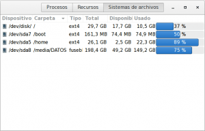
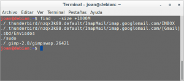
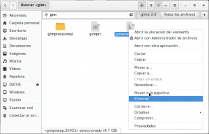
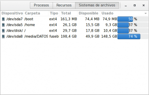
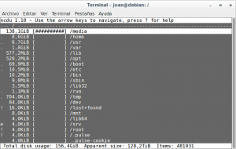
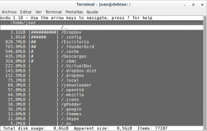

Hoy estaba redimensionando una imagen con Gimp y he parado el proceso porqué me he dado que la partición Home se estaba quedando sin espacio debido al proceso de redimensionamento de la foto con Gimp.<!--more-->

Al parar el proceso pensaba que la partición Home volvería a tener el mismo espacio libre que antes de empezar a redimensionar la foto, pero no ha sido así. Al parar el proceso **me ha quedado la Home llena y no tenia ni la más remota idea del archivo que estaba consumiendo este espacio**. El problema que acabo de citar lo podéis ver reflejado en la siguiente captura de pantalla:

[](images/Particion-Home-disco-duro-llena.png)

**Para solucionar este problema** y encontrar el archivo que me estaba generando este problema **he usado el comando find**. Seguidamente podéis ver los pasos que usé:

## BUSCAR ARCHIVOS QUE LLENAN MI PARTICIÓN HOME CON FIND

La solución para encontrar el archivo que nos esta generando el problema es fácil. Visto mi caso es de suponer que el archivo que estará ocupando todo el espacio solo será uno y además tendrá un tamaño importante.

Como el problema lo tenemos en la partición home tan solo tenemos que **abrir una terminal y ubicarnos en la raíz de la partición Home. Seguidamente ejecutamos el siguiente comando:**

> ```
> find . -size +1000M
> ```

###### Nota: Es interesante comprender mínimamente el comando que acabamos de usar para que cada uno lo pueda modificar según su necesidad. ****find**** no es mas que el comando para indicarle que se busque un archivo. El ****.**** lo que hace es indicar que la ruta donde queremos buscar el archivo o carpeta es en nuestra ubicación actual. Finalmente ****\-size +1000M**** indica que el archivo a buscar dentro de la ubicación que hemos elegido tiene que tener más de 1000 Mb de tamaño.

###### Nota: Si tenéis problemas al usar el comando find es posible que sea debido a que no tengáis el paquete ****findutils**** instalado en vuestro sistema. Para ello tan solo tenemos que abrir la terminal y teclear ****sudo apt-get install findutils****

###### Nota: Sin duda find es un buscador extremadamente potente y con multitud de opciones de búsqueda disponibles. Para que os podáis hacer una idea de todo lo que se puede realizar con el comando find, tan solo tenéis que clicar encima del siguiente [link]().

Después de ejecutar el comando obtenemos el siguiente resultado:

[](images/Archivos-que-llenan-mi-disco-duro.png)

Como se puede ver en la captura de pantalla **en mi partición Home solo existen 3 archivos con un tamaño superior a 1Gb**. Dos de ellos corresponden al gestor de correo electrónico Thunderbird, otro corresponde a un archivo muy raro denominado ****sudo****, y finalmente **el archivo** ****gimpswap.26421**** que **sin duda es el archivo que está llenando mi Home de forma inútil**.

###### Nota: Tanto el archivo sudo de cerca de 2 Gb que aparece en mi home, como el tamaño que ocupa la carpeta de Thunderbird no son normales. Los archivos de Thunderbird ocupan cerca de 8 Gb y el tamaño total que ocupa mi cuenta de gmail es simplemente de 2.53 Gb. Por lo tanto habrá que mirar que está pasando y es posible que acabe obteniendo más espacio libre del que pensaba en un inicio.

**Una vez localizado el archivo** que está generando el problema, tal y como se puede ver en la captura de pantalla, tan solo **tenemos que ir a buscarlo en su ubicación y borrarlo**.

[](images/borrar-archivos-que-llenan-mi-disco-duro.png)

Una vez eliminado el archivo el problema se ha solucionado y volveremos a tener espacio en nuestra home. Además **después de investigar el archivo sudo y los archivos de thunderbird he visto que aún podía eliminar más contenido que era innecesario. Por lo tanto después de haber terminado la limpieza de mi Home el resultado es el siguiente:**

[](images/Espacio-recuperado-en-el-disco-duro.png)

Como se puede ver la ganancia de espacio en mi caso ha sido más que sorprendente pasando de un 89% de espacio ocupado a un 37%.

## BUSCAR ARCHIVOS QUE LLENAN MI DISCO DURO CON FIND

En el apartado que acabamos de ver simplemente hemos revisado los archivos de tamaño superior a un 1 Gb presentes en nuestra partición Home. **Si en vez de revisar nuestra Home queremos revisar todo nuestro disco duro podemos usar el siguiente comando**:

> ```
> sudo find / -size +1000M
> ```

###### Nota: A diferencia del caso anterior ahora tenemos que ejecutar este comando como usuario root ya que para analizar los archivos presentes en la partición raíz tenemos que ser root.

**El comando que acabamos de usar nos detallará la totalidad de archivos de nuestro disco duro que tienen un tamaño superior a 1000 Mb**. Una vez los tengamos simplemente deberemos analizar cuales se pueden y queremos borrar y cuales son necesarios para el funcionamiento del sistema. En mi caso después de aplicar este comando no he detectado nada anómalo.

**En el caso que queramos obtener los 10 archivos o carpetas que ocupan más tamaño en la totalidad de nuestro disco duro podemos ejecutar el siguiente comando en la terminal:**

> ```
> sudo find / -printf '%s %p\n'| sort -nr | head -10
> ```

###### Nota: Si quisieran obtener los 30 archivos o carpetas más grandes de vuestro disco duro tan solo tendrían que cambiar el 10 del comando por el número 30.

Después de aplicar este comando en mi caso tampoco he detectado nada fuera de lo normal. Todo lo que tenia que detectar ya lo he detectado con el primer comando que he aplicado.

## BUSCAR ARCHIVOS QUE LLENAN MI DISCO DURO DE FORMA GRÁFICA

**Si no somos grandes amantes de los comandos siempre podemos usar una herramienta más gráfica, como por ejemplo [ncdu](http://dev.yorhel.nl/ncdu "Web del desarrollador de ncdu")**, para solucionar el problema citado en este post.

###### Nota: A pesar de ser una herramienta gráfica es bastante menos útil que el método mostrado anteriormente. No obstante es una herramienta útil.

Para usar ncdu lo primero que tenemos que hacer es instalarlo. Para ello **abrimos una terminal y ejecutamos el comando**:

> ```
> sudo apt-get install ncdu
> ```

###### Nota: El comando que acabamos de ver es válido para distribuciones derivadas de Debian. En el caso de usar distribuciones basadas en Red Had el comando se deberá sustituir por sudo yum install ncdu. En el caso de usar distribuciones derivadas de arch Linux deberán usar el comando sudo pacman -S ncdu

Una vez instalado ya lo podemos usar. Para usarlo **abrimos una terminal y nos posicionamos en el directorio raíz**. Una vez estamos en el directorio raiz **ejecutamos el siguiente comando**:

> ```
> ncdu
> ```

Una vez ejecutado ncdu tan solo hace falta esperar un poco y veremos un contenido parecido al siguiente:

[](images/Partición-raíz-con-ncdu.png)

Tal y como se puede ver en la captura de pantalla **estamos viendo la totalidad de archivos y carpetas de la partición raíz. Además se nos está indicando el tamaño que ocupa cada una de las carpetas y archivos de forma ordenada de mayor a menor tamaño.**

**Mediante los cursores podremos ir navegando dentro de la estructura de directorios y particiones para analizar si existe algún archivo o carpeta que tiene un tamaño anormal**. Para poner un simple ejemplo en la siguiente captura de pantalla veréis que he navegado dentro dentro de mi partición home:

[](images/Partición-home-con-ncdu.png)

Si analizamos el contenido de la captura de pantalla veremos que obviamente no hay ningún anomalía ya que con anterioridad borre la totalidad de archivos que estaban llenando inútilmente mi disco duro.

## OTRAS ACCIONES A REALIZAR PARA LIBERAR ESPACIO

Si después de realizar todo lo mencionado en este post algunas de las particiones de vuestro disco duro sigue estando llena siempre podéis **aplicar las operaciones que se detallan en los siguiente enlaces:**

[https://geekland.eu/limpiar-nuestro-sistema/]()

[https://geekland.eu/liberar-espacio-con-bleachbit/]()
