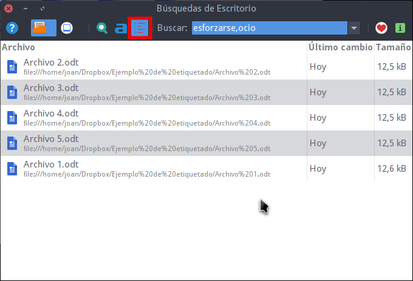

Hace semanas vimos como [instalar y configurar tracker](), como [buscar archivos]() por su contenido y como [etiquetar archivos y carpetas](). Para complementar estos artículos, a continuación veremos como podemos buscar archivos y carpetas usando las etiquetas que tienen asignadas los archivos y las carpetas.<!--more-->

## BUSCAR ARCHIVOS Y CARPETAS MEDIANTE SUS ETIQUETAS CON TRACKER-NEEDLE

A modo de ejemplo supongamos que queremos encontrar la totalidad de archivos y carpetas que contienen las etiqueta ocio y la etiqueta esforzarse.

Para ello tan solo tenemos que abrir Tracker-needle y clicar encima del botón de Buscar criterios de búsqueda en etiquetas. A continuación, en el cuadro de búsqueda escribimos el nombre de las 2 etiquetas que buscamos separadas por comas.

[](images/buscar-archivos-y-carpetas-por-etiquetas.png)

Tal y como se puede ver en la captura de pantalla, después de escribir el nombre de las etiquetas obtendremos la totalidad de archivos y carpetas que contienen la etiqueta esforzarse o la etiqueta ocio.

###### Nota: Si en el cuadro de búsqueda únicamente escribiéramos el nombre de la etiqueta ocio, entonces obtendríamos los archivos y carpetas que contienen la etiqueta ocio.

Estas son todas las operaciones que permite realizar la interfaz gráfica de tracker. Por lo tanto pueden ver que su funcionalidad es muy limitada y claramente inferior a la experiencia que nos proporciona Plasma.

No obstante para solucionar limitación podemos usar la terminal del siguiente modo.

## BUSCAR ARCHIVOS Y CARPETAS MEDIANTE SUS ETIQUETAS Y LA TERMINAL

Cuando empiecen a buscar archivos mediante la terminal verán que las posibilidades que les ofrece son mucho mayores que las de la interfaz gráfica.

### Buscar archivos y carpetas que tengan una etiqueta en determinada

Si quieren buscar la totalidad de archivos y carpetas que contiene la etiqueta business deberán ejecutar el siguiente comando:

> ```
> tracker tag -t -s business
> ```

###### Nota: La opción \-t lista la totalidad de las etiquetas. La opción \-s lista los archivos que contienen las etiquetas.

### Buscar archivos y carpetas que tengan una o varias etiquetas

Para buscar los archivos y carpetas que contienen la etiqueta business o la etiqueta ocio ejecutaremos el siguiente comando en la terminal:

> ```
> tracker tag -t -s business ocio
> ```

### Obtener los archivos que tienen las etiquetas business y ocio de forma simultánea

Si queremos ir más allá y buscar los archivos que de forma simultánea tienen las etiquetas business y ocio ejecutaremos el siguiente comando en la terminal:

> ```
> tracker sparql -q "SELECT nie:url(?f) WHERE { ?f nao:hasTag [ nao:prefLabel 'business' ] ; nao:hasTag [ nao:prefLabel 'ocio' ] }"
> ```

###### Nota: A partir de estos momentos, todas las partes de color rojo de los comandos corresponden a los nombres de las etiquetas y/o contenido que estamos buscando.

### Listar documentos que contengan una etiqueta específica

Sí únicamente queremos buscar los documentos que contengan la etiqueta ocio tenemos que ejecutar el siguiente comando en la terminal.

> ```
> tracker sparql -q "SELECT nie:url(?document) WHERE { ?document a nfo:Document ; nao:hasTag [ nao:prefLabel 'ocio' ] }"
> ```

### Listar las carpetas que contengan una etiqueta específica

Podemos buscar únicamente las carpetas contengan la etiqueta business ejecutando el siguiente comando en la terminal:

> ```
> tracker sparql -q "SELECT nie:url(?folder) WHERE { ?folder a nfo:Folder ; nao:hasTag [ nao:prefLabel 'business' ] }"
> ```

### Encontrar archivos que contengan una etiqueta en concreto y en su contenido tengan una palabra determinada

Para estrechar más la búsqueda podemos buscar archivos por sus etiquetas y por el contenido que tienen en su interior.

De este modo si quieren buscar los archivos que en su interior contengan la palabra esforzarse y además tengan la etiqueta business deberán ejecutar el siguiente comando en la terminal:

> ```
> tracker sparql -q "SELECT nie:url(?f) WHERE { ?f fts:match 'esforzarse' ; nao:hasTag [ nao:prefLabel 'business' ]}"
> ```

Si quisiéramos encontrar la totalidad de archivos que contienen la palabra esforzarse y además tuvieran asignadas de forma simultánea las etiquetas ocio y business, podríamos ejecutar el siguiente comando:

> ```
> tracker sparql -q "SELECT nie:url(?f) WHERE { ?f fts:match 'esforzarse' ; nao:hasTag [ nao:prefLabel 'business' ] ; nao:hasTag [ nao:prefLabel 'ocio' ] }"
> ```

### Buscar archivos que tengan una etiqueta determinada y contengan ciertas palabras determinadas

En caso que tengamos que buscar todos los archivos que dentro de su contenido figuren las palabras esforzarse e importante y que además tengan la etiqueta business, ejecutaremos el siguiente comando en la terminal:

> ```
> tracker sparql -q "SELECT nie:url(?f) WHERE { ?f fts:match 'esforzarse importantes' ; nao:hasTag [ nao:prefLabel 'business' ]}"
> ```

### Listar las imágenes que contengan una etiqueta específica

Para obtener la totalidad de imágenes que contienen la etiqueta business ejecutamos el siguiente comando en la terminal.

> ```
> tracker sparql -q "SELECT nie:url(?image) WHERE { ?image a nfo:Image ; nao:hasTag [ nao:prefLabel 'business' ] }"
> ```

### Listar las canciones que tengan una etiqueta específica

Para listar la totalidad de archivos de audio que contienen la etiqueta techno ejecutamos el siguiente comando en la terminal:

> ```
> tracker sparql -q "SELECT nie:url(?audio) WHERE { ?audio a nfo:Audio ; nao:hasTag [ nao:prefLabel 'techno' ] }"
> ```

### Consultar los archivos de vídeo que tienen una etiqueta determinada

Finalmente, para encontrar la totalidad de archivos de vídeo que contienen la etiqueta Thriller podemos ejecutar el siguiente comando en la terminal:

> ```
> tracker sparql -q "SELECT nie:url(?video) WHERE { ?video a nfo:Video ; nao:hasTag [ nao:prefLabel 'Thriller' ] }"
> ```

## CONCLUSIONES SOBRE TRACKER

A lo largo de todos los artículos realizados han podido ver que Tracker es una herramienta extremadamente útil, potente y versátil.

No obstante también hay remarcar los siguientes puntos:

1. Veo difícil que la gente use Tracker porque presenta una interfaz gráfica pobre y limitada.
2. Es una herramienta potente completamente desaprovechada por el equipo de Gnome.

En el momento de instalar cualquier distribución con Gnome se deberían cumplir las siguientes premisas:

1. Existir una interfaz gráfica potente e intuitiva para poder usar Tracker. Incluso se podría integrar en el Dash de Gnome.
2. Tracker debería estar completamente integrado con el buscador de archivos Nautilus.

De este forma todo el mundo usaría y hablaría maravillas de Tracker.
