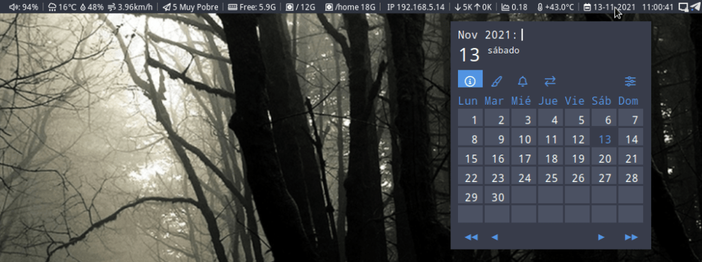
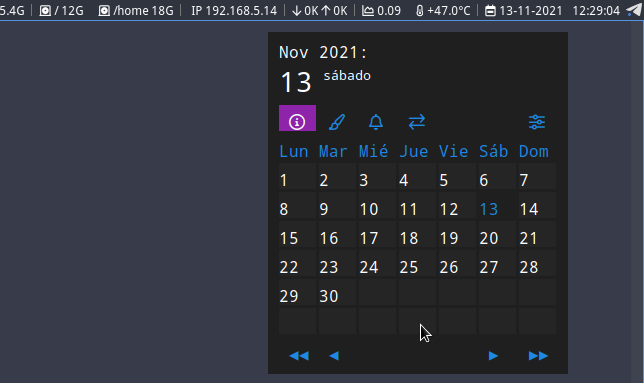
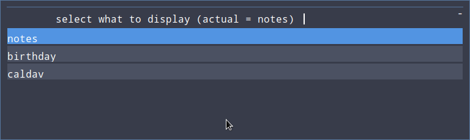
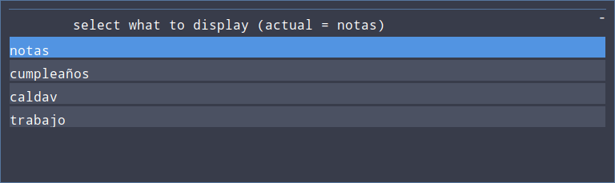
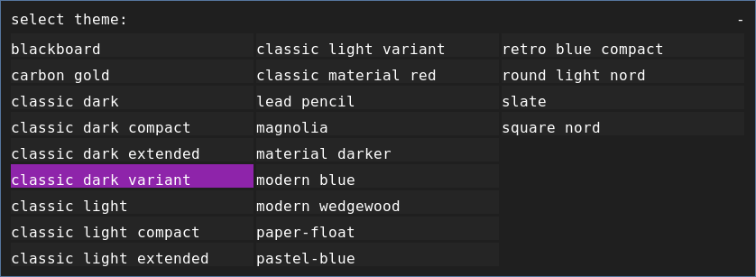
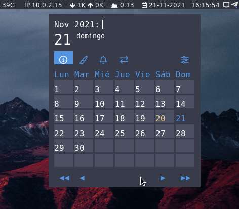
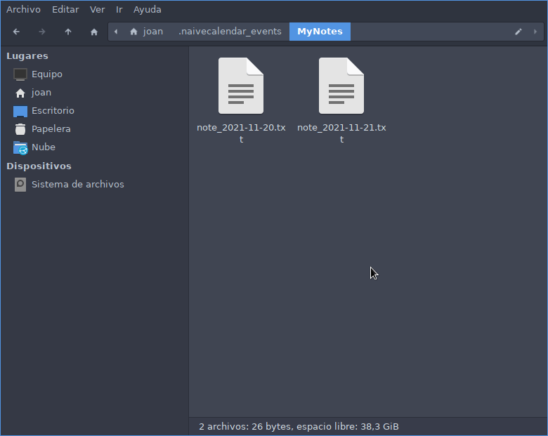

En mi caso estoy usando el escritorio i3 con la barra de herramientas i3blocks. El entorno de escritorio me encanta, pero para tenerlo como a uno le gusta hay que invertir horas y buscarse la vida. Una de las cosas que echaba de menos era el hecho de disponer de un calendario en mi barra de herramientas. Después de buscar encontré la opción de NaiveCalendar.<!--more-->

## QUE NOS OFRECE EL CALENDARIO NAIVECALENDAR

Una vez instalado y configurado NaiveCalendar aparecerá el siguiente calendario cada vez cliquemos encima del bloque del calendario de nuestra barra de tareas.

[](images/aspecto-del-calendario-naivecalendar-en-el-escritorio-i3.png)

Una vez abierto el calendario podremos realizar lo siguiente mediante atajos de teclado o el ratón:

1. Ver los días del mes actual. Mediante el ratón o los atajos de teclado podremos cambiar de mes y de año de forma fácil y rápida.
2. Introducir notas para todas y cada una de las fechas que aparecen en el calendario. Por lo tanto en cada una de las fechas podemos introducir notas, recordatorios de fecha de cumpleaños, tareas a realizar, etc.
3. NaiveCalendar permite crear diferentes tipos de categorías como por ejemplo notas, calendarios, fechas de cumpleaños, etc. Por lo tanto si queremos introducir fecha de cumpleaños podemos seleccionar la categoría cumpleaños y después introducir los datos en la fecha que toque.
4. Visualizar y editar los eventos programados para el mes actual de forma sencilla.
5. Descargar todos los eventos o notas que tengamos en un servidor CalDav y que se muestren en el calendario local. La sincronización es solamente en una dirección. Para realizar este paso hay que introducir la URL, usuario y el password del servidor CalDav en el fichero `caldav2file.py`.
6. Usando una aplicación de sincronización de ficheros, como por ejemplo Syncthing, Dropbox u otra podremos acceder a las notas o eventos generados en múltiples equipos.
7. Cambiar el tema del calendario. Si no os gustan los temas predeterminados los podéis modificar fácilmente. En mi caso por ejemplo he modificado los colores de uno de los temas para que se integre bien con el tema de mi escritorio que es `Arc`.

## REQUISITOS PARA LA INSTALACIÓN DE NAIVECALENDAR

Para que Naivecalendar funcione hay que tener instalado:

- Phyton3
- Rofi

Para que se visualicen bien los iconos también es necesario instalar la fuente FontAwesome.

Para que funcione la importación de eventos de un servidor de un servidor CalDav y funcione el portapapeles hay que instalar:

- python3-caldav
- xclip

## INSTALACIÓN DEL CALENDARIO NAIVECALENDAR

Hay varias formas de instalar Naivecalendar. En mi caso he usado la opción manual para controlar en todo momento lo que esta pasando en mi equipo. Lo primero a realizar es definir la ruta de instalación. En mi caso la ruta seleccionada es:

```shell
~/Aplicaciones
```

Para acceder a la ruta tecleo los siguiente comandos:

```shell
joan@gk55:~/Aplicaciones$ cd

joan@gk55:~$ cd Aplicaciones/
```

Para descargar NaiveCalendar en el equipo ejecuto el siguiente comando:

```shell
joan@gk55:~/Aplicaciones$ git clone https://framagit.org/Daguhh/naivecalendar.git
Clonando en 'naivecalendar'...
remote: Enumerating objects: 2292, done.
remote: Counting objects: 100% (453/453), done.
remote: Compressing objects: 100% (258/258), done.
remote: Total 2292 (delta 358), reused 244 (delta 194), pack-reused 1839
Recibiendo objetos: 100% (2292/2292), 1.14 MiB | 1.18 MiB/s, listo.
Resolviendo deltas: 100% (1565/1565), listo.
```

Una vez clonado el repositorio de gitlab accedemos dentro del directorio `naivecalendar/src` para ver el contenido descargado.

```shell
joan@gk55:~/Aplicaciones$ cd ~/Aplicaciones/naivecalendar/src/

joan@gk55:~/Aplicaciones/naivecalendar/src$ ls
global  naivecalendar.py  naivecalendar.sh  scripts  themes
```

Para iniciar el calendario por primera vez ejecutamos el siguiente comando en la terminal:

```shell
joan@gk55:~/Aplicaciones/naivecalendar/src$ ./naivecalendar.sh 
```

Acto seguido se abrirá el calendario con el tema predeterminado.

[](images/primer-inicio-naivecalendar.png)

## INTEGRAR EL CALENDARIO NAIVECALENDAR EN EL ESCRITORIO i3 USANDO LA BARRA DE TAREAS i3BLOCKS

Para integrar NaiveCalendar en nuestro escritorio realizaremos las siguientes acciones.

### Hacer que el calendario se abra cada vez que cliquemos sobre la fecha que aparece en la barra de tareas de i3blockls

Para que el calendario se abra cada vez que cliquemos en la fecha que aparece en nuestra barra de tareas i3blocks realizaremos lo siguiente.

Inicialmente abriremos el fichero de configuración de i3blocks. En mi caso el fichero se halla en `/home/joan/.config/i3/i3blocks.conf`, por lo tanto el comando a ejecutar es el siguiente:

```shell
joan@gk55:~$ nano /home/joan/.config/i3/i3blocks.conf
```

Una vez abierto el fichero de configuración pegaremos el siguiente código:

```shell
[time]
label=
command=date '+%d-%m-%Y   %H:%M:%S' ; if [ "${BLOCK_BUTTON}" -eq 1 ]; then ` bash /home/joan/Aplicaciones/naivecalendar/src/naivecalendar.sh`; fi
interval=5
align=center
```

**Nota:** Deberéis reemplazar `/home/joan/Aplicaciones/naivecalendar/src/naivecalendar.sh` por la ruta en que tengáis almacenado el fichero para lanzar NaiveCalendar.

Una vez copiado el código guardaremos los cambios, cerraremos el fichero y finalmente reiniciaremos el entorno de escritorio. A partir de estos momentos cada vez que posicionemos el puntero encima de la fecha que aparece en el panel de i3blocks y cliquemos con el botón izquierdo del ratón aparecerá NaiveCalendar.

### Abrir el calendario mediante un atajo de teclado

Si lo preferimos también podemos abrir el calendario mediante un atajo de teclado. Para ello tendremos que acceder al archivo de configuración del escritorio i3. En mi caso la ruta del archivo de configuración es `/home/joan/.config/i3/config`. Por lo tanto para acceder y editar el fichero ejecutaré el siguiente comando:

```shell
joan@gk55:~$ nano /home/joan/.config/i3/config
```

Una vez se abra el editor de texto nano añadiré el siguiente código:

```shell
bindsym $mod+c exec bash /home/joan/Aplicaciones/naivecalendar/src/naivecalendar.sh
```

**Nota:** Deberéis reemplazar `/home/joan/Aplicaciones/naivecalendar/src/naivecalendar.sh` por la ruta en que tengáis almacenado el fichero para lanzar NaiveCalendar.

A continuación guardamos los cambios, cerramos el fichero y reiniciamos el entorno de escritorio. A partir de estos momentos cada vez que presionemos la combinación de teclas `Win+c` se abrirá NaiveCalendar.

**Nota:** NaiveCalendar también se puede integrar de forma sencilla en la barra de herramientas PolyBar, pero no lo abordaremos por el momento ya que nunca he usado PolyBar.

### Definir el tipo de codificación y el editor que usaremos para editar los eventos

Si os fijáis, en los 2 apartados anteriores he usado 2 veces el comando para lanzar Naivecalendar. En mi caso el comando es el siguiente:

```shell
bash /home/joan/Aplicaciones/naivecalendar/src/naivecalendar.sh
```

Si lo necesitáis podéis añadir opciones al comando para por ejemplo conseguir los siguientes propósitos.

1. Forzar la codificación de los eventos.
2. Editar los eventos con el editor de textos que queramos.

De este modo si queremos editar los eventos con el editor `mousepad` y codificarlos con `es_ES.utf8` usaremos el siguiente comando:

```shell
bash /home/joan/Aplicaciones/naivecalendar/src/naivecalendar.sh -e mousepad -l es_ES.utf8
```

Sin consultáis la [página de Gitlab](https://framagit.org/Daguhh/naivecalendar) o [Github](https://github.com/Daguhh/naivecalendar) encontraréis opciones adicionales.

## ATAJOS DE TECLADO PARA USAR NAIVECALENDAR

Naivecalendar es ideal para ser usado con ajajos de teclado. Los atajos de teclados disponibles son los siguientes:

| Atajo de teclado | Acción |
| --- | --- |
| `pp + enter` | Retroceder el calendario un año. |
| `p + enter` | Retroceder el calendario un mes. |
| `nn + enter` | Avanzar el calendario un año. |
| `n + enter` | Avanzar el calendario un mes. |
| `ee + enter` | Visualizar todos los eventos que tenemos programados en el mes actual. |
| `ss + enter` | Seleccionar el tipo de evento que queremos crear/visualizar. Por defecto tenemos 3 tipos de evento, pero podemos crear los tipos que queramos. |
| `hh + enter` | Se muestra la ayuda en pantalla. |
| `tt + enter` | Se muestra un menú para cambiar de tema NaiveCalendar. |
| `mm + enter` | Mostrar el menú para acceder a las opciones de configuración y uso. |
| `cc + enter` | Se exportan todos los elementos del servidor CalDav configurado a nuestro calendario. |
| `win + c` | Abrir el calendario. Este atajo de teclado lo hemos definido nosotros mismos. |

Si lo prefieren también pueden usar el ratón, pero si se acostumbran a usar los atajos de teclado verán que la productividad aumenta considerablemente.

## TIPOS DE CATEGORÍAS EN NAIVECALANDAR

Si abren NaiveCalendar y presionan la combinación de teclas `ss + ENTER` verán que de forma predeterminada existen los siguientes tipos de categorías:

[](images/tipos-de-eventos.png)

Si queremos modificar o crear nuevos tipos de categorías tan solo tenemos que modificar el fichero `events.cfg` que en mi caso está almacenado en la ruta `~/Alicaciones/naivecalendar/src/global/`

Para acceder y editar el fichero de configuración ejecuto el siguiente comando:

```shell
nano /home/joan/Aplicaciones/naivecalendar/src/global/events.cfg
```

El contenido que aparece en mi fichero de configuración es el siguiente:

```shell
Notes = .naivecalendar_events/MyNotes/note_%Y-%m-%d.txt

Birthday = .naivecalendar_events/Birthdays/birthday_on_%d-%m.txt

CalDav = .naivecalendar_events/CalDav/%y-%m-%d.txt
```

En mi caso añadiré la categoría de evento `Trabajo` y españolizaré el resto de categorías. Por lo tanto el contenido final de mi fichero de configuración es el siguiente:

```shell
Notas = .naivecalendar_events/Misnotas/nota_%Y-%m-%d.txt

Cumpleaños = .naivecalendar_events/Cumpleaños/cumples_on_%d-%m.txt

CalDav = .naivecalendar_events/CalDav/%y-%m-%d.txt

Trabajo = .naivecalendar_events/trabajo/Trabajo_%Y-%m-%d.txt
```

Si ahora vuelvo a consultar las categorías de evento disponibles veré lo siguiente:

[](images/modificar-categorias-en-naivecalendar.png)

Las categorías son útiles para clasificar la información que añadimos a nuestro calendario. Por lo tanto si quiero añadir notas relacionadas con mi trabajo seleccionaré el evento trabajo. Una vez seleccionado el evento trabajo solo podré ver notas que previamente se hayan creado dentro de la categoría trabajo y si creo una nota nueva se creará en la categoría Trabajo.

## CAMBIAR EL TEMA DE NAIVECALENDAR

Cambiar el tema de Naivecalendar es extremadamente sencillo. Tan solo tenéis que abrir el calendario y presionar la combinación de teclas `tt+ENTER`. Acto seguido aparecerá el siguiente menú para seleccionar el tema que más les guste:

[](images/cambiar-el-tema-naivecalendar.png)

Si ninguno de los temas se adapta a su escritorio podéis modificar los colores de alguno de los temas existentes de forma sencilla. En mi caso modificaré los colores del tema `classic dark extended` del siguiente modo.

Si queremos modificar el color accederemos al fichero donde se definen los colores. Este fichero está ubicado en :

```shell
~/Aplicaciones/naivecalendar/src/themes/common/
```

Allí abrimos el fichero `theme_dark.rasi` y si nos fijamos veremos que los colores se definen del siguiente modo:

```shell
* {
    nord13: 	    #ebcb8b;	
    nord15: 	    #b48ead;	
    blue:           #56769E;
    blue2:          #1E88E5;
    dark1:                       #1F1F1F;
    dark2:                       #252525;
    white1:                      #FFFFFF;
    blue3:                       #8E24AA;
```

Por lo tanto tan solo tenemos que modificar los colores en formato hexadecimal del siguiente modo:

```shell
* {
    nord13:       #ebcb8b;
    nord15:       #5294e2;
    blue:           #56769E;
    blue2:          #5294e2;
    dark1:                       #383c4a;
    dark2:                       #4b5162;
    white1:                      #FFFFFF;
    blue3:                       #5294e2;
```

Una vez aplicados los cambios el resultados conseguido ha sido el siguiente:

[](images/resultado-final-personalizacion-tema.png)

Ahora el tema del calendario se integra a la perfección con el tema de escritorio Arc. Por lo tanto hemos conseguido nuestro objetivo.

## DÓNDE QUEDAN ALMACENADAS LAS NOTAS/EVENTOS DE NAIVECALENDAR

Todas las notas/eventos de NaiveCalendar se almacenan de forma estructurada en la siguiente ubicación:

```shell
nano ~/.naivecalendar_events/
```

Si accedemos a esta ubicación veremos que cada uno de los directorios es un tipo de categoría. Si entramos en uno de los directorios/categorías veremos que cada una de las notas se almacena en un fichero de texto siguiendo la estructura definida en el fichero `/home/joan/Aplicaciones/naivecalendar/src/global/events.cfg`.

[](images/almacenamiento-de-notas.png)

Por lo tanto guardando la totalidad del contenido del directorio `~/.naivecalendar_events/` podremos realizar una copia de seguridad o exportar las notas de un equipo a otro. También con programas de sincronización como Syncthing podremos sincronizar nuestras notas con distintos equipos.

#### Fuentes

[https://framagit.org/Daguhh/naivecalendar](https://framagit.org/Daguhh/naivecalendar)
