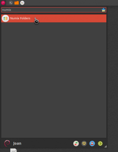
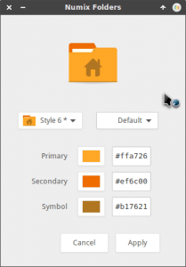
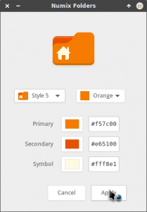
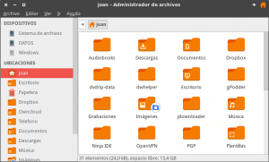

Existen usuarios del tema de iconos de Numix que estoy seguro que les gustaría cambiar el color y la apariencia de sus carpetas. Si este es vuestro caso podéis instalar el tema de carpetas Numix folders siguiendo las instrucciones del siguiente post.<!--more-->

## CONSIDERACIÓNES INICIALES ANTES DE PROCEDER CON LA INSTALACIÓN NUMIX FOLDERS

Para poder seguir este tutorial es necesario cumplir una serie de requisitos. Los requisitos mínimos son los siguientes:

1. **Disponer de los temas de iconos Numix y Numix-Circle** instalados en su ordenador.
2. **Las versiones de los temas de iconos Numix** instalados en su ordenador **tienen que ser posteriores al 19 de Junio de 2015**. Si no es así en el momento de usar numix folders se romperá el tema de iconos.

**En el caso que no cumplan alguno de estos 2 requisitos** tendrán que instalar o reinstalar de nuevo el tema de iconos Numix. Para ello les recomiendo **seguir las instrucciones que encontrarán en el siguiente enlace**:

https://geekland.eu/instalar-tema-iconos-numix-linux/

## INSTALACIÓN DEL SCRIPT NUMIX FOLDERS PARA MODIFICAR EL COLOR Y DISEÑO DE LAS CARPETAS

**El primer paso** a realizar para disponer de las carpetas Numix es instalar el software de control de versiones git para poder clonar el tema de carpetas Numix de Github. Para su instalación tenemos que **ejecutar el siguiente comando en la terminal**:

> ```
> sudo apt-get install git
> ```

**El segundo paso** consiste en **descargar el script Numix Folders ejecutando el siguiente comando en la terminal**:

> ```
> git clone https://github.com/numixproject/numix-folders
> ```

**En el tercer paso** vamos a copiar la carpeta que nos acabamos de descargar en la ubicación **/opt**. Para ello e**jecutamos el siguiente comando en la terminal**:

> ```
> sudo cp -r ~/numix-folders /opt
> ```

**Seguidamente** accedemos a la carpeta que contiene el script Numix folders. Para ello **ejecutamos el siguiente comando en la terminal**:

> ```
> cd /opt/numix-folders
> ```

**A continuación** transformaremos en ejecutable el script numix folders. Para ello **ejecutamos el siguiente comando en la terminal**:

> ```
> sudo chmod +x /opt/numix-folders/numix-folders
> ```

**El quinto paso** consiste en editar el archivo **numix-folders.desktop** para poder ejecutar el script. Para ello en la terminal **ejecutamos el siguiente comando**:

> ```
> sudo nano /opt/numix-folders/numix-folders.desktop
> ```

Una vez ejecutado el comando se abrirá el editor de textos nano en el que deberemos **localizar la siguiente línea**:

> ```
> Exec=numix-folders
> ```

Una vez localizada **la borramos y la reemplazamos por la siguiente**:

> ```
> Exec=/opt/numix-folders/numix-folders
> ```

Una vez realizadas las modificaciones **guardamos los cambios y cerramos el editor de texto**.

**Seguidamente** integraremos el script numix folders en el menú de nuestro entorno de escritorio copiando el archivo **numix-folders.dektop** en la ubicación **/usr/share/applications**. Para ello **ejecutamos el siguiente comando en la terminal**:

> ```
> sudo cp /opt/numix-folders/numix-folders.desktop /usr/share/applications
> ```

**Finalmente** crearemos un enlace simbólico del archivo ejecutable de **numix-folders** al directorio **/usr/bin** para tener la posibilidad de arrancar numix folders directamente desde la terminal . Para ello **ejecutamos el siguiente comando en la terminal**:

> ```
> sudo ln -s /opt/numix-folders/numix-folders /usr/bin/numix-folders
> ```

Una vez aplicados los cambios el proceso de instalación ha finalizado.

## ABRIR EL PROGRAMA / SCRIPT NUMIX FOLDERS

Tal y como se puede ver en la captura de pantalla, vamos al menú de nuestra distro y ejecutamos Numix Folders.

[](images/Abrir-el-script-Numix-folders.png)

###### Nota: Si quieren también pueden ejecutar el script Numix folders vía terminal. Para ello abren una terminal y ejecutan el comando **/opt/numix-folders/numix-folders** o el comando numix-folders

## USAR Y CONFIGURAR NUMIX FOLDERS PARA CAMBIAR EL COLOR Y ASPECTO DE LAS CARPETAS

Justo después de abrir el script los aparecerá la siguiente ventana en la que podremos **seleccionar el diseño y el color de nuestras carpetas**.

[](images/Pantalla-de-configuración-de-las-carpetas.png)

En mi caso selecciono el color naranja y el estilo 5. Una vez realizada la selección hay que **presionar en el botón Apply**.

[](images/Aplicar-la-configuración.png)

Después de presionar encima del botón tenemos que **esperar unos segundos** para que el script numix folders cambie el color y el diseño de nuestras carpetas. **Una vez aplicados los cambios** en mi caso **obtengo el siguiente resultado**:

[](images/Resultado-después-de-aplicar-el-script-de-numix-folders.png)

Como podéis ver he sido conservador y el aspecto final no difiere mucho del aspecto inicial. No obstante **si nos lo proponemos podemos llegar a obtener aspectos similares al siguiente**:

[](images/Aspecto-radical.png)

## OPTIMIZAR EL RENDIMIENTO DE NUMIX FOLDERS

Una vez modificado el aspecto de nuestras carpetas es recomendable actualizar los archivos de cache de los iconos Numix. Para ello en mi caso **ejecuto los siguientes comandos en la terminal**:

> ```
> gtk-update-icon-cache /usr/share/icons/Numix-Circle/
> ```
> 
> ```
> gtk-update-icon-cache /usr/share/icons/Numix-Circle-Light/
> ```
> 
> ```
> gtk-update-icon-cache /usr/share/icons/Numix/
> ```
> 
> ```
> gtk-update-icon-cache /usr/share/icons/Numix-Light/
> ```

###### Nota: Los comandos que acabo de citar es posible que se deban adaptar en función de la ruta en que tengáis instalados los iconos Numix.

## DESINSTALAR EL SCRIPT NUMIX FODLERS

Si algún día queremos desinstalar el script Numix Folders tan solo tenemos que deshacer los cambios realizados. Para ello **ejecutamos el script Numix Folders y seleccionamos el estilo 6 y el color Default**. Una vez realizada la selección **presionamos el botón Apply y esperamos unos segundos**.

[](images/Pantalla-de-configuración-de-las-carpetas.png)

Una vez podamos visualizar las carpetas estándar **abrimos una terminal y borramos el archivo numix-folders.desktop ejecutando el siguiente comando en la terminal**:

> ```
> sudo rm /usr/share/applications/numix-folders.desktop
> ```

Seguidamente **borramos el enlace simbólico que hicimos en usr/bin ejecutando el siguiente comando en la terminal**:

> ```
> sudo rm /opt/numix-folders/numix-folders /usr/bin/numix-folders
> ```

Finalmente **borramos el script numix folders ejecutando el siguiente comando en la terminal**:

> ```
> sudo rm -R /opt/numix-folders
> ```

Una vez realizados estos pasos el proceso de desinstalación del script ha finalizado.

## ENLACES DE INTERÉS

Para finalizar el post les dejo el enlace para que puedan visitar la plataforma de desarrollo de numix-folders. De este modo cualquier tipo de problema que encuentren, o cualquier propuesta de mejora, la pueden reportar directamente a los desarrolladores.

[https://github.com/numixproject/numix-folders](https://github.com/numixproject/numix-folders "Link a la plataforma de desarrollo de Numix Folders")
