En el penúltimo post que publique vimos las [utilidades de whisker menu, y las diferentes opciones que tenemos disponibles para su instalación](). Por lo tanto, siguiendo en la misma linea, en este post y en futuros post, **detallaremos como configurar Whisker menu** para que los usuarios puedan sacar el máximo rendimiento de este menú alternativo. Cuando los lectores hayan terminado de leer la totalidad de post que escribiré estoy seguro que se darán cuenta de las enormes posibilidades que ofrece este menú.<!--more-->

Seguidamente empezaremos a mostrar la totalidad de aspectos que podemos configurar de Whisker menu .

## CAMBIAR EL ICONO DE WHISKER MENU

Como os habréis podido fijar en las capturas de este post, o en vuestro propio ordenador, el icono de Whisker menu es el icono de un ratón. Si no os gusta y lo queréis cambiar tan solo tenéis que seguir los siguientes pasos:

**1-** **Posicionamos el puntero del ratón encima del icono del whisker menu**.

**2-** **Presionamos el botón derecho de nuestro ratón**. Al presionar el botón aparecerá un menú contextual.

**3-** En el menú contextual **seleccionamos la opción Propiedades**.

**4-** Una vez seleccionada está opción aparecerá la ventana de configuración de whisker menu. Tal y como se puede ver en la captura de pantalla tendrán que **clicar con el ratón encima del icono del ratón**.

[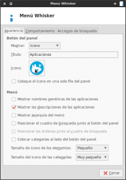](images/2-Cambiar-icono-Whisker-menu.png)

**5-** Seguidamente aparecerá una ventana en la que tendremos que simplemente **seleccionar el icono que queramos**. Una vez seleccionado, tal y como se puede ver en la captura de pantalla, tenemos que **presionar el botón Aceptar** y el proceso habrá finalizado.

[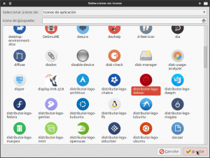](images/3-Seleccionar-el-icono-de-Whisker-menu.png)

## CAMBIAR LOS COLORES Y CONFIGURAR WHISKER MENU

Si os fijáis, en la siguiente captura de pantalla, mi Debian tiene un tema oscuro, mientras que Whisker menu tiene un tema claro. Esto provoca que Whisker menu no se integre de forma adecuada en mi entorno de escritorio.

[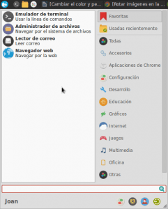](images/4-Colores-por-defecto-de-Whisker-menu.png)

Para solucionar este problema, y para por lo tanto hacer que Whisker menu se integre con nuestro tema GTK, que en mi caso es Numix, tenemos que realizar las siguientes acciones:

**1- Abrimos una terminal**. Una vez dentro de la terminal **tecleamos el siguiente comando** para asegurarnos que estamos dentro de nuestra partición home.

> ```
> cd ~/
> ```

**2-** Seguidamente **crearemos un archivo de texto con el nombre .gtkrc-2.0**. Para ello tenemos que **teclear el siguiente comando en la terminal**:

> ```
> touch .gtkrc-2.0
> ```

**3-** El tercer paso es editar el fichero que acabamos de crear. Para editar el fichero tenemos que **teclear el siguiente comando en la terminal**:

> ```
> nano .gtkrc-2.0
> ```

**4-** **Una vez abierto el editor de textos nano pegamos el siguiente texto** que es el que realmente configurará los colores y apariencia de whisker menu:

> ```
> style "whiskerblack"
> {
> bg[NORMAL] = "#2D2D2D" #color del panel principal y del panel de categorías
> bg[ACTIVE] = "#D64937" #color de la categoría activa justo después de deseleccionarse
> bg[PRELIGHT] = "#D64937" #color de fondo de la categoría seleccionada en panel de categorías
> fg[NORMAL] = "#ccc" #color del texto del panel de categorías
> fg[ACTIVE] = "#fff" #color de texto de la categoría justo después de deseleccionarse
> fg[PRELIGHT] = "#fff" #color del texto de la categoría seleccionada
> base[NORMAL] = "#404040" #color de fondo del panel de aplicaciones
> base[ACTIVE] = "#D64937" #color de fondo de la aplicación seleccionada
> text[NORMAL] = "#ccc" #color del texto de las aplicaciones
> text[ACTIVE] = "#fff" #color del texto de la aplicación seleccionada
> }
> widget "whiskermenu-window*" style "whiskerblack"
> ```

###### Nota: En rojo se indican los colores en forma hexadecimal usados para cada uno de los elementos del whisker menu. Si no os gustan los colores seleccionados podéis sustituirlos por los que más os gusten. En el siguiente [enlace](http://html-color-codes.info/codigos-de-colores-hexadecimales/ "Ayuda para seleccionar colores hexadecimales") tenéis un catálogo de colores en forma hexadecimal para que podáis tener una idea del color antes de aplicarlo.

###### Nota: Las letras de color verde son simples comentarios que indican los colores que estamos modificando.

###### Nota: Los colores seleccionados en la configuración de colores que acabo de mostrar, son perfectos para conseguir una integración total con el tema GTK Numix.

**5-** Una vez pegado el texto tan solo tenemos que **guardar los cambios y cerrar el editor de textos**.

**6-** Finalmente para hacer que los colores definidos en el fichero de configuración se apliquen, tan solo hay que **teclear el siguiente comando en la terminal**:

> ```
> xfce4-panel --restart
> ```

**7-** Después de teclear el comando en la terminal el resultado obtenido es el siguiente:

[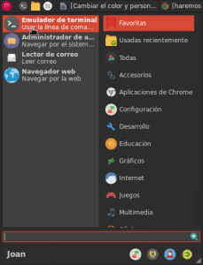](images/5-Colores-modificados-Whisker-menu.png)

###### Nota: Tal y como se puede ver en la captura de pantalla, la combinación de colores seleccionados se integra a la perfección con el popular tema de Numix.

## AÑADIR TRANSPARENCIAS A WHISKER MENU

No es mi caso, pero podría darse el caso Whisker menu no se integre en vuestro escritorio porqué tengáis transparencias en el panel de XFCE.

Si este es vuestro caso lo podéis solucionar siempre y cuando uséis una versión de Whisker menu igual o superior a la 1.5. A partir de la versión 1.5 Whisker menu permite añadir transparencias. Para realizar esto tan solo hay que **posicionar el ratón encima del icono del whisker menu**. Seguidamente **presionamos el botón derecho de nuestro ratón**. Después de apretarlo aparecerá un menú contextual en el que deberemos **seleccionar la opción Propiedades**. Seguidamente aparecerá la siguiente pantalla:

[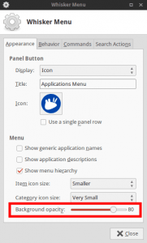](images/6-Transparencia-en-Whisker-menu.png)

Finalmente, tal y como se puede ver en la captura de pantalla, tan solo tendremos que **poner el valor que precisemos en el campo Opacidad de fondo** (Background opacity).

## REDIMIENSIONAR LAS MEDIDAS DE WHISKER MENU

Una vez personalizado el color, el siguiente paso es seleccionar el tamaño del Whisker menu. Tal y como de se puede ver en la captura de pantalla anterior, parte del contenido de las aplicaciones se corta.

Si queremos solucionar este problema, tal y como se puede ver en la captura de pantalla, tan solo tenemos que **abrir el whisker menu y posicionar el mouse en el extremo inferior derecho del panel**. Cuando cambia el dibujo del puntero del panel, tan solo tenemos que **presionar el botón izquierdo del ratón y arrastrar el ratón para definir el tamaño de menú que deseamos**.

[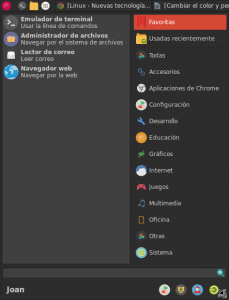](images/7-Cambiar-tamaño-de-Whisker-menu.png)

## AÑADIR APLICACIONES A FAVORITOS

Tal y como podrán observar, Whisker menú dispone de una categoría de aplicaciones favoritas. En esta categoría por defecto aparecen iconos para poder acceder de forma rápida a la terminal, al administrador de archivos, al lector de correo, y al navegador web.

Si queremos añadir más iconos de acceso rápido a la categoría de Favoritos, tal y como se puede ver en la captura de pantalla, tan solo tenemos que **buscar la aplicación que queremos introducir**, que en mi caso es gimp. Una vez encontrada **la seleccionamos y presionamos el botón derecho del mouse**. Seguidamente aparecerá un menú contextual en el que deberemos **seleccionar la opción Añadir a las favoritas**. Una vez seleccionada la opción la aplicación Gimp estará presente en la categoría de aplicaciones Favoritas.

[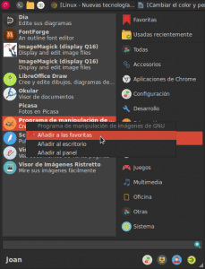](images/8-Añadir-aplicaciones-a-favoritos.png)

Si por algún motivo queremos quitar alguna de las aplicaciones que hemos añadido en la categoría de favoritos, tal y como se puede ver en la captura de pantalla, tenemos que **seleccionar la aplicación que queremos quitar, presionar el botón derecho del ratón y** cuando aparezca el menú contextual **seleccionaremos y ejecutaremos la opción Eliminar de las favoritas**.

[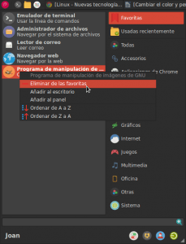](images/9-Eliminar-aplicación-de-favoritos.png)

Dentro del menú de Favoritas también podemos seleccionar el orden en que se posicionan nuestras aplicaciones Favoritas. De esta forma si queremos que el Software Gimp aparezca en la primera posición de nuestras aplicaciones favoritas, tal y como se puede ver en la captura de pantalla, tenemos que **ir al menú de favoritas y posicionar el puntero del mouse encima del software Gimp**.

Seguidamente **presionamos le botón izquierdo de nuestro ratón y arrastramos el puntero hasta la posición que queramos poner Gimp**. Tal y como se puede ver en la captura de pantalla, en mi caso estoy posicionando Gimp en la posición número 1 dentro del menú de Favoritas.

## AÑADIR APLICACIONES DENTRO DEL MENÚ DE WHISKER MENU

Si por algún motivo queremos añadir una aplicación que no tiene lanzador dentro del whisker menu, lo podemos realizar de la siguiente forma:

**1-** **Abrimos whisker menu y en el cuadro de búsqueda escribimos menú principal**. Una vez hayamos escrito menú principal se realizará la búsqueda de la aplicación que nos permitirá configurar los elementos de nuestro menú. **Una vez encontrada, tal y como se puede ver en la captura de pantalla, la ejecutamos**.

[](images/11-Acceder-al-menu-principal.png)

**2-** Una la hayamos ejecutado la aplicación aparecerá una ventana para configurar el menú principal. Tal y como se puede ver en la captura de pantalla, en esta ventana tenemos que **presionar el botón Elemento Nuevo**.

[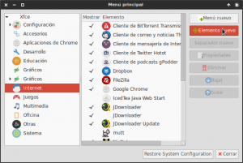](images/12-Añadir-Firefox-en-Whisker-menu.png)

**3-** Seguidamente aparecerá una ventana en la que tendremos que **introducir los parámetros necesarios para introducir el programa que deseemos en el menú**. En mi caso tal y como se puede ver en la captura de pantalla estoy añadiendo el programa Firefox.

[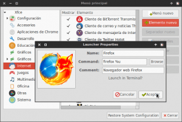](images/13-Aplicación-añadida.png)

Los valores a introducir en cada uno de los 4 campos, para por ejemplo introducir Firefox, son los siguientes:

**Campo Name:** En este campo simplemente tenemos que introducir el nombre de la aplicación que en mi caso es Firefox. Vosotros seleccionad el que queráis.

**Campo Command:** En este campo hay que poner el comando que usaríamos para lanzar Firefox, o cualquier otros programa, desde la terminal seguido del carácter %u. Por lo tanto en este campo en mi caso tengo que escribir firefox %u.

**Campo Comment:** En este campo se puede poner un breve comentario que describa la utilidad de la aplicación que estamos añadiendo. En mi caso escribiré Navegador web Firefox.

**Campo Icono:** Si clicamos encima del icono aparecerá un navegador de archivos para que podamos seleccionar el icono que más nos guste. Como pueden ver en la captura de pantalla anterior en mi caso he seleccionado un icono para Firefox.

**4-** Una vez rellenados todos los campos tan solo tendremos que **presionar encima del botón Aceptar** para finalizar el proceso.

## AÑADIR CHROME APPS EN WHISKER MENU

Si por algún motivo queremos añadir una aplicación o chrome App en whisker menu también lo podemos hacer de una forma extremadamente fácil.

Para ello lo primero que tenemos que realizar es **localizar la chrome App que queremos añadir** que en mi caso es la de Grooveshark. Una vez localizada **abro mi gestor de archivos y navego hasta la ubicación** ~/.local/share/applications. Una vez dentro de esta ubicación, tal y como se puede ver en la captura de pantalla, **copiamos la chrome app o lanzador dentro de esta ubicación**.

[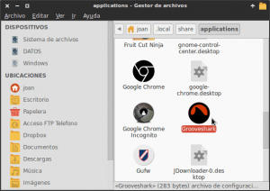](images/14-Añadir-Chrome-ap-en-whisker-menu.png)

Una vez copiado el lanzador dentro de esta ubicación, la aplicación de Grooveshark ya aparecerá en nuestro menú dentro de la categoría Otras.

## CONFIGURAR LA APARIENCIA Y COMPORTAMIENTO DE WHISKER MENU

Finalmente solo queda jugar con las opciones básicas de configuración que ofrece Whisker menu para elegir las que más os convenzan. Para ello podemos seguir los siguientes pasos:

**1-** **Posicionamos el puntero del ratón encima del icono del whisker menu**.

**2-** **Presionamos el botón derecho de nuestro ratón**. Al presionar el botón aparecerá un menú contextual.

**3- Seleccionamos y ejecutamos la opción Propiedades** del menú contextual.

**4-** Una vez dentro de Propiedades aparecerá la ventana de configuración de whisker menu. Tal y como se puede ver en la captura, en la pestaña de apariencia encontraréis distintas opciones para personalizar el comportamiento y visualización de Whisker Menu. Tan solo tenemos que **seleccionar las opciones que más nos interesen.**

[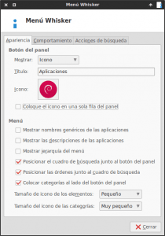](images/15-Configurar-aparencia-de-Whisker-menu.png)

###### Nota: En la captura de pantalla se pueden ver las opciones de apariencia que estoy usando actualmente.

Algunas de las opciones de apariencia que aparecerán en el menú son las siguientes:

**Mostrar nombres genéricos de las aplicaciones:** Si activamos esta opción Whisker menu mostrará nombres genéricos para cada una de las aplicaciones que aparecen en Whisker menu. Así por lo tanto en vez de mostrar el nombre Transmission mostrará el nombre Cliente de BitTorrent.

**Mostrar descripciones de las aplicaciones:** Si marcamos esta opción, justo debajo de cada aplicación aparecerá una breve descripción del uso de la aplicación.

**Mostrar Jerarquía del Menú:** En función de si activamos o desactivamos esta opción, las categorías que aparecerán en Whisker menu se ordenarán de diferente forma.

**Posicionar el cuadro de búsqueda junto al botón del panel:** El cuadro de búsqueda de Whisker menu viene ubicado en la parte opuesta al botón que activa Whisker menu. Si queremos que el botón de Whisker menu y el cuadro de búsqueda estén juntos uno encima de otro, tan solo tenemos que marcar esta opción.

**Posicionar las ordenes junto al cuadro de Búsqueda:** Si activamos esta opción haremos que las ordenes de Cerrar sesión, bloquear pantalla, etc se posicionen justo al lado del cuadro de búsqueda.

**Colocar categorías al lado del botón del panel:** Si marcamos esta opción lo que haremos es que la categorías se muestren en el mismo lado en que está ubicado el botón del panel. De este modo podemos tener ubicadas las categorías en el lado izquierdo del menú o en el lado derecho del menú.

**Tamaño del icono de los elementos:** En este campo podemos seleccionar el tamaño de los iconos de los elementos de Whisker menu.

**Tamaño del icono de las categorías:** En este campo podemos seleccionar el tamaño de los iconos de las categorías de Whisker menu.

**5-** Una vez configurada la apariencia podemos configurar el comportamiento del menú, para ello tan solo tenemos que **clicar encima de la pestaña Comportamiento** y aparecerá la siguiente ventana:

[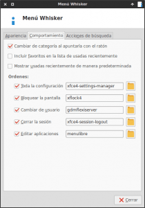](images/16-Configurar-Comportamiento-Whisker-menu.png)

###### Nota: En la captura de pantalla se pueden ver las opciones de comportamiento que estoy usando actualmente.

En la ventana de configuración del comportamiento encontraremos una serie de opciones. Tan solo tenemos que **seleccionar las opciones que más nos interesen**.

Algunas de las opciones de comportamiento que aparecerán en el menú son las siguientes:

**Cambiar de categoría al apuntarla con el ratón:** Si marcamos esta opción a medida que deslizamos el mouse de categoría en categoría se irán mostrando las aplicaciones que contiene cada una de las categorías. En caso contrario solo se mostraran las aplicaciones de las categorías que seleccionemos clicando con el ratón.

**Incluir favoritos en la lista de usadas recientemente:** Si no marcamos está opción, las aplicaciones que están en el menú de favoritos no aparecerán en aplicaciones usadas recientemente.

**Mostrar usadas recientemente de forma predeterminada:** Si seleccionamos esta opción, al abrir Whisker menu la categoría predeterminada seleccionada de inicio será aplicaciones recientes.

**Toda la configuración:** Si tildamos esta opción, dentro del Whisker menu aparecerá un icono de acceso directo para acceder a la ventana de configuración de xfce.

**Bloquear la pantalla:** Si tildamos está opción, dentro del Whisker menu aparecerá un icono de acceso directo que al presionarlo se bloqueará la pantalla.

**Cambiar de usuario:** Si tildamos está opción, dentro del Whisker menu aparecerá un icono de acceso directo que al presionarlo podremos cambiar de usuario tranquilamente.

**Cerrar la sesión:** Si tildamos está opción, cuando posicionemos el puntero del mouse encima del botón del whisker menu, y presionemos el botón derecho del ratón nos aparecerá la opción de Editar aplicaciones. Esta opción es una opción alternativa para personalizar los lanzadores que aparecen dentro de Whisker menu. Quien quiera usar esta opción, tiene que comprobar que el paquete menulibre esté debidamente instalado.

###### Nota: Aparte de las opciones de bloquear pantalla, cerrar la sesión etc. Seria interesante que en un futuro los usuarios pudieran crearse sus propias ordenes.

**6-** Una vez hemos seleccionado las opciones de apariencia y comportamiento tan solo tenemos que **presionar el botón Cerrar**.

Para finalizar este post, os dejo una captura de pantalla para que podáis ver como luce Whisker menu en mi Debian Testing.

[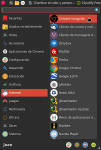](images/17-Aspecto-final-de-whisker-menu.png)

Ya para despedirme deciros que en los próximos post seguiremos viendo como sacar el máximo partido a Whisker menu. Concretamente veremos 2 opciones muy interesantes y potentes que tiene Whisker menu. La primera de ellas es como podemos [usar Whisker menu como un lanzador de aplicaciones]() tipo Synapse, Kupfer, etc, y para finalizar la serie de post de Whisker menu veremos la potencia, la versatilidad y las posibilidades que nos ofrecen [sus acciones de búsqueda]().
