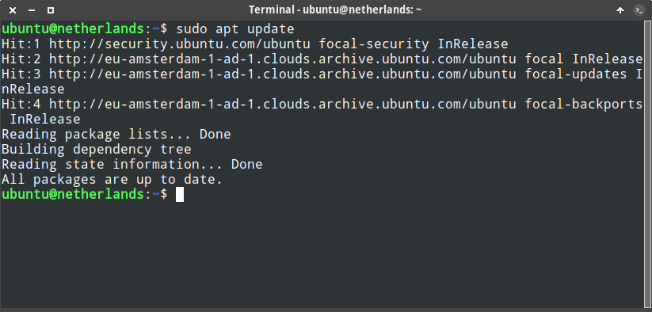
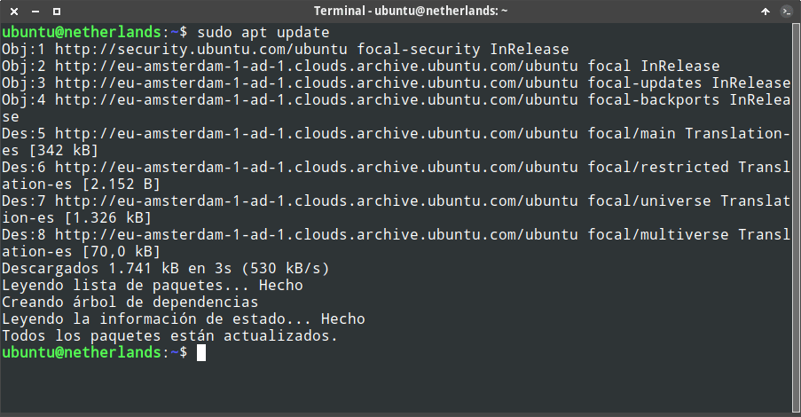
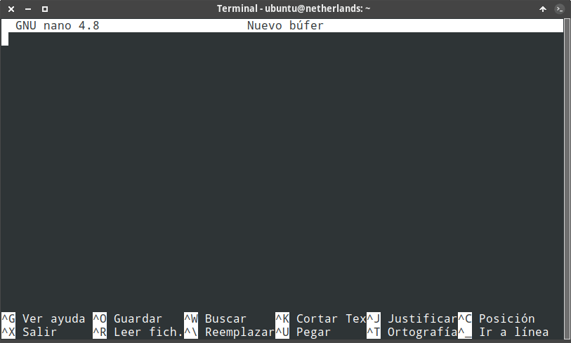
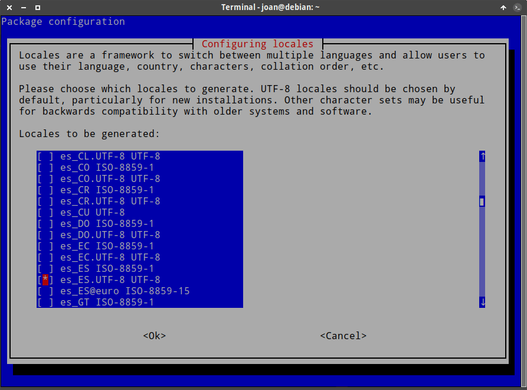
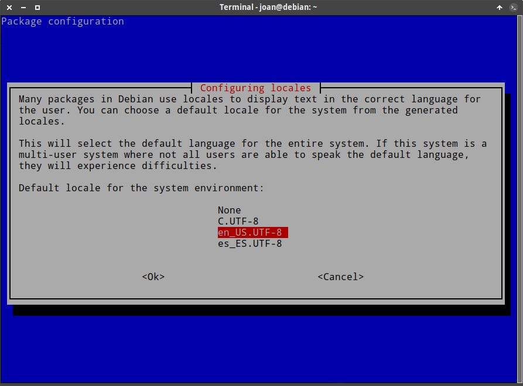

A continuación veremos como podemos cambiar el idioma de la terminal en Debian o en Ubuntu porque es relativamente normal que en el momento de contratar un servidor VPS la terminal no esté en Español. Por ejemplo en la siguiente captura de pantalla pueden ver que todo el texto que aparece en la terminal está en Inglés.<!--more-->

[](images/terminal-en-ingles.png)

Para solucionar este pequeño inconveniente vamos a cambiar el idioma de nuestro servidor Debian o Ubuntu desde la terminal.

## CAMBIAR EL IDIOMA DE LA TERMINAL EN UBUNTU

Los pasos a seguir para cambiar el idioma de nuestro servidor Ubuntu son los siguientes:

### Identificar el idioma en que está configurado el equipo o servidor

Mediante el comando `locale` podremos ver el idioma que tenemos definido como predeterminado en nuestro servidor:

> `**ubuntu@netherlands:~$ locale LANG=C.UTF-8 LANGUAGE= LC_CTYPE="C.UTF-8" LC_NUMERIC=C.UTF-8 LC_TIME=C.UTF-8 LC_COLLATE="C.UTF-8" LC_MONETARY=C.UTF-8 LC_MESSAGES="C.UTF-8" LC_PAPER=C.UTF-8 LC_NAME=C.UTF-8 LC_ADDRESS=C.UTF-8 LC_TELEPHONE=C.UTF-8 LC_MEASUREMENT=C.UTF-8 LC_IDENTIFICATION=C.UTF-8 LC_ALL=**`

En nuestro caso vemos que en prácticamente todos los apartados pone `C.UTF-8`. Por lo tanto el idioma predeterminado del sistema operativo es el Inglés. Ahora si queremos podemos mirar todos los idiomas que tenemos instalados y veremos lo siguiente:

> ```shell
> ubuntu@netherlands:~$ locale -a
> C
> C.UTF-8
> POSIX
> ```

Visto el resultado de salida vemos que el Español no está disponible.

### Instalar los paquetes necesarios para añadir cualquier tipo de variante de Español

Para añadir el Español tendremos que instalar el paquete `language-pack-es` mediante el siguiente comando:

> ```shell
> ubuntu@netherlands:~$ sudo apt-get install language-pack-es
> Reading package lists... Done
> Building dependency tree       
> Reading state information... Done
> The following package was automatically installed and is no longer required:
>   apparmor
> Use 'sudo apt autoremove' to remove it.
> The following additional packages will be installed:
>   language-pack-es-base locales
> The following NEW packages will be installed:
>   language-pack-es language-pack-es-base locales
> 0 upgraded, 3 newly installed, 0 to remove and 0 not upgraded.
> Need to get 6775 kB of archives.
> After this operation, 30.4 MB of additional disk space will be used.
> Do you want to continue? [Y/n] 
> Get:1 http://eu-amsterdam-1-ad-1.clouds.archive.ubuntu.com/ubuntu focal-updates/main amd64 locales all 2.31-0ubuntu9.1 [3868 kB]
> Get:2 http://eu-amsterdam-1-ad-1.clouds.archive.ubuntu.com/ubuntu focal-updates/main amd64 language-pack-es-base all 1:20.04+20200709 [2905 kB]
> Get:3 http://eu-amsterdam-1-ad-1.clouds.archive.ubuntu.com/ubuntu focal-updates/main amd64 language-pack-es all 1:20.04+20200709 [1904 B]
> Fetched 6775 kB in 11s (631 kB/s)                                                    
> debconf: delaying package configuration, since apt-utils is not installed
> Selecting previously unselected package locales.
> (Reading database ... 89701 files and directories currently installed.)
> Preparing to unpack .../locales_2.31-0ubuntu9.1_all.deb ...
> Unpacking locales (2.31-0ubuntu9.1) ...
> Selecting previously unselected package language-pack-es-base.
> Preparing to unpack .../language-pack-es-base_1%3a20.04+20200709_all.deb ...
> Unpacking language-pack-es-base (1:20.04+20200709) ...
> Selecting previously unselected package language-pack-es.
> Preparing to unpack .../language-pack-es_1%3a20.04+20200709_all.deb ...
> Unpacking language-pack-es (1:20.04+20200709) ...
> Setting up locales (2.31-0ubuntu9.1) ...
> debconf: unable to initialize frontend: Dialog
> debconf: (No usable dialog-like program is installed, so the dialog based frontend cannot be used. at /usr/share/perl5/Debconf/FrontEnd/Dialog.pm line 76.)
> debconf: falling back to frontend: Readline
> Generating locales (this might take a while)...
>   es_AR.UTF-8... done
>   es_BO.UTF-8... done
>   es_CL.UTF-8... done
>   es_CO.UTF-8... done
>   es_CR.UTF-8... done
>   es_CU.UTF-8... done
>   es_DO.UTF-8... done
>   es_EC.UTF-8... done
>   es_ES.UTF-8... done
>   es_GT.UTF-8... done
>   es_HN.UTF-8... done
>   es_MX.UTF-8... done
>   es_NI.UTF-8... done
>   es_PA.UTF-8... done
>   es_PE.UTF-8... done
>   es_PR.UTF-8... done
>   es_PY.UTF-8... done
>   es_SV.UTF-8... done
>   es_US.UTF-8... done
>   es_UY.UTF-8... done
>   es_VE.UTF-8... done
> Generation complete.
> Setting up language-pack-es (1:20.04+20200709) ...
> Setting up language-pack-es-base (1:20.04+20200709) ...
> Generating locales (this might take a while)...
> Generation complete.
> ```

**Nota**: Si por ejemplo quisiera que la terminal estuviera en Catalán, Euskera o Gallego deberían instalar los siguientes paquetes:

| Idioma | Paquete a instalar |
| --- | --- |
| Catalán | `language-pack-ca` |
| Euskera | `language-pack-eu` |
| Gallego | `language-pack-gl` |

### Definir el Español como lenguaje predeterminado

Una vez instalados los paquetes necesarios tenemos generar los locales y definir el idioma predeterminado. Para ello ejecutaremos el el siguiente comando:

> ```shell
> ubuntu@netherlands:~$ sudo dpkg-reconfigure locales
> ```

Justo después de ejecutar el comando tendrán que seleccionar el idioma para el cual quieren construir los locales. En mi caso como quiero el Español de España he seleccionado la opción `es_ES.UTF-8 UTF-8`.

> ```shell
> ubuntu@netherlands:~$ sudo dpkg-reconfigure locales
> debconf: unable to initialize frontend: Dialog
> debconf: (No usable dialog-like program is installed, so the dialog based frontend cannot be used. at /usr/share/perl5/Debconf/FrontEnd/Dialog.pm line 76.)
> debconf: falling back to frontend: Readline
> Configuring locales
> -------------------
> 
> Locales are a framework to switch between multiple languages and allow users to use
> their language, country, characters, collation order, etc.
> 
> Please choose which locales to generate. UTF-8 locales should be chosen by default,
> particularly for new installations. Other character sets may be useful for backwards
> compatibility with older systems and software.
> 
>   1. All locales                      252. gl_ES.UTF-8 UTF-8
>   2. aa_DJ ISO-8859-1                 253. gl_ES@euro ISO-8859-15
>   3. aa_DJ.UTF-8 UTF-8                254. gu_IN UTF-8
>   4. aa_ER UTF-8                      255. gv_GB ISO-8859-1
>   5. aa_ER@saaho UTF-8                256. gv_GB.UTF-8 UTF-8
>   6. aa_ET UTF-8                      257. ha_NG UTF-8
>   7. af_ZA ISO-8859-1                 258. hak_TW UTF-8
>   8. af_ZA.UTF-8 UTF-8                259. he_IL ISO-8859-8
>   9. agr_PE UTF-8                     260. he_IL.UTF-8 UTF-8
>   10. ak_GH UTF-8                     261. hi_IN UTF-8
>   11. am_ET UTF-8                     262. hif_FJ UTF-8
>   183. es_ES.UTF-8 UTF-8              263. hne_IN UTF-8
> ....
> 
> (Enter the items you want to select, separated by spaces.)
> 
> Locales to be generated: 183
> ```

Acto seguido tendremos que seleccionar el idioma que queremos como predeterminado. Como quiero que el idioma predeterminado sea el Español de España seleccionaré la opción `es_ES.UTF-8`.

> ```shell
> Many packages in Debian use locales to display text in the correct language for the user. You can choose a default locale for the system from the generated locales.
> 
> This will select the default language for the entire system. If this system is a multi-user system where not all users are able to speak the default language, they will experience
> difficulties.
> 
> 1. None         4. es_EC.UTF-8  7. es_BO.UTF-8  10. es_PY.UTF-8  13. es_PE.UTF-8  16. es_VE.UTF-8  19. es_AR.UTF-8 22. es_PR.UTF-8
> 2. C.UTF-8      5. es_CO.UTF-8  8. es_DO.UTF-8  11. es_NI.UTF-8  14. es_CU        17. es_GT.UTF-8  20. es_US.UTF-8  23. es_UY.UTF-8
> 3. es_ES.UTF-8  6. es_CL.UTF-8  9. es_HN.UTF-8  12. es_ES.UTF-8  15. es_CR.UTF-8  18. es_SV.UTF-8  21. es_PA.UTF-8  24. es_MX.UTF-8
> Default locale for the system environment: 3
> 
> Generating locales (this might take a while)...
>   es_AR.UTF-8... done
>   es_BO.UTF-8... done
>   es_CL.UTF-8... done
>   es_CO.UTF-8... done
>   es_CR.UTF-8... done
>   es_CU.UTF-8... done
>   es_DO.UTF-8... done
>   es_EC.UTF-8... done
>   es_ES.UTF-8... done
>   es_GT.UTF-8... done
>   es_HN.UTF-8... done
>   es_MX.UTF-8... done
>   es_NI.UTF-8... done
>   es_PA.UTF-8... done
>   es_PE.UTF-8... done
>   es_PR.UTF-8... done
>   es_PY.UTF-8... done
>   es_SV.UTF-8... done
>   es_US.UTF-8... done
>   es_UY.UTF-8... done
>   es_VE.UTF-8... done
> Generation complete.
> ```

### Reiniciar el servidor o equipo para cambiar el idioma de la terminal

Una vez realizados todos los pasos tan solo tenemos que reiniciar el servidor mediante el siguiente comando:

> ```shell
> ubuntu@netherlands:~$ sudo reboot
> ```

La próxima vez que reinicie el servidor, el idioma predeterminado en todos los usuarios debería ser el Español de España.

[](images/terminal-en-espanol.png)

Y si abrimos aplicaciones que se ejecutan en la terminal como por ejemplo nano también estarán en español:

[](images/nano-en-espanol.png)

Y si ahora ejecutamos el comando `locale` veremos que el idioma predeterminado es el Español.

> ```shell
> ubuntu@netherlands:~$ locale
> LANG=es_ES.UTF-8
> LANGUAGE=
> LC_CTYPE="es_ES.UTF-8"
> LC_NUMERIC=es_ES.UTF-8
> LC_TIME=es_ES.UTF-8
> LC_COLLATE="es_ES.UTF-8"
> LC_MONETARY=es_ES.UTF-8
> LC_MESSAGES="es_ES.UTF-8"
> LC_PAPER=es_ES.UTF-8
> LC_NAME=es_ES.UTF-8
> LC_ADDRESS=es_ES.UTF-8
> LC_TELEPHONE=es_ES.UTF-8
> LC_MEASUREMENT=es_ES.UTF-8
> LC_IDENTIFICATION=es_ES.UTF-8
> LC_ALL=
> ```

## CAMBIAR EL IDIOMA DE LA TERMINAL EN DEBIAN

Si están en un sistema operativo Debian y quieren cambiar el idioma de la terminal hay que asegurar que tienen instalado el paquete `locales`. Para ello ejecuten el siguiente comando en la terminal:

> ```shell
> joan@debian:~$ sudo apt install locales
> Leyendo lista de paquetes... Hecho
> Creando árbol de dependencias       
> Leyendo la información de estado... Hecho
> locales ya está en su versión más reciente (2.31-4).
> fijado locales como instalado manualmente.
> 0 actualizados, 0 nuevos se instalarán, 0 para eliminar y 0 no actualizados
> ```

### Generar los locales del idioma que queremos como predeterminado

Una vez estamos seguros que el paquete `locales` está instalado ejecutaremos el siguiente comando para generar los locales de nuestro idioma.

> ```shell
> joan@debian:~$ sudo dpkg-reconfigure locales
> [sudo] password for joan: 
> ```

Después de ejecutar el comando tendrán que definir el idioma para el que necesitan crear los locales. En nuestro caso el idioma es el Español de España, por lo tanto seleccionaremos la opción `es_ES.UTF-8 UTF-8`.

[](images/definir-locales-a-generar.png)

### Seleccionar el idioma predeterminado del sistema en Debian

Acto seguido y una vez se hayan generado los locales aparecerán todos los idiomas que tenemos disponibles. Como quiero que el idioma sea el Español de España seleccionaré la opción `es_ES.UTF-8`

[](images/elegir-idioma-predeterminado-del-sistema.png)

**Nota**: Si por algún motivo no se generan los locales de forma automática pueden ejecutar el comando `sudo locale-gen`

### Reiniciar el servidor Debian

Finalmente mediante el comando `sudo reboot` reinician el equipo. La próxima vez que enciendan el equipo el idioma predeterminado para todos los usuarios de un equipo debería ser el Español.

> ```shell
> joan@debian:~$ sudo reboot
> ```

## CAMBIAR EL IDIOMA DE LA TERMINAL EN UBUNTU O DEBIAN PARA UN SOLO USUARIO

Si siguen las instrucciones que hemos detallado en el artículo se cambiará el idioma predeterminado de todos los usuarios del servidor o del equipo. Sí unicamente quieren cambiar el idioma de uno de los usuarios deberán proceder del siguiente modo.

### Instalar los locales pertinentes y definir el idioma predeterminado

Para instalar los locales pertinentes y definir el idioma predeterminado sigan las instrucciones que se han detallado con anterioridad en este artículo. En mi caso he instalado los locales `en_US.UTF-8` y `es_ES.UTF-8`

> ```shell
> joan@debian:~$ locale -a
> C
> C.UTF-8
> es_ES.utf8
> en_US.UTF-8
> POSIX
> ```

Además el idioma que he seleccionado como predeterminado es el Español de España.

### Definir el idioma para únicamente uno de los usuarios

Si ahora **queremos que todos los usuarios tengan como idioma el Español de España excepto el usuario** `joan` **que queremos que tenga el idioma Inglés de Estados unidos** procederemos del siguiente modo. Primero de todo nos logueamos con el usuario `joan` ejecutando el siguiente comando:

> ```shell
> raul@debian:~$ su joan
> Contraseña:
> ```

A continuación ejecutamos el comando `cd` para asegurar que estamos dentro de la partición home del usuario `joan`.

> ```shell
> joan@debian:~$ cd
> ```

Acto seguido ejecutamos el siguiente comando para editar el contenido del fichero `.profile`

> ```shell
> joan@debian:~$ nano .profile
> ```

Cuando se abra el editor de textos pegamos el siguiente código al final del archivo:

> ```shell
> LANG=en_US.UTF-8
> LANGUAGE=
> LC_CTYPE="en_US.UTF-8"
> LC_NUMERIC="en_US.UTF-8"
> LC_TIME="en_US.UTF-8"
> LC_COLLATE="en_US.UTF-8"
> LC_MONETARY="en_US.UTF-8"
> LC_MESSAGES="en_US.UTF-8"
> LC_PAPER="en_US.UTF-8"
> LC_NAME="en_US.UTF-8"
> LC_ADDRESS="en_US.UTF-8"
> LC_TELEPHONE="en_US.UTF-8"
> LC_MEASUREMENT="en_US.UTF-8"
> LC_IDENTIFICATION="en_US.UTF-8"
> LC_ALL=
> ```

**Nota:** Si quisieran usar un idioma diferente al Inglés de Estados Unidos deberían reemplazar `en_US.UTF-8` por la denominación que recibe el local del idioma que quieren usar.

Una vez pegado el texto guardamos los cambios y cerramos el fichero. A continuación editaremos el fichero `.bashrc` ejecutando el siguiente comando en la terminal:

> ```shell
> joan@debian:~$ nano .bashrc
> ```

En el momento que se abra el editor de textos nano pegaremos el mismo código que pegamos en el fichero `.profile`:

> ```shell
> LANG=en_US.UTF-8
> LANGUAGE=
> LC_CTYPE="en_US.UTF-8"
> LC_NUMERIC="en_US.UTF-8"
> LC_TIME="en_US.UTF-8"
> LC_COLLATE="en_US.UTF-8"
> LC_MONETARY="en_US.UTF-8"
> LC_MESSAGES="en_US.UTF-8"
> LC_PAPER="en_US.UTF-8"
> LC_NAME="en_US.UTF-8"
> LC_ADDRESS="en_US.UTF-8"
> LC_TELEPHONE="en_US.UTF-8"
> LC_MEASUREMENT="en_US.UTF-8"
> LC_IDENTIFICATION="en_US.UTF-8"
> LC_ALL=
> ```

**Nota:** Si quisieran usar un idioma diferente al Inglés de Estados Unidos deberían reemplazar `en_US.UTF-8` por la denominación que recibe el local del idioma que quieren usar.

Una vez pegado el código guardaremos los cambios y cerraremos el fichero. Seguidamente volveremos a pegar el mismo código en el fichero `.xsessionrc`. Para ello ejecutaremos el siguiente comando:

> ```shell
> joan@debian:~$ nano .xsessionrc
> ```

Al abrirse el editor de textos nano pegaremos el código correspondiente:

> ```shell
> LANG=en_US.UTF-8
> LANGUAGE=
> LC_CTYPE="en_US.UTF-8"
> LC_NUMERIC="en_US.UTF-8"
> LC_TIME="en_US.UTF-8"
> LC_COLLATE="en_US.UTF-8"
> LC_MONETARY="en_US.UTF-8"
> LC_MESSAGES="en_US.UTF-8"
> LC_PAPER="en_US.UTF-8"
> LC_NAME="en_US.UTF-8"
> LC_ADDRESS="en_US.UTF-8"
> LC_TELEPHONE="en_US.UTF-8"
> LC_MEASUREMENT="en_US.UTF-8"
> LC_IDENTIFICATION="en_US.UTF-8"
> LC_ALL=
> ```

**Nota:** Si quisieran usar un idioma diferente al Inglés de Estados Unidos deberían reemplazar `en_US.UTF-8` por la denominación que recibe el local del idioma que quieren usar.

### Reiniciar el equipo para aplicar los cambios y cambiar el lenguaje de la terminal

Finalmente guardaremos los cambios, cerraremos el fichero y reiniciaremos el equipo. Una vez reiniciado el equipo todos los usuarios tendrán la terminal en Español de España excepto el usuario `joan` que la tendrá en Inglés de Estados Unidos. Si además quieren confirmar que el lenguaje configurado para el usuario joan es el Inglés de Estados Unidos pueden ejecutar el siguiente comando:

> ```shell
> joan@debian:~$ echo $LANG
> en_US.UTF-8
> ```

#### Fuente

[https://wiki.archlinux.org/index.php/Locale\_(Espa%C3%B1ol)](https://wiki.archlinux.org/index.php/Locale_\(Espa%C3%B1ol\))
