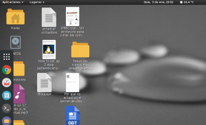
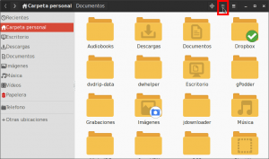
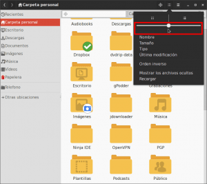

Por una serie de motivos que no vienen al caso Gnome shell no es el entorno de escritorio que utilizo habitualmente y cuando empecé a usarlo después de varios meses sin hacerlo, me encontré con la sorpresa que el tamaño por defecto de los iconos era enorme. Si queréis ver una muestra de lo que digo tan solo tienen que ver la siguiente captura de pantalla:<!--more-->

[](images/Iconos-demasiado-grandes.png)

Sin duda el tamaño de estos iconos es ideal para un entorno táctil, pero si queremos usar el ordenador de forma convencional el tamaño de los iconos es demasiado grande.

En el caso que tengan la misma opinión que la mia pueden cambiar muy fácilmente el tamaño de los iconos siguiendo las siguientes instrucciones.

###### Nota: No acabo de entender el motivo por el cual el tamaño por defecto de los iconos Gnome es tan grande. Es un sistema operativo que mayoritariamente se usa en ordenadores y la mayoría de la gente que usa ordenadores no acostumbra a usar el soporte táctil. Por lo tanto el tamaño de los iconos estándar no tienen ninguna justificación.

## CAMBIAR EL TAMAÑO DE LOS ICONOS EN GNOME SHELL

Primeramente hay que **abrir una terminal y ejecutar siguiente comando**:

> ```
> nautilus
> ```

Una vez ejecutado el comando se abrirá el gestor de archivos Nautilus. Una vez abierto, tal y como se puede ver en la captura de pantalla, deberemos **clicar encima del icono que es un cuadradito con puntos**.

[](images/acceder-a-configuración.png)

Seguidamente, tal y como se puede ver en la captura de pantalla, se desplegará un menú en el que desplazando el puntito de la barra podremos modificar el tamaño de los iconos.

[](images/Modificar-el-tamaño-de-los-iconos.png)

**Después de desplazar la barra apropiadamente**, tal y como se puede ver en la captura de pantalla, veremos que ahora **los iconos ya tienen un tamaño mucho más racional**.

[](images/Iconos-con-el-tamaño-ideal.png)

Así con estos simples pasos podremos disfrutar de un tamaño de iconos adiente para poder trabajar más a gusto y ser más productivos.
