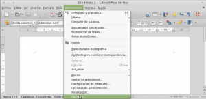
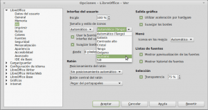
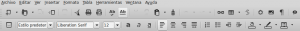

No soy un gran fan de la personalización del entorno de escritorio y la estética de una distribución no es algo que me preocupe en exceso. Bajo mi punto de vista hay aspectos más importantes como por ejemplo que el sistema operativo sea fluido, la estabilidad, que el entorno de escritorio sea usable, etc.

No obstante paso bastantes horas delante del ordenador usando [Libreoffice](http://es.libreoffice.org/ "Web oficial del Libreoffice") para escribir los post del blog, y la verdad es que el tema de iconos que tiene por defecto no me gusta. Quizás no me guste porqué lo he estado viendo a diario durante varios años.<!--more-->

Para quienes al igual que yo estén cansados del tema actual de iconos de Libreoffice tan solo tienen que seguir los siguientes pasos para cambiar el tema de iconos.

###### Nota: Para aplicar el método detallado como minino tienen que tener instalada la versión 4.2 de Libreoffice. El método detallado es válido para cualquier distribución Linux.

## LOCALIZAR LOS PAQUETES QUE CONTIENES LOS TEMAS DE ICONOS

Después de su instalación, Libreoffice solo dispone de 2 o 3 temas de iconos disponibles y bajo mi punto de vista ninguno de ellos es ninguna obra de arte. Para tener más temas de iconos disponibles tan solo tenemos que instalar los paquetes correspondientes.

**Para averiguar los paquetes que contienen temas de iconos tan solo tenemos que abrir una terminal y teclear el siguiente comando**:

> ```
> apt-cache search libreoffice-style
> ```

###### Nota: Los usuarios de Fedora u otras distros que utilicen el gestor de paquetes Yum tienen que sustituir apt-cache search por yum search.

Una vez ejecutado el comando obtendrán la lista de paquetes que contienen temas de iconos para Libreoffice. En mi caso los paquetes obtenidos son los siguientes:

```
libreoffice-style-crystal
libreoffice-style-galaxy
libreoffice-style-hicontrast
libreoffice-style-human
libreoffice-style-oxygen
libreoffice-style-sifr
libreoffice-style-tango
```

###### Nota: En mi caso tengo 7 temas de iconos disponibles. En vuestro caso y en función de múltiples factores, como por ejemplo vuestra distro o versión de Libreoffice, es posible que el número de temas disponibles sea diferente.

## INSTALAR LOS PAQUETES QUE CONTIENEN LOS ICONOS

**Ahora tan solo tenemos que instalar los paquetes que hemos localizado en el apartado anterior**. Para instalarlos tan solo tenemos que teclear el siguiente comando en la terminal:

> ```
> sudo apt-get install libreoffice-style-crystal libreoffice-style-galaxy libreoffice-style-hicontrast libreoffice-style-human libreoffice-style-oxygen libreoffice-style-sifr libreoffice-style-tango
> ```

###### Nota: Los usuarios de Fedora u otras distros que utilicen el gestor de paquetes Yum tienen que sustituir sudo apt-get install por sudo yum install.

###### Nota: Es posible que al aplicar el comando vean que algunos de los paquetes que queramos instalar ya estén instalados. Esto no es ningún problema.

###### Nota: No debería haberme pasado pero al instalar estos paquetes apt-get me forzó a desinstalar los paquetes mint-themes mint-artwork y mint-meta-cinnamon. Si os pasa los podéis desinstalar y justo al acabar la instalación los volvemos a instalar introduciendo el comando sudo apt-get install mint-themes mint-artwork mint-meta-cinnamon en la terminal. Imagino que esta incidencia será un problema de [Linux Mint](http://www.linuxmint.com/ "Web de Linux Mint") o mio ya que en otras distros nunca he observado este comportamiento.

## CAMBIAR EL TEMA DE ICONOS

Para la totalidad de distros basadas en Gnome, el tema de iconos por defecto acostumbra a ser Tango y es el siguiente:

[](images/Iconos-iniciales.png)

###### Nota: En las distros kde el tema de iconos por defecto de Libreoffice es oxygen en vez de Tango.

Si queremos cambiar el tema de los iconos que acabamos de ver **abrimos el editor de texto de Libreoffice que es Writer**. Una vez abierto, tal y como se puede ver en la imagen, **accedemos al menú** **Herramientas y seleccionamos** **Opciones**.

[](images/acceso-a-cambiar-iconos.png)

Seguidamente se abrirá la ventana de opciones. Tal y como se puede ver en la captura de pantalla, **en la parte izquierda de la ventana de opciones seleccionamos la opción** **Ver**.

[](images/Seleccionar-el-tema-de-iconos.png)

Una vez seleccionada la opción **Ver en** la parte derecha de la pantalla aparecerá un apartado denominado **Tamaño y estilo de iconos**. En este apartado pueden **seleccionar el tema de iconos que mas les guste**. Como se puede ver en la captura de pantalla **en mi caso he seleccionado el tema** **Humano**. Una vez seleccionado el tema tan solo tienen que **presionar del botón de** **Aceptar**.

Justo al apretar el botón de **Aceptar** el cambio del tema de iconos será efectivo obteniendo el resultado que mostramos a continuación:

[](images/Resultado-final.png)

Como se puede ver el resultado ha sido excelente. Hemos pasado de un tema de iconos que según mi opinión es obsoleto a otro tema que sigue las tendencias de diseño actual. Unos iconos con diseño flat y monocromáticos que se integran perfectamente con mi entorno de escritorio.

###### Nota: En el caso de no gustarles el tema Humano pueden probar con otros temas. Actualmente el tema que estoy usando es el  sifr.
