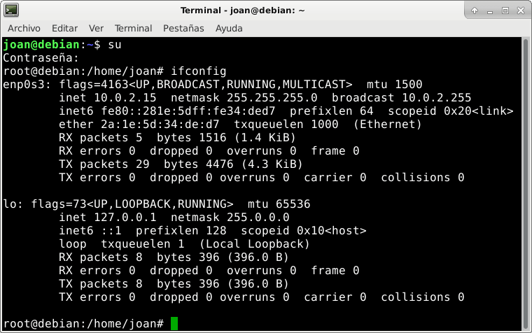
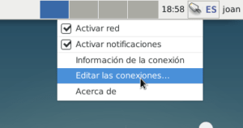
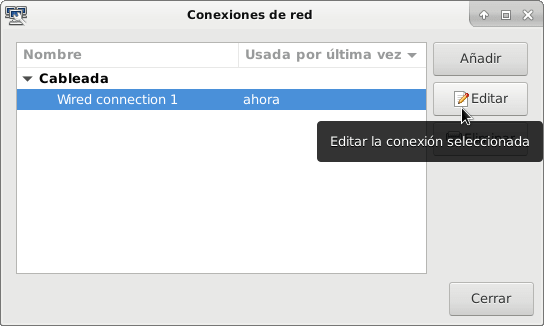
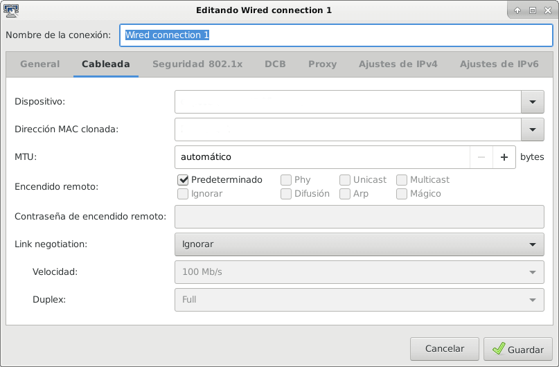
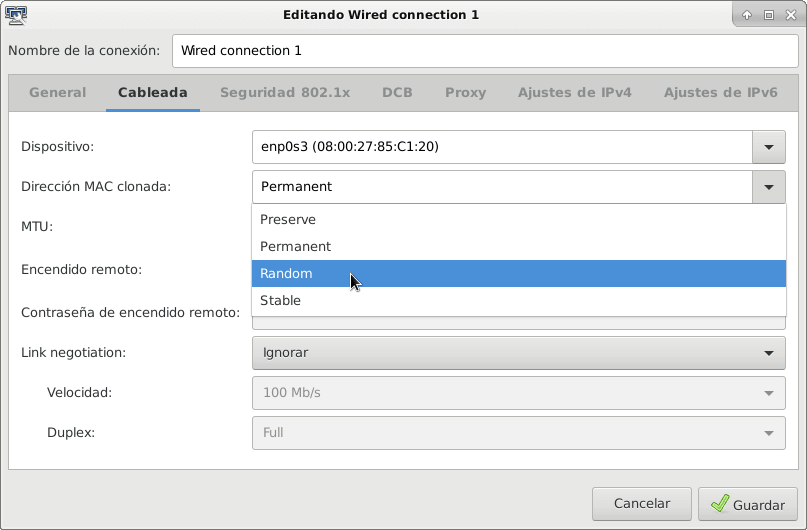
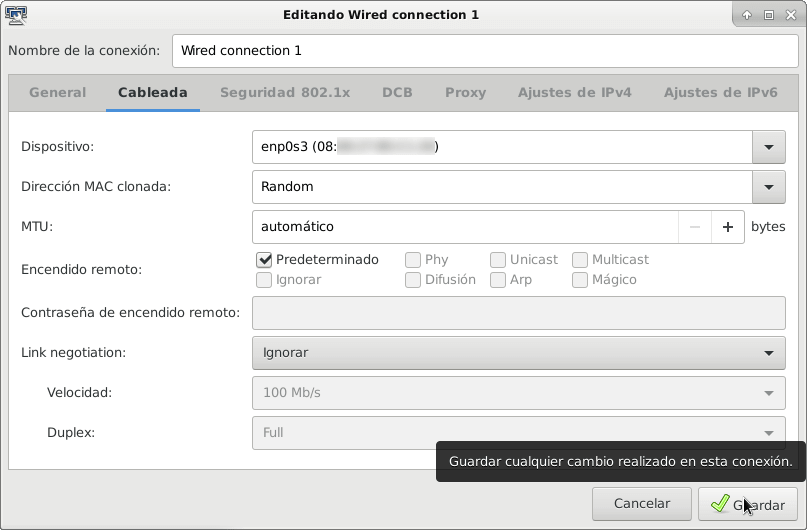

NetworkManager permite cambiar la Mac address de nuestras tarjetas de red de forma extremadamente simple. A medida que van saliendo nuevas versiones de NetworkManager se van añadiendo nuevas opciones para ocultar nuestra Mac Address, o lo que es lo mismo, para realizar Mac Spoofing.

A día de hoy podemos afirmar que NetworkManager tiene prácticamente las mismas funcionalidades que otros software como por ejemplo [Macchanger](https://github.com/alobbs/macchanger "Plataforma de desarrollo de Macchanger") o [Macchiato](https://github.com/EtiennePerot/macchiato "Plataforma de desarrollo de Macchiato").<!--more-->

## ¿POR QUÉ ES ACONSEJABLE CAMBIAR LA MAC ADDRESS O REALIZAR MAC SPOOFING?

Hace tiempo escribí un artículo en el que explicaba [que es la Mac Address, los usos que tiene y la importancia de ocultarla]().

Les recomiendo encarecidamente que lean este artículo porque entonces todo lo que realicen a continuación tendrá un sentido.

## AVERIGUAR NUESTRA MAC ADDRESS

Para estar seguros que estamos ocultando nuestra Mac Address, lo primero que tenemos que hacer es averiguar nuestra Mac Address real.

Para ello abrimos una terminal y ejecutamos el siguiente comando:

> ```
> sudo ifconfig
> ```

El resultado obtenido será similar al siguiente. Tal y como pueden ver en la captura de pantalla las direcciones MAC de nuestras interfaces de red aparecen justo después de la palabra ether:

[](images/averiguar-nuestra-mac-address.png)

Por lo tanto en mi caso la dirección MAC de mi tarjeta de red Ethernet es la:

> ```
> 2a:1e:5d:34:de:d7
> ```

Como pueden ver la Mac Address se trata de un número formado por 6 pares de dígitos. La información que dan los dígitos de la Mac Address es la siguiente:

1. Los 3 primeros pares de números indican quien es el fabricante de nuestra interfaz de red.
2. Los 3 últimos pares de números identifican el dispositivo fabricado mediante un número de serie.

Cambiar la Mac Address será útil para que no podamos ser identificados cuando nos conectamos en redes locales o en redes wifi.

## CAMBIAR LA MAC ADDRESS MEDIANTE LA INTERFAZ GRÁFICA DE NETWORKMANAGER

A continuación verán de forma detallada el proceso para cambiar la Mac Address de nuestra tarjeta de red. Siguiendo los consejos de este apartado conseguirán lo siguiente:

1. Que nuestra dirección MAC sea aleatoria. De esta forma, cada vez que arranquemos el ordenador o nos conectemos a una red nuestra Mac Address cambiará.
2. Usar una Mac Address clonada o no real de forma permanente. De este modo podremos usar siempre la misma Mac Address y será diferente a la real.

Para empezar nos dirigimos al icono del panel de NetworkManager, presionamos el botón derecho del ratón y cuando aparezca el menú contextual clicamos en Editar conexiones:

[](images/editar-conexiones-networkmanager.png)

Seguidamente seleccionamos la interfaz de red en que queremos cambiar la Mac Address. Una vez seleccionada presionamos el botón Editar:

[](images/editar-configuracion-conexiones-red.png)

A continuación se abrirá la ventana de configuración de nuestra interfaz de red. Una vez abierta clicamos en la segunda pestaña que en mi caso tiene el nombre Cableada. La configuración que encontraremos por defecto será parecida a la siguiente:

[](images/configuracion-inicial-mac-address.png)

En mi caso modifico los parámetros de configuración de la siguiente forma:

[](images/opciones-configruacion-mac-address.png)

Clicamos en el desplegable de **Dispositivo** y seleccionamos la tarjeta de red en que queremos cambiar la Mac address. En mi caso selecciono la interfaz de red enp0s3.

En el desplegable **Dirección MAC clonada** podemos escribir una Mac Address o seleccionar los valores Preserve, Permanent, Random y Stable. La función de cada una de estas opciones es la siguiente:

- **Permanent:** Siempre usaremos la Mac Address real de nuestra tarjeta de red. En otras palabras, siempre que reiniciemos nuestra interfaz de red, NetworkManager nos asignará nuestra Mac Address real. Por lo tanto, con esta opción NetworkManager prevalecerá sobre otros software para cambiar la Mac Address como por ejemplo Macchanger
- **Preserve:** Siempre se usará la Mac Address que se asigna al conectarse nuestra tarjeta de red. Con esta opción podremos usar Macchanger porque esta opción nos permitirá parar nuestra interfaz de red, cambiar la Mac Address y volver a levantar la interfaz de red sin que NetworkManager sobrescriba la Mac Address asignada por Macchanger.
- **Random:** Cada vez que nos conectamos o reconectamos a una red se genera una nueva Mac Address aleatoria. El hecho que nuestro Mac Address sea aleatoria puede generar que algunos servicios funcionen de forma inesperada.
- **Stable:** Mediante un hash se genera una Mac Address diferente a la real. Esta dirección Mac no será aleatoria, pero nos permitirá camuflar nuestra Mac Address real. Esta opción puede resultar útil varios casos. Algunos de ellos pueden ser cuando nuestra dirección IP se nos proporcione a través de un servidor DHCP o en el caso que un servicio web local utilice nuestra Mac Address para saber si estamos logueados o no.
- **Campo en Blanco:** Si no seleccionamos nada y dejamos el campo en blanco, NetworkManager considerará la opción por defecto. La opción por defecto para versiones de NetworManager inferiores a la 1.6 es Permanent, mientras que para versiones superiores a la 1.6 la opción por defecto es Preserve.
- **Escribir una Mac Address:** En el campo Dirección Mac clonada también podemos escribir una Mac Address cualquiera. De esta forma pasaremos a tener la Mac Address que nos hayamos inventado.

En mi caso selecciono la opción Random y clico encima del botón Guardar.

[](images/configuracion-final-cambiar-mac-address.png)

Una vez aplicado todos los cambios reiniciamos el ordenador. A partir de ahora, cada vez que nos conectemos o reconectemos a una red cableada se modificará nuestra Mac Address y dificultará que alguien nos pueda identificar a través de la dirección MAC.

Para finalizar solo aclarar que si disponemos de una versión de NetworkManager igual o superior a la 1.4 podemos aplicar el método descrito en tarjetas de red Ethernet y Wifi. En el caso de disponer de una versión inferior a la 1.4 únicamente lo podremos usar en tarjetas de red Wifi.

## COMO DISPONER DE UNA MAC ADDRESS ALEATORIA EN EL CASO QUE NOS ESCANEEN

Multitud de routers y otros dispositivos escanean la MAC Address de nuestros dispositivos. El motivo es saber si hemos estado en una cafetería, el recorrido que hemos seguido dentro de un centro comercial, etc.

Para evitar este problema, a partir de la versión 1.2 NetworkManager incorpora una mecanismo de protección. Este mecanismo está habilitado de forma predeterminada y hace lo siguiente:

Cuando no estamos conectados a ninguna red, NetworkManager va cambiando de forma periódica nuestra Mac Address. De esta forma, si alguien nos escanea no podrá identificarnos por nuestra MAC Address porque la segunda vez que nos escanee probablemente ya tendremos otra MAC Address distinta a la primera vez que nos escaneo.

Esta opción viene habilitada por defecto. Si alguien la quiere deshabilitar tenemos que editar el archivo de configuración de NetworkManager. Para ello abrimos una terminal y ejecutamos el siguiente comando:

> ```
> sudo nano /etc/NetworkManager/NetworkManager.conf
> ```

Dentro del archivo de configuración pegamos el siguiente código:

> ```
> [device]
> wifi.scan-rand-mac-address=no
> ```

Una vez pegado el código guardamos los cambios y cerramos el fichero. A partir de estos momentos, cada vez que nos escaneen estaremos proporcionando nuestra MAC Address real.

## CAMBIAR LA MAC ADDRESS SIN USAR LA INTERFAZ GRÁFICA DE NETWORKMANAGER

A lo largo de este apartado hemos cambiado la MAC address usando una interfaz gráfica. Si queremos también lo podemos hacer a través de la terminal. Para ello accedemos al archivo de configuración de NetworkManager ejecutando el siguiente comando en la terminal:

> ```
> sudo nano /etc/NetworkManager/NetworkManager.conf
> ```

Una vez abierto el fichero de configuración de NetworkManager tendremos que añadir el siguiente código:

Si queremos que cada vez que nos conectemos a una red wifi se genere una nueva MAC Address aleatoria pegaremos el siguiente código:

> ```
> [connection]
> wifi.cloned-mac-address=random
> ```

###### Nota: La opción random se puede reemplazar por las opciones stable, preserve, permanent, random, stable o por una Mac Address cualquiera que podemos escribir. El significado de cada uno de estos parámetros lo encontraréis en el apartado cambiar la Mac Address mediante la interfaz gráfica.

Si queremos que cada vez que nos conectemos a una red mediante nuestra tarjeta Ethernet se genere una nueva Mac Address aleatoria usaremos el siguiente código:

> ```
> [connection]
> ethernet.cloned-mac-address=random
> ```

###### Nota: La opción random se puede reemplazar por las opciones stable, preserve, permanent, random, stable o por una Mac Address cualquiera que podemos escribir. El significado de cada uno de estos parámetros lo encontraréis en el apartado cambiar la Mac Address mediante la interfaz gráfica.

Una vez introducidos los cambios, el fichero contendrá un contenido similar al siguiente:

> ```
> [device]
> wifi.scan-rand-mac-address=yes
> 
> [connection]
> ethernet.cloned-mac-address=random
> wifi.cloned-mac-address=random
> ```

Para finalizar con la configuración guardamos los cambios y reiniciamos el ordenador.

Después de aplicar los cambios nuestro ordenador tendrá el siguiente comportamiento:

1. Cada vez que nos conectemos a una red Wifi o una red local se generará una Mac Address aleatoria.
2. Cuando no estemos conectados a ninguna red, nuestra Mac Address irá cambiando de forma periódica. Cada una de las Mac Address que se nos asignaran serán completamente aleatorias.

En el siguiente enlace pueden obtener información adicional para editar el fichero de [configuración de NetworkManager](https://developer.gnome.org/NetworkManager/stable/NetworkManager.conf.html#id-1.2.5.12 "Explicación de los parámetros de configuración de NetworkManager"). Otra opción para obtener más información es ejecutar el siguiente comando en la terminal:

> ```
> man NetworkManager.conf
> ```

## CONCLUSIONES

Para finalizar decir que durante este artículo hemos visto varias de las opciones disponibles para cambiar la Mac Address con NetworkManager.

A día de hoy NetworkManager ofrece las mismas opciones que cualquier otro programa como por ejemplo macchanger o macchiato. Por lo tanto no tiene sentido alguno que los usuarios de NetworkManager instalen software adicional para cambiar la Mac Address de sus dispositivos de red.

NetworkManager es un gestor de red usado por muchos usuarios de Linux. Además el procedimiento para cambiar la MAC Address es extremadamente simple y asequible para todo el mundo. Esto hace que NetworkManager sea una excelente herramienta para mejorar nuestra privacidad.
