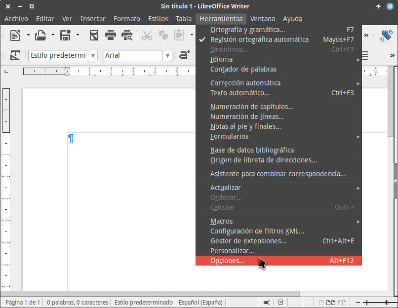
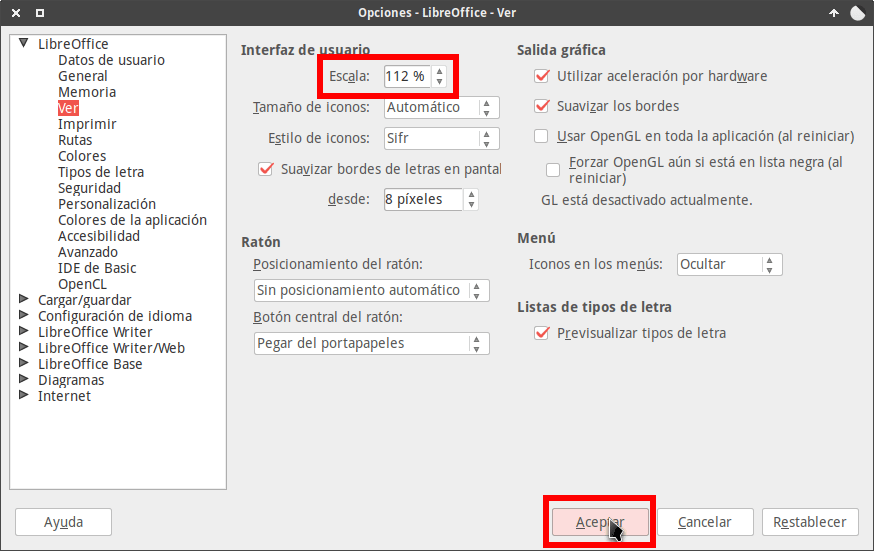
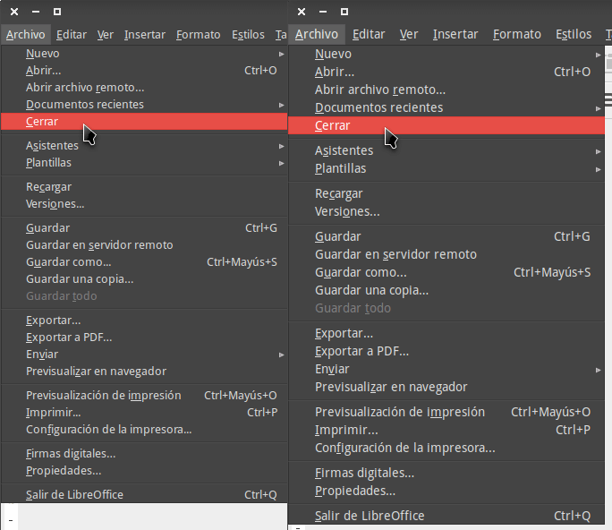
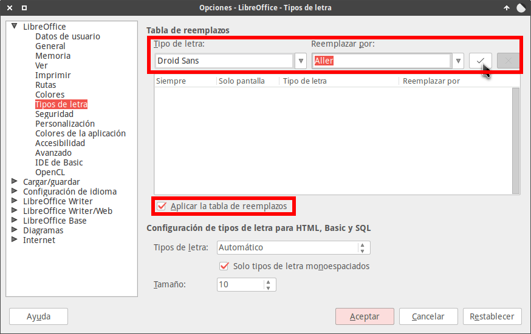
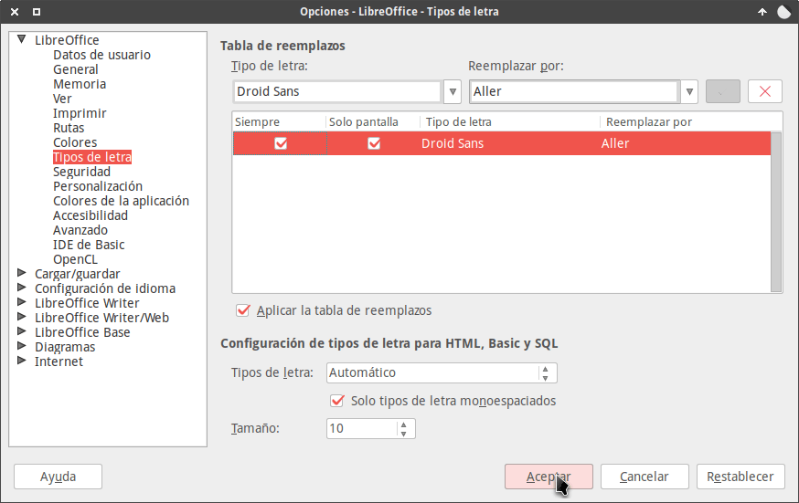
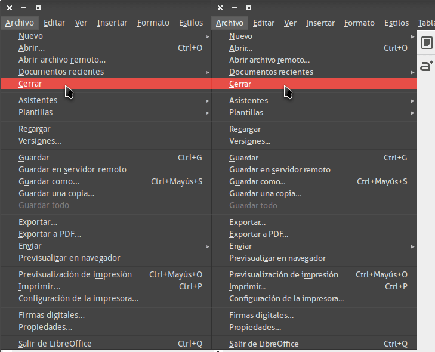
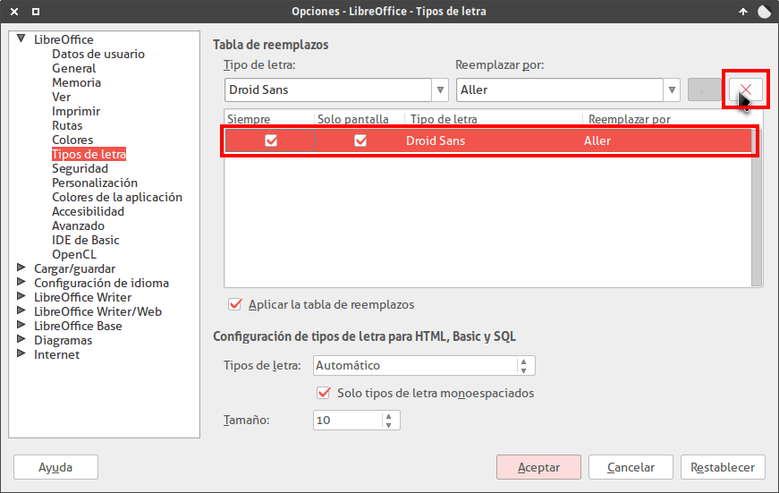

Los menús y las ventanas de Libreoffice usan la letra que tenemos configurada en nuestro sistema operativo. En el caso que la letra predefinida de nuestro sistema operativo no luzca bien o sea demasiada pequeña podemos cambiar la letra y su tamaño sin ningún tipo de problema.<!--more-->

En mi caso como fuente de sistema uso la letra Droid Sans con tamaño 10. Con esta combinación cuando abro Libreoffice tengo la siguiente sensación:

1. La tamaño de la letra que aparece en los menús, en las ventanas o en las pestañas de Calc me parece demasiado pequeña.
2. Al ser demasiada pequeña la letra se ve mal y en determinados casos me cuesta leer y seleccionar las opciones del menú.

En el caso que tengáis la misma sensación que yo, o simplemente queráis cambiar el tipo de letra de Libreoffice tenéis que seguir los siguientes pasos.

## CAMBIAR EL TAMAÑO DE LA LETRA EN LOS MENUS Y VENTANAS DE LIBREOFFICE

Para cambiar el tamaño de la letra de les menús y de las ventanas abrimos Libreoffice. A continuación accedemos al menú Herramientas y clicamos en Opciones.

En la ventana Opciones clicamos en la opción Ver ubicada en la parte izquierda de la ventana. A continuación en el apartado Interfaz de usuario modificaremos el valor de Escala de 100% a 112% y presionaremos el botón Aceptar.

###### Nota: Cuando más incrementos el valor del campo Escala, más grandes veremos la tipografías en los menús y ventanas de LibreOffice.

Una vez realizados estos pasos veremos la letras de los menús y de las ventanas de Libreoffice más grandes que antes:

###### Nota: Si aún quisieran hacer las letras más grandes deberían incrementar más el valor de Escala.

## CAMBIAR EL TIPO DE LETRA EN LOS MENÚS Y VENTANAS DE LIBREOFFICE

Para cambiar el tipo de letra de los menús y ventanas de Libreoffice tenemos que realizar lo siguiente:

Accedemos al menú Herramientas y clicamos en Opciones.

En la ventana Opciones clicamos en la opción Tipos de letra ubicada en la parte izquierda de la pantalla. A continuación realizamos las siguientes acciones:

1. Tildamos la opción Aplicar la tabla de reemplazos.
2. En Tipo de letra seleccionamos el nombre de la fuente que tenemos configurada en nuestro sistema operativo. La fuente predeterminada de mi sistema operativo es la Droid Sans.
3. En el apartado Reemplazar por selecciono el tipo de letra que quiero usar en vez de la Droid Sans. En mi caso he seleccionado la Aller.

Una vez finalizados estos pasos clicamos encima del botón de Aplicar.

A continuación tildamos las casillas Siempre y Solo pantalla. Finalmente presionamos encima del botón Aceptar.

Ahora tan solo nos falta observar el resultado final:

Por lo tanto hemos visto que de forma simple y rápida podemos modificar el tamaño y el tipo de letra de nuestros menús y ventanas. De esta forma podremos trabajar más a gusto con la Suite ofimática Libreoffice.

### Deshacer los cambios para volver a usar la fuente predeterminada

Si no estamos satisfechos con el resultado obtenido podemos deshacer los cambios del siguiente modo:

1. Accedemos al menú Herramientas y clicamos en Opciones.
2. A continuación clicamos en la opción Tipos de letra ubicada en la parte izquierda de la ventana.
3. Seleccionamos la tabla de reemplazo que creamos y presionamos el botón de Eliminar.
4. Finalmente presionamos encima del botón Aceptar.

De esta forma tan simple los menús y ventanas de Libreoffice volverán a usar la fuente predeterminada del sistema que en mi caso es la Droid Sans.
