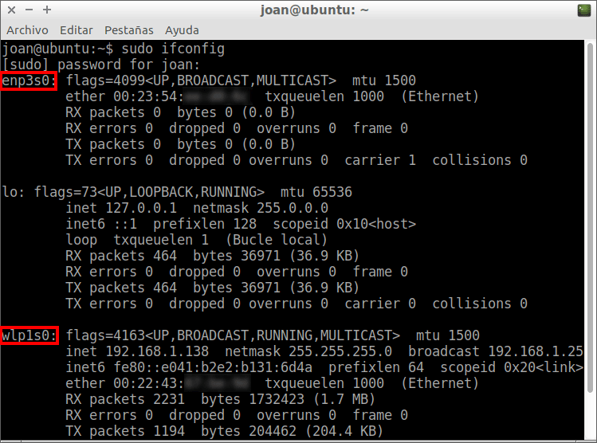
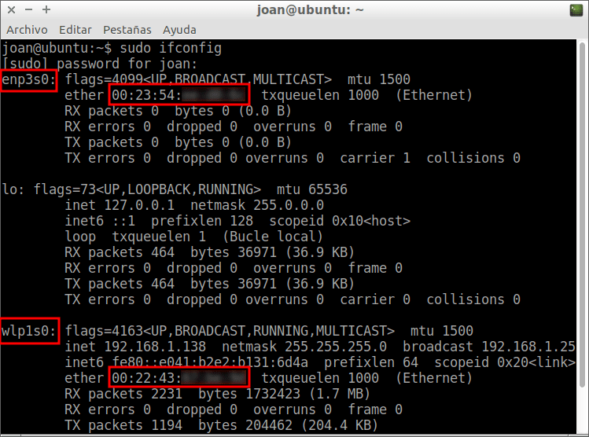
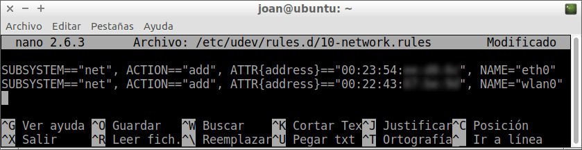
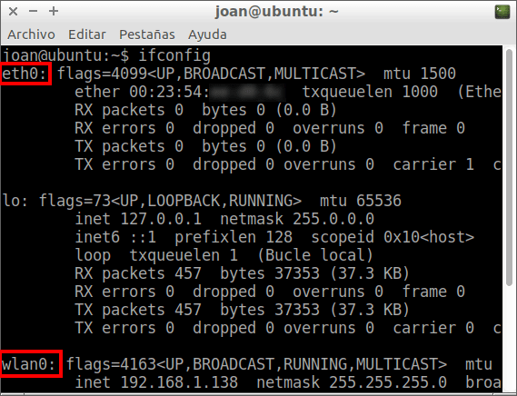

Ayer inicie un ordenador que tiene instalado Lubuntu y observe que los nombres de las interfaces de red eran poco habituales y difíciles de recordar. Por este motivo en el siguiente artículo veremos como cambiar el nombre de nuestra interfaz de red de forma muy sencilla. De esta forma siempre que veamos el nombre nuestra interfaz de red sabremos cual es sin dudar lo más mínimo.<!--more-->

## CONSULTAR EL NOMBRE DE LA INTERFAZ DE RED

Para comprobar el nombre de nuestra interfaz de red tan solo tenemos que abrir una terminal y ejecutar el siguiente comando:

> ```
> sudo ifconfig
> ```

[](images/nombre-interfaces-de-red.png)

Tal y como se puede ver en la captura de pantalla:

1. [La tarjeta de red](https://es.wikipedia.org/wiki/Tarjeta_de_red "Explicación de lo que es una tarjeta de red") Ethernet es reconocida como enp3s0. Normalmente este tipo de interfaz de red es reconocida como eth0, eth1, eth2, etc.
2. La interfaz de red inalámbrica es reconocida como wlp1s0. Normalmente este tipo de interfaces disponen del nombre wlan0, wlan1, etc.

## CAMBIAR EL NOMBRE DE NUESTRA INTERFAZ DE RED

En mi caso cambiaré el nombre de mis interfaces de red de la siguiente forma:

1. enp3s0 se transformará en eth0
2. wlp1s0 se transformará en wlan0

Los pasos a seguir para conseguir nuestro objetivo son los siguientes:

### Averiguar la mac address de nuestra interfaz de red

El primer paso para cambiar el nombre de nuestra interfaz de red es obtener la Mac address de la interfaz de red a la que le queremos cambiar el nombre. Para ello abrimos una terminal y tecleamos el siguiente comando:

> ```
> sudo ifconfig
> ```

Después de ejecutar el comando obtendremos el siguiente resultado:

[](images/mac-address-interfaz-de-red.png)

Tal y como se puede observar en la captura de pantalla:

1. Mi tarjeta de red Ethernet enp3s0 tiene la mac address 00:23:54:xx:xx:xx
2. La interfaz de red inalámbrica wlp1s0 dispone de la mac address 00:22:43:xx:xx:xx

Otro comando útil para obtener las mac address de nuestras interfaces de red es el siguiente:

> ```
> sudo ifconfig | grep ether
> ```

### Cambiar el nombre de nuestra interfaz de red

Una vez conocemos las direcciones mac ya podemos modificar los nombres de nuestras interfaces de red. Para ello crearemos o editaremos el fichero /etc/udev/rules.d/10-network.rules ejecutando el siguiente comando en la terminal:

> ```
> sudo nano /etc/udev/rules.d/10-network.rules
> ```

Una vez se abra el editor de textos nano añadiremos un texto del siguiente tipo:

> ```
> SUBSYSTEM=="net", ACTION=="add", ATTR{address}=="Mac_address_interfaz_1", NAME="nombre_de_la_interfaz"
> ```

Por lo tanto, para que mi tarjeta Ethernet enp3s0, que dispone de una Mac Address 00:23:54:xx:xx:xx, se llame eth0 introduciré el siguiente código:

> ```
> SUBSYSTEM=="net", ACTION=="add", ATTR{address}=="00:23:54:xx:xx:xx", NAME="eth0"
> ```

Para que mi tarjeta de red inalámbrica wlp1s0, que dispone de una Mac Address 00:22:43:xx:xx:xx, se llame wlan0 introduciré el siguiente código:

> ```
> SUBSYSTEM=="net", ACTION=="add", ATTR{address}=="00:22:43:xx:xx:xx", NAME="wlan0"
> ```

Una vez realizados los cambios el fichero quedará de la siguiente forma:

[](images/codigo-para-cambiar-interfaz-de-red.png)

Ahora tan solo tenemos que guardar los cambios y cerrar el fichero.

### Revisar la configuración del fichero /etc/network/interfaces

###### Nota: Este paso únicamente es necesario para los usuarios que no utilicen gestores de red como Network manager o Wicd.

A continuación tenemos acceder al fichero de configuración /etc/network/interfaces ejecutando el siguiente comando en la terminal:

> ```
> sudo nano /etc/network/interfaces
> ```

Una vez dentro del fichero tienen que reemplazar el nombre de las interfaces de red antiguas por el nombre de las nuevas interfaces de red.

Por lo tanto en el hipotético caso que la configuración de mi /etc/network/interfaces fuera la siguiente:

> ```
> auto lo
> iface lo inet loopback
> 
> allow-hotplug enp3s0
>  iface enp3s0 inet static
>  address 192.168.1.40
>  netmask 255.255.255.0
>  network 192.168.1.0
>  broadcast 192.168.1.255
>  gateway 192.168.1.1
> 
> auto wlp1s0
>  iface wlp1s0 inet static
>  address 192.168.1.40
>  netmask 255.255.255.0
>  broadcast 192.168.1.255
>  gateway 192.168.1.1
>  dns-nameservers 8.8.8.8
> ```

La debería reemplazar por la siguiente:

> ```
> auto lo
> iface lo inet loopback
> 
> allow-hotplug eth0
>  iface eth0 inet static
>  address 192.168.1.40
>  netmask 255.255.255.0
>  network 192.168.1.0
>  broadcast 192.168.1.255
>  gateway 192.168.1.1
> 
> auto wlan0
>  iface wlan0 inet static
>  address 192.168.1.40
>  netmask 255.255.255.0
>  broadcast 192.168.1.255
>  gateway 192.168.1.1
>  dns-nameservers 8.8.8.8
> ```

Una vez realizadas las modificaciones tan solo hay que guardar los cambios y cerrar el fichero.

###### Nota: Puede darse el caso que existan otros servicios o programas que en sus archivos de configuración figuren los nombres de las antiguas interfaces de red. En este caso deberemos repetir la operación realizada en este apartado.

### Comprobar que hemos cambiado el nombre de nuestra interfaz de red

Para comprobar que hemos cambiado el nombre de nuestra interfaz de red tan solo tenemos que reiniciar el ordenador. Una vez reiniciado abrimos una terminal y ejecutamos el siguiente comando:

> ```
> sudo ifconfig
> ```

Después de ejecutar el comando pueden comprobar que efectivamente hemos cambiado el nombre de la interfaz de red de forma simple, sencilla y rápida

[](images/interfaz-de-red-cambiada.png)

## CAMBIAR NUESTRA INTERFAZ DE RED DE FORMA PROVISIONAL

Si lo que pretendemos es cambiar el nombre de nuestra interfaz de red de forma provisional y sin tener que reiniciar el ordenador existen otras soluciones.

Supongamos que en nuestro caso tenemos una interfaz de red con nombre eth0 y la queremos renombrar a peth0. Para ello abrimos una terminal y seguimos las siguientes instrucciones:

Apagamos nuestra interfaz de red ejecutando el siguiente comando en la terminal:

> ```
> sudo ifconfig eth0 down 
> ```

Seguidamente cambiamos el nombre de la interfaz de eth0 a peth0 ejecutando el siguiente comando en la terminal:

> ```
> sudo ip link set eth0 name peth0 
> ```

Finalmente levantamos la nueva interfaz de red peth0 ejecutando el siguiente comando:

> ```
> sudo ifconfig peth0 up 
> ```

De este forma podemos cambiar el nombre de nuestra interfaz de red de forma provisional. La próxima vez que reiniciemos el ordenador se perderán los cambios y nuestra interfaz de red volverá a ser eth0.
