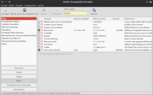
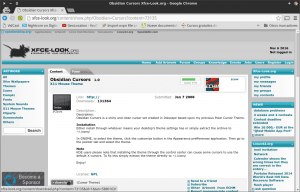
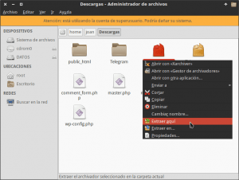
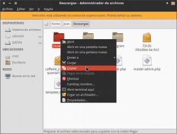
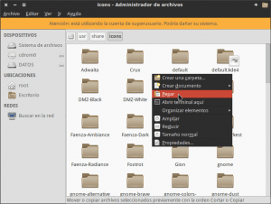
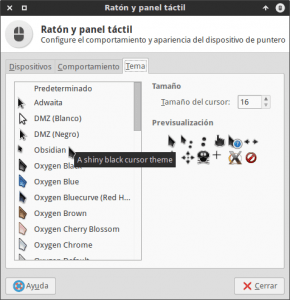
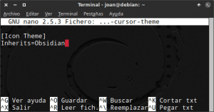

Hace cuatro años que uso el mismo puntero de ratón en mi distribución Linux y creo que ha llegado el momento de realizar un cambio.

En mi caso procedí a ver los temas de punteros de ratón que tenia disponibles para elegir y me encontré con la sorpresa que únicamente tenia tres temas disponibles. Por lo tanto la primera tarea para cambiar el puntero del ratón es encontrar un tema que nos guste.<!--more-->

## BUSCAR E INSTALAR TEMAS PARA NUESTRO PUNTERO DEL RATÓN

Hay varias formas para instalar temas nuevos para el puntero de nuestro ratón. Los podemos conseguir a través de los repositorios de nuestra distro o en páginas web especializadas en artworks para distribuciones GNU/Linux.

### Instalar temas de puntero de ratón a través de los repositorios

En mi caso la opción que preferida es realizar la instalación de temas a través de paquetes que tenemos disponibles en los repositorios de nuestra distro por los siguientes motivos:

1. La instalación es mucho más rápida y cómoda.
2. Si algún día queremos desinstalar el tema lo podremos realizar de una forma mucho más fácil.
3. Sí algún día sale una actualización del tema se actualizará de forma automática sin que tengamos que realizar nada.

Para localizar los temas de puntero de mouse disponibles en nuestros repositorios, tal y como se puede ver en la captura de pantalla, **abrimos el gestor de paquetes Synaptic (u otro similar) y realizamos una búsqueda con la palabra cursor. Una vez realizada la búsqueda**, mediante el nombre del paquete y de la descripción, podremos **identificar** fácilmente **los paquetes que corresponden a temas para el puntero de nuestro ratón**.

[](images/Temas-de-puntero-de-mouse-disponibles.png)

Por si a alguien le puede ayudar, **en mi distribución Debian Testing Stretch he podido localizar los siguientes paquetes:**

> ```
> big-cursor
> comixcursors
> crystalcursors
> dmz-cursor-theme
> industrial-cursor-theme
> oneko
> xcursor-themes
> moblin-cursor-theme
> breeze-cursor-theme
> oxygencursors
> comixcursors-lefthanded
> comixcursors-lefthanded-opaque
> comixcursors-righthanded-opaque
> comixcursors-righthanded
> ```

**Una vez localizados los paquetes que contienen punteros de ratón adicionales tan solo tenemos que instalarlos.** En el caso que quisiéramos instalar la totalidad de paquetes que hemos encontrado tenemos que abrir una terminal y teclear el siguiente comando:

> ```
> sudo apt-get install big-cursor comixcursors crystalcursors dmz-cursor-theme industrial-cursor-theme oneko xcursor-themes moblin-cursor-theme breeze cursor-theme oxygencursors comixcursors-lefthanded comixcursors-lefthanded-opaque comixcursors-righthanded-opaque comixcursors-righthanded
> ```

###### Nota: En el caso de usar un gestor de paquetes paquetes distinto a apt-get deberán adaptar el comando para poder realizar la instalación.

### Instalar temas de puntero de ratón usando temas externos a nuestra distro

En el caso que no os convenza ninguno de los temas disponibles en los repositorios, **podemos descargar temas de páginas web especializadas en realizar artworks** para distros Linux. **Algunas de estas web son las siguientes:**

[http://xfce-look.org/](http://xfce-look.org/ "Web de artworks xfce-look.org")

[http://www.kde-look.org](http://www.kde-look.org "Web de artworks kde-look.org")

[http://www.gnome-look.org](http://www.gnome-look.org "Web de artworks gnome-look.org")

[http://www.deviantart.com/](http://www.deviantart.com/ "Web de artworks devianart")

En mi caso para realizar el post **he decido instalar uno de los temas de la web de xfce-look.org**. Para ello en mi caso **accedo a la siguiente URL:**

[http://xfce-look.org/index.php?xcontentmode=36](http://xfce-look.org/index.php?xcontentmode=36 "URL para descargar el tema Obsidian")

Seguidamente, tal y como se puede ver en la captura de pantalla, **descargo el tema Obsidian:**

[](images/Descargar-un-tema-de-puntero-de-ratón.png)

###### Nota: Si os fijáis en la captura de pantalla se describe la forma de instalación del tema. Todas las web que he mencionado detallan como se debe realizar el proceso de instalación, pero por lo general en la mayoría de casos la instalación se realiza tal y como veréis a continuación.

A continuación **abrimos nuestro gestor archivos con permisos de usuario root ejecutando** el siguiente comando en la terminal:

> ```
> sudo thunar
> ```

###### Nota: El último comando es válido para los usuarios que utilizan el gestor de archivos Thunar. Si utilizan otro gestor de archivos deberán reemplazar thunar por el nombre del gestor de archivos pertinente.

Como cuarto paso, tal y como se puede ver en la captura de pantalla, **descomprimimos el archivo del tema que hemos descargado**.

[](images/Descomprimir-el-tema.png)

A continuación **copiamos la carpeta que acabamos de descomprimir**.

[](images/Copiar-el-tema-del-puntero-de-ratón.png)

Finalmente **pegamos la carpeta que acabamos de copiar en la ubicación /usr/share/icons**

[](images/Instalación-del-tema-de-puntero-de-ratón.png)

Con estos simples pasos el proceso de instalación del tema ha finalizado.

## CAMBIAR EL TEMA DEL PUNTERO DEL RATÓN

Una vez instalados los nuevos temas tan solo tenemos que activarlos. Para ello **abrimos una terminal y ejecutamos el siguiente comando:**

> ```
> xfce4-mouse-settings
> ```

Seguidamente se abrirá una ventana en la que que tenemos que **clicar en la pestaña Tema**. Seguidamente, tal y como se puede ver en la captura de pantalla, **seleccionamos el tema de iconos que queremos, seleccionamos el tamaño** del puntero y **presionamos el botón Cerrar**:

[](images/Seleccionar-el-tema-de-puntero-del-ratón.png)

**Una vez activado el tema** ya podemos **reiniciar el ordenador** y en el próximo arranque el nuevo tema de cursor se debería visualizar sin ningún tipo de problema.

## ASEGURAR QUE EL NUEVO TEMA SE APLICA EN TODOS LOS SITIOS

Después de reiniciar el ordenador ya podremos visualizar el nuevo puntero de ratón, pero es posible que en ciertos programas o en nuestro gestor de sesiones siga viéndose el antiguo tema. Para solucionar este aspecto tan solo tenemos que **abrir una terminal y ejecutar el siguiente comando**:

> ```
> sudo nano /etc/alternatives/x-cursor-theme
> ```

Una vez se abra el editor de textos, tal y como se puede ver en la siguiente captura de pantalla, deberemos **reemplazar el nombre del tema antiguo por el nombre del nuevo tema que en mi caso es Obsidian**.

[](images/Tema-del-puntero-en-todos-los-programas.png)

Después de realizar las modificaciones tan solo tenemos que **guardar los cambios realizados y cerrar el fichero**. De este modo, **la próxima vez que reiniciamos el ordenador, el tema Obsidian se aplicará absolutamente en todos los programas** y en nuestro gestor de sesiones.
