En el siguiente artículo explicaremos la función que realiza el lector de feeds Tiny Tiny RSS. Además detallaremos las [funcionalidades y características](https://tt-rss.org/) que lo hacen diferente del resto de servicios que ofrecen funciones similares.<!--more-->

## ¿QUÉ ES TINY TINY RSS?

Tiny Tiny RSS **es un lector de feeds** alternativo a los archiconocidos Feedly, Inoreader, Flipboard, etc. Pero con la diferencia que se instala en un servidor web que puede estar en nuestro ordenador, Raspberry Pi, servidor VPS, etc. Por lo tanto, el lector de feeds Tiny Tiny RSS será accesible vía cualquier navegador web o a través de diversos clientes existentes en Android e iOS.

En definitiva, Tiny Tiny RSS es un herramienta que nos permitirá seguir nuestros blogs o podcast favoritos de forma fácil y cómoda.

[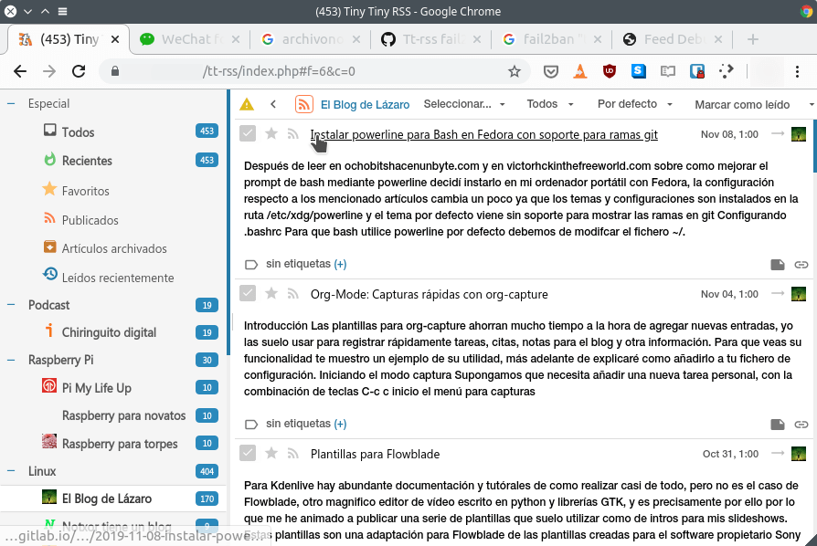](images/leyendo-noticias-tiny-tiny-rss.png)

## CARACTERÍSTICAS QUE HACEN QUE EL LECTOR DE FEEDS TINY TINY RSS SEA DIFERENTE

Ya hemos comentado que Tiny Tiny RSS es una alternativa a servicios como por ejemplo Feedly, Inoreader y Flipboard, pero con las siguientes ventajas y funcionalidades.

### Respeta la privacidad de sus usuarios

Tiny Tiny RSS **es respetuoso con la privacidad** de sus usuarios porque **es software libre** y además **corre en nuestro propio servidor**. Por lo tanto nadie tendrá acceso a las noticias que leemos de forma habitual.

Es altamente probable que otros servicios, como los mencionados anteriormente, construyan perfiles de sus usuarios para venderlos a terceros y de este modo ofrecernos publicidad personalizada.

### Leer noticias sin publicidad y sin “ruido” externo

Puedes **seguir las noticias que más te interesan sin el ruido y anuncios** que introducen Twitter u otras plataformas de feeds como por ejemplo Inoreader o Feedly.

[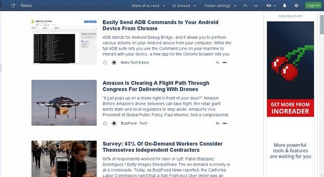](images/anuncios-inoreader.jpg)

### Servicio sin las limitaciones habituales de los servicios Free

**No tendremos** las **limitaciones** que imponen Feedly, Inoreader y otros servicios equivalentes. Por ejemplo Feedly no permite seguir más de 100 fuentes RSS siendo un usuario free.

Tened en cuenta que los servicios free ofrecen funcionalidades muy básicas. Por norma general lo único que permiten realizar es seguir un número limitado de fuentes. Además, lo único que podremos realizar con las fuentes que seguimos es leerlas y compartir y su contenido.

### Reproduce podcast y vídeos de YouTube incrustados en los feed

En Tiny Tiny RSS podemos reproducir podcast. Para ello tan solo tenemos que añadir el feed del podcast en cuestión. Acto seguido podremos reproducir los podcast del feed sin ningún tipo de problema.

[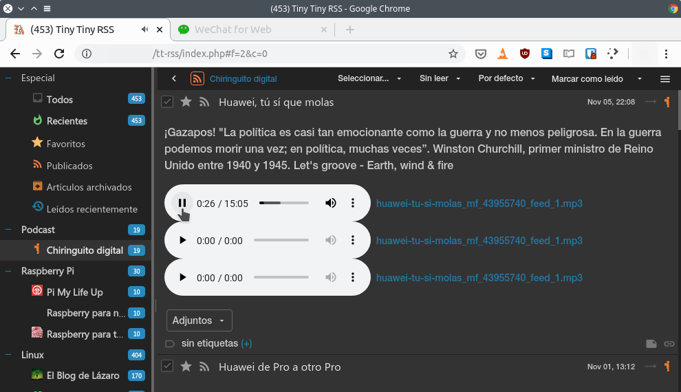](images/reproducir-podcast-ttrss.png)

Además, activando la extensión af\_youtube\_embed podremos reproducir la totalidad de vídeos de Youtube incrustados en el feed.

### Lectura por voz de las noticias y contenido almacenado en TTRSS

Existen clientes de Android, como FeedMe, que son una auténtica maravilla y ofrecen funcionalidades como **leer el contenido de los feeds**.

Para ello tan solo tenemos que presionar de forma prolongada la noticia que queremos leer.

[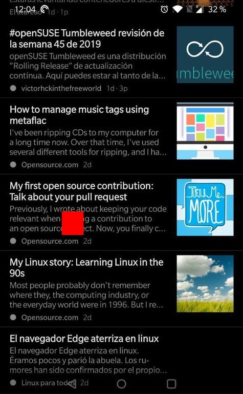](images/seleccionar-artículo-a-leer.jpg)

Cuando aparezca el menú de opciones presionaremos sobre las opciones de Reproducir. Acto seguido el sintetizador de voz de Google nos leerá la noticia.

[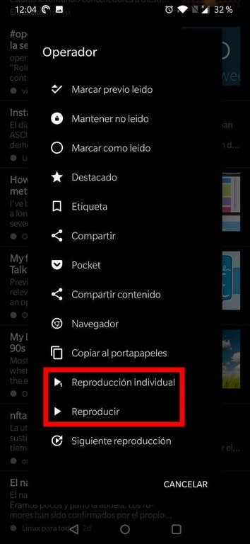](images/leer-articulo-en-feedme.jpg)

###### Nota: El cliente de Android FeedMe se sincroniza con y alimenta del lector de feeds Tiny Tiny RSS.

### Más opciones de configuración y funcionalidades adicionales

TTRSS dispone de **más opciones de configuración** que los servicios RSS que todos conocemos. Podremos seleccionar **distintos temas de visualización, borrar el contenido que lleva almacenado más de x tiempo**, etc.

Además **mediante su sistema de extensiones obtendremos muchas más funcionalidades** que otros servicios como por ejemplo Inoreader, Feedly, etc.

### Autoetiquetado de contenido para buscar artículos relacionados

TTRSS usa las etiquetas de los artículos para clasificar el contenido que almacena.

De este modo si clico la etiqueta SSH de un artículo.

[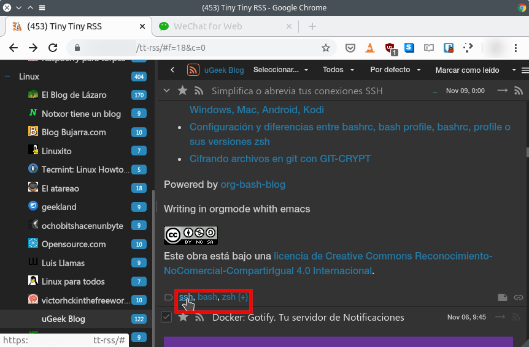](images/filtrar-contenido-por-etiquetas.png)

Tiny Tiny RSS mostrará la totalidad de artículos que tiene almacenados y contienen la etiqueta SSH.

[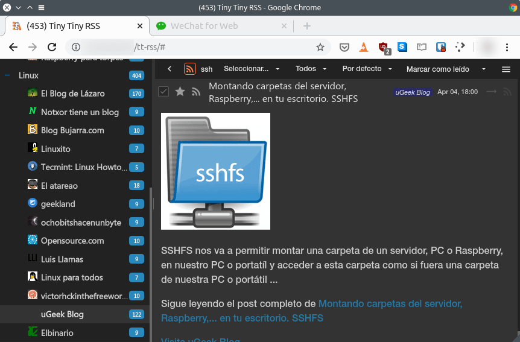](images/articulos-que-continen-una-etiqueta.png)

En el caso que los creadores de contenido no etiqueten sus artículos tenemos las siguientes opciones:

1. Añadir las etiquetas de forma manual.
2. Usar la extensión auto\_assign\_labels para que los artículos sin etiquetas se autoetiqueten de forma automática en función de su contenido.

### Archivar artículos de forma permanente

TTRSS permite archivar los artículos que más nos gustan. De este modo si un blog desaparece podremos seguir consultando su información porque el contenido del artículo estará almacenado en nuestro propio servidor

Para archivar un artículo tan solo tendrán seleccionarlo. Una vez seleccionado clican en el botón Seleccionar... y cuando se despliegue el menú clican en la opción Archivar.

[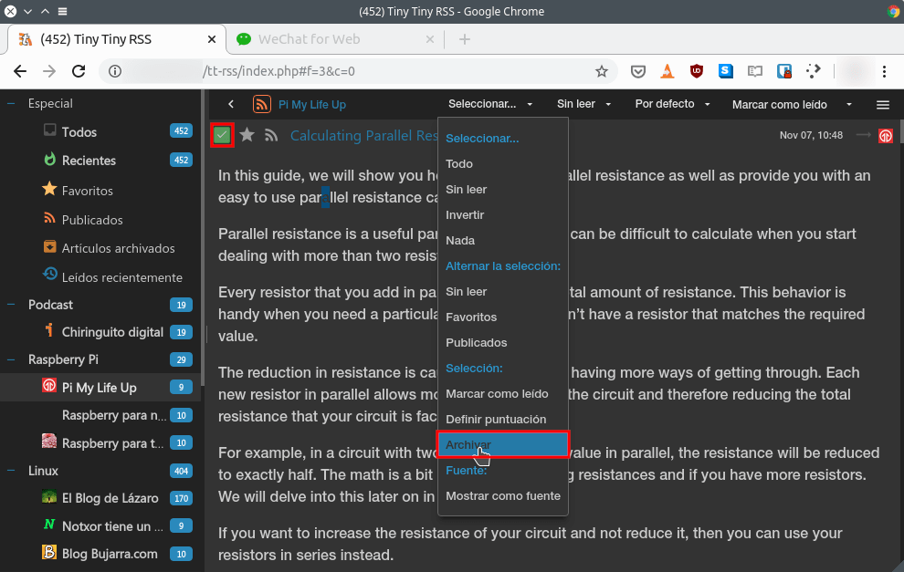](images/archivar-un-articulo-en-ttrss.png)

Accediendo al apartado Artículos archivados podremos consultar la totalidad de artículos guardados:

[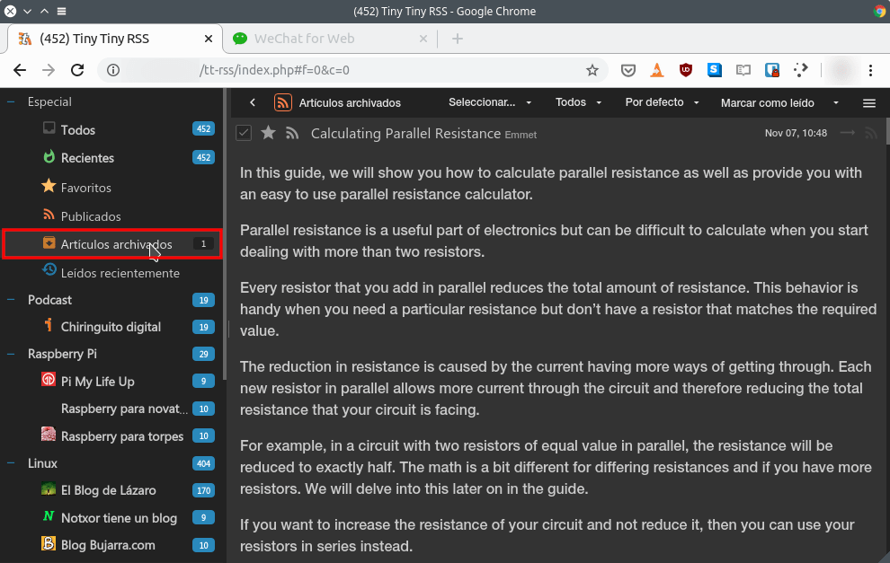](images/consultar-articulos-archivados.png)

### Añadir notas y puntuar los artículos

TTRSS ofrece la posibilidad de añadir notas a cada uno de los artículos y puntuarlos.

[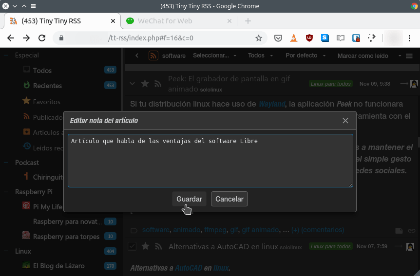](images/crear-notas.png)

De esta forma en un futuro podremos:

1. Buscar los artículos que más nos gustaron.
2. Buscar los artículos que contienen anotaciones y leer rápidamente las anotaciones que hicimos en su día. Las anotaciones pueden contener información adicional acerca del artículo o simplemente una breve frase para hacernos una idea del contenido del artículo.

### Atajos de teclado para ser más productivo

TTRSS **permite usar atajos de teclado** para acceder y consumir el contenido que más nos interesa de forma rápida. Para ello tan solo tendremos que activar las extensión googlereaderkeys y hotkeys\_noscroll.Los atajos de teclado de este programa son los mismos que en su día uso Google Reader.

### Leer el contenido de los artículos sin tener que acceder a las web

En ocasiones los feeds no muestran el contenido completo de los artículos.

[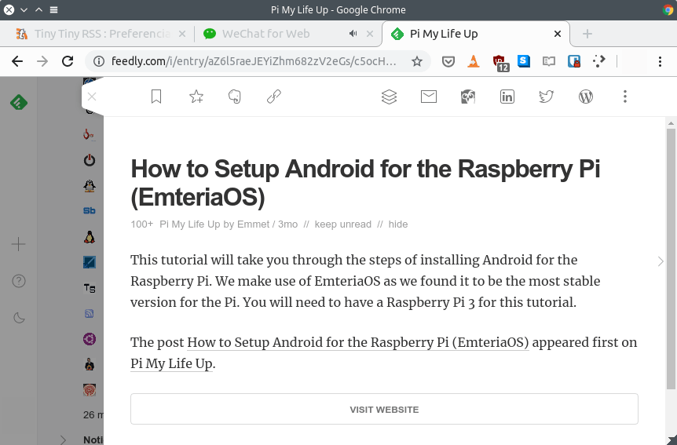](images/contenido-feed-limitado.png)

El motivo es que los creadores de contenido quieren que entremos en sus blogs para que nos traguemos su publicidad y nos puedan trackear.

No obstante, gracias a la extensión Readibility **podremos leer la totalidad de los artículos dentro del feed**. De esta forma tendremos la experiencia que nosotros deseamos y no la que el creador de contenido quiera que tengamos.

En Android les recomiendo que usen el cliente FeedMe. FeedMe también permite leer el contenido de los feeds sin tener que entrar en la web.

### Filtrar contenido almacenado en los feeds por palabras

Tiny Tiny RSS almacena una cantidad muy elevada de información. Por esto motivo ofrece la posibilidad de filtrar su contenido por palabras y de esta forma encontrar la información que estamos buscando de forma fácil y sencilla.

Para aplicar filtros por palabras pueden ver el siguiente vídeo:

https://www.youtube.com/watch?v=fgOoJONR-s4&t

### Compartir artículos de forma fácil limpia y sin publicidad

**Permite generar enlaces para compartir contenido**. Quien reciba y abra los enlaces generados podrá leer el contenido compartido de forma limpia. La visualización será similar a la ofrecida por programas como por ejemplo Pocket.

[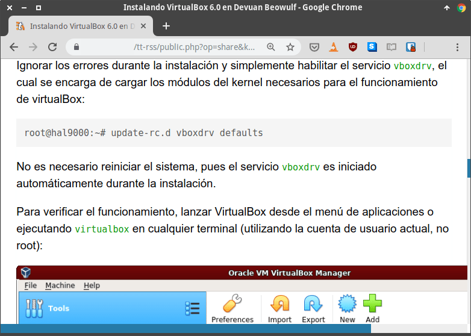](images/compartir-una-noticia-o-articulo.png)

Además TTRSS dispone de un feed especial en el que podremos introducir la totalidad de artículos que queremos compartir. Una vez definidos los artículos a compartir podemos generar una URL para que nuestros compañeros puedan visualizar los artículos seleccionados uno detrás de otro.

[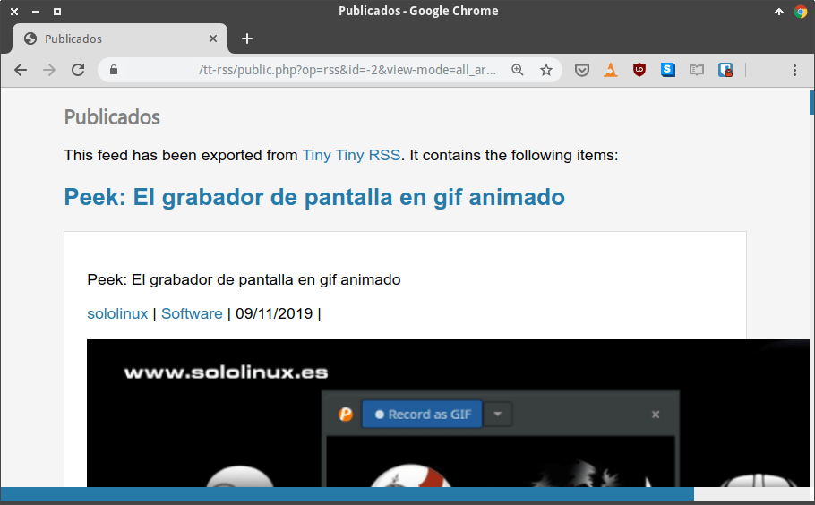](images/conjunto-de-noticias-compartidas-en-TTRSS.png)

###### Nota: Obviamente TTRSS también permite compartir contenido por otras vías como por ejemplo correo electrónico.

### Leer nuestro artículos en cualquier momento de forma cómoda

Todas las noticias y contenidos estarán sincronizados en la totalidad de nuestros dispositivos. Además todas nuestras noticias y artículos serán accesibles a través de cualquier dispositivo ya sea mediante clientes de escritorio, apps o un simple navegador web.

## INCONVENIENTES DE TINY TINY RSS

Acabamos de ver las bondades de TTRSS. No hace falta decir que es una opción que ofrece más funcionalidades que los lectores de feeds convencionales, pero también presenta puntos de mejora.

Algunos de los puntos que se deberían mejorar son los siguientes:

1. **Su interfaz web no es Responsive**. Por lo tanto no podremos usar el cliente web en dispositivos móviles. No obstante en dispositivos móviles existentes clientes excelentes como por ejemplo FeedMe.
2. **Es necesario tener conocimientos de CSS** parar cambiar la fuente y el tamaño de la fuente de los artículos. Para personalizar un tema existente también es necesario saber un mínimo de CSS
3. Su **procedimiento de instalación y configuración no es sencillo**. Su instalación requiere de conocimientos informáticos que no están al alcance de la mayoría de personas. Por este motivo en breve publicaré en artículo que muestra las instrucciones de instalación y configuración de TTRSS.
